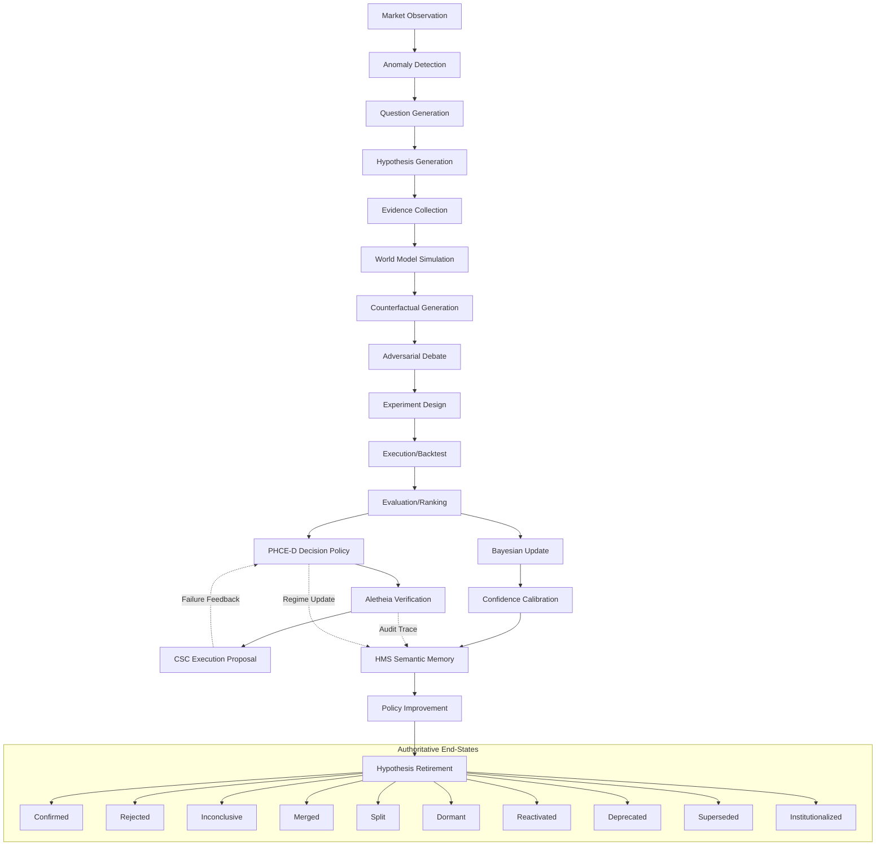

# Hypothesis Dependency Graph - AlphaAlgo UCA 2026

This document maps the flow of hypotheses from raw market observations to institutionalized knowledge across all subsystems.

## High-Level Lifecycle Flow

## Subsystem Roles in the Ecosystem

### 1. The Proposers (Generation)
- **AlphaMiningEngine**: Discovers statistical signals ($alpha$) via genetic programming.
- **CuriosityEngine**: Generates "Why" questions from market anomalies.
- **StrategyGenerator**: Evolves strategy DNAs (hypotheses) in `self_evolving_researcher.py`.
- **CognitiveSystemController (CSC)**: Generates competing reasoning branches for immediate execution.

### 2. The Auditors (Validation)
- **ScientificReasoningEngine (SRE)**: The 19-step orchestrator of the hypothesis lifecycle.
- **PHCE-D**: Parallel Hypothesis Correction Engine; provides conservative gatekeeping and refusal logic.
- **Aletheia**: Formal verification and browser-based research auditing of claims.
- **VerificationSwarm**: Multi-agent "Red Team" that attempts to falsify trade ideas.

### 3. The Repository (Memory)
- **Hierarchical Memory System (HMS)**: Stores the "Scientific Ledger" and semantic graph of all beliefs.
- **Unified Alpha Brain**: Aggregates weights and performance for all active strategies.
- **TALOS**: Manages the research evidence bridge and long-term research memory.

### 4. The Policy (Evolution)
- **SkillRouter**: Routes tasks based on the "Earned Work" logic of validated hypotheses.
- **ImmutableShield**: Enforces constitutional constraints on all accepted policies.
