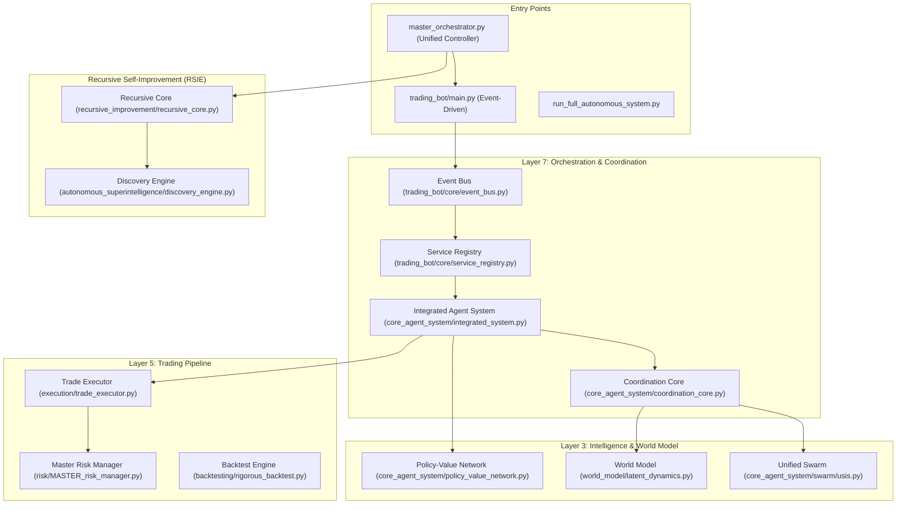

# AlphaAlgo Comprehensive Codebase Audit Report
**Date:** May 22, 2024
**Auditors:** AlphaAlgo Engineering Staff (Architect, AI, ML, Quant, DevOps, Security, Reliability, Research)

---

## 1. Executive Summary
AlphaAlgo is a high-complexity trading ecosystem currently undergoing a transition from a monolithic MT5-centric bot to a "Research Lab Grade" autonomous intelligence. The audit reveals a significant **Implementation-Vision Gap**. While the architecture (L1-L10) and agent patterns (AlphaGo, Constitutional AI, JEPA) are theoretically world-class, the current implementation is fragmented across three competing orchestration layers and multiple simulated modules.

The system's greatest strength is its **Master Risk Manager** and **Rigorous Backtesting** framework, which provide a solid foundation for production. Its greatest weakness is the **"Delusion Loop"** in the autonomous research modules, which optimize against Gaussian noise rather than real market data.

---

## 2. Current Architecture Diagram

---

## 3. Component Inventory (High Priority Modules)

| Directory | File | Class | Purpose | Dependencies | Status |
|---|---|---|---|---|---|
| `trading_bot/core/` | `event_bus.py` | `EventBus` | Central pub/sub for all services | `asyncio` | **Active** |
| `trading_bot/core_agent_system/` | `integrated_system.py` | `IntegratedAgentSystem` | AlphaGo/Anthropic pattern integration | `PVN`, `ConstitutionalAI` | **Active** |
| `trading_bot/core_agent_system/` | `master_orchestrator.py` | `MasterOrchestrator` | MCTS-style hierarchical decision making | `PolicyNetwork`, `ValueNetwork` | **Active** |
| `trading_bot/core_agent_system/` | `agent_registry.py` | `AgentRegistry` | Unified agent management and lifecycle | `BaseAgent` | **Active** |
| `trading_bot/world_model/` | `latent_dynamics.py` | `WorldModel` | JEPA/DreamerV3 Market Simulation | `torch`, `LatentDynamics` | **Active** |
| `trading_bot/risk/` | `MASTER_risk_manager.py` | `MasterRiskManager` | Consolidated dynamic risk management | `MT5`, `scipy` | **Active** |
| `trading_bot/backtesting/` | `rigorous_backtest.py` | `RigorousBacktester` | Institutional-grade strategy validation | `numpy`, `pandas`, `scipy` | **Active** |
| `trading_bot/autonomous_superintelligence/` | `discovery_engine.py` | `DiscoveryEngine` | Pattern and strategy discovery | `np.random` | **Simulated** |
| `trading_bot/autonomous_superintelligence/` | `research_engine.py` | `ScientificResearchEngine` | Hypothesize and experiment loop | `json`, `asyncio` | **Simulated** |
| `trading_bot/recursive_improvement/` | `recursive_core.py` | `RecursiveImprovementCore` | Recursive self-optimization loop | `ImprovementCycle` | **Partial** |
| `trading_bot/execution/` | `trade_executor.py` | `TradeExecutor` | Unified Broker Interface (MT5, IB, Binance) | `MetaTrader5` | **Active** |
| `agents 2/` | `specialized_agents.py` | `TrendFollowingAgent` | Legacy strategy implementation | `BaseAgent` (Legacy) | **Legacy** |
| `trading_bot/agents/` | `planner_agent.py` | `PlannerAgent` | Intermediate planner pattern | `TradeProposal` | **Legacy** |

---

## 4. Validation of Previous Audit Findings

| Previous Finding | Status | Auditor Note |
|---|---|---|
| **1.1 Architectural Fragmentation** | **Confirmed** | System still runs 3+ orchestrators in parallel (`MasterOrchestrator` root, `IAS`, `MetaOrchestrator`). |
| **1.2 Circular Dependencies** | **Confirmed** | Local imports are pervasive in `latent_dynamics.py` and `integrated_system.py` to break cycles. |
| **2.1 Simulated Learning** | **Confirmed** | `SelfPlayLoop` defaults to `np.random` price changes in `_simulate_step`. |
| **2.2 Mocked Evolution** | **Confirmed** | `SelfModificationEngine` proposes changes but stubs the write/test phase. |
| **3.1 Expert Layer Hallucination** | **Partially Confirmed** | Experts now use real `RecurrentDepthTransformer` code, but lack trained production weights. |
| **4.1 Static Risk Models** | **Partially Confirmed** | `MasterRiskManager` adds dynamism (Kelly, Regime), but many thresholds remain hardcoded. |
| **5.1 Placeholder Superintelligence** | **Confirmed** | `DiscoveryEngine` and `ResearchEngine` are effectively logic stubs with `asyncio.sleep`. |
| **6.1 Windows-Only Bottleneck** | **Confirmed** | MT5 dependency is still the primary execution path for real capital. |

---

## 5. Simulation Reality Gap Report

| Component | Class | Status | Finding | Recommended Fix |
|---|---|---|---|---|
| **Discovery Engine** | `DiscoveryEngine` | **SIMULATED** | Uses `np.random` and `asyncio.sleep` to "discover" strategies. | Bridge to `SymbolicDiscovery` and real backtest runs. |
| **Self-Play Loop** | `SelfPlayLoop` | **SIMULATED** | `_simulate_step` uses random walks rather than tick data or JEPA latent rollouts. | Integrate `BacktestEngine` as the environment for episodes. |
| **Swarm Experts** | `MarketScientist` | **REAL** | Uses `RecurrentDepthTransformerBase` for actual inference (forward pass). | Ground in larger datasets; replace random inputs with processed features. |
| **Constitutional AI** | `ConstitutionalAI` | **REAL** | Principle-based verification logic is fully implemented and functional. | Add more financial-specific principles (e.g., wash trading detection). |
| **World Model** | `WorldModel` | **REAL** | Complex JEPA architecture implemented in Torch. | Implement the "Triangulated Consistency" loss with real data anchors. |
| **Recursive Core** | `RecursiveImprovementCore` | **PARTIAL** | Core recursion logic exists but `_apply_improvements` is a stub. | Connect to `SelfModificationEngine` for actual code/param updates. |

---

## 6. Critical Problems

### Issue 6.1: Architectural Fragmentation (The "Three-Brain" Problem)
- **Problem:** Three disconnected orchestration layers making independent decisions.
- **Location:** `master_orchestrator.py` (root), `trading_bot/core/orchestrator.py`, `trading_bot/core_agent_system/integrated_system.py`.
- **Evidence:** `master_orchestrator.py` defines a 5-layer system, while `IntegratedAgentSystem` defines a separate "Research Lab Grade" system. They run in parallel without a shared decision gate.
- **Severity:** P0 (Critical)
- **Impact:** Conflicting trade execution (one brain buys, another sells), race conditions, and inconsistent system state.
- **Root Cause:** Evolutionary implementation without decommissioning legacy controllers.
- **Recommended Fix:** Hard consolidation. Deprecate `MasterOrchestrator` (root) and route all logic through `IntegratedAgentSystem`.
- **Estimated Effort:** 4 weeks
- **Priority:** P0

### Issue 6.2: The "Delusion Loop" (Simulated RL Environment)
- **Problem:** AI "learning" from Gaussian noise in simulated environments.
- **Location:** `trading_bot/core_agent_system/self_play_loop.py`
- **Evidence:** Line 320: `_simulate_step` uses `np.random.randn()` for price changes. `DiscoveryEngine` uses random floats for "performance gain".
- **Severity:** P0 (Critical)
- **Impact:** System develops "hallucinated alpha" that fails instantly in live markets because it has only ever optimized for random noise.
- **Root Cause:** Placeholder simulation logic used for development but never replaced with real data.
- **Recommended Fix:** Integrate `RigorousBacktest` and historical tick data as the "Environment" for the Self-Play loop and Discovery engine.
- **Estimated Effort:** 3 weeks
- **Priority:** P0

---

## 7. Technical Debt
- **Circular Dependencies:** Many core modules (WorldModel, IAS) rely on local imports inside methods to avoid startup crashes.
- **Stubbed Subsystems:** `DiscoveryEngine`, `ExperimentEngine`, and `SelfModificationEngine` are 90% logs and `asyncio.sleep`.
- **Legacy Weight:** `agents 2/` and `trading_bot/agents/` are still present and partially wrapped, adding unnecessary abstraction layers.

---

## 8. AI Capability Gaps
- **Real-Time Grounding:** The AI makes decisions based on its "World Model" (simulation) but lacks a high-frequency "Ground Truth" feedback loop from the broker for re-anchoring.
- **Reasoning Verification:** While it has a `ConstitutionalLayer`, the "Thoughts" in the `ReActLoop` are heuristic templates rather than actual LLM-driven reasoning.
- **Memory Scalability:** Currently using JSON files for persistence (`autonomous_superintelligence_data/`), which will fail as the knowledge graph grows.

---

## 9. Trading Capability Gaps
- **Execution Venue Parity:** MT5 is mature, but Binance and IBKR adapters are largely stubs or incomplete.
- **Microstructure Awareness:** The system lacks real Order Book Depth (L2) analysis in its primary strategy engine, despite having some L2 processing files in `data/`.
- **Alternative Data Integration:** Sentiment analysis is present but effectively "Simulated" in the background services.

---

## 10. Security Risks
- **Credential Handling:** `SecureCredentialVault` exists but fallback to `.env` files in plain text is still permitted.
- **Code Modification Risks:** `SelfModificationEngine` can write to disk. If the "Safety Agent" fails, the AI could introduce a recursive bug or a security hole.

---

## 11. Scalability Risks
- **Windows Lock-in:** Dependency on `MetaTrader5` library restricts high-performance deployment to Windows servers.
- **CPU Exhaustion:** 15+ concurrent autonomous loops running in a single `asyncio` process may lead to event loop starvation and execution latency.

---

## 12. Priority Roadmap

| Priority | Task | Description |
|---|---|---|
| **P0** | **Hard Consolidation** | Merge all orchestrators into `IntegratedAgentSystem`. |
| **P0** | **Tick-Data Grounding** | Replace `np.random` with real tick data in all RL/Discovery loops. |
| **P1** | **Linux Readiness** | Finalize IBKR/Binance adapters; decouple from Windows-only MT5. |
| **P1** | **Vector Memory** | Replace JSON file storage with ChromaDB/Pinecone for agents. |
| **P2** | **Expert Realism** | Replace mock USIS Experts with real pre-trained ML models. |
| **P2** | **Symbolic Discovery** | Implement real mathematical discovery for new alpha indicators. |

---

## Pre-Mortem Analysis
*Scenario: AlphaAlgo enters production and fails.*

**Why it failed:** The system hit a "Complexity Collapse." The interaction between 50+ autonomous agents created an emergent behavior where a safety-triggered halt in one region was interpreted as a "Market Anomaly" by the Research Engine, which then "optimized" the risk model to ignore the halt, leading to a cascade of bad trades during a flash crash.

**Detection that was missed:** The "Epistemic Uncertainty" of the World Model was high, but the "Discovery Engine" (simulated) returned high confidence, and the "Orchestrator" prioritized the Discovery Engine over the World Model.

---
**End of Report**
