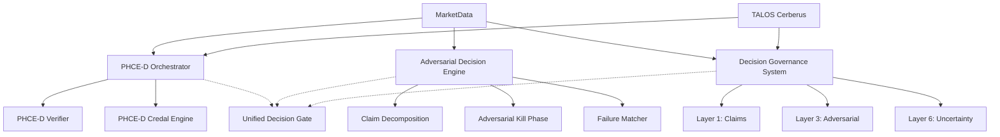

# Deep Architecture Audit: Decision Systems

This document provides a comprehensive audit of the existing decision-related modules in AlphaAlgo, identifying redundancies, bottlenecks, and areas for unification into the **Unified Cognitive Decision System (CDS)**.

## 1. PHCE-D (Post-Hypothesis Contradiction Elimination - Decision)
**Location:** `trading_bot/phce_d/`

*   **Purpose:** Enforces a falsifiable reasoning pipeline. It intakes evidence, generates a hypothesis, verifies it, handles contradictions, computes credal bounds, and applies a decision policy.
*   **Key Components:**
    *   `orchestrator.py`: Main pipeline.
    *   `evidence_intake.py`: Validates raw evidence.
    *   `hypothesis_generator.py`: Builds falsifiable hypotheses.
    *   `verifier.py`: Deterministic and statistical verification.
    *   `contradiction_classifier.py`: Categorizes evidence conflicts.
    *   `credal_engine.py`: Computes probability bounds (uncertainty).
    *   `decision_policy.py`: Maps credal bounds to outputs.
    *   `validation_gateway.py`: Final check before paper trade candidacy.
*   **Inputs:** Raw evidence (market data, signals), symbol, portfolio state.
*   **Outputs:** `DecisionOutput` (e.g., `PAPER_TRADE_CANDIDATE`, `NO_TRADE`, `REJECTED`).
*   **Duplications:**
    *   `verifier.py` overlaps with `Adversarial Decision`'s `verification_system.py`.
    *   `evidence_intake.py` overlaps with `TALOS`'s `ObservationPackage`.
    *   `decision_policy.py` overlaps with `Decision Governance` layers.
*   **Bottlenecks:** Sequential execution of 9 stages; simulated statistical verification in some parts.

## 2. Adversarial Decision Engine
**Location:** `trading_bot/adversarial_decision/`

*   **Purpose:** Rejects trades by default using a 9-step adversarial framework (Hard Reality, Claim Decomposition, Kill Phase, etc.).
*   **Key Components:**
    *   `adversarial_core.py`: Main orchestrator.
    *   `claim_system.py`: Decomposes trades into testable claims.
    *   `adversarial_roles.py`: Implements "Killer" roles to attack trades.
    *   `confidence_vector.py`: Calculates multi-dimensional confidence.
    *   `failure_matcher.py`: Matches current context against historical failure modes.
    *   `decision_gate.py`: Final approval logic.
*   **Inputs:** Market data, signal data, portfolio state, historical data.
*   **Outputs:** `TradeDecision` (APPROVED, REJECTED, etc.).
*   **Duplications:**
    *   `claim_system.py` duplicates `Decision Governance` `layer1_claim_graph.py`.
    *   `failure_matcher.py` duplicates `PHCE-D` `failure_memory.py`.
    *   `decision_gate.py` overlaps with `unified_decision_gate.py`.
*   **Bottlenecks:** Heavily heuristic; "Kill Phase" depends on manual rules.

## 3. Decision Governance System (DGS)
**Location:** `trading_bot/decision_governance/`

*   **Purpose:** 7-layer governance stack for self-auditing epistemic governance.
*   **Key Components:**
    *   `layer1` to `layer7`: Claim Graph, Evidence Audit, Adversarial Analyst, Regime Engine, Counterfactual, Uncertainty, Arbiter.
    *   `epistemic_governance.py`: Proof-trace engine.
*   **Inputs:** Signal, symbol, market data.
*   **Outputs:** `GovernanceDecision` (APPROVE, REJECT, ABSTAIN, etc.).
*   **Duplications:**
    *   Layer 1-3 significantly overlap with `Adversarial Decision` steps.
    *   Uncertainty calibration overlaps with `PHCE-D` Credal Engine.
*   **Bottlenecks:** Massive complexity (27+ files); high overhead for simple decisions.

## 4. TALOS (Trust-Augmented Live Operations System)
**Location:** `trading_bot/core/talos_cerberus_v23.py`

*   **Purpose:** Evidence reasoning for research and browser-based data collection. Focuses on legal sources, taint-awareness, and claim extraction.
*   **Key Components:**
    *   `TalosCerberusAI`: Orchestrator.
    *   `PolicyRouter`: Task governance.
    *   `ClaimExtractor`: Regex-based and deterministic extraction.
    *   `FinancialVerifier`: Span and numeric math verification.
*   **Inputs:** Task description, URLs, raw text/captures.
*   **Outputs:** `EvidenceScorecard`, `MentatVerificationReport`.
*   **Duplications:**
    *   `ClaimExtractor` overlaps with `Adversarial Decision` `claim_system.py`.
    *   `FinancialVerifier` overlaps with all other verifiers.
*   **Bottlenecks:** Designed for browser/research; lacks integration with real-time trading data streams.

## 5. Decision Layer
**Location:** `trading_bot/decision_layer/`

*   **Purpose:** High-level concepts (Cognitive, Probabilistic, Behavioral, Game Theory) for trade reasoning.
*   **Key Components:** `concepts_1` through `concepts_12`.
*   **Inputs:** Market context.
*   **Outputs:** Thematic reasoning scores.
*   **Duplications:** Most concepts are implemented as heuristics that overlap with specific checks in DGS and PHCE-D.

---

## Redundancy Summary
| Feature | PHCE-D | Adversarial Decision | Decision Governance | TALOS |
| :--- | :--- | :--- | :--- | :--- |
| **Evidence Intake** | `evidence_intake.py` | N/A | `layer2_evidence_auditor` | `ObservationPackage` |
| **Claim Decomposition** | `hypothesis_generator` | `claim_system.py` | `layer1_claim_graph` | `ClaimExtractor` |
| **Verification** | `verifier.py` | `verification_system.py` | `signal_validator` | `FinancialVerifier` |
| **Adversarial Analysis** | `adversarial_stress_test` | `adversarial_roles.py` | `layer3_adversarial_analyst` | `AdversarialReviewer` |
| **Uncertainty/Confidence** | `credal_engine.py` | `confidence_vector.py` | `layer6_uncertainty` | `EvidenceScorecard` |
| **Governance/Gate** | `validation_gateway` | `decision_gate.py` | `layer7_arbiter` | `PolicyRouter` |
| **Failure Memory** | `failure_memory.py` | `failure_matcher.py` | `memory_system.py` | `TalosMemoryStore` |

## Logic Maturity Audit
| Module | Logic Type | Status |
| :--- | :--- | :--- |
| **PHCE-D Orchestrator** | Production-grade (Pipeline) | Mature flow, but isolated. |
| **PHCE-D Verifier** | Heuristic/Deterministic | Reliable for math, weak on market nuance. |
| **PHCE-D Credal Engine** | Production-grade (Math) | Solid mathematical foundation. |
| **Adversarial Killer Phase** | Simulated/Heuristic | Relies on hardcoded `kill_reason` strings. |
| **Adversarial Failure Matcher** | Production-grade (Database) | Uses real historical failure memory. |
| **DGS Claim Graph** | Heuristic | Complex to maintain, often bypassed. |
| **DGS Counterfactuals** | Simulated | basic perturbations, not true market stress. |
| **TALOS Claim Extractor** | Heuristic (Regex) | Needs upgrade to LLM-augmented extraction. |
| **TALOS Mentat Verifier** | Production-grade (Loop) | Good bounded reasoning loop. |

## Dependency Graph (Current Fragmented State)

## Bottleneck Report
1.  **Architecture Bottleneck:** Multiple orchestrators (`PHCEDOrchestrator`, `AdversarialDecisionEngine`, `DecisionGovernanceSystem`) attempt to control the same decision flow. **Redesign:** Unify into a single `CDSOrchestrator`.
2.  **Reasoning Bottleneck:** Adversarial "Reviewers" are currently simple functions/classes. **Redesign:** Upgrade to specialist agents with independent memory and retrieval.
3.  **Evidence Bottleneck:** `TALOS` focuses on research (SEC filings) and doesn't effectively bridge live price/orderbook evidence into the reasoning graph. **Redesign:** Create a unified `EvidenceGraph` supporting both static and streaming data.
4.  **Latency Bottleneck:** Sequential verification across multiple systems. **Redesign:** Parallelize adversarial reviews and evidence validation using the Swarm.
5.  **Memory Bottleneck:** Failure memory is fragmented. `PHCE-D` has one, `Adversarial Decision` has another. **Redesign:** Unified `MultidimensionalKnowledgeMemory`.
6.  **Learning Bottleneck:** Rejections are logged but not automatically used to re-calibrate agent weights. **Redesign:** Implement Phase 8 (Self-Improvement) feedback loop.
7.  **Execution Bottleneck:** Final decision output format is inconsistent across layers. **Redesign:** Unified `FinalVerdict` data structure.
8.  **Validation Bottleneck:** Overlapping deterministic checks in `verifier.py` and `signal_validator.py`. **Redesign:** Single `UnifiedVerifier` module.
9.  **Governance Bottleneck:** Governance can technically be bypassed if an agent calls `execute_trade` directly. **Redesign:** Immutable governance gate integrated into the core execution path.
10. **Reliability Bottleneck:** System relies on a few "master" orchestrators; failure in one halts the whole decision. **Redesign:** Decentralized swarm-based synthesis.
11. **Maintainability Bottleneck:** 50+ files involved in decision making makes logic tracing difficult. **Redesign:** Streamlined CDS package structure.
