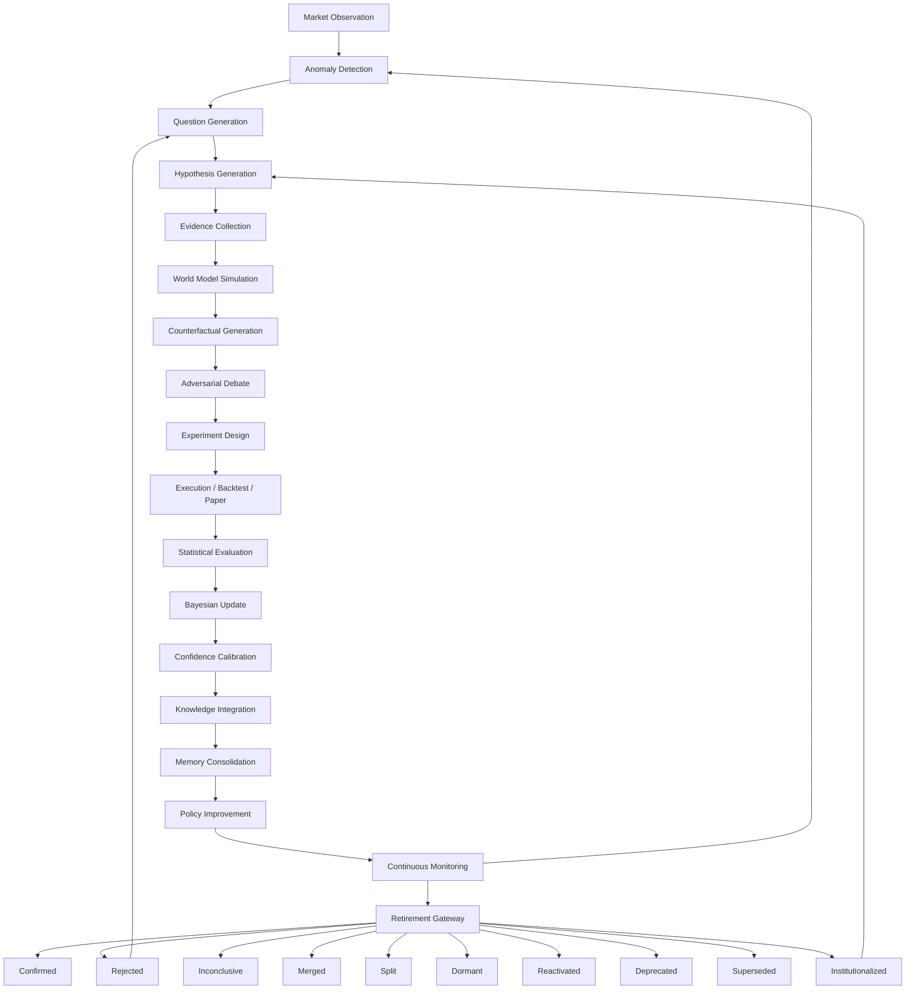

# AlphaAlgo Hypothesis Dependency Graph

This graph illustrates the current (and target) propagation of hypotheses through the AlphaAlgo UCA V5 ecosystem.

## Lifecycle Stages
1. **Observation**: Ingestion of raw market data and internal system states.
2. **Anomaly Detection**: Identifying deviations from World Model expectations.
3. **Question Generation**: Formulating causal inquiries about detected anomalies.
4. **Hypothesis Generation**: Creating falsifiable claims and Alpha ideas.
5. **Evidence Collection**: Gathering cross-domain data to support/refute claims.
6. **World Model Simulation**: Running "Forward World Model" projections.
7. **Counterfactual Generation**: Interventional "What-if" analysis (Do-calculus).
8. **Adversarial Debate**: Subjecting the hypothesis to the Verification Swarm.
9. **Experiment Design**: Defining the methodology for empirical testing.
10. **Execution**: Running backtests, forward tests, or production shadow trades.
11. **Evaluation**: Measuring performance vs. institutional metrics (Sharpe, etc.).
12. **Bayesian Update**: Updating posterior belief $P(H|E)$.
13. **Confidence Calibration**: Adjusting for uncertainty and model ambiguity.
14. **Knowledge Integration**: Abstracting findings into semantic memory.
15. **Memory Consolidation**: Storing into long-term research ledgers.
16. **Policy Improvement**: Updating SkillRouter and execution parameters.
17. **Continuous Monitoring**: Tracking for drift, decay, or regime shifts.
18. **Hypothesis Retirement**: Transitioning to one of the 10 authoritative end-states.
19. **Automatic Discovery**: Meta-discovery of new research paths from the retired state.
