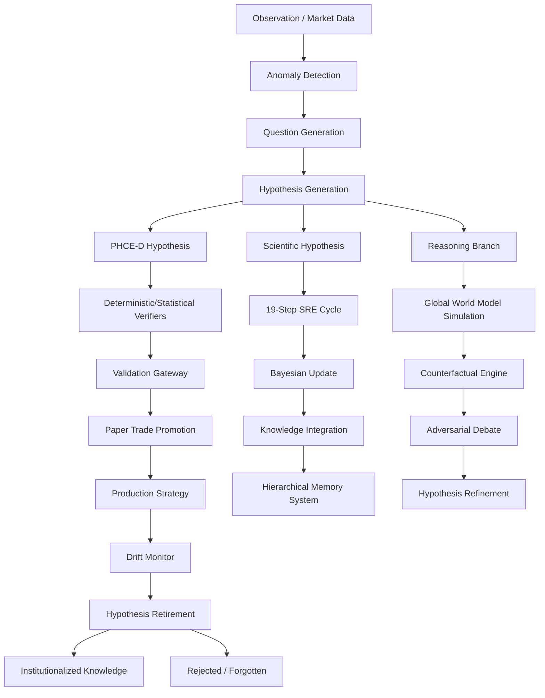

# Hypothesis Dependency Graph

## Flow Description

1.  **Origination**: Hypotheses originate from `HypothesisGenerator` modules (in PHCE-D and CSC) or via the `observe()` method in the `ScientificReasoningEngine`. They are triggered by anomalies or research objectives.
2.  **Propagation**: Hypotheses are wrapped in `ReasoningBranch` objects in CSC for parallel simulation, or passed as `Hypothesis` data structures through the `ValidationGateway` in PHCE-D.
3.  **Evolution**: Hypotheses evolve through the 19-step cycle in the SRE, where they are refined based on experiment results and counterfactual reasoning.
4.  **Evaluation**: Primary evaluation occurs in `trading_bot/phce_d/verifier.py` (performance metrics) and `trading_bot/core_agent_system/cds/epistemology_engine.py` (epistemic quality).
5.  **Death**: Hypotheses "die" when they are moved to `REJECTED` or `RETIRED` states due to drift detection, failed validation, or being superseded.
6.  **Knowledge**: Successful hypotheses are abstracted into Semantic or Institutional memory tiers within the HMS.
7.  **Policies**: Validated hypotheses influence trading policies via the `SkillRouter` and `PolicyImprovement` steps.
8.  **Strategies**: Hypotheses become active trading strategies after passing the Paper Trade promotion gate.
9.  **Feedback**: Retired or failed hypotheses influence future generation by providing negative examples in the `FailureMemory`.
