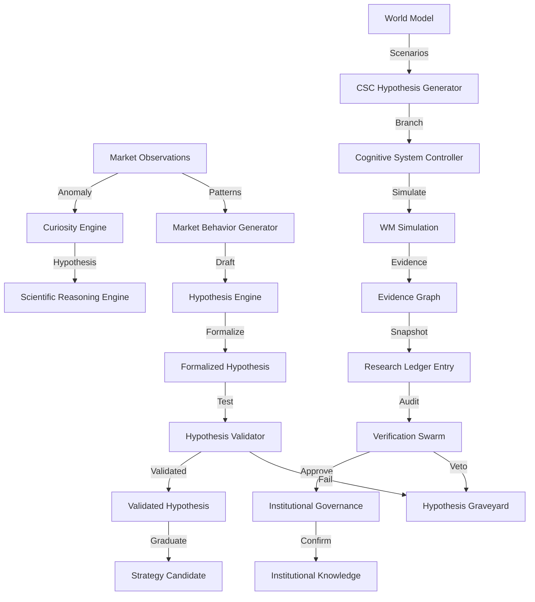

# AlphaAlgo Hypothesis Dependency Graph (Audit 2026)

## 1. Hypothesis Origin Points (Birth)

- **Market Observations:** `MarketBehaviorGenerator` (`trading_bot/intelligence_core/hypothesis_engine.py`) creates raw hypotheses from price patterns, volume anomalies, and regime changes.
- **World Model Scenarios:** `HypothesisGenerator` (`trading_bot/core/csc/hypothesis.py`) asks the World Model for raw scenarios and generates competing branches (Bull, Bear, Neutral).
- **Curiosity-Driven Research:** `CuriosityEngine` (`trading_bot/foundation_agents/curiosity_engine/hypothesis_generator.py`) generates hypotheses to fill information gaps or explain anomalies.
- **Autonomous Research Loops:** `ContinuousResearchOrganism` (`trading_bot/autonomous_research_organism/continuous_research_organism.py`) generates `ExperimentHypothesis` as part of its Phase 2.
- **Multi-Agent Debate:** `MultiAgentDebateSystem` (`trading_bot/agents/multi_agent_debate.py`) produces conflicting "beliefs" or "reasoning traces" that function as implicit hypotheses.

## 2. Hypothesis Propagation & Evolution (Life)

- **Formalization:** Raw ideas are transformed into `ScientificHypothesis` (`trading_bot/core_agent_system/scientific_reasoning/core.py`) or formalized `Hypothesis` (`trading_bot/intelligence_core/hypothesis_engine.py`) with testable predictions.
- **Reasoning Branches:** Hypotheses propagate through `ReasoningBranch` objects in the CSC, each carrying an `EvidenceGraph`.
- **Refinement:** The `HypothesisEngine` allows for "refined" status after testing if a hypothesis doesn't fully validate but isn't dead.
- **Evidence Synthesis:** `ResearchLedgerEntry` (`trading_bot/core/hms/models.py`) collects evidence packages from various sources (Market, Macro, Sentiment) and links them to hypotheses.

## 3. Evaluation & Verification Gates (The Trial)

- **World Model Simulation:** Hypotheses are tested against futures in `HypothesisGenerator.simulate_branches`.
- **Statistical Validation:** `HypothesisValidator` (`trading_bot/intelligence_core/hypothesis_engine.py`) tests predictions against out-of-sample data using significance and effect size thresholds.
- **Independent Peer Review:** `VerificationSwarm` (`trading_bot/core/verification/swarm.py`) audits `ResearchLedgerEntry` for hallucinations, causal consistency, and calculation errors.
- **Evidence-First Constraint:** CSC enforces a hard gate requiring minimum graph density and verifier consensus.

## 4. Promotion & Knowledge Integration (Transcendence)

- **Graduation:** Validated hypotheses in `HypothesisEngine` are "graduated" (status `GRADUATED`) to strategy candidates, often requiring human-in-the-loop approval (`trading_bot/approval/human_in_loop.py`).
- **Institutional Memory:** `ScientificMemoryObject` (`trading_bot/core/hms/models.py`) stores generalized lessons, failure modes, and regime correlations derived from successful/failed hypotheses.
- **Policy Update:** Confirmed hypotheses influence the `DecisionBus` and update agent policies in the RL/Self-Improvement layers.

## 5. Rejection & Retirement (Death)

- **Kill Conditions:** `Hypothesis` objects define explicit `kill_conditions` (e.g., "reliability drops below 50%").
- **The Graveyard:** `dead_hypotheses` are moved to the graveyard in `HypothesisEngine` to prevent reuse of failed ideas.
- **Falsification Triggers:** `ScientificHypothesis` includes `falsification_triggers` for continuous monitoring.

## 6. Summary Dependency Flow

## 7. Authoritative Registry of Lifecycle Points

### Creation Points (Birth)
1. `trading_bot/intelligence_core/hypothesis_engine.py`: `MarketBehaviorGenerator.generate()`
2. `trading_bot/core/csc/hypothesis.py`: `HypothesisGenerator.generate_competing_branches()`
3. `trading_bot/foundation_agents/curiosity_engine/hypothesis_generator.py`: `CuriosityEngine.generate()`
4. `trading_bot/autonomous_research_organism/continuous_research_organism.py`: `ExperimentPhase.HYPOTHESIS`
5. `trading_bot/core_agent_system/scientific_reasoning/core.py`: `ScientificReasoningEngine._generate_hypotheses()` (Step 4)

### Evaluation Points (Testing)
1. `trading_bot/intelligence_core/hypothesis_engine.py`: `HypothesisValidator.validate()`
2. `trading_bot/core/csc/hypothesis.py`: `HypothesisGenerator.simulate_branches()`
3. `trading_bot/core/csc/controller.py`: `CognitiveSystemController._verify_evidence_hard_constraint()`
4. `trading_bot/core/verification/swarm.py`: `VerificationSwarm.run_swarm()`
5. `trading_bot/core_agent_system/scientific_reasoning/core.py`: `ScientificReasoningEngine._evaluate()` (Step 11)

### Rejection Points (Death)
1. `trading_bot/intelligence_core/hypothesis_engine.py`: `HypothesisEngine._kill_hypothesis()` (Graveyard move)
2. `trading_bot/core/csc/controller.py`: CSC Evidence Gate rejection.
3. `trading_bot/core_agent_system/scientific_reasoning/core.py`: `ScientificReasoningEngine.evolve()` -> `HypothesisState.REJECTED`

### Promotion Points (Graduation)
1. `trading_bot/intelligence_core/hypothesis_engine.py`: `HypothesisEngine.graduate_hypothesis()` (Human-in-the-loop)
2. `trading_bot/core_agent_system/scientific_reasoning/core.py`: `ScientificReasoningEngine._integrate_knowledge()` (Step 14) -> `HypothesisState.INSTITUTIONALIZED`

