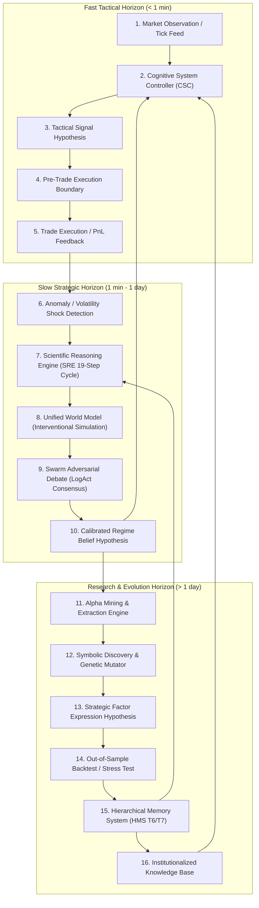

# Hypothesis Dependency Graph (Complete System Audit 2026)

## Overview
This document outlines the complete multi-horizon dependency and propagation graph of hypotheses across the AlphaAlgo Autonomous Scientific System. In AlphaAlgo, every signal, prediction, regime belief, trade idea, world model projection, and parameter mutation is treated as a falsifiable hypothesis.

---

## 1. Multi-Horizon Dependency Flow Graph

---

## 2. Propagation & Transition Pathways

| Horizon Stage | Subsystem Owner | Input Evidence | Transformation Output | Propagation Target |
| :--- | :--- | :--- | :--- | :--- |
| **Observation** | Data Pipelines / Tick Stream | Raw Orderbook & Trades | Anomaly Metric ($z$-score $> 2.5$) | `SRE.observe()` |
| **Tactical Hypothesis** | `CognitiveSystemController` | Price Action & Latent Features | Position Candidate Vector | `DeterministicFinancialGateway` |
| **World Model Simulation** | `UnifiedWorldModel` | Structural Causal Graph & $do(X)$ | Tri-Horizon Futures (Nominal, Stressed, Black Swan) | `AdversarialDebate` |
| **Adversarial Debate** | `GovernanceOrchestrator` | Risk Vetoes & Verifier Scores | Evidence-Weighted Consensus | `SRE.update_bayesian()` |
| **Memory Consolidation** | `HierarchicalMemorySystem` | Evaluated Performance Ledger | Knowledge Subgraph Entry (SAGE Graph) | `SkillRouter` |

---

## 3. Propagation to Downstream Action Layers

1. **Knowledge Conversion**: Validated hypotheses accumulate epistemic weight and transition to permanent nodes in `HierarchicalMemorySystem` (Level T6/T7).
2. **Policy Conversion**: Confirmed strategic hypotheses update the action space routing probabilities in `SkillRouter` and execution weights in `CognitiveSystemController`.
3. **Trading Strategy Conversion**: Factor hypotheses passing out-of-sample stress testing are promoted to active execution candidates managed by the `PHCE-D` deterministic engine.
4. **Future Reasoning Influence**: Historical failures are recorded with full invalidation DAGs, preventing repeated discovery of rejected structures.
