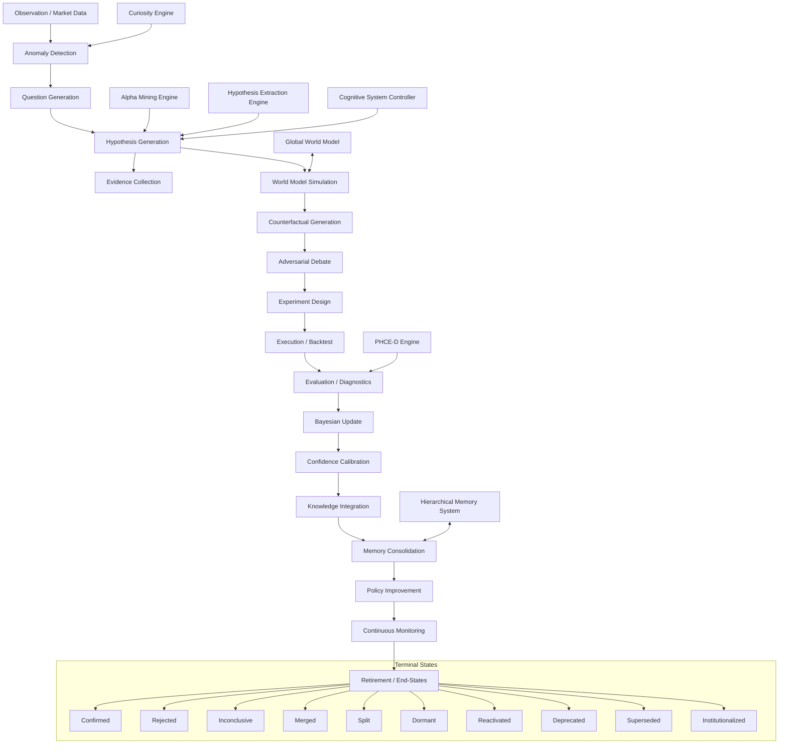

# Hypothesis Dependency Graph (Comprehensive Audit 2026)

## Critical Propagation Paths

1. **The Fast Loop (Tactical)**: `Observation` -> `CSC Reasoning` -> `Signal` -> `Execution` -> `Market Teacher Evaluation`.
2. **The Slow Loop (Strategic)**: `Anomaly` -> `SRE 19-Step Cycle` -> `Validated Hypothesis` -> `HMS Research Ledger` -> `Alpha Promotion`.
3. **The Research Loop**: `Academic Paper` -> `Extraction Engine` -> `Causal Mechanism` -> `Backtest` -> `Knowledge Base`.

## Component Mapping
- **World Model**: `trading_bot/world_model/` (Imagination, Counterfactuals, Causal Model).
- **Research Engine**: `trading_bot/alpha_research/` (Extraction, Mining).
- **Core Reasoning**: `trading_bot/core_agent_system/scientific_reasoning/core.py` (SRE).
- **Decision Layer**: `trading_bot/core/csc/` (Reasoning Branches, Logic Folding).
- **Validation**: `trading_bot/core/phce_d_engine.py` (Deterministic Verifiers).
- **Governance**: `trading_bot/core/unified_event_bus.py` (LogAct Consensus).
