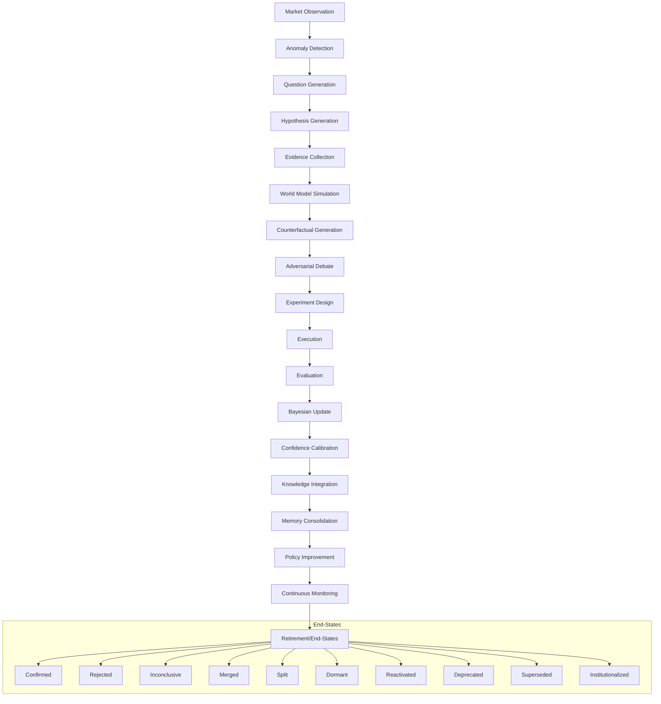

# Hypothesis Dependency Graph - AlphaAlgo UCA 2026

This document maps the flow of hypotheses from raw market observations to institutionalized knowledge.

## High-Level Flow

## Propagation Paths

1.  **Research-Led Path**:
    `ResearchObject` -> `HypothesisExtractionEngine` -> `Hypothesis` -> `ScientificReasoningEngine`.
2.  **Market-Led Path**:
    `MarketObservation` -> `CuriosityEngine` -> `HypothesisGenerator` -> `ReasoningBranch` -> `ScientificReasoningEngine`.
3.  **Discovery-Led Path**:
    `AlphaMiningEngine` -> `AlphaCandidate` -> `GeneticAlphaSearch` -> `ScientificReasoningEngine`.
4.  **Governance-Led Path**:
    `PHCE-D` -> `Hypothesis` -> `ValidationGateway` -> `DecisionRecord` -> `ScientificReasoningEngine`.

## Data Model Dependencies

- `ScientificHypothesis` (Core)
  - depends on `ScientificEvidence` (HMS)
  - depends on `HypothesisLineage` (SRE)
  - influences `CoreDecision` (CSC)
  - persists as `ScientificMemoryObject` (HMS)
