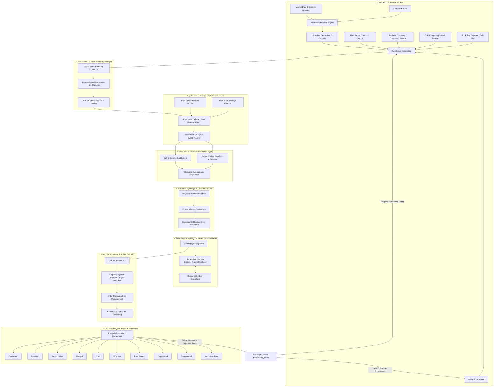

# Hypothesis Dependency Graph (Comprehensive Institutional Audit 2026)

## Overview & Architecture

The hypothesis ecosystem inside AlphaAlgo forms the central cognitive backbone of the Unified Cognitive Architecture (UCA V6). Hypotheses represent falsifiable claims, predictive models, directional market beliefs, strategy proposals, and causal representations across tactical (fast loop), strategic (slow loop), and meta-learning layers.

This dependency graph models the complete end-to-end propagation, state evolution, evaluation cycles, and knowledge conversion paths across all subsystems.

---

## Complete Mermaid Dependency Graph

---

## Detailed Propagation Loops

### 1. The Tactical Loop (Fast Loop - Latency Sensitive)
- **Flow**: `Market Ingestion` $\rightarrow$ `CSC State Classification` $\rightarrow$ `Hypothesis Generation` $\rightarrow$ `Deterministic Shield Verification` $\rightarrow$ `Execution Routing` $\rightarrow$ `Trade Journal Logging`.
- **Purpose**: Rapid market response and real-time execution based on pre-validated causal rules and calibrated confidence estimates.

### 2. The Strategic Scientific Loop (Slow Loop - 19-Stage SRE)
- **Flow**: `Anomaly Detection` $\rightarrow$ `Question Generation` $\rightarrow$ `Hypothesis Extraction / Mining` $\rightarrow$ `World Model Simulation` $\rightarrow$ `Do-Calculus Interventions` $\rightarrow$ `Verification Swarm Debate` $\rightarrow$ `Empirical Backtest` $\rightarrow$ `Bayesian Credal Contraction` $\rightarrow$ `HMS Ledger Storage`.
- **Purpose**: High-fidelity research, alpha discovery, strategy evolution, and rigorous falsification.

### 3. The Meta-Learning & Recursive Self-Improvement Loop
- **Flow**: `Hypothesis End-State Aggregation` $\rightarrow$ `Rejection Rate / Overfitting Diagnostics` $\rightarrow$ `SRE Parameter Self-Tuning (SEAL)` $\rightarrow$ `Curiosity Threshold Adaptation` $\rightarrow$ `Alpha Mining Strategy Update`.
- **Purpose**: Systemic self-correction preventing persistent bias, over-fitting, and search degeneration.

---

## Subsystem Interface Mapping

| Subsystem | Primary Class / Module | Interface Role in Hypothesis Lifecycle |
| :--- | :--- | :--- |
| **Scientific Reasoning Engine** | `trading_bot/core_agent_system/scientific_reasoning/core.py` | Central lifecycle orchestrator managing 19 stages and 10 terminal states. |
| **World Model** | `trading_bot/world_model/imagination.py` & `causal_model.py` | Performs scenario simulations, counterfactual interventions ($do(X)$), and surprise calculations. |
| **Cognitive System Controller** | `trading_bot/core/csc/controller.py` | Synthesizes competing hypothesis branches, evaluates risk constraints, and routes signals. |
| **Hierarchical Memory System** | `trading_bot/core/hms/memory.py` | Persists research ledgers, hypothesis graphs, evidence chains, and historical failures. |
| **Verification Swarm** | `trading_bot/agents/multi_agent_debate.py` | Executes multi-agent adversarial debate, red-teaming, and risk verifier falsification. |
| **Alpha Research Engine** | `trading_bot/alpha_research/hypothesis_extraction.py` | Mines expressions, extracts academic paper hypotheses, and logs alpha decay via Death Clock. |
| **Governance & Safety** | `trading_bot/governance/evolution_gate.py` & `immutable_shield.py` | Enforces non-negotiable risk limits, multi-attribute evolution gates, and immutable safety rules. |

---

## Terminal End-State Definitions

Every hypothesis created within the ecosystem must resolve deterministically into one of these 10 states:

1. **Confirmed**: Validated empirically with $P(\mathcal{H} \mid \mathcal{E}) \ge 0.85$ and $ECE < 0.05$. Promoted to active trading.
2. **Rejected**: Statistically falsified or vetoed by risk verifiers ($P(\mathcal{H} \mid \mathcal{E}) < 0.20$).
3. **Inconclusive**: Insufficient sample size or high credal ambiguity ($\text{span}(p) > 0.50$).
4. **Merged**: Synthesized with a complementary hypothesis to form a higher-order strategy.
5. **Split**: Decomposed into distinct regime-specific sub-hypotheses due to bimodal performance.
6. **Dormant**: Inactive due to unfavorable current market regime, but preserved for reactivation.
7. **Reactivated**: Retrieved from dormant state when market conditions match boundary specifications.
8. **Deprecated**: Graduated out of active service due to continuous alpha decay over time.
9. **Superseded**: Replaced by a superior evolution or higher-Sharpe strategy.
10. **Institutionalized**: Consolidated into permanent background knowledge (Level 5 promotion).
