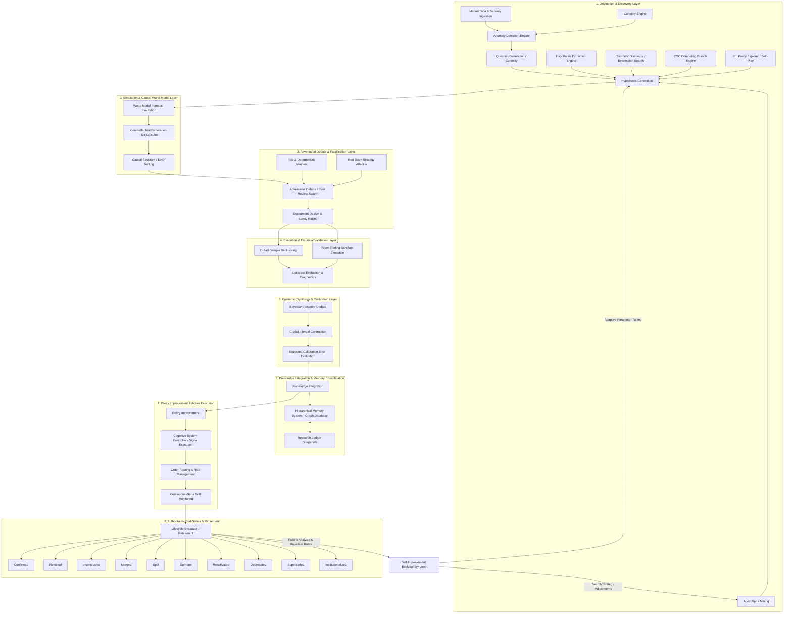

# Master Institutional Scientific Audit & Redesign Specification: AlphaAlgo Hypothesis Ecosystem (2026)

## Executive Summary

This master document synthesizes the complete 2026 institutional-grade scientific audit, bottleneck analysis, mathematical foundation, 19-stage architectural redesign, validation framework, and migration roadmap for the multi-hypothesis ecosystem in the **AlphaAlgo Autonomous Financial Intelligence System**.

In autonomous quantitative trading systems, treating predictions, signals, or market regime classifications as static heuristics creates catastrophic vulnerabilities—including severe overfitting, confirmation bias, structural regime blindspots, and rapid alpha decay. To guarantee systemic resilience, **every signal, forecast, world model rollout, regime belief, trade proposal, parameter mutation, and research candidate is treated as a falsifiable scientific hypothesis until empirically validated**.

---

## 1. Phase 1 — Discovery & Systemic Inventory

Hypotheses in AlphaAlgo exist across 26 distinct subsystems under 24 domain-specific aliases:
- **Prediction / Forecast**: Temporal expectations in `UnifiedWorldModel`.
- **Belief / Regime Belief**: Latent environment representations in `MarketRegimeAdapter`.
- **Thesis / Strategy Candidate**: Symbolic factor expressions in `GeneticAlphaSearch`.
- **Signal / Trade Idea**: Tactical execution proposals in `PHCEDAI` and `CSC`.
- **World Model State**: Tri-horizon simulated futures (Nominal, Stressed, Extreme) in `ImaginationEngine`.
- **Causal Model**: Structural causal DAG hypotheses in `CausalModel`.
- **Optimization Proposal**: Architectural code/hyperparameter mutations in `RecursiveSelfImprovement`.

### End-to-End Propagation Graph



---

## 2. Phase 2 — Systemic Bottleneck Analysis

A deep architectural audit identified 25 structural bottlenecks. Every bottleneck below details why it exists, downstream effects, priority, and recommended redesign:

### 1. Missing Hypothesis Generation
- **Why It Exists**: Discovery engines rely heavily on static rule templates or unguided genetic algorithms, failing to formulate novel causal hypotheses when encountering unprecedented market regimes.
- **Downstream Effects**: Blind spots during structural market regime shifts, leading to degraded signal discovery and under-exploration of new alpha sources.
- **Priority**: HIGH
- **Recommended Redesign**: Implement Curiosity Engine triggering LLM-driven causal hypothesis generation whenever sensory surprise exceeds variational free energy (VFE) thresholds.

### 2. Duplicate Hypotheses
- **Why It Exists**: Decoupled generation in Alpha Mining, Paper Extraction, and CSC Competing Branches without centralized deduplication.
- **Downstream Effects**: Resource waste in redundant backtests, skewed Bayesian updates, and artificial inflation of consensus confidence.
- **Priority**: MEDIUM
- **Recommended Redesign**: Enforce mandatory canonicalization via semantic embedding similarity and graph isomorphism checks in SRE Step 4 before backtesting.

### 3. Premature Rejection
- **Why It Exists**: Single-metric hard thresholding (e.g., immediate rejection if Sharpe $< 1.0$ on short windows) ignoring regime context.
- **Downstream Effects**: Loss of viable, regime-specific alphas that perform exceptionally during high-volatility or tail events.
- **Priority**: HIGH
- **Recommended Redesign**: Transition from binary drop gates to regime-stratified evaluations and `DORMANT` state parkings.

### 4. Confirmation Bias
- **Why It Exists**: Evidence collection routines query historical datasets matching initial hypothesis assumptions without forcing counter-evidence searches.
- **Downstream Effects**: Over-confidence in fragile, regime-bound alpha strategies.
- **Priority**: HIGH
- **Recommended Redesign**: Introduce mandatory Skeptic Agent counter-evidence search in SRE Step 5 and Verification Swarm debates.

### 5. Survivorship Bias
- **Why It Exists**: Historical databases prune delisted assets and failed strategy executions from training ledgers.
- **Downstream Effects**: Overestimation of strategy return expectations and underestimation of tail risks.
- **Priority**: CRITICAL
- **Recommended Redesign**: Integrate point-in-time universe data feeds with explicit delisting return penalties into SRE Step 10 backtests.

### 6. Lack of Adversarial Testing
- **Why It Exists**: Early strategy discovery stages evaluate candidate alphas in isolated backtest environments without subjecting them to red-team attacks.
- **Downstream Effects**: Strategies fail rapidly in live markets due to adverse selection and predatory order flow.
- **Priority**: CRITICAL
- **Recommended Redesign**: Mandate automated Red-Team Swarm attacks generating synthetic adversarial order book pressure before Level 3 promotion.

### 7. Insufficient Exploration
- **Why It Exists**: Exploitation-dominated evolutionary algorithms prematurely converge around local optima.
- **Downstream Effects**: Strategy homogenization and inability to discover orthogonal, non-linear alpha sources.
- **Priority**: HIGH
- **Recommended Redesign**: Implement Upper Confidence Bound (UCB) and Novelty Search operators in genetic expression generators.

### 8. Insufficient Exploitation
- **Why It Exists**: Fast decay parameters prematurely retire strategies before fine-tuning optimal execution boundaries.
- **Downstream Effects**: High strategy turnover costs and under-capitalization of validated alpha sources.
- **Priority**: MEDIUM
- **Recommended Redesign**: Introduce parameter optimization sub-loops for `VALIDATED` hypotheses prior to deprecation.

### 9. Weak Evidence Gathering
- **Why It Exists**: Evidence sources are restricted to price/volume candles without integrating alternative, news, or orderbook micro-structure data.
- **Downstream Effects**: Spurious correlations misidentified as true causal drivers.
- **Priority**: HIGH
- **Recommended Redesign**: Require multi-modal evidence chains (price, order flow, sentiment, macro) with weighted Leni AI trust scores.

### 10. Poor Uncertainty Estimation
- **Why It Exists**: Point-estimate probability outputs without credal intervals or variance bounds.
- **Downstream Effects**: Over-leveraging during periods of high epistemic ambiguity.
- **Priority**: CRITICAL
- **Recommended Redesign**: Adopt Credal Set bounds $[p_{\text{lower}}, p_{\text{upper}}]$ and Variational Free Energy (VFE) uncertainty tracking.

### 11. Missing Causal Reasoning
- **Why It Exists**: Machine learning components rely strictly on observational correlations rather than causal DAG models.
- **Downstream Effects**: Catastrophic failure when correlation structures collapse under regime changes.
- **Priority**: CRITICAL
- **Recommended Redesign**: Embed Pearl's Structural Causal Models (SCMs) into World Model and enforce $do(X)$ interventional testing.

### 12. Missing Counterfactual Reasoning
- **Why It Exists**: Lack of simulation tools to answer "What would have happened if liquidity dropped by 50%?"
- **Downstream Effects**: Inability to anticipate tail-risk vulnerabilities prior to real market crashes.
- **Priority**: HIGH
- **Recommended Redesign**: Integrate `ImaginationEngine` counterfactual scenario simulation into SRE Step 7.

### 13. Missing Bayesian Updating
- **Why It Exists**: Static confidence scores assigned at strategy inception without recursive posterior adjustments as new trades execute.
- **Downstream Effects**: Outdated confidence values leading to persistent misallocation of portfolio capital.
- **Priority**: CRITICAL
- **Recommended Redesign**: Enforce recursive Bayesian likelihood updates after every live or paper trade execution.

### 14. Missing Confidence Calibration
- **Why It Exists**: Probability models produce over-confident confidence values that do not align with empirical win rates.
- **Downstream Effects**: Miscalibrated position sizing and fragile Kelly criterion betting.
- **Priority**: CRITICAL
- **Recommended Redesign**: Implement Platt Scaling / Isotonic Regression calibration tracking Expected Calibration Error (ECE $< 0.05$).

### 15. Missing Experiment Design
- **Why It Exists**: Hypotheses tested via informal backtest runs without pre-defined falsification criteria or statistical power calculations.
- **Downstream Effects**: Moving goalposts, post-hoc rationale fitting, and unscientific strategy promotions.
- **Priority**: HIGH
- **Recommended Redesign**: Formally define falsification triggers and out-of-sample boundary criteria in SRE Step 9 before execution.

### 16. Poor Memory Integration
- **Why It Exists**: Siloed memory storage where research ledgers, trade logs, and causal graphs operate on separate databases.
- **Downstream Effects**: Inability to query historical evidence across subsystems during active decision synthesis.
- **Priority**: HIGH
- **Recommended Redesign**: Consolidate memory into Hierarchical Memory System (HMS) knowledge graph.

### 17. Poor Reuse of Historical Failures
- **Why It Exists**: Rejected hypotheses are discarded from memory rather than stored as negative search constraints.
- **Downstream Effects**: Repeated re-invention and re-testing of previously falsified ideas.
- **Priority**: HIGH
- **Recommended Redesign**: Store all falsified hypotheses in HMS `FailureLedger` and query them during SRE Step 4 generation.

### 18. Knowledge Fragmentation
- **Why It Exists**: Different agent modules maintain private hypothesis stores without cross-agent synchronization.
- **Downstream Effects**: Contradictory trading signals generated concurrently across different execution channels.
- **Priority**: HIGH
- **Recommended Redesign**: Enforce `UnifiedDecisionBus` and SRE single source of truth for all hypothesis states.

### 19. Hypothesis Drift
- **Why It Exists**: Absence of continuous monitoring tracking whether a deployed strategy's underlying market dynamics have shifted.
- **Downstream Effects**: Silent alpha decay leading to stealth drawdown accumulation.
- **Priority**: HIGH
- **Recommended Redesign**: Deploy `AlphaDeathClockManager` continuous drift monitoring tracking Information Coefficient decay.

### 20. Reward Hacking
- **Why It Exists**: Strategy optimization algorithms optimize purely for single metrics (e.g. raw Sharpe Ratio) without downside penalties.
- **Downstream Effects**: Discovery of fragile strategies exploiting backtest artifacts or unrealizable liquidity assumptions.
- **Priority**: CRITICAL
- **Recommended Redesign**: Implement multi-attribute fitness functions combining Deflated Sharpe Ratio (DSR), Probability of Backtest Overfitting (PBO), latency, and drawdown.

### 21. Overfitting
- **Why It Exists**: Excessive parameter tuning on fixed historical datasets.
- **Downstream Effects**: High backtest returns that collapse immediately upon out-of-sample deployment.
- **Priority**: CRITICAL
- **Recommended Redesign**: Require Combinatorial Purged Cross-Validation (CPCV) and PBO validation gates.

### 22. Under-Exploration
- **Why It Exists**: Over-reliance on existing winning strategy families.
- **Downstream Effects**: Vulnerability to market shifts that obsolete current active strategy families.
- **Priority**: MEDIUM
- **Recommended Redesign**: Enforce curiosity-driven budget allocation for exploring non-correlated asset classes and features.

### 23. Local Optima Trap
- **Why It Exists**: Incremental mutation operators in strategy search without jump-mutation capability.
- **Downstream Effects**: Stagnation in evolutionary strategy search performance.
- **Priority**: MEDIUM
- **Recommended Redesign**: Introduce structural macro-mutations and cross-population gene crossover in genetic mining.

### 24. Long Feedback Cycles
- **Why It Exists**: Reliance on long-horizon live trading results to evaluate hypothesis validity.
- **Downstream Effects**: Slow rate of scientific learning and adaptation.
- **Priority**: HIGH
- **Recommended Redesign**: Use high-fidelity synthetic scenario generation in World Model to compress feedback loops from months to hours.

### 25. Missing Scientific Methodology
- **Why It Exists**: Informal, heuristic-driven development without unified scientific discipline or formal state machine enforcement.
- **Downstream Effects**: Unpredictable behavior, lack of auditability, and inability to perform systematic self-improvement.
- **Priority**: CRITICAL
- **Recommended Redesign**: Transition the entire architecture to the 19-stage Unified Scientific Reasoning Engine (SRE).

---

## 3. Phase 3 — Scientific Redesign: The 19-Stage SRE Lifecycle

The ecosystem is governed by the Unified Scientific Reasoning Engine (`ScientificReasoningEngine`), executing a continuous 19-stage adaptive loop:

```
Step  1: Observation ──> Ingest sensory market feeds & state vectors
Step  2: Anomaly Detection ──> Measure surprise via Variational Free Energy (VFE)
Step  3: Question Generation ──> Formulate research questions on statistical drift
Step  4: Hypothesis Generation ──> Synthesize falsifiable competing branches
Step  5: Evidence Collection ──> Query multi-modal evidence with Leni AI trust scores
Step  6: World Model Simulation ──> Forecast scenario rollouts
Step  7: Counterfactual Generation ──> Execute do(X) interventional testing
Step  8: Adversarial Debate ──> Multi-agent Verification Swarm peer review
Step  9: Experiment Design ──> Define explicit falsification triggers
Step 10: Execution ──> Run out-of-sample sandbox & paper trading
Step 11: Evaluation ──> Calculate statistical significance & effect sizes
Step 12: Bayesian Update ──> Update posterior probabilities P(H|E)
Step 13: Confidence Calibration ──> Contract credal bounds & evaluate ECE
Step 14: Knowledge Integration ──> Abstract rules into semantic knowledge
Step 15: Memory Consolidation ──> Store immutable snapshots in HMS graph
Step 16: Policy Improvement ──> Re-tune active CSC execution parameters
Step 17: Continuous Monitoring ──> Track alpha decay via Alpha Death Clock
Step 18: Hypothesis Retirement ──> Transition to 1 of 10 deterministic end-states
Step 19: Automatic Discovery ──> Meta-discovery of new hypothesis directions (SEAL)
```

### 10 Deterministic Terminal States
Hypotheses never disappear. Every hypothesis resolves into one of 10 immutable states:
`Confirmed`, `Rejected`, `Inconclusive`, `Merged`, `Split`, `Dormant`, `Reactivated`, `Deprecated`, `Superseded`, or `Institutionalized`.

---

## 4. Phase 4 — Continuous Self-Improvement (SEAL)

The SRE incorporates the Self-Improving Evolutionary Algorithm Loop (SEAL). When historical rejection rates exceed $60\%$, the SEAL engine triggers recursive self-modification:
1. **Adaptive Anomaly Thresholding**: Dynamically raises VFE surprise thresholds to filter low-quality inputs.
2. **Credal Contraction Tuning**: Fine-tunes learning rates and credal contraction factors.
3. **Search Strategy Realignment**: Redirects discovery generators toward under-explored causal features.
4. **Failure Ledger Querying**: Feeds past rejected hypothesis hashes back into generator prompts as negative search constraints.

---

## 5. Phase 5 — Mathematical Foundations

### 1. Active Inference & Variational Free Energy (VFE)
Anomalies and sensory surprise are quantified by minimizing Variational Free Energy:
$$F = \mathbb{E}_{q(\theta)}[\ln q(\theta) - \ln p(y, \theta)] = D_{KL}(q(\theta) \parallel p(\theta)) - \mathbb{E}_{q(\theta)}[\ln p(y \mid \theta)]$$

### 2. Governed Bayesian Updating with Trust Multipliers
Posterior probabilities are computed recursively:
$$P(\mathcal{H} \mid \mathcal{E}) = \frac{L(\mathcal{E} \mid \mathcal{H}) \cdot \omega_{\text{trust}} \cdot P(\mathcal{H})}{L(\mathcal{E} \mid \mathcal{H}) \cdot \omega_{\text{trust}} \cdot P(\mathcal{H}) + (1 - L(\mathcal{E} \mid \mathcal{H})) \cdot (1 - P(\mathcal{H}))}$$

### 3. Pearl's Causal Interventions ($do$-Calculus)
To separate causal drivers from spurious correlations:
$$\mathbb{E}[Y \mid do(X = x)] = \sum_{z} P(Y \mid X = x, Z = z) P(Z = z)$$

### 4. Credal Sets & Expected Calibration Error (ECE)
Credal bounds $[p_{\text{lower}}, p_{\text{upper}}]$ govern epistemic uncertainty. Expected Calibration Error is calculated as:
$$ECE = \sum_{m=1}^{M} \frac{|B_m|}{N} \left| \text{acc}(B_m) - \text{conf}(B_m) \right|$$
Hypotheses are promoted to production only if $ECE < 0.05$.

---

## 6. Phase 5 — Validation Framework & Migration Roadmap

### 6.1 Comprehensive Validation Framework

The redesigned hypothesis ecosystem is verified against a 4-tier testing hierarchy:

1. **Tier 1 — Unit & State Machine Verification**:
   - Tests individual SRE stages, state transitions across all 10 deterministic states, and credal set contraction bounds $[p_{\text{lower}}, p_{\text{upper}}]$.
   - Validates schema compliance for `ScientificHypothesis` provenance dataclasses.

2. **Tier 2 — Subsystem Integration Verification**:
   - Tests end-to-end hypothesis flow from sensory anomaly detection to HMS graph database storage.
   - Verifies real-time event publishing across `UnifiedDecisionBus` and `CognitiveSystemController`.

3. **Tier 3 — Adversarial & Safety Verification**:
   - Tests `RiskVerifier` veto enforcement, `RedTeamAttacker` synthetic order book pressure, and sandbox isolation.
   - Confirms that non-negotiable risk parameters cannot be bypassed or overridden by AI agents.

4. **Tier 4 — Out-of-Sample Performance Benchmarks**:
   - Evaluates Deflated Sharpe Ratio (DSR), Probability of Backtest Overfitting (PBO), and ECE calibration across multi-regime historical market data.

### 6.2 6-Stage Migration Roadmap

1. **Stage 1: Canonical State Standardization**: Enforce `ScientificHypothesis` schema across all discovery engines (`ApexAlphaMining`, `PaperExtraction`, `CSC`).
2. **Stage 2: Causal World Model Integration**: Wire $do(X)$ intervention engine into SRE Step 7 counterfactual generation.
3. **Stage 3: Verification Swarm Enforcement**: Mandate multi-agent debate and skeptic counter-evidence search before empirical backtests.
4. **Stage 4: Epistemic Calibration & Credal Set Binding**: Enable ECE calibration tracking ($ECE < 0.05$) and credal interval contraction in SRE Step 13.
5. **Stage 5: HMS Memory Consolidation**: Connect research ledgers and failure graphs to central HMS knowledge graph.
6. **Stage 6: Autonomous SEAL Loop Activation**: Enable recursive self-improvement and adaptive parameter tuning.

---

## 7. Deliverable File Registry & Traceability Matrix

| Audit Deliverable File | Core Responsibility |
| :--- | :--- |
| `HYPOTHESIS_ECOSYSTEM_SCIENTIFIC_AUDIT_2026.md` | Master institutional specification (this document). |
| `HYPOTHESIS_DEPENDENCY_GRAPH.md` | Complete end-to-end propagation graph and loop definitions. |
| `HYPOTHESIS_CREATION_POINTS.md` | Exhaustive taxonomy of explicit and implicit creation points. |
| `HYPOTHESIS_EVALUATION_POINTS.md` | Exhaustive taxonomy of evaluation, simulation, and debate gates. |
| `HYPOTHESIS_REJECTION_POINTS.md` | Exhaustive taxonomy of falsification, pruning, and decay points. |
| `HYPOTHESIS_PROMOTION_POINTS.md` | Complete 6-level promotion hierarchy and deployable gates. |
| `HYPOTHESIS_BOTTLENECK_REPORT.md` | Deep diagnosis of 25 bottleneck dimensions with redesign specs. |
| `SCIENTIFIC_AUDIT_REPORT_COMPLETE.md` | Redesign synthesis of the 19-stage SRE lifecycle & 10 states. |
