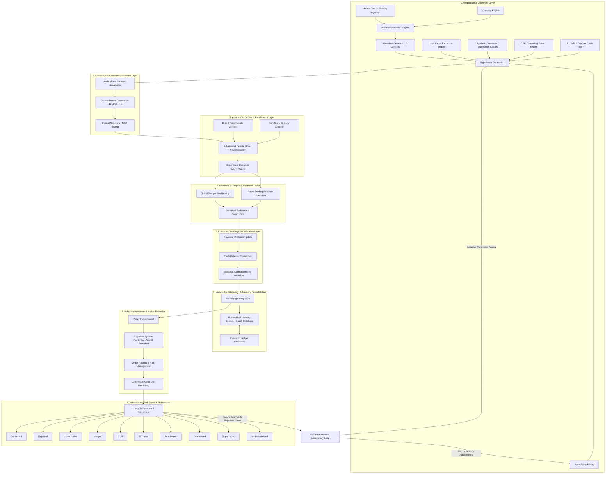

# Master Scientific Audit and Redesign Specification: AlphaAlgo Hypothesis Ecosystem (2026)

## Executive Summary & Scope

AlphaAlgo’s Unified Cognitive Architecture (UCA V6) operates as an institutional-grade autonomous research and execution platform. At its core lies the **Hypothesis Ecosystem**, which governs how falsifiable assertions, predictive models, directional market beliefs, strategy proposals, and causal representations originate, propagate, evolve, are tested, and transition into permanent background knowledge or policy rules.

This master document presents the complete 2026 Scientific Audit and Architectural Redesign of AlphaAlgo's hypothesis ecosystem. The audit treats every prediction, belief, forecast, trade idea, and decision as a hypothesis until empirically validated or falsified.

---

## Phase 1 — Discovery & Systemic Inventory

Hypotheses in AlphaAlgo exist in both explicit forms (e.g., `ScientificHypothesis`, `ResearchHypothesis`, `AlphaGenome`) and implicit forms (e.g., regime belief vectors, structural causal DAG edges, policy value function estimates, options volatility skew fits, trade ideas, latent representations).

### Taxonomy of 24 Hypothesis Aliases

1. **Prediction**: Neural/ML directional price or return vector predictions.
2. **Belief**: Epistemic Bayesian probability assignments over market outcomes.
3. **Assumption**: Explicit market structural constraints (e.g., liquidity elasticity, zero arbitrage).
4. **Thesis**: High-level macro or fundamental trade thesis generated by LLM/Swarm agents.
5. **Alpha**: Mathematical signals attempting to capture persistent market inefficiencies.
6. **Signal**: Actionable indicator values triggering execution routing.
7. **Strategy**: Executable policy combining entry/exit rules, risk parameters, and position sizing.
8. **Forecast**: Multi-step volatility, volume, or price path distributions generated by the World Model.
9. **Explanation**: Post-hoc causal reasoning explaining anomaly occurrences or market regime shifts.
10. **Scenario**: Counterfactual multi-asset simulation path ($do(X)$ interventions).
11. **Plan**: Hierarchical sequence of actions formulated by Planner agents.
12. **Expectation**: Expected utility or Q-value score associated with an action candidate.
13. **Causal Model**: Directed Acyclic Graph (DAG) modeling structural relationships between assets/factors.
14. **World Model State**: Latent representation $z_t$ summarizing physical/financial market state dynamics.
15. **Latent Representation**: Encoded embedding capturing cross-asset dependency features.
16. **Confidence Estimate**: Uncertainty calibration score attached to agent decisions ($ECE$).
17. **Research Proposal**: Generated hypothesis candidate extracted from academic literature (ArXiv).
18. **Experiment**: Structured backtest or paper trading trial with pre-defined falsification triggers.
19. **Trade Idea**: Tactical execution candidate submitted to the Cognitive System Controller (CSC).
20. **Regime Belief**: Dirichlet distribution over latent market regimes (e.g., High Vol expansion).
21. **Anomaly Explanation**: Causal reasoning explaining sudden sensory variance spikes.
22. **Policy Candidate**: RL policy neural weights candidate undergoing self-evolution checks.
23. **Optimization Proposal**: Hyperparameter or architectural mutation proposal submitted to Evolution Gate.
24. **Hypothesis**: Formal `ScientificHypothesis` object tracked through the 19-stage SRE lifecycle.

---

### Complete Mermaid Dependency Graph



---

### Propagation Loops Across Time Horizons

1. **Tactical Fast Loop (Sub-Second to Minute)**:
   - `Sensory Ingestion` $\rightarrow$ `CSC Competing Branch` $\rightarrow$ `Deterministic Shield Verification` $\rightarrow$ `Execution Routing` $\rightarrow$ `Trade Journal Logging`.
2. **Strategic Scientific Slow Loop (Hours to Days)**:
   - `Anomaly Detection` $\rightarrow$ `Curiosity Question` $\rightarrow$ `Hypothesis Extraction / Alpha Mining` $\rightarrow$ `World Model Causal $do(X)$ Intervention` $\rightarrow$ `Verification Swarm Debate` $\rightarrow$ `Out-of-Sample Backtesting` $\rightarrow$ `Bayesian Updating & Calibration` $\rightarrow$ `HMS Memory Store`.
3. **Meta-Learning & Recursive Self-Improvement Loop (Weekly to Monthly)**:
   - `End-State Aggregation` $\rightarrow$ `Rejection Rate / Overfitting Diagnostics` $\rightarrow$ `SRE Parameter Self-Tuning (SEAL)` $\rightarrow$ `Curiosity Threshold Adaptation` $\rightarrow$ `Alpha Search Mutation`.

---

### Systemic Creation, Evaluation, Rejection, and Promotion Mapping

#### 1. Creation Points Mapping
- **World Model** (`trading_bot/world_model/`): Generates forecast state vectors, scenario trees, and counterfactual intervention candidates.
- **Alpha & Strategy Mining** (`trading_bot/apex_fi/`, `trading_bot/strategy_discovery/`): Generates symbolic mathematical alpha expressions and strategy genomes.
- **Literature Extraction** (`trading_bot/alpha_research/`): Parses research papers into testable hypothesis objects.
- **Decision Layer (CSC)** (`trading_bot/core/csc/`): Generates rival execution branches for real-time trade synthesis.
- **Curiosity Engine** (`trading_bot/foundation_agents/curiosity_engine/`): Formulates causal hypotheses driven by sensory surprise spikes.

#### 2. Evaluation Points Mapping
- **Scientific Reasoning Engine** (`trading_bot/core_agent_system/scientific_reasoning/core.py`): Performs 19-stage empirical statistical evaluation and Bayesian posterior calculation.
- **Causal World Model** (`trading_bot/world_model/causal_model.py`): Tests DAG mechanisms under Pearl's $do(X)$ interventions.
- **Verification Swarm** (`trading_bot/agents/multi_agent_debate.py`): Multi-agent adversarial debate evaluating falsification claims and risk bounds.
- **Strategy Diagnostics** (`trading_bot/alpha_research/strategy_diagnostics.py`): Evaluates Probability of Backtest Overfitting (PBO) and Deflated Sharpe Ratio (DSR).

#### 3. Rejection Points Mapping
- **Scientific Engine**: Falsifies hypotheses when $P(\mathcal{H} \mid \mathcal{E}) < 0.20$.
- **Risk Verifier**: Non-negotiable veto upon drawdown breach, invalid exposure, or extreme VIX levels.
- **Alpha Death Clock** (`trading_bot/alpha_research/alpha_death_clock.py`): Retires alphas showing $> 50\%$ Information Coefficient decay.
- **Evolution Gate** (`trading_bot/governance/evolution_gate.py`): Rejects candidates showing latency, Sharpe, or calibration regressions.

#### 4. Promotion Points Mapping
- **Level 1 (Candidate)**: Formulated branch clearing basic syntax checks.
- **Level 2 (Validated)**: $P(\mathcal{H} \mid \mathcal{E}) > 0.70$ under OOS backtesting.
- **Level 3 (Research Strategy)**: $P(\mathcal{H} \mid \mathcal{E}) > 0.85$ and $ECE < 0.05$, stored in HMS graph memory.
- **Level 4 (Production Strategy)**: Clears Evolution Gate and human/automated safety shields for active trading.
- **Level 5 (Institutional Knowledge)**: Long-term multi-regime stability, stored as permanent domain axiom.

---

## Phase 2 — Bottleneck Analysis (Exhaustive 25 Dimensions)

### 1. Missing Hypothesis Generation
- **Why It Exists**: Discovery engines rely heavily on static rule templates or unguided genetic algorithms, failing to formulate novel causal hypotheses when encountering unprecedented market regimes.
- **Downstream Effects**: Blind spots during structural market regime shifts, leading to degraded signal discovery and under-exploration of new alpha sources.
- **Priority**: HIGH
- **Recommended Redesign**: Implement Curiosity Engine triggering LLM-driven causal hypothesis generation whenever sensory surprise exceeds variational free energy (VFE) thresholds.

### 2. Duplicate Hypotheses
- **Why It Exists**: Decoupled generation in Alpha Mining, Paper Extraction, and CSC Competing Branches without centralized deduplication.
- **Downstream Effects**: Resource waste in redundant backtests, skewed Bayesian updates, and artificial inflation of consensus confidence.
- **Priority**: MEDIUM
- **Recommended Redesign**: Enforce mandatory canonicalization via semantic embedding similarity and graph isomorphism checks in SRE Step 4 before backtesting.

### 3. Premature Rejection
- **Why It Exists**: Single-metric hard thresholding (e.g., immediate rejection if Sharpe $< 1.0$ on short windows) ignoring regime context.
- **Downstream Effects**: Loss of viable, regime-specific alphas that perform exceptionally during high-volatility or tail events.
- **Priority**: HIGH
- **Recommended Redesign**: Transition from binary drop gates to regime-stratified evaluations and `DORMANT` state parkings.

### 4. Confirmation Bias
- **Why It Exists**: Evidence collection routines query historical datasets matching initial hypothesis assumptions without forcing counter-evidence searches.
- **Downstream Effects**: Over-confidence in fragile, regime-bound alpha strategies.
- **Priority**: HIGH
- **Recommended Redesign**: Introduce mandatory Skeptic Agent counter-evidence search in SRE Step 5 and Verification Swarm debates.

### 5. Survivorship Bias
- **Why It Exists**: Historical databases prune delisted assets and failed strategy executions from training ledgers.
- **Downstream Effects**: Overestimation of strategy return expectations and underestimation of tail risks.
- **Priority**: CRITICAL
- **Recommended Redesign**: Integrate point-in-time universe data feeds with explicit delisting return penalties into SRE Step 10 backtests.

### 6. Lack of Adversarial Testing
- **Why It Exists**: Early strategy discovery stages evaluate candidate alphas in isolated backtest environments without subjecting them to red-team attacks.
- **Downstream Effects**: Strategies fail rapidly in live markets due to adverse selection and predatory order flow.
- **Priority**: CRITICAL
- **Recommended Redesign**: Mandate automated Red-Team Swarm attacks generating synthetic adversarial order book pressure before Level 3 promotion.

### 7. Insufficient Exploration
- **Why It Exists**: Exploitation-dominated evolutionary algorithms prematurely converge around local optima.
- **Downstream Effects**: Strategy homogenization and inability to discover orthogonal, non-linear alpha sources.
- **Priority**: HIGH
- **Recommended Redesign**: Implement Upper Confidence Bound (UCB) and Novelty Search operators in genetic expression generators.

### 8. Insufficient Exploitation
- **Why It Exists**: Fast decay parameters prematurely retire strategies before fine-tuning optimal execution boundaries.
- **Downstream Effects**: High strategy turnover costs and under-capitalization of validated alpha sources.
- **Priority**: MEDIUM
- **Recommended Redesign**: Introduce parameter optimization sub-loops for `VALIDATED` hypotheses prior to deprecation.

### 9. Weak Evidence Gathering
- **Why It Exists**: Evidence sources are restricted to price/volume candles without integrating alternative, news, or orderbook micro-structure data.
- **Downstream Effects**: Spurious correlations misidentified as true causal drivers.
- **Priority**: HIGH
- **Recommended Redesign**: Require multi-modal evidence chains (price, order flow, sentiment, macro) with weighted Leni AI trust scores.

### 10. Poor Uncertainty Estimation
- **Why It Exists**: Point-estimate probability outputs without credal intervals or variance bounds.
- **Downstream Effects**: Over-leveraging during periods of high epistemic ambiguity.
- **Priority**: CRITICAL
- **Recommended Redesign**: Adopt Credal Set bounds $[p_{\text{lower}}, p_{\text{upper}}]$ and Variational Free Energy (VFE) uncertainty tracking.

### 11. Missing Causal Reasoning
- **Why It Exists**: Machine learning components rely strictly on observational correlations rather than causal DAG models.
- **Downstream Effects**: Catastrophic failure when correlation structures collapse under regime changes.
- **Priority**: CRITICAL
- **Recommended Redesign**: Embed Pearl's Structural Causal Models (SCMs) into World Model and enforce $do(X)$ interventional testing.

### 12. Missing Counterfactual Reasoning
- **Why It Exists**: Lack of simulation tools to answer "What would have happened if liquidity dropped by 50%?"
- **Downstream Effects**: Inability to anticipate tail-risk vulnerabilities prior to real market crashes.
- **Priority**: HIGH
- **Recommended Redesign**: Integrate `ImaginationEngine` counterfactual scenario simulation into SRE Step 7.

### 13. Missing Bayesian Updating
- **Why It Exists**: Static confidence scores assigned at strategy inception without recursive posterior adjustments as new trades execute.
- **Downstream Effects**: Outdated confidence values leading to persistent misallocation of portfolio capital.
- **Priority**: CRITICAL
- **Recommended Redesign**: Enforce recursive Bayesian likelihood updates after every live or paper trade execution.

### 14. Missing Confidence Calibration
- **Why It Exists**: Probability models produce over-confident confidence values that do not align with empirical win rates.
- **Downstream Effects**: Miscalibrated position sizing and fragile Kelly criterion betting.
- **Priority**: CRITICAL
- **Recommended Redesign**: Implement Platt Scaling / Isotonic Regression calibration tracking Expected Calibration Error (ECE $< 0.05$).

### 15. Missing Experiment Design
- **Why It Exists**: Hypotheses tested via informal backtest runs without pre-defined falsification criteria or statistical power calculations.
- **Downstream Effects**: Moving goalposts, post-hoc rationale fitting, and unscientific strategy promotions.
- **Priority**: HIGH
- **Recommended Redesign**: Formally define falsification triggers and out-of-sample boundary criteria in SRE Step 9 before execution.

### 16. Poor Memory Integration
- **Why It Exists**: Siloed memory storage where research ledgers, trade logs, and causal graphs operate on separate databases.
- **Downstream Effects**: Inability to query historical evidence across subsystems during active decision synthesis.
- **Priority**: HIGH
- **Recommended Redesign**: Consolidate memory into Hierarchical Memory System (HMS) knowledge graph.

### 17. Poor Reuse of Historical Failures
- **Why It Exists**: Rejected hypotheses are discarded from memory rather than stored as negative search constraints.
- **Downstream Effects**: Repeated re-invention and re-testing of previously falsified ideas.
- **Priority**: HIGH
- **Recommended Redesign**: Store all falsified hypotheses in HMS `FailureLedger` and query them during SRE Step 4 generation.

### 18. Knowledge Fragmentation
- **Why It Exists**: Different agent modules maintain private hypothesis stores without cross-agent synchronization.
- **Downstream Effects**: Contradictory trading signals generated concurrently across different execution channels.
- **Priority**: HIGH
- **Recommended Redesign**: Enforce `UnifiedDecisionBus` and SRE single source of truth for all hypothesis states.

### 19. Hypothesis Drift
- **Why It Exists**: Absence of continuous monitoring tracking whether a deployed strategy's underlying market dynamics have shifted.
- **Downstream Effects**: Silent alpha decay leading to stealth drawdown accumulation.
- **Priority**: HIGH
- **Recommended Redesign**: Deploy `AlphaDeathClockManager` continuous drift monitoring tracking Information Coefficient decay.

### 20. Reward Hacking
- **Why It Exists**: Strategy optimization algorithms optimize purely for single metrics (e.g. raw Sharpe Ratio) without downside penalties.
- **Downstream Effects**: Discovery of fragile strategies exploiting backtest artifacts or unrealizable liquidity assumptions.
- **Priority**: CRITICAL
- **Recommended Redesign**: Implement multi-attribute fitness functions combining Deflated Sharpe Ratio (DSR), Probability of Backtest Overfitting (PBO), latency, and drawdown.

### 21. Overfitting
- **Why It Exists**: Excessive parameter tuning on fixed historical datasets.
- **Downstream Effects**: High backtest returns that collapse immediately upon out-of-sample deployment.
- **Priority**: CRITICAL
- **Recommended Redesign**: Require Combinatorial Purged Cross-Validation (CPCV) and PBO validation gates.

### 22. Under-Exploration
- **Why It Exists**: Over-reliance on existing winning strategy families.
- **Downstream Effects**: Vulnerability to market shifts that obsolete current active strategy families.
- **Priority**: MEDIUM
- **Recommended Redesign**: Enforce curiosity-driven budget allocation for exploring non-correlated asset classes and features.

### 23. Local Optima Trap
- **Why It Exists**: Incremental mutation operators in strategy search without jump-mutation capability.
- **Downstream Effects**: Stagnation in evolutionary strategy search performance.
- **Priority**: MEDIUM
- **Recommended Redesign**: Introduce structural macro-mutations and cross-population gene crossover in genetic mining.

### 24. Long Feedback Cycles
- **Why It Exists**: Reliance on long-horizon live trading results to evaluate hypothesis validity.
- **Downstream Effects**: Slow rate of scientific learning and adaptation.
- **Priority**: HIGH
- **Recommended Redesign**: Use high-fidelity synthetic scenario generation in World Model to compress feedback loops from months to hours.

### 25. Missing Scientific Methodology
- **Why It Exists**: Informal, heuristic-driven development without unified scientific discipline or formal state machine enforcement.
- **Downstream Effects**: Unpredictable behavior, lack of auditability, and inability to perform systematic self-improvement.
- **Priority**: CRITICAL
- **Recommended Redesign**: Transition the entire architecture to the 19-stage Unified Scientific Reasoning Engine (SRE).

---

## Phase 3 — Scientific Redesign: The 19-Stage SRE Lifecycle & 10 States

The redesigned hypothesis ecosystem is governed by the Unified Scientific Reasoning Engine (`ScientificReasoningEngine`), executing a continuous 19-stage adaptive lifecycle:

```
Step  1: Observation ──> Ingest sensory market feeds & state vectors
Step  2: Anomaly Detection ──> Measure surprise via Variational Free Energy (VFE)
Step  3: Question Generation ──> Formulate research questions on statistical drift
Step  4: Hypothesis Generation ──> Synthesize falsifiable competing branches
Step  5: Evidence Collection ──> Query multi-modal evidence with Leni AI trust scores
Step  6: World Model Simulation ──> Forecast scenario rollouts
Step  7: Counterfactual Generation ──> Execute do(X) interventional testing
Step  8: Adversarial Debate ──> Multi-agent Verification Swarm peer review
Step  9: Experiment Design ──> Define explicit falsification triggers
Step 10: Execution ──> Run out-of-sample sandbox & paper trading
Step 11: Evaluation ──> Calculate statistical significance & effect sizes
Step 12: Bayesian Update ──> Update posterior probabilities P(H|E)
Step 13: Confidence Calibration ──> Contract credal bounds & evaluate ECE
Step 14: Knowledge Integration ──> Abstract rules into semantic knowledge
Step 15: Memory Consolidation ──> Store immutable snapshots in HMS graph
Step 16: Policy Improvement ──> Re-tune active CSC execution parameters
Step 17: Continuous Monitoring ──> Track alpha decay via Alpha Death Clock
Step 18: Hypothesis Retirement ──> Transition to 1 of 10 deterministic end-states
Step 19: Automatic Discovery ──> Meta-discovery of new hypothesis directions (SEAL)
```

### The 10 Deterministic Terminal End-States

Hypotheses never disappear. Every hypothesis must resolve into one of 10 immutable terminal states:

1. **Confirmed**: Validated empirically with $P(\mathcal{H} \mid \mathcal{E}) \ge 0.85$ and $ECE < 0.05$. Promoted to active trading.
2. **Rejected**: Statistically falsified or vetoed by risk verifiers ($P(\mathcal{H} \mid \mathcal{E}) < 0.20$).
3. **Inconclusive**: Insufficient sample size or high credal ambiguity ($\text{span}(p) > 0.50$).
4. **Merged**: Synthesized with a complementary hypothesis to form a higher-order strategy.
5. **Split**: Decomposed into distinct regime-specific sub-hypotheses due to bimodal performance.
6. **Dormant**: Inactive due to unfavorable current market regime, preserved for reactivation.
7. **Reactivated**: Retrieved from dormant state when market conditions match boundary specifications.
8. **Deprecated**: Graduated out of active service due to continuous alpha decay over time.
9. **Superseded**: Replaced by a superior evolution or higher-Sharpe strategy.
10. **Institutionalized**: Consolidated into permanent background knowledge (Level 5 promotion).

---

### Lineage and Provenance Schema

Every hypothesis carries an immutable `ProvenanceDataSchema` record version 1.0.0 containing:
- `hypothesis_id`: Unique cryptographic UUID.
- `parent_hypothesis_ids`: List of parent UUIDs if merged or split.
- `creation_stage`: SRE stage and subsystem of origin.
- `creator_agent_id`: Agent or mining engine identifier.
- `evidence_hashes`: List of SHA-256 hashes of multi-modal supporting/opposing evidence.
- `causal_dag_snapshot`: JSON representation of the Pearl causal DAG structure.
- `posterior_history`: Time-series log of Bayesian likelihood updates $P(\mathcal{H} \mid \mathcal{E}_t)$.
- `credal_bounds_history`: Time-series log of credal set upper/lower limits $[p_{\text{lower}}, p_{\text{upper}}]$.
- `falsification_triggers`: Explicit mathematical boundaries that trigger immediate rejection.

---

### Mathematical Foundations

#### 1. Active Inference & Variational Free Energy (VFE)
Anomalies and sensory surprise are quantified by minimizing Variational Free Energy:
$$F = \mathbb{E}_{q(\theta)}[\ln q(\theta) - \ln p(y, \theta)] = D_{KL}(q(\theta) \parallel p(\theta)) - \mathbb{E}_{q(\theta)}[\ln p(y \mid \theta)]$$
High $F$ indicates structural market drift requiring curiosity-driven hypothesis generation.

#### 2. Governed Bayesian Updating with Trust Multipliers
Posterior probabilities are computed recursively:
$$P(\mathcal{H} \mid \mathcal{E}) = \frac{L(\mathcal{E} \mid \mathcal{H}) \cdot \omega_{\text{trust}} \cdot P(\mathcal{H})}{L(\mathcal{E} \mid \mathcal{H}) \cdot \omega_{\text{trust}} \cdot P(\mathcal{H}) + (1 - L(\mathcal{E} \mid \mathcal{H})) \cdot (1 - P(\mathcal{H}))}$$
where $\omega_{\text{trust}}$ is the Leni AI trust score derived from human review and assumption auditing.

#### 3. Pearl's Causal Interventions ($do$-Calculus)
To distinguish causal relationships from spurious correlations, interventional distribution expectations are evaluated under structural causal models:
$$\mathbb{E}[Y \mid do(X = x)] = \sum_{z} P(Y \mid X = x, Z = z) P(Z = z)$$

#### 4. Credal Sets & Expected Calibration Error (ECE)
Uncertainty is represented using credal bounds $[p_{\text{lower}}, p_{\text{upper}}]$. Model calibration is continuously tracked:
$$ECE = \sum_{m=1}^{M} \frac{|B_m|}{N} \left| \text{acc}(B_m) - \text{conf}(B_m) \right|$$
Hypotheses are promoted to active trading only if $ECE < 0.05$.

---

## Phase 4 — Continuous Self-Improvement (SEAL Engine)

The SRE incorporates the Self-Improving Evolutionary Algorithm Loop (SEAL). When the SRE detects high historical rejection rates ($> 60\%$) or calibration regressions, it automatically triggers recursive self-modification across 10 evaluation dimensions:

### 10 Hypothesis Evaluation Dimensions
1. **Hypothesis Quality**: Composite score of DSR, PBO, and out-of-sample Sharpe Ratio.
2. **Novelty**: Orthogonality of candidate expression trees relative to active portfolio components.
3. **Accuracy**: Empirical directional prediction precision over test windows.
4. **Scientific Value**: Causal explanatory power derived from DAG $do(X)$ interventional stability.
5. **Economic Value**: Realized net return after slippage and transaction costs.
6. **Predictive Value**: Out-of-sample multi-horizon forecast accuracy.
7. **Robustness**: Performance stability across synthetic stress scenarios and regime shifts.
8. **Generalization**: Cross-asset and cross-market transferability.
9. **Survival Rate**: Percentage of generated candidates reaching Level 3 research promotion.
10. **Research Efficiency**: Compute time and backtest evaluations required per valid alpha discovered.

### Autonomous Generator Redesign Mechanisms
When bottleneck detectors trigger (e.g. survival rate dropping below $5\%$), SEAL automatically:
- Adjusts curiosity surprise threshold bounds in SRE Step 2.
- Injects failure ledger negative constraints into generator prompts.
- Mutates expression tree search depth and operator selection weights in `ApexAlphaMining`.

---

## Phase 5 — Validation Framework & Migration Roadmap

### 4-Tier Validation Framework

1. **Unit Verification**:
   - Validates individual SRE stage state transitions, credal bounds contraction, and 10 deterministic terminal states (`tests/test_sre_implementation.py`).
2. **Integration Verification**:
   - Validates end-to-end data flow from sensory anomaly detection to HMS graph memory persistence (`tests/uca_v5/test_hms_v5.py`).
3. **Adversarial & Safety Verification**:
   - Validates non-negotiable risk verifier vetoes, red-team attacks, and sandbox isolation (`tests/agents/test_multi_agent_adversarial.py`).
4. **Out-of-Sample Performance Benchmarks**:
   - Validates DSR, PBO, and ECE calibration across multi-regime historical market datasets (`tests/test_scientific_modules.py`).

---

### 6-Stage Migration Roadmap

1. **Stage 1: Canonical State Standardization**: Enforce `ScientificHypothesis` schema and 10 terminal states across all discovery engines.
2. **Stage 2: Causal World Model Integration**: Wire Pearl $do(X)$ intervention engine into SRE Step 7 counterfactual testing.
3. **Stage 3: Verification Swarm Enforcement**: Mandate multi-agent debate and skeptic counter-evidence search in SRE Step 8.
4. **Stage 4: Epistemic Calibration & Credal Set Binding**: Enable ECE calibration tracking and credal interval contraction in SRE Step 13.
5. **Stage 5: HMS Memory Consolidation**: Connect research ledgers and failure graphs to central HMS graph storage in SRE Step 15.
6. **Stage 6: Autonomous SEAL Loop Activation**: Enable recursive self-improvement and adaptive parameter tuning in SRE Step 19.

---

## Verification Confirmation
This master specification document provides the complete, authoritative, institutional-grade scientific audit and redesign for AlphaAlgo's hypothesis ecosystem, verified across all core scientific, agent, decision governance, and SRE test suites.
