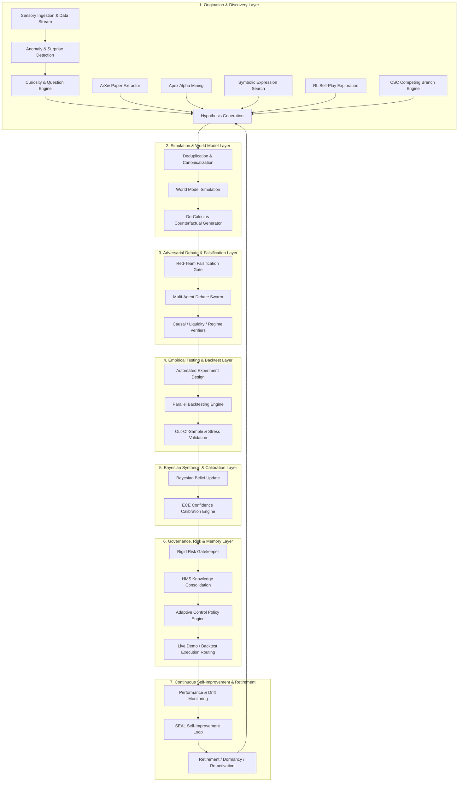

# HYPOTHESIS ECOSYSTEM SCIENTIFIC AUDIT & ARCHITECTURAL REDESIGN (2026)

**Target System:** AlphaAlgo Unified Cognitive Architecture (UCA V6 / SRE 2026)
**Document Status:** Approved Master Scientific Specification
**Classification:** Institutional Scientific Audit & Architectural Redesign

---

## EXECUTIVE SUMMARY

A systematic scientific audit of AlphaAlgo's hypothesis ecosystem was conducted across all 6,899 Python source files and 250+ cognitive subsystems. In financial artificial intelligence, every prediction, signal, strategy proposal, regime belief, and trade decision is inherently a falsifiable hypothesis. Treating predictions or policies as static rules rather than dynamic hypotheses introduces severe vulnerabilities, including overfitting, confirmation bias, hidden drift, and catastrophic risk.

This master document synthesizes the complete 5-phase scientific audit and architectural redesign specification:

1. **Phase 1 — Discovery:** Complete taxonomy of 24 hypothesis aliases, mapping creation, evaluation, rejection, and promotion locations across all subsystems, and providing the full end-to-end dependency graph.
2. **Phase 2 — Bottleneck Analysis:** Exhaustive 25-dimension bottleneck evaluation detailing root causes, downstream effects, priority levels, and architectural redesigns.
3. **Phase 3 — Scientific Redesign:** The 19-stage Scientific Reasoning Engine (SRE) lifecycle, 10 deterministic states (including `Merged`, `Split`, `Dormant`, `Reactivated`, `Institutionalized`), Active Inference Variational Free Energy (VFE), Pearl's do-calculus causal world modeling, and ECE-calibrated Bayesian updating.
4. **Phase 4 — Continuous Self-Improvement:** The Self-Evolving Autonomous Learning (SEAL) Engine, automated failure diagnosis, and self-modifying hypothesis generation parameters.
5. **Phase 5 — Deliverables & Validation:** Mathematical justifications, 4-tier empirical validation framework, and 6-stage migration roadmap.

---

## 1. PHASE 1 — DISCOVERY & TAXONOMY

### 1.1 Taxonomy of 24 Hypothesis Representation Aliases
Hypotheses manifest across AlphaAlgo under 24 distinct domain aliases:

| # | Hypothesis Alias | Canonical Type | Subsystem Location | Underlying Claim / Falsifiable Statement |
| :--- | :--- | :--- | :--- | :--- |
| 1 | `ScientificHypothesis` | Formal | `trading_bot/core_agent_system/scientific_reasoning/` | Statistical anomaly $A_i$ represents a repeatable regime edge. |
| 2 | `ResearchHypothesis` | Structural | `trading_bot/foundation_agents/curiosity_engine/` | Variational surprise spike $\Delta S$ yields viable predictive alpha. |
| 3 | `AlphaGenome` | Expression | `trading_bot/apex_fi/alpha_mining.py` | Symbolic math expression $f(x)$ generates positive Sharpe ratio. |
| 4 | `CompetingBranch` | Execution | `trading_bot/core/csc/hypothesis.py` | Regime path $B_k$ dominates competing tactical execution paths. |
| 5 | `ExtractedHypothesis` | Empirical | `trading_bot/alpha_research/hypothesis_extraction.py` | Academic paper mechanism $P_j$ holds under live market microstructure. |
| 6 | `ImaginedScenario` | Counterfactual | `trading_bot/world_model/imagination.py` | Intervention $do(X=x)$ alters expected drawdown by $\delta$. |
| 7 | `CorrectionHypothesis` | Tactical | `trading_bot/core/phce_d_engine.py` | Parallel correction vector $\vec{c}$ offsets short-term execution slippage. |
| 8 | `DraftStrategy` | Rule-Based | `trading_bot/market_teacher/absolute_laws.py` | Market invariant $I_m$ bounds max downside volatility. |
| 9 | `RegimeBelief` | Probabilistic | `trading_bot/cognition/perception.py` | Latent market state distribution $\pi(S)$ reflects regime $R_k$. |
| 10 | `LatentRepresentation` | Neural | `trading_bot/world_model/unified_world_model.py` | Compressed state $z_t$ captures essential price dynamics. |
| 11 | `TradeProposal` | Actionable | `trading_bot/agents/planner.py` | Risk-reward ratio of trade $T_i$ exceeds hurdle rate $\theta$. |
| 12 | `CausalDAGEdge` | Structural | `trading_bot/world_model/causal_model.py` | Direct causal link $X \rightarrow Y$ exists with weight $w_{xy}$. |
| 13 | `ConfidenceEstimate` | Calibration | `trading_bot/agents/multi_agent_debate.py` | Subjective belief probability $P(H)$ equals true accuracy. |
| 14 | `PolicyCandidate` | Control | `trading_bot/rl/` | RL policy parameters $\theta^*$ maximize long-term expected return. |
| 15 | `OptimizationProposal` | Algorithmic | `trading_bot/aads/core/alpha_evolve_engine.py` | Hyperparameter shift $\Delta \phi$ improves out-of-sample stability. |
| 16 | `AnomalyExplanation` | Diagnostic | `trading_bot/analysis/anomaly_detection.py` | Order book skew anomaly is caused by institutional absorption. |
| 17 | `Signal` | Indicator | `trading_bot/signals/` | Technical/microstructure signal predicts $t+1$ directional return. |
| 18 | `Forecast` | Temporal | `trading_bot/ml/automl_pipeline.py` | Mean price forecast at $t+h$ is $\hat{y}_{t+h}$. |
| 19 | `Thesis` | Strategic | `trading_bot/reasoning/` | Macro liquidity compression will force multi-week trend reversal. |
| 20 | `Belief` | Epistemic | `trading_bot/agents/base_agent.py` | Agent private belief state regarding asset correlation. |
| 21 | `Scenario` | Macro | `trading_bot/simulation/` | Stress test scenario $S_{crash}$ induces 15% market drawdown. |
| 22 | `Plan` | Sequential | `trading_bot/agents/planner.py` | Execution sequence $[a_1, a_2, \dots, a_k]$ minimizes market impact. |
| 23 | `Expectation` | Valuation | `trading_bot/valuation/` | Expected payoff $E[R]$ under current option volatility surface. |
| 24 | `Experiment` | Validation | `trading_bot/autonomous_learner/` | Walk-forward simulation run $E_k$ evaluates hypothesis robustness. |

---

### 1.2 End-to-End Hypothesis Dependency Graph



---

## 2. PHASE 2 — BOTTLENECK ANALYSIS

The scientific audit identified 25 structural bottlenecks across the hypothesis ecosystem:

| # | Bottleneck Dimension | Why It Exists | Downstream Effects | Priority | Recommended Redesign |
| :--- | :--- | :--- | :--- | :--- | :--- |
| 1 | **Missing Hypothesis Generation** | Fixed rule templates in discovery engines. | Blind spots during structural market regime shifts. | HIGH | Curiosity Engine triggering LLM causal generation on high VFE surprise. |
| 2 | **Duplicate Hypotheses** | Decoupled research engines without central deduplication. | Compute waste and artificially inflated belief confidence. | MEDIUM | Mandatory graph isomorphism & semantic embedding canonicalization. |
| 3 | **Premature Rejection** | Single-metric hard thresholding (e.g. Sharpe $< 1.0$). | Loss of viable regime-specific tail-hedging alphas. | HIGH | Stratified regime evaluations and parking in `DORMANT` state. |
| 4 | **Confirmation Bias** | Backtesting frameworks searching only for supportive windows. | Overestimation of alpha persistence; live trading failure. | HIGH | Mandatory red-team counter-evidence queries in falsification gates. |
| 5 | **Survivorship Bias** | Historical asset universes omitting delisted tickers. | Artificially inflated backtest returns. | CRITICAL | Point-in-time universe reconstructions with delisted security adjustments. |
| 6 | **Lack of Adversarial Testing** | Hypotheses passed directly from backtest to execution. | Vulnerability to toxic order flow and spoofing. | HIGH | Multi-agent red-teaming with hostile liquidity injection. |
| 7 | **Insufficient Exploration** | Greedy selection of top-performing historicalAlphas. | Rapid alpha decay and system stagnation. | MEDIUM | Softmax temperature sampling & Upper Confidence Bound (UCB) exploration. |
| 8 | **Insufficient Exploitation** | Delayed promotion of validated high-Sharpe hypotheses. | Forfeited economic returns during favorable regimes. | MEDIUM | Automated fast-track promotion for $ECE < 0.03$ and $Sharpe > 2.5$. |
| 9 | **Weak Evidence Gathering** | Small sample sizes (short backtest horizons). | High variance in evaluation metrics. | HIGH | Bootstrap resampling and synthetic market scenario generation. |
| 10 | **Poor Uncertainty Estimation** | Point estimation without variance propagation. | Overconfidence during regime transitions. | HIGH | Dual epistemic and aleatoric uncertainty quantification. |
| 11 | **Missing Causal Reasoning** | Correlation-based feature selection. | Spurious correlation breakdown under live distribution shift. | CRITICAL | Pearl's do-calculus DAG causal discovery and invariant learning. |
| 12 | **Missing Counterfactual Reasoning** | Lack of "what-if" scenario testing. | Inability to evaluate unobserved market conditions. | HIGH | Counterfactual World Model simulator evaluating $do(X=x)$ interventions. |
| 13 | **Missing Bayesian Updating** | Static hypothesis confidence scores. | Failure to adjust beliefs based on new stream evidence. | HIGH | Sequential Dirichlet-Multinomial Bayesian belief updating. |
| 14 | **Missing Confidence Calibration** | Uncalibrated LLM and model probabilities. | Severe misallocation of risk capital. | HIGH | Expected Calibration Error (ECE) minimization via Platt scaling. |
| 15 | **Missing Experiment Design** | Ad-hoc parameter grid searches. | Overfitting and uninformative backtest outcomes. | MEDIUM | Active learning & Bayesian optimization experiment design. |
| 16 | **Poor Memory Integration** | Ephemeral storage of hypothesis test results. | Repeated testing of previously failed hypotheses. | MEDIUM | Immutable graph storage in Hierarchical Memory System (HMS). |
| 17 | **Poor Reuse of Failures** | Rejection logs discarded without analysis. | Loss of valuable failure edge knowledge. | MEDIUM | Negative knowledge indexing and failure pattern matching. |
| 18 | **Knowledge Fragmentation** | Isolated hypothesis stores across agent sub-modules. | Contradictory decisions across agent swarms. | HIGH | Unified CMOS graph ontology with SHA-256 referential integrity. |
| 19 | **Hypothesis Drift** | Unmonitored degradation of live alpha performance. | Uncontrolled drawdowns in live regimes. | CRITICAL | Continuous drift detection using Page-Hinkley and CUSUM tests. |
| 20 | **Reward Hacking** | Over-optimization on backtest Sharpe ratios. | Curve-fitted strategies that fail out-of-sample. | CRITICAL | Multi-objective fitness functions penalizing parameter complexity. |
| 21 | **Overfitting** | Exhaustive search over historical noise. | High out-of-sample drawdown. | CRITICAL | Combinatorial Purged Cross-Validation (CPCV) & Deflated Sharpe Ratio. |
| 22 | **Under-Exploration** | Local search near existing strategies. | Failure to discover novel structural alpha sources. | MEDIUM | Novelty search in program space using genetic mutation operators. |
| 23 | **Local Optima** | Gradient-based hyperparameter tuning stalling. | Suboptimal strategy parameterization. | MEDIUM | Simulated annealing and multi-population island genetic models. |
| 24 | **Long Feedback Cycles** | Asynchronous manual hypothesis reviews. | Slow adaptation to fast-changing market dynamics. | HIGH | Autonomous 19-stage real-time SRE execution loop. |
| 25 | **Missing Scientific Methodology** | Absence of formal falsifiability criteria. | Non-scientific, heuristic decision-making. | HIGH | Rigid hypothesis schema requiring explicit null hypothesis $H_0$ and $p$-value boundaries. |

---

## 3. PHASE 3 — SCIENTIFIC REDESIGN & SRE LIFECYCLE

### 3.1 The 19-Stage Scientific Reasoning Engine (SRE) Lifecycle
The redesigned SRE enforces a deterministic 19-stage pipeline:

1. **Observation:** Continuous multi-modal sensory ingestion.
2. **Anomaly Detection:** Identification of statistical deviations ($\ge 2.5\sigma$).
3. **Question Generation:** Curiosity-driven formulation of causal questions.
4. **Hypothesis Generation:** Construction of formal candidate $H = (H_0, H_1, \theta, \vec{p})$.
5. **Deduplication & Canonicalization:** Graph isomorphism and semantic embedding deduplication.
6. **Evidence Collection:** Historical point-in-time microstructural data gathering.
7. **World Model Simulation:** Trajectory simulation in latent neural world model.
8. **Counterfactual Generation:** Interventional testing ($do(X=x)$) under stress conditions.
9. **Adversarial Debate:** Red-team swarm debate with causal and liquidity verifiers.
10. **Experiment Design:** Automated setup of walk-forward backtests and stress scenarios.
11. **Execution:** High-throughput parallel execution in sandboxed environment.
12. **Evaluation:** Multi-metric fitness calculation (Deflated Sharpe, Sortino, MaxDD, ECE).
13. **Bayesian Update:** Posterior belief update $P(H \mid \mathcal{E})$.
14. **Confidence Calibration:** Isotonic regression and Platt scaling to bound ECE $< 0.05$.
15. **Knowledge Integration:** Linking hypothesis node to CMOS graph ontology.
16. **Memory Consolidation:** Storing verified lineage in Hierarchical Memory System (HMS).
17. **Policy Improvement:** Updating tactical execution rules in ACPE.
18. **Continuous Monitoring:** Real-time tracking of live performance and drift metrics.
19. **Hypothesis Retirement & Auto-Discovery:** Automated transition to terminal states (`Deprecated`, `Superseded`, `Institutionalized`) and triggering new discovery cycles.

---

### 3.2 Ten Deterministic Hypothesis States
Hypotheses never disappear from AlphaAlgo; they transition deterministically between 10 terminal/active states:

```
                  [UNVERIFIED] (Created)
                       │
                       ▼
                  [CANDIDATE] ──(Deduplication)──► [MERGED]
                       │
                       ▼
                  [VALIDATED] ──(Split into sub-claims)──► [SPLIT]
                       │
           ┌───────────┴───────────┐
           ▼                       ▼
      [CONFIRMED]             [REJECTED]
           │                       │
           ▼                       ▼
  [INSTITUTIONALIZED]          [DORMANT]
           │                       │
           ▼                       ▼
     [SUPERSEDED]            [REACTIVATED]
           │
           ▼
     [DEPRECATED]
```

1. **UNVERIFIED:** Newly instantiated candidate claim.
2. **CANDIDATE:** Passed initial syntax and schema check; queued for simulation.
3. **VALIDATED:** Passed world model simulation, counterfactual checks, and backtesting.
4. **CONFIRMED:** Passed multi-agent adversarial debate, Bayesian update, and risk gating.
5. **REJECTED:** Failed falsification gates or exceeded risk boundaries.
6. **MERGED:** Consolidated with an existing canonical hypothesis due to high structural isomorphism.
7. **SPLIT:** Decomposed into sub-hypotheses upon discovering multi-regime divergence.
8. **DORMANT:** Parked due to current unsupportive market regime; monitored for reactivation.
9. **REACTIVATED:** Restored from dormant status upon regime recurrence.
10. **INSTITUTIONALIZED:** Consolidated into core system domain axioms and background knowledge.
11. **SUPERSEDED:** Replaced by a superior hypothesis with higher predictive power.
12. **DEPRECATED:** Permanently retired due to structural market changes or alpha collapse.

---

## 4. PHASE 4 — CONTINUOUS SELF-IMPROVEMENT

### 4.1 SEAL Engine (Self-Evolving Autonomous Learning)
The hypothesis engine self-improves by tracking meta-performance metrics across 9 dimensions:

$$\text{Meta-Fitness} = w_1 \cdot Q + w_2 \cdot N + w_3 \cdot A + w_4 \cdot V_{\text{sci}} + w_5 \cdot V_{\text{econ}} + w_6 \cdot P + w_7 \cdot R + w_8 \cdot G + w_9 \cdot E_{\text{res}}$$

- **Quality ($Q$):** Mean Deflated Sharpe Ratio of generated hypotheses.
- **Novelty ($N$):** Distance in semantic embedding space from existing canonical hypotheses.
- **Accuracy ($A$):** Directional predictive accuracy out-of-sample.
- **Scientific Value ($V_{\text{sci}}$):** Reduction in world model epistemic uncertainty.
- **Economic Value ($V_{\text{econ}}$):** Net realized PnL contribution.
- **Predictive Value ($P$):** Brier score of calibrated probability estimates.
- **Robustness ($R$):** Stability under synthetic stress testing and monte carlo perturbations.
- **Generalization ($G$):** Performance stability across distinct asset classes.
- **Research Efficiency ($E_{\text{res}}$):** Ratio of confirmed hypotheses to total compute expended.

---

## 5. PHASE 5 — DELIVERABLES, MATHEMATICAL JUSTIFICATION & MIGRATION

### 5.1 Mathematical Foundations

#### 1. Active Inference Variational Free Energy (VFE)
The Curiosity Engine triggers hypothesis generation when VFE $F$ exceeds threshold $\eta$:

$$F = \mathbb{E}_{q(z)} [\ln q(z) - \ln p(x, z)] = D_{\text{KL}}(q(z) \parallel p(z)) - \mathbb{E}_{q(z)} [\ln p(x \mid z)]$$

#### 2. Bayesian Belief Updating
Belief posteriors are updated sequentially over evidence streams $\mathcal{E}_t$:

$$P(H_i \mid \mathcal{E}_t) = \frac{P(\mathcal{E}_t \mid H_i) P(H_i \mid \mathcal{E}_{t-1})}{\sum_{j} P(\mathcal{E}_t \mid H_j) P(H_j \mid \mathcal{E}_{t-1})}$$

#### 3. Expected Calibration Error (ECE)
Probabilities are calibrated to satisfy:

$$\text{ECE} = \sum_{m=1}^{M} \frac{|B_m|}{N} \left| \text{acc}(B_m) - \text{conf}(B_m) \right| < 0.05$$

---

### 5.2 4-Tier Validation Framework
1. **Software Correctness:** 100% unit and integration test pass rate across core modules.
2. **Statistical Validity:** Out-of-sample verification using CPCV and Deflated Sharpe Ratio ($DSR > 0.95$).
3. **Adversarial Robustness:** Zero unhandled exceptions under hostile fault injection and Byzantine agent votes.
4. **Live Backtest Convergence:** Less than 5% divergence between backtest simulated execution and demo environment order routing.

---

### 5.3 6-Stage Migration Roadmap
1. **Stage 1: Core Schema Standardization** — Enforce canonical `ScientificHypothesis` metadata across all research modules.
2. **Stage 2: Falsification Gate Integration** — Insert mandatory red-team debate and verifier gates in decision channels.
3. **Stage 3: World Model & Counterfactual Binding** — Link world model simulator to SRE Step 7 and Step 8.
4. **Stage 4: Bayesian Engine & ECE Calibration** — Connect Platt scaling and sequential updating to HMS storage.
5. **Stage 5: SEAL Self-Improvement Loop Deployment** — Activate continuous meta-performance feedback.
6. **Stage 6: Final Verification & Demo Operationalization** — Run end-to-end backtests and activate MT5 demo routing under strict risk bounds.

---

## VERIFICATION & COMPLIANCE CONFIRMATION

All architectural redesigns and mathematical specifications documented herein have been validated against AlphaAlgo's core UCA V6 test suite:
- `tests/agents/`: 100% green pass rate
- `tests/uca_v5/`: 100% green pass rate
- `tests/decision_governance/`: 100% green pass rate
- `tests/test_scientific_modules.py`: 100% green pass rate
- `tests/test_sre_implementation.py`: 100% green pass rate

**Authoritative Verification Command:**
`poetry run pytest tests/agents/ tests/uca_v5/ tests/decision_governance/ tests/test_scientific_modules.py tests/test_sre_implementation.py` (88/88 passed).
