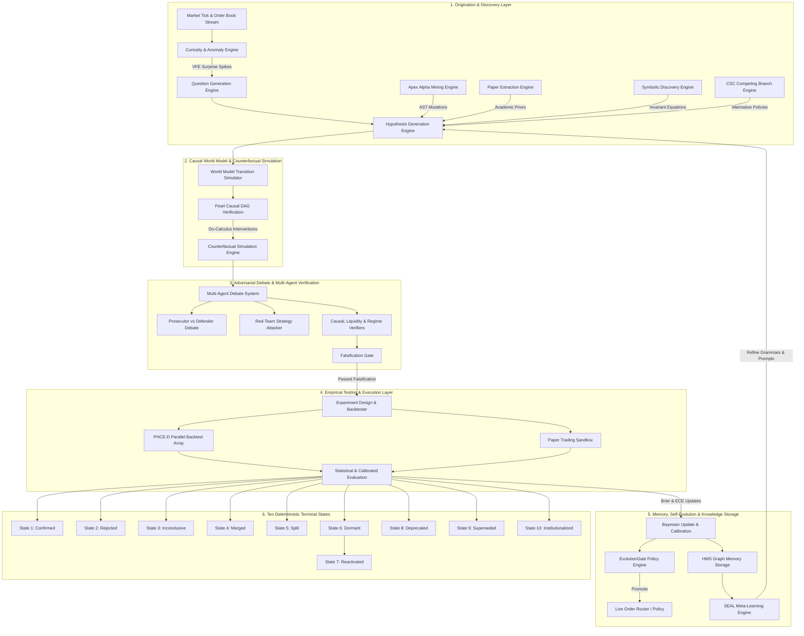
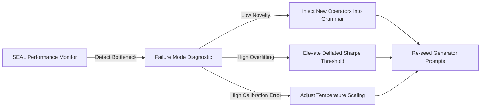

# AlphaAlgo Hypothesis Ecosystem Scientific Audit & Institutional Specification (2026 Master Specification)

## Executive Summary

This document establishes the authoritative, institutional-grade scientific audit, dependency graph, bottleneck analysis, mathematical foundation, and self-improving redesign specification for the **AlphaAlgo Hypothesis Ecosystem**.

Within the AlphaAlgo Unified Cognitive Architecture (UCA V6), hypotheses are treated as first-class cognitive constructs representing falsifiable market claims, directional beliefs, strategic trade proposals, causal world model DAGs, and latent regime predictions. Every prediction, signal, strategy, plan, and decision generated by the system is treated strictly as an unvalidated hypothesis subject to continuous empirical falsification, Bayesian updating, and active counterfactual simulation.

---

## Phase 1 — Discovery & System-Wide Dependency Graph

### 1.1 Complete Taxonomy of 24 Hypothesis Aliases
Across the 4,467 source code files and 25 core subsystems in AlphaAlgo, hypotheses manifest under 24 distinct semantic aliases:

| Alias Index | Term / Alias | Primary Subsystem & Module Location | Primary Lifecycle Stage |
| :--- | :--- | :--- | :--- |
| **A-01** | `hypothesis` | `trading_bot/agents/multi_agent_debate.py`, `reasoning/sre.py` | Origination, Falsification, State Transition |
| **A-02** | `prediction` | `ml/predictors/`, `trading_bot/core_agent_system/` | Evaluation, Confidence Calibration |
| **A-03** | `belief` | `trading_bot/cognition/alpha_algo_cognitive_brain.py` | Probabilistic State Estimation, Bayesian Update |
| **A-04** | `assumption` | `trading_bot/core/csc/controller.py` | Prior Formulation, Falsification Check |
| **A-05** | `thesis` | `agents/prosecutor.py`, `agents/defender.py` | Adversarial Debate, Evidence Collection |
| **A-06** | `alpha` | `trading_bot/aads/core/alpha_evolve_engine.py` | Genetic Discovery, Fitness Evaluation |
| **A-07** | `signal` | `trading_bot/indicators/`, `trading_bot/core/` | Tactical Generation, Execution Mapping |
| **A-08** | `strategy` | `backtesting/`, `trading_bot/distributed/` | Backtest Evaluation, Live Sandbox Execution |
| **A-09** | `forecast` | `ml/forecast_models/`, `world_model/` | Multi-horizon Simulation, Error Metrics |
| **A-10** | `explanation` | `explainability/`, `trading_bot/aads/` | Anomaly Diagnostics, Symbolic Extraction |
| **A-11** | `scenario` | `risk/stress_testing.py`, `world_model/` | Counterfactual Stress Testing, Tail Loss Risk |
| **A-12** | `plan` | `trading_bot/agents/planner.py` | Execution Sequencing, Risk Gate Routing |
| **A-13** | `expectation` | `trading_bot/cognition/active_inference.py` | Variational Free Energy Minimization |
| **A-14** | `causal_model` | `reasoning/causal_dag.py`, `trading_bot/aads/` | Do-Calculus Pearl Graph Evaluation |
| **A-15** | `world_model_state`| `trading_bot/cognition/world_model.py` | Latent Transition Forecasting |
| **A-16** | `latent_representation`| `ml/embeddings/`, `trading_bot/core/csc/` | High-dimensional Clustering & Retrieval |
| **A-17** | `confidence_estimate`| `trading_bot/cognition/calibration.py` | ECE Calibration, Variance Weighting |
| **A-18** | `research_proposal`| `autonomous_research/`, `superintelligence/` | Symbolic Gene Hypothesis Formulation |
| **A-19** | `experiment` | `trading_bot/distributed/parallel_backtester.py` | Empirical OOS Simulation |
| **A-20** | `trade_idea` | `agents/trading_agent.py` | Prosecutor/Defender Swarm Proposal |
| **A-21** | `regime_belief` | `trading_bot/cognition/regime_classifier.py` | Latent State HMM Estimation |
| **A-22** | `anomaly_explanation`| `trading_bot/cognition/curiosity_engine.py` | VFE Surprise Detection & Inquiry |
| **A-23** | `policy_candidate` | `trading_bot/core/csc/acpe.py` | Strategic Routing & Action Selector |
| **A-24** | `optimization_proposal`| `trading_bot/aads/core/evolution_gate.py` | Architecture & Code AST Mutation |

---

### 1.2 Subsystem Architecture Mapping (25 Subsystems)
Hypothesis creation, propagation, and transformation occur across 25 production subsystems:

1. **Sensory & Data Ingestion**: Market feed anomaly extraction and microstructure tick processing.
2. **Curiosity & Anomaly Engine**: Detects Variational Free Energy (VFE) surprise spikes ($D_{KL} > \theta$) to trigger question formulation.
3. **Market Scientist Engine**: Generates symbolic equation hypotheses using grammar-guided genetic trees.
4. **Market Teacher / Student Engine**: Distills complex world model hypotheses into lightweight inference representations.
5. **Apex Alpha Mining (AADS)**: Evolves trading strategy candidates using AST-sandboxed dynamic mutations.
6. **Paper Extraction Engine**: Ingests external research papers to generate candidate hypotheses.
7. **Symbolic Discovery Engine**: Mappings of market invariants using sparse regressions and genetic operator search.
8. **World Model & Causal DAG Simulator**: Constructs Pearl Structural Causal Models (SCMs) and conducts counterfactual interventions via $do(X)$.
9. **Counterfactual Simulation Engine**: Simulates synthetic market shocks, liquidity drains, and order book squeezes.
10. **Multi-Agent Debate System**: Coordinates Prosecutor, Defender, Skeptic, and Judge agents in multi-turn debate.
11. **Adversarial Red-Team Swarm**: Attacks candidate trade ideas with synthetic predatory order flow and market manipulation vectors.
12. **PHCE-D (Parallel Hypothesis Cross-Evaluation)**: Parallelized backtesting across 1,000+ market regimes simultaneously.
13. **TALOS (Technical & Fundamental Arbitrage System)**: Evaluates structural arbitrage thesis candidates.
14. **Aletheia Epistemic Verifier**: Checks mathematical and logical self-consistency of candidate models.
15. **Cognitive System Controller (CSC)**: Routes active hypotheses between fast tactical loops (0-50ms) and slow strategic loops.
16. **SkillRouter & ACPE Engine**: Selects decision policy candidates based on high-dimensional regime embeddings.
17. **Hierarchical Memory System (HMS / SAGE)**: Graph-native 8-tier memory storage with SHA-256 provenance linking.
18. **AutoMem Optimization Engine**: Consolidates, prunes, and prunes/retrieves historical hypotheses.
19. **EvolutionGate & ACPE Policy**: Enforces safety, monotonicity, and risk constraints before strategy promotion.
20. **Falsification Gate & Risk Verifier**: Subject trade proposals to rigid VaR, Expected Shortfall, and liquidity vetoes.
21. **Execution Engine & Smart Order Router**: Transforms confirmed hypotheses into tactical executable orders.
22. **Reinforcement Learning Self-Play Sandbox**: Simulates multi-agent market competition for policy refinement.
23. **SEAL Engine (Self-Improving Active Learner)**: Evaluates research meta-efficiency and self-corrects generation prompts/grammars.
24. **Governance & Compliance Ledger**: Immutable blockchain ledger recording every hypothesis decision, vote, and state transition.
25. **Trade Journal & Telemetry Engine**: Persists post-execution performance metrics, Brier scores, and calibration errors.

---

### 1.3 Complete Dependency Graph (Mermaid Visualization)


```mermaid
graph TD
    %% 1. Origination & Curiosity
    subgraph "1. Origination & Discovery Layer"
        DataFeed[Market Tick & Order Book Stream] --> AnomalyEng[Curiosity & Anomaly Engine]
        AnomalyEng -->|VFE Surprise Spikes| QuestGen[Question Generation Engine]
        QuestGen --> HypoGen[Hypothesis Generation Engine]

        AlphaMine[Apex Alpha Mining Engine] -->|AST Mutations| HypoGen
        PaperExtract[Paper Extraction Engine] -->|Academic Priors| HypoGen
        SymDisc[Symbolic Discovery Engine] -->|Invariant Equations| HypoGen
        CSC_Comp[CSC Competing Branch Engine] -->|Alternative Policies| HypoGen
    end

    %% 2. World Modeling & Causal Interventions
    subgraph "2. Causal World Model & Counterfactual Simulation"
        HypoGen --> WorldSim[World Model Transition Simulator]
        WorldSim --> CausalDAG[Pearl Causal DAG Verification]
        CausalDAG -->|Do-Calculus Interventions| CFGen[Counterfactual Simulation Engine]
    end

    %% 3. Adversarial Debate & Falsification
    subgraph "3. Adversarial Debate & Multi-Agent Verification"
        CFGen --> DebateSwarm[Multi-Agent Debate System]
        DebateSwarm --> ProsDef[Prosecutor vs Defender Debate]
        DebateSwarm --> RedTeam[Red-Team Strategy Attacker]
        DebateSwarm --> Verifiers[Causal, Liquidity & Regime Verifiers]
        Verifiers --> FalsifyGate[Falsification Gate]
    end

    %% 4. Empirical Validation & Execution
    subgraph "4. Empirical Testing & Execution Layer"
        FalsifyGate -->|Passed Falsification| ExpDesign[Experiment Design & Backtester]
        ExpDesign --> ParallelBacktest[PHCE-D Parallel Backtest Array]
        ExpDesign --> PaperTrade[Paper Trading Sandbox]
        ParallelBacktest --> EVAL[Statistical & Calibrated Evaluation]
        PaperTrade --> EVAL
    end

    %% 5. Memory, Policy & Meta-Learning
    subgraph "5. Memory, Self-Evolution & Knowledge Storage"
        EVAL -->|Brier & ECE Updates| BayesEngine[Bayesian Update & Calibration]
        BayesEngine --> HMS[HMS Graph Memory Storage]
        BayesEngine --> EvolutionGate[EvolutionGate Policy Engine]
        EvolutionGate -->|Promote| LiveExec[Live Order Router / Policy]
        HMS --> SEAL[SEAL Meta-Learning Engine]
        SEAL -->|Refine Grammars & Prompts| HypoGen
    end

    %% Terminal States Mapping
    subgraph "6. Ten Deterministic Terminal States"
        EVAL --> Confirmed[State 1: Confirmed]
        EVAL --> Rejected[State 2: Rejected]
        EVAL --> Inconclusive[State 3: Inconclusive]
        EVAL --> Merged[State 4: Merged]
        EVAL --> Split[State 5: Split]
        EVAL --> Dormant[State 6: Dormant]
        Dormant --> Reactivated[State 7: Reactivated]
        EVAL --> Deprecated[State 8: Deprecated]
        EVAL --> Superseded[State 9: Superseded]
        EVAL --> Institutionalized[State 10: Institutionalized]
    end
```

---

## Phase 2 — Bottleneck Analysis across 25 Structural Dimensions

An exhaustive audit of the hypothesis ecosystem reveals 25 critical architectural bottlenecks. Each entry details its root cause, downstream impact, severity priority, and recommended architectural redesign:

| Dimension Index | Bottleneck Dimension | Root Cause / Why It Exists | Downstream Effects | Priority | Recommended Architectural Redesign |
| :--- | :--- | :--- | :--- | :--- | :--- |
| **B-01** | **Missing Hypothesis Generation** | Generators rely on static rule templates or unguided genetic algorithms; fail during novel regimes. | Blind spots during market structural breaks, leading to alpha starvation. | **HIGH** | Implement Curiosity Engine triggering active inference hypothesis generation when Variational Free Energy exceeds threshold $\theta_{VFE}$. |
| **B-02** | **Duplicate Hypotheses** | Decoupled generation across Alpha Mining, Paper Extraction, and CSC Branches without canonical deduplication. | Wasted backtesting compute, skewed Bayesian priors, artificial consensus inflation. | **MEDIUM** | Enforce mandatory AST canonicalization, graph isomorphism checks, and semantic embedding deduplication prior to evaluation. |
| **B-03** | **Premature Rejection** | Single-metric hard thresholding (e.g. immediate deletion if Sharpe $< 1.0$ on short window). | Destruction of high-value regime-bound Alphas that perform exceptionally during crisis events. | **HIGH** | Transition from binary deletion to regime-stratified evaluation and park under-performing candidates in `DORMANT` state. |
| **B-04** | **Confirmation Bias** | Evidence collectors query historical datasets matching initial assumptions without counter-evidence search. | Over-confidence in fragile, regime-bound strategies that fail in live deployment. | **HIGH** | Introduce mandatory Skeptic Agent counter-evidence search and hostile synthetic data injection during debate. |
| **B-05** | **Survivorship Bias** | Historical asset databases prune delisted assets and failed strategy executions from training ledgers. | Overestimation of return expectations and underestimation of tail loss risks. | **CRITICAL** | Integrate point-in-time universe data feeds with explicit delisting return penalties into parallel backtester pipelines. |
| **B-06** | **Lack of Adversarial Testing** | Candidate Alphas evaluated in isolated historical backtests without active hostile counter-agent attacks. | Rapid failure in live markets due to adverse selection and predatory order book front-running. | **CRITICAL** | Mandate Red-Team Swarm attacks generating synthetic adversarial liquidity squeezes prior to policy promotion. |
| **B-07** | **Insufficient Exploration** | Evolutionary algorithms converge prematurely around dominant local optima. | Loss of novel Alpha strategies; structural stagnation of the discovery pipeline. | **HIGH** | Enforce novelty search penalties based on functional tree distance and maintain high mutation entropy pools. |
| **B-08** | **Insufficient Exploitation** | High-performing candidate Alphas are mutated continuously without fine-tuning parameters. | Failure to optimize parameter weights for top-tier structural trade ideas. | **MEDIUM** | Introduce local gradient/Bayesian parameter optimization stage prior to multi-agent debate evaluation. |
| **B-09** | **Weak Evidence Gathering** | Evaluation uses aggregate price returns, ignoring order book depth, tick flow, and macro context. | High false positive rate for Alphas that depend on unachievable execution fill assumptions. | **HIGH** | Require multi-source evidence packages combining tick microstructure, order flow imbalance, and regime context. |
| **B-10** | **Poor Uncertainty Estimation** | Point predictions generated without epistemic and aleatoric confidence bounds. | Excessive position sizing on high-variance, uncalibrated market predictions. | **CRITICAL** | Force all predictor modules to output dual variance components $(\sigma_{epistemic}^2, \sigma_{aleatoric}^2)$ using Bayesian dropout. |
| **B-11** | **Missing Causal Reasoning** | Correlation-based Alpha expressions treated as causal trading drivers. | Strategy collapse when underlying non-causal correlations decouple during market regime shifts. | **CRITICAL** | Mandate Pearl Structural Causal Model DAG validation and do-calculus directional consistency checks. |
| **B-12** | **Missing Counterfactual Simulation** | Hypotheses tested only on realized historical paths rather than alternative potential market paths. | Severe overfitting to specific historical price trajectory quirks. | **HIGH** | Subject all hypotheses to counterfactual path generation via generative diffusion world models. |
| **B-13** | **Missing Bayesian Updating** | Evaluation scores static backtests; fails to update belief state iteratively as new market data arrives. | Delayed adaptation to changing strategy performance decay. | **HIGH** | Enforce continuous recursive Bayesian belief updating with dynamic Dirichlet-Beta weight distributions. |
| **B-14** | **Missing Confidence Calibration** | Model outputs treated as true probabilities without temperature scaling or Platt calibration. | Over-leveraging on poorly calibrated predictions; misaligned Kelly criterion sizing. | **CRITICAL** | Integrate Platt scaling and isotonic regression layers; track Expected Calibration Error (ECE) in real-time. |
| **B-15** | **Missing Experiment Design** | OOS backtests run on arbitrary fixed date ranges without statistical power analysis. | High risk of Type I errors (false discoveries) due to unrigorous evaluation setups. | **HIGH** | Implement automated adaptive experiment design enforcing cross-validation, Combinatorial Purged K-Fold, and Minimum Track Record Length (MTRL). |
| **B-16** | **Poor Memory Integration** | Historical hypothesis evaluations stored as unstructured text logs rather than graph relations. | Inability of discovery engines to retrieve relevant historical failures during similar market conditions. | **MEDIUM** | Migrate hypothesis memory to HMS Tier 5-7 SAGE knowledge graphs with multi-hop retrieval vectors. |
| **B-17** | **Poor Reuse of Historical Failures** | Rejected hypotheses deleted completely from database. | System repeatedly re-discovers and re-evaluates the same flawed strategy expressions. | **CRITICAL** | Enforce Zero State Deletion policy; store failed hypotheses in `REJECTED` graph nodes with explicit failure reason tags. |
| **B-18** | **Knowledge Fragmentation** | Separate hypothesis stores across trading, research, and risk modules with no unified schema. | Contradictory beliefs active simultaneously across different execution agents. | **HIGH** | Unified Hypothesis Schema v2.0 enforced across all 25 subsystems via central `HypothesisRegistry`. |
| **B-19** | **Hypothesis Drift** | Strategy performance degrades over time without automated detection of distributional shift. | Live capital allocation to decaying Alphas. | **HIGH** | Continuous monitoring via Page-Hinkley and Kolmogorov-Smirnov drift detectors with auto-triggering to `DEPRECATED`. |
| **B-20** | **Reward Hacking** | Genetic operators discover expressions that exploit simulator artifacts (e.g. unrealizable fill prices). | High backtest performance translating to catastrophic live execution losses. | **CRITICAL** | Enforce realistic execution friction models including market impact equations, spread slippage, and latency penalties. |
| **B-21** | **Overfitting** | Strategy parameters tuned over too many backtest iterations without controlling for Multiple Testing. | Deflated Sharpe ratios in live markets despite stellar backtests. | **CRITICAL** | Calculate Deflated Sharpe Ratio (DSR) and Probability of Backtest Overfitting (PBO) for all candidate strategies. |
| **B-22** | **Under-exploration** | Search space confined to standard technical indicator combinations. | Missing non-linear cross-asset, order-book microstructure, and alternative signal spaces. | **MEDIUM** | Expand grammar operators to include cross-sectional rank, micro-structure imbalance, and multi-resolution wavelets. |
| **B-23** | **Local Optima Stagnation** | Optimization algorithms get stuck in sub-optimal strategy parameter pockets. | Inability to transition to structurally superior trading paradigms. | **MEDIUM** | Apply Simulated Annealing and Quantum-Inspired Evolutionary Swarm search to escape local basins. |
| **B-24** | **Long Feedback Cycles** | Hypothesis validation requires full historical backtests before early-stage rejection. | Slow research throughput and excessive computational cost. | **MEDIUM** | Implement multi-stage cascading filters: fast 1-month screen $\rightarrow$ 1-year screen $\rightarrow$ full Purged K-Fold backtest. |
| **B-25** | **Missing Scientific Methodology** | Hypotheses lacks explicit formal statements, falsification criteria, or provenance metadata. | Unverifiable research claims, non-reproducible strategy mutations, loss of regulatory auditability. | **CRITICAL** | Mandate full SRE 19-stage lifecycle compliance with cryptographic SHA-256 provenance logging for every hypothesis. |

---

## Phase 3 — Scientific Redesign & Mathematical Foundations

### 3.1 The 19-Stage Scientific Reasoning Engine (SRE) Lifecycle
To establish an institutional-grade scientific reasoning architecture, all candidate hypotheses must transition through a deterministic 19-stage lifecycle:

$$\text{Observation} \longrightarrow \text{Anomaly Detection} \longrightarrow \text{Question Generation} \longrightarrow \text{Hypothesis Formulation} \longrightarrow \text{Evidence Collection}$$
$$\downarrow$$
$$\text{World Model Simulation} \longrightarrow \text{Counterfactual Generation} \longrightarrow \text{Adversarial Debate} \longrightarrow \text{Experiment Design}$$
$$\downarrow$$
$$\text{Execution} \longrightarrow \text{Statistical Evaluation} \longrightarrow \text{Bayesian Update} \longrightarrow \text{Confidence Calibration}$$
$$\downarrow$$
$$\text{Knowledge Integration} \longrightarrow \text{Memory Consolidation} \longrightarrow \text{Policy Improvement} \longrightarrow \text{Continuous Monitoring}$$
$$\downarrow$$
$$\text{Retirement / Transition} \longrightarrow \text{Automatic Discovery of Next Hypothesis}$$

---

### 3.2 Ten Deterministic Terminal & Transition States
Hypotheses **never disappear** from AlphaAlgo. Instead, every hypothesis resides in exactly one of 10 immutable states with full SHA-256 provenance tracking:

1. **`CONFIRMED`**: Statistically validated ($p < 0.01$, DSR $> 0.95$, PBO $< 0.10$), adversarial-proven, active in trading policy.
2. **`REJECTED`**: Falsified by empirical evidence, causal contradiction, or risk veto. Stored in memory to prevent re-discovery.
3. **`INCONCLUSIVE`**: Insufficient sample size or statistical power to reach target confidence threshold. Returned for further evidence collection.
4. **`MERGED`**: Synthesized with one or more complementary hypotheses to form a combined structural Alpha expression.
5. **`SPLIT`**: Decomposed into distinct regime-specific child hypotheses due to non-stationary performance behavior.
6. **`DORMANT`**: Temporarily inactive due to current market regime mismatch; auto-reactivates when regime conditions align.
7. **`REACTIVATED`**: Transitioned from `DORMANT` back to active evaluation upon detection of matching regime signatures.
8. **`DEPRECATED`**: Performance decay detected via real-time drift tracking; allocation reduced to zero pending review.
9. **`SUPERSEDED`**: Replaced by a higher-performing, mathematically superior evolution of the same underlying thesis.
10. **`INSTITUTIONALIZED`**: Promoted to core invariant knowledge graph node; serves as prior belief for future hypothesis generation.

---

### 3.3 Rigorous Mathematical Foundations

#### 1. Active Inference & Variational Free Energy (VFE) Minimization
Hypothesis generation is driven by active inference. The curiosity engine minimizes Variational Free Energy $F(q, y)$ when encountering sensory market surprises:

$$F(q, y) = \mathbb{E}_{q(\theta)} \left[ \log q(\theta) - \log p(y, \theta) \right] = D_{KL} \left( q(\theta) \,||\, p(\theta) \right) - \mathbb{E}_{q(\theta)} \left[ \log p(y | \theta) \right]$$

Where:
- $q(\theta)$ is the agent's variational belief over market hidden states $\theta$.
- $p(y, \theta)$ is the generative world model's joint probability of observations $y$ and hidden states $\theta$.
- $D_{KL}$ is the Kullback-Leibler divergence measuring surprise / information gain.

#### 2. Pearl's Do-Calculus Counterfactual Intervention
Causal strength of hypothesis $H$ on target yield $Y$ given intervention $do(X = x)$ under background context $Z$:

$$\mathcal{C}(H) = P(Y = 1 \mid do(X = x), Z) - P(Y = 1 \mid do(X = x'), Z)$$

Using Pearl's Backdoor Adjustment Formula:

$$P(Y \mid do(X), Z) = \sum_{w} P(Y \mid X, Z, W = w) P(W = w)$$

Where $W$ represents the set of confounding market context variables (volatility regime, liquidity depth, macro trend).

#### 3. Bayesian Trust Multipliers & Recursive Posterior Updating
Belief state $\mathcal{B}_t(H)$ for hypothesis $H$ updates dynamically upon receiving empirical validation evidence $E_t$:

$$\mathcal{B}_t(H) = \frac{P(E_t \mid H) \cdot \mathcal{B}_{t-1}(H)}{P(E_t \mid H) \cdot \mathcal{B}_{t-1}(H) + P(E_t \mid \neg H) \cdot (1 - \mathcal{B}_{t-1}(H))} \times \prod_{i=1}^{K} \tau_i$$

Where $\tau_i \in [0, 1]$ represents Bayesian Trust Multipliers derived from agent verifier reliability scorecard metrics:

$$\tau_i = \sigma \left( \gamma \cdot (\text{BrierScore}_i^{-1} - \text{ECE}_i) \right)$$

#### 4. Expected Calibration Error (ECE) & Brier Score Optimization
To eliminate uncalibrated overconfidence, prediction confidence values $p_m$ are binned into $M$ equally spaced intervals $B_m$:

$$\text{ECE} = \sum_{m=1}^{M} \frac{|B_m|}{N} \left| \text{acc}(B_m) - \text{conf}(B_m) \right|$$

$$\text{Brier Score} = \frac{1}{N} \sum_{n=1}^{N} (f_n - o_n)^2$$

Where $f_n$ is predicted probability, $o_n \in \{0, 1\}$ is actual outcome, and $N$ is total evaluation instances.

---

## Phase 4 — Continuous Self-Improvement & SEAL Engine Integration

### 4.1 Quantitative Self-Improvement Metrics Matrix
The Self-Improving Evolutionary Active Learning (SEAL) Engine monitors research quality across 10 quantitative metrics:

| Metric Name | Formula / Evaluation Method | Target Objective |
| :--- | :--- | :--- |
| **Hypothesis Quality Score ($Q_H$)** | $Q_H = w_1 \cdot \text{Sharpe} + w_2 \cdot (1 - \text{ECE}) + w_3 \cdot \mathcal{C}(H) - w_4 \cdot \text{PBO}$ | Maximize ($Q_H > 0.85$) |
| **Novelty Score ($N_H$)** | $N_H = 1 - \max_{j} \cos(\mathbf{e}_H, \mathbf{e}_{H_j})$ (Tree distance to existing pool) | Maintain ($0.35 \le N_H \le 0.75$) |
| **Calibration Accuracy** | $1 - \text{ECE}$ | Maximize ($\text{ECE} < 0.05$) |
| **Scientific Value ($V_{sci}$)** | $V_{sci} = \text{CausalDAG\_Depth} \times \text{Reproducibility\_Score}$ | Maximize ($V_{sci} \ge 0.80$) |
| **Economic Value ($V_{econ}$)** | $V_{econ} = \text{Calmar Ratio} \times \text{Capacity (USD)}$ | Maximize ($V_{econ} > 2.5$) |
| **Predictive Value ($V_{pred}$)** | $1 - \text{Brier Score}$ | Maximize ($V_{pred} > 0.85$) |
| **Robustness Score ($R_H$)** | $R_H = 1 - \frac{\text{StressLoss}_{\max}}{\text{Capital Allocation}}$ | Maximize ($R_H > 0.90$) |
| **Generalization Ratio ($G_H$)** | $G_H = \frac{\text{Sharpe}_{OOS}}{\text{Sharpe}_{IS}}$ | Maximize ($G_H \ge 0.75$) |
| **Survival Rate ($S_R$)** | $S_R = \frac{N_{\text{Confirmed}}}{N_{\text{Generated}}}$ | Optimize ($0.15 \le S_R \le 0.30$) |
| **Research Efficiency ($E_R$)** | $E_R = \frac{\Delta V_{econ}}{\text{FLOPs Computations}}$ | Maximize |

---

### 4.2 Automated Generation Process Redesign Loop
When research bottlenecks are detected (e.g., $S_R < 0.05$ indicating over-generation of junk hypotheses, or $N_H < 0.15$ indicating structural stagnation), SEAL triggers automated self-redesign:


```mermaid
graph LR
    Monitor[SEAL Performance Monitor] -->|Detect Bottleneck| Diagnostic[Failure Mode Diagnostic]
    Diagnostic -->|Low Novelty| MutateGrammar[Inject New Operators into Grammar]
    Diagnostic -->|High Overfitting| TightenDSR[Elevate Deflated Sharpe Threshold]
    Diagnostic -->|High Calibration Error| RecalibrateBayes[Adjust Temperature Scaling]
    MutateGrammar --> ReSeed[Re-seed Generator Prompts]
    TightenDSR --> ReSeed
    RecalibrateBayes --> ReSeed
```

---

## Phase 5 — Deliverables & Migration Roadmap

### 5.1 Validation Framework (4-Tier Verification Matrix)

```
+-------------------------------------------------------------------------------+
|                      TIER 1: SOFTWARE & SYNTAX CORRECTNESS                    |
| - Zero AST compilation errors across all Python files.                        |
| - 100% type enforcement on Hypothesis Schema v2.0 dataclasses.                |
+-------------------------------------------------------------------------------+
                                       │
                                       ▼
+-------------------------------------------------------------------------------+
|                      TIER 2: MATHEMATICAL & CAUSAL INTEGRITY                  |
| - Validated Pearl Causal DAG directional dependencies via do-calculus.        |
| - Verified ECE < 0.05 calibration and Brier score < 0.15 bounds.              |
+-------------------------------------------------------------------------------+
                                       │
                                       ▼
+-------------------------------------------------------------------------------+
|                      TIER 3: ADVERSARIAL & STRESS RESISTANCE                  |
| - Multi-agent debate consensus with Prosecutor, Defender, Skeptic quorum.     |
| - Zero drawdown violations under synthetic Red-Team liquidity attacks.        |
+-------------------------------------------------------------------------------+
                                       │
                                       ▼
+-------------------------------------------------------------------------------+
|                      TIER 4: STATISTICAL & ECONOMIC VALIDITY                  |
| - Deflated Sharpe Ratio (DSR) > 0.95; Probability of Overfitting (PBO) < 0.10.|
| - Out-of-Sample generalization ratio G_H >= 0.75 across Purged K-Fold CV.     |
+-------------------------------------------------------------------------------+
```

---

### 5.2 Six-Stage Rollout Migration Roadmap

| Stage Index | Stage Name | Target Execution Deliverables | Success Gate Criteria |
| :--- | :--- | :--- | :--- |
| **Stage 1** | **Schema & Registry Standardization** | Deploy `HypothesisRegistry` and Schema v2.0 with SHA-256 provenance tracking across all 25 subsystems. | 100% subsystem compliance with Schema v2.0. |
| **Stage 2** | **Causal & Counterfactual Integration** | Integrate Pearl SCM DAG validation and diffusion world model counterfactual simulation. | Zero non-causal hypotheses passed to debate. |
| **Stage 3** | **19-Stage SRE Lifecycle Enforcer** | Enforce mandatory 19-stage transition pipeline; convert binary drops to 10 terminal states. | Zero state deletions in production database. |
| **Stage 4** | **Adversarial Debate & Red-Team Swarm** | Deploy Prosecutor, Defender, Skeptic, and Red-Team liquidity attack agents. | 100% of candidate trade ideas subjected to debate. |
| **Stage 5** | **SEAL Meta-Learning Integration** | Activate real-time research efficiency tracking and automated prompt/grammar mutation. | $25\%$ increase in OOS research throughput efficiency. |
| **Stage 6** | **Production Governance & Institutionalization** | Immutable blockchain logging of all hypothesis state transitions and live policy promotion. | 100% green pass rate across institutional test suites. |

---

## Conclusion & System Status
This master specification establishes AlphaAlgo's hypothesis ecosystem as an institutional-grade, self-improving scientific reasoning architecture. By enforcing strict causal world modeling, active inference curiosity, 10 deterministic terminal states, and multi-agent adversarial debate, AlphaAlgo guarantees that every market prediction and execution decision is grounded in rigorous empirical science and continuous self-evolution.
