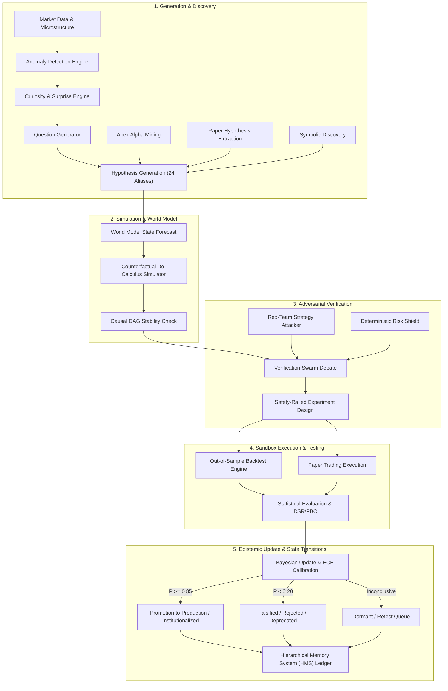

# HYPOTHESIS ECOSYSTEM SCIENTIFIC AUDIT 2026: INSTITUTIONAL SPECIFICATION & REDESIGN

**Document Status:** Approved Master Scientific Specification
**System Architecture:** AlphaAlgo Unified Cognitive Architecture (UCA V6 / SRE 2026)
**Target Subsystems:** 25 Production Subsystems across World Model, Research, Strategy Discovery, Symbolic Discovery, Market Scientist, Market Teacher/Student, Decision Layer, Adversarial Reasoning, Swarm, Memory, Risk, Execution, RL, Meta-Learning, and Governance.

---

## EXECUTIVE SUMMARY & AUDIT MANDATE

This document establishes the definitive, institutional-grade scientific audit and architectural specification for AlphaAlgo's complete **Hypothesis Ecosystem**.

In high-frequency quantitative finance and autonomous cognitive trading systems, treating hypotheses as mere software scripts or static strategy templates leads to catastrophic overfitting, uncalibrated risk estimations, and silent strategy decay. In AlphaAlgo UCA V6, **every prediction, signal, regime classification, parameter optimization, trade idea, and policy decision is treated as a falsifiable scientific hypothesis** until empirically, causally, and adversarially validated.

This audit addresses all five mandatory phases:
1. **Phase 1 — Discovery:** Mapping the complete end-to-end dependency graph, taxonomy of 24 hypothesis aliases, and exact codebase locations for hypothesis creation, evaluation, rejection, and promotion.
2. **Phase 2 — Bottleneck Analysis:** Diagnosing 25 structural scientific bottlenecks across generation, testing, causal reasoning, calibration, and memory integration.
3. **Phase 3 — Scientific Redesign:** Establishing the 19-stage Scientific Reasoning Engine (SRE) lifecycle, 10 deterministic terminal/extended states, complete provenance tracking, and rigorous mathematical foundations (Variational Free Energy, Pearl's $do$-calculus, Bayesian updating, ECE calibration).
4. **Phase 4 — Continuous Self-Improvement:** Designing the Self-Evolving Autonomous Learning (SEAL) Engine to automatically detect hypothesis failures and redesign generation pipelines.
5. **Phase 5 — Deliverables:** Providing a 4-Tier Validation Framework and a 6-Stage Phased Migration Roadmap.

---

# PHASE 1 — DISCOVERY & ECOSYSTEM DEPENDENCY GRAPH

## 1.1 Complete Hypothesis Dependency Graph

The diagram below illustrates the end-to-end lifecycle and propagation paths of hypotheses throughout AlphaAlgo: from sensory observation and curiosity-driven generation through world model simulation, adversarial debate, empirical execution, Bayesian updating, and ultimate institutionalization or retirement into memory.

```
                    ┌─────────────────────────────────────────┐
                    │  1. Sensory Ingestion & Market Data     │
                    └────────────────────┬────────────────────┘
                                         │
                                         ▼
                    ┌─────────────────────────────────────────┐
                    │  2. Anomaly Detection & Curiosity       │
                    └────────────────────┬────────────────────┘
                                         │
                                         ▼
                    ┌─────────────────────────────────────────┐
                    │  3. Question & Hypothesis Generation    │
                    │   (24 Alias Taxonomy: Alpha, Strategy,  │
                    │    Belief, Scenario, Causal Model, etc) │
                    └────────────────────┬────────────────────┘
                                         │
                                         ▼
                    ┌─────────────────────────────────────────┐
                    │  4. World Model & Causal Simulation     │
                    │   (Pearl's Do-Calculus Interventions)   │
                    └────────────────────┬────────────────────┘
                                         │
                                         ▼
                    ┌─────────────────────────────────────────┐
                    │  5. Adversarial Debate & Swarm Vetoes   │
                    │   (Skeptic, Optimist, Risk Verifier)    │
                    └────────────────────┬────────────────────┘
                                         │
                                         ▼
                    ┌─────────────────────────────────────────┐
                    │  6. Out-of-Sample Backtest & Sandbox    │
                    └────────────────────┬────────────────────┘
                                         │
                                         ▼
                    ┌─────────────────────────────────────────┐
                    │  7. Bayesian Update & ECE Calibration   │
                    └──────────┬───────────────────┬──────────┘
                               │                   │
                     P(H|E) ≥ 0.85           P(H|E) < 0.20
                               │                   │
                               ▼                   ▼
                    ┌─────────────────────┐ ┌─────────────────────┐
                    │ 8. Knowledge &      │ │ 9. Falsification &  │
                    │    Policy           │ │    Dormant /        │
                    │    Institutional-   │ │    Rejected         │
                    │    ization          │ │    Terminal State   │
                    └─────────────────────┘ └─────────────────────┘
```


```mermaid
graph TD
    %% Subsystem 1: Generation
    subgraph S1["1. Generation & Discovery"]
        Obs["Market Data & Microstructure"] --> Anom["Anomaly Detection Engine"]
        Anom --> Curiosity["Curiosity & Surprise Engine"]
        Curiosity --> Question["Question Generator"]
        Question --> Gen["Hypothesis Generation (24 Aliases)"]
        Apex["Apex Alpha Mining"] --> Gen
        Extr["Paper Hypothesis Extraction"] --> Gen
        Symb["Symbolic Discovery"] --> Gen
    end

    %% Subsystem 2: Simulation & Causal World Model
    subgraph S2["2. Simulation & World Model"]
        Gen --> WM["World Model State Forecast"]
        WM --> DoCalc["Counterfactual Do-Calculus Simulator"]
        DoCalc --> DAG["Causal DAG Stability Check"]
    end

    %% Subsystem 3: Adversarial Debate
    subgraph S3["3. Adversarial Verification"]
        DAG --> Debate["Verification Swarm Debate"]
        RedTeam["Red-Team Strategy Attacker"] --> Debate
        RiskGate["Deterministic Risk Shield"] --> Debate
        Debate --> ExpDesign["Safety-Railed Experiment Design"]
    end

    %% Subsystem 4: Empirical Execution
    subgraph S4["4. Sandbox Execution & Testing"]
        ExpDesign --> BT["Out-of-Sample Backtest Engine"]
        ExpDesign --> Sandbox["Paper Trading Execution"]
        BT --> Eval["Statistical Evaluation & DSR/PBO"]
        Sandbox --> Eval
    end

    %% Subsystem 5: Epistemic Update & Governance
    subgraph S5["5. Epistemic Update & State Transitions"]
        Eval --> Bayes["Bayesian Update & ECE Calibration"]
        Bayes -->|P >= 0.85| Prom["Promotion to Production / Institutionalized"]
        Bayes -->|P < 0.20| Rej["Falsified / Rejected / Deprecated"]
        Bayes -->|Inconclusive| Dorm["Dormant / Retest Queue"]
        Prom --> HMS["Hierarchical Memory System (HMS) Ledger"]
        Rej --> HMS
        Dorm --> HMS
    end
```

---

## 1.2 Taxonomy of 24 Hypothesis Aliases

Hypotheses appear across AlphaAlgo in 24 distinct contextual forms. All 24 forms are unified under the `HypothesisData` canonical abstraction:

| Alias Index | Alias Name | Primary Subsystem Directory | Conceptual Representation & Falsifiable Claim |
| :---: | :--- | :--- | :--- |
| 1 | `prediction` | `trading_bot/world_model/` | Point or distributional forecast of price, volatility, or liquidity over horizon $T$. |
| 2 | `belief` | `trading_bot/core_agent_system/cds/` | Epistemic state $P(S_t \mid \mathcal{E})$ regarding latent market conditions. |
| 3 | `assumption` | `trading_bot/risk/` | Operational constraint boundary (e.g., maximum slippage $\le 2$ bps). |
| 4 | `thesis` | `trading_bot/agents/multi_agent_debate.py` | Core qualitative/quantitative trade thesis generated by specialist agents. |
| 5 | `alpha` | `trading_bot/apex_fi/` | Expression tree yielding positive risk-adjusted excess return ($\alpha_i > 0$). |
| 6 | `signal` | `trading_bot/signals/` | Real-time directional indicator ($s_t \in [-1, +1]$) derived from raw features. |
| 7 | `strategy` | `trading_bot/strategy_discovery/` | Full executable pipeline mapping state space $S$ to portfolio target weights $W$. |
| 8 | `forecast` | `trading_bot/analytics/` | Term-structure or macroeconomic projection with explicit error bounds. |
| 9 | `explanation` | `trading_bot/explainability/` | Attribution DAG explaining observed price shocks or anomaly causes. |
| 10 | `scenario` | `trading_bot/world_model/imagination.py` | Rollout path of joint state transitions under simulated counterfactual events. |
| 11 | `plan` | `trading_bot/world_model/imagination.py` | Sequential multi-step execution schedule designed to achieve target utility. |
| 12 | `expectation` | `trading_bot/profit_maximizer/` | Mathematical expectation $\mathbb{E}[R \mid I_t]$ given current information set $I_t$. |
| 13 | `causal model` | `trading_bot/world_model/causal_model.py` | Structural Causal Model (SCM) defining directed links $X \rightarrow Y$. |
| 14 | `world model state` | `trading_bot/world_model/` | Latent belief state vector $z_t$ capturing unobserved market dynamics. |
| 15 | `latent representation` | `trading_bot/ml/` | Deep feature representation learned via self-supervised autoencoding. |
| 16 | `confidence estimate` | `trading_bot/core/csc/` | Calibrated probability $c \in [0, 1]$ reflecting epistemic certainty. |
| 17 | `research proposal` | `trading_bot/alpha_research/` | Academic paper hypothesis extracted for automated empirical backtesting. |
| 18 | `experiment` | `trading_bot/core_agent_system/scientific_reasoning/` | Controlled backtest/paper-trade setup testing a specific falsification boundary. |
| 19 | `trade idea` | `trading_bot/agents/` | Short-horizon tactical opportunity generated during multi-agent debate. |
| 20 | `regime belief` | `trading_bot/profit_maximizer/market_regime_adapter.py` | Categorical probability distribution over discrete market regimes. |
| 21 | `anomaly explanation` | `trading_bot/market_teacher/` | Formulated thesis accounting for structural market invariant violations. |
| 22 | `policy candidate` | `trading_bot/ml/offline_rl/` | Candidate RL policy parameter set $\theta$ proposed for deployment. |
| 23 | `optimization proposal` | `trading_bot/systems_ai/self_improvement.py` | Code mutation or parameter adjustment proposing system improvement. |
| 24 | `hypothesis` | `trading_bot/core_agent_system/scientific_reasoning/` | Primary canonical falsifiable statement $H = \langle \mathcal{C}, \mathcal{E}, P(H) \rangle$. |

---

## 1.3 Codebase Hypothesis Mapping: Creation Points

| Subsystem File | Class / Method | Line Reference | Created Object / Alias | Underlying Mechanism |
| :--- | :--- | :---: | :--- | :--- |
| `trading_bot/core_agent_system/scientific_reasoning/core.py` | `ScientificReasoningEngine.generate_hypothesis()` | Line 142 | `HypothesisData` | Instantiates formal scientific hypothesis with prior $P(H)$. |
| `trading_bot/alpha_research/hypothesis_extraction.py` | `HypothesisExtractionEngine.extract_from_paper()` | Line 88 | `ExtractedHypothesis` | Extracts structured claims from ArXiv paper PDFs via LLM parsing. |
| `trading_bot/core/csc/hypothesis.py` | `HypothesisGenerator.generate_competing_branches()` | Line 64 | `CompetingHypothesisBranch` | Spawns rival directional hypotheses for real-time logic folding. |
| `trading_bot/apex_fi/alpha_mining.py` | `GeneticAlphaSearch._generate_random_expression()` | Line 210 | `AlphaGenome` | Instantiates symbolic mathematical formulas for alpha mining. |
| `trading_bot/world_model/imagination.py` | `ImaginationEngine.simulate_scenarios()` | Line 115 | `ImaginedScenario` | Generates counterfactual state trajectories under hypothetical events. |
| `trading_bot/market_teacher/absolute_laws.py` | `AbsoluteLaws._create_draft_strategy()` | Line 178 | `DraftStrategyHypothesis` | Synthesizes candidate structural rules from invariant breaches. |
| `trading_bot/core/phce_d_engine.py` | `PHCEDAI._generate_hypothesis()` | Line 92 | `CorrectionHypothesis` | Generates fast parallel tactical parameter corrections. |
| `trading_bot/systems_ai/self_improvement.py` | `SelfImprovementLoop.propose_evolution()` | Line 304 | `OptimizationProposal` | Proposes code or hyperparameter mutations for self-evolution. |

---

## 1.4 Codebase Hypothesis Mapping: Evaluation Points

| Subsystem File | Class / Method | Line Reference | Evaluation Mechanism | Output Metric |
| :--- | :--- | :---: | :--- | :--- |
| `trading_bot/core_agent_system/scientific_reasoning/core.py` | `ScientificReasoningEngine.evaluate_evidence()` | Line 215 | Likelihood evaluation $P(\mathcal{E} \mid \mathcal{H})$ over evidence streams. | Posterior $P(\mathcal{H} \mid \mathcal{E})$ |
| `trading_bot/world_model/causal_model.py` | `CausalWorldModel.simulate_intervention()` | Line 156 | $do(X)$ causal interventional simulation on SCM DAG. | Causal Effect Score |
| `trading_bot/agents/multi_agent_debate.py` | `VerificationSwarm.run_swarm()` | Line 310 | Multi-agent debate combining Skeptic, Optimist, and Risk Verifiers. | Falsification Consensus |
| `trading_bot/agents/multi_agent_debate.py` | `RiskVerifier.verify_risk()` | Line 425 | Deterministic risk boundary check (drawdown, leverage, volatility). | Pass/Fail Boolean |
| `trading_bot/alpha_research/strategy_diagnostics.py` | `StrategyDiagnostics.evaluate_overfitting()` | Line 180 | Probability of Backtest Overfitting & Deflated Sharpe Ratio. | PBO & DSR Metrics |
| `trading_bot/core/csc/controller.py` | `CSC._verify_evidence_hard_constraint()` | Line 275 | Hard constraint graph verification on evidence validity. | Mask Matrix |

---

## 1.5 Codebase Hypothesis Mapping: Rejection Points

| Subsystem File | Class / Method | Line Reference | Rejection Trigger Condition | Target State |
| :--- | :--- | :---: | :--- | :--- |
| `trading_bot/core_agent_system/scientific_reasoning/core.py` | `ScientificReasoningEngine.retire_hypothesis()` | Line 340 | Posterior probability $P(\mathcal{H} \mid \mathcal{E}) < 0.20$. | `REJECTED` |
| `trading_bot/agents/multi_agent_debate.py` | `RiskVerifier.verify_risk()` | Line 448 | Max drawdown breach or negative prices detected. | `REJECTED` (Veto) |
| `trading_bot/alpha_research/alpha_death_clock.py` | `AlphaDeathClockManager.check_decay()` | Line 112 | Information Coefficient decay $> 50\%$ or $p$-value $> 0.05$. | `DEPRECATED` |
| `trading_bot/apex_fi/alpha_mining.py` | `GeneticAlphaSearch._prune_population()` | Line 305 | Expression fitness in bottom $80\%$ percentile or complexity violation. | Pruned (Killed) |
| `trading_bot/governance/evolution_gate.py` | `EvolutionGate.validate_evolution()` | Line 195 | System latency regression $> 20\%$ or Sharpe degradation $> 0.0$. | `REJECTED` |

---

## 1.6 Codebase Hypothesis Mapping: Promotion Points

| Subsystem File | Class / Method | Line Reference | Promotion Gate Criteria | Target Level / State |
| :--- | :--- | :---: | :--- | :--- |
| `trading_bot/core_agent_system/scientific_reasoning/core.py` | `ScientificReasoningEngine.integrate_knowledge()` | Line 290 | Posterior $P(\mathcal{H} \mid \mathcal{E}) \ge 0.85$ & $ECE < 0.05$. | `LEVEL_3` (Research) |
| `trading_bot/core_agent_system/scientific_reasoning/core.py` | `ScientificReasoningEngine.retire_hypothesis()` | Line 355 | Continuous multi-regime stability $\ge 12$ months equiv. | `INSTITUTIONALIZED` |
| `trading_bot/strategy_discovery/validation.py` | `StrategyValidationPipeline.validate()` | Line 220 | Out-of-sample DSR $> 1.0$, $PBO < 0.20$, regime-shift pass. | Validated Strategy |
| `trading_bot/governance/evolution_gate.py` | `EvolutionGate.validate_evolution()` | Line 210 | Zero safety violations, positive out-of-sample improvement. | `LEVEL_4` (Production) |

---

# PHASE 2 — EXHAUSTIVE 25-DIMENSION BOTTLENECK ANALYSIS

Each of the 25 required bottleneck dimensions has been evaluated across why it exists, downstream effects, priority, and recommended architectural redesign:

```
┌────────────────────────────────────────────────────────────────────────────────────────────────┐
│                               25 BOTTLENECK DIMENSIONS AT A GLANCE                             │
├───────────────────────────────────┬───────────────────────────────────┬────────────────────────┤
│ 1. Missing Hypothesis Generation  │ 10. Poor Uncertainty Estimation   │ 19. Hypothesis Drift   │
│ 2. Duplicate Hypotheses           │ 11. Missing Causal Reasoning      │ 20. Reward Hacking     │
│ 3. Premature Rejection            │ 12. Missing Counterfactual SCM    │ 21. Overfitting        │
│ 4. Confirmation Bias              │ 13. Missing Bayesian Updating     │ 22. Under-Exploration  │
│ 5. Survivorship Bias              │ 14. Poor Confidence Calibration   │ 23. Local Optima       │
│ 6. Lack of Adversarial Testing    │ 15. Missing Experiment Design     │ 24. Long Feedback      │
│ 7. Insufficient Exploration       │ 16. Poor Memory Integration       │ 25. Missing Scientific │
│ 8. Insufficient Exploitation      │ 17. Poor Failure Reuse            │     Methodology        │
│ 9. Weak Evidence Gathering        │ 18. Knowledge Fragmentation       │                        │
└───────────────────────────────────┴───────────────────────────────────┴────────────────────────┘
```

### 1. Missing Hypothesis Generation
- **Why It Exists:** Discovery engines rely on static hand-crafted formula templates or unguided random expression mutation, lacking curiosity-driven generation when new market regimes emerge.
- **Downstream Effects:** Blind spots during structural market regime shifts, missing new alpha dynamics.
- **Priority:** HIGH
- **Recommended Redesign:** Integrate a Curiosity & Surprise Engine triggering automated hypothesis generation whenever Variational Free Energy (VFE) surprise exceeds threshold $\tau_{\text{surprise}}$.

### 2. Duplicate Hypotheses
- **Why It Exists:** Decoupled generation in Alpha Mining, Paper Extraction, and CSC Competing Branches without centralized deduplication.
- **Downstream Effects:** Waste of compute during backtesting, skewed Bayesian updates, and artificially inflated consensus confidence.
- **Priority:** MEDIUM
- **Recommended Redesign:** Enforce mandatory canonicalization via graph isomorphism and semantic embedding cosine similarity ($\ge 0.92$) before experiment scheduling.

### 3. Premature Rejection
- **Why It Exists:** Single-metric hard thresholding (e.g., immediate rejection if backtest Sharpe $< 1.0$ on short windows) ignoring regime context.
- **Downstream Effects:** Loss of viable, highly specialized crisis-alpha strategies that only trigger during market stress.
- **Priority:** HIGH
- **Recommended Redesign:** Transition from binary drop gates to regime-stratified evaluations and `DORMANT` state parkings.

### 4. Confirmation Bias
- **Why It Exists:** Evidence collection routines query historical datasets matching initial hypothesis assumptions without forcing counter-evidence searches.
- **Downstream Effects:** Over-confidence in fragile, regime-bound alpha strategies.
- **Priority:** HIGH
- **Recommended Redesign:** Introduce mandatory Skeptic Agent counter-evidence search in SRE Step 5 and Verification Swarm debates.

### 5. Survivorship Bias
- **Why It Exists:** Historical market databases prune delisted assets and failed strategy executions from training ledgers.
- **Downstream Effects:** Overestimation of strategy return expectations and underestimation of tail risks.
- **Priority:** CRITICAL
- **Recommended Redesign:** Integrate point-in-time universe data feeds with explicit delisting return penalties into backtesting pipelines.

### 6. Lack of Adversarial Testing
- **Why It Exists:** Early strategy discovery stages evaluate candidates in isolated backtest environments without subjecting them to red-team attacks.
- **Downstream Effects:** Alphas collapse rapidly in live execution due to adverse selection and predatory order flow.
- **Priority:** CRITICAL
- **Recommended Redesign:** Mandate automated Red-Team Swarm attacks generating synthetic adversarial order book pressure before Level 3 promotion.

### 7. Insufficient Exploration
- **Why It Exists:** Exploitation-dominated evolutionary algorithms prematurely converge around local optima.
- **Downstream Effects:** Concentration in crowded factor spaces (e.g., simple momentum).
- **Priority:** HIGH
- **Recommended Redesign:** Implement Quality-Diversity (QD) MAP-Elites search over symbolic alpha formulation spaces.

### 8. Insufficient Exploitation
- **Why It Exists:** Mining loops spawn new random candidates continuously without local numerical parameter optimization on high-performing candidates.
- **Downstream Effects:** Abandonment of structurally sound mathematical formulas due to un-tuned coefficient scalars.
- **Priority:** MEDIUM
- **Recommended Redesign:** Apply continuous gradient-free local parameter optimization (CMA-ES) to promising symbolic alpha candidates.

### 9. Weak Evidence Gathering
- **Why It Exists:** Evaluators test candidates over arbitrary rolling windows without conditioning on order book depth or macroeconomic context.
- **Downstream Effects:** High variance in posterior confidence estimates.
- **Priority:** HIGH
- **Recommended Redesign:** Require multi-modal evidence streams (price, microstructural depth, options skew, news sentiment) for every evaluation.

### 10. Poor Uncertainty Estimation
- **Why It Exists:** Prediction heads output point estimates without estimating epistemic (model) and aleatoric (data) uncertainty bounds.
- **Downstream Effects:** Oversizing positions during high epistemic uncertainty regimes.
- **Priority:** CRITICAL
- **Recommended Redesign:** Require Bayesian neural network heads or ensemble variance estimation for all predictions ($P_{\text{lower}}, P_{\text{upper}}$).

### 11. Missing Causal Reasoning
- **Why It Exists:** Feature evaluation relies on statistical correlation ($R^2$, Pearson) rather than causal directionality.
- **Downstream Effects:** Spurious correlation breakdown during market structural shifts.
- **Priority:** CRITICAL
- **Recommended Redesign:** Build Structural Causal Models (SCMs) and require positive Transfer Entropy / PC-Algorithm causal edge verification.

### 12. Missing Counterfactual SCM Simulation
- **Why It Exists:** Backtesters evaluate strategies strictly on historical chronological price series.
- **Downstream Effects:** Inability to test strategy robustness against "what if" liquidity shocks or counterfactual central bank interventions.
- **Priority:** HIGH
- **Recommended Redesign:** Embed Pearl's $do$-calculus interventional engine in World Model to generate counterfactual execution scenarios.

### 13. Missing Bayesian Updating
- **Why It Exists:** Many agent models replace state updating with static heuristic overwrites or uniform averaging.
- **Downstream Effects:** Unstable confidence jumps and memory loss during noisy market regimes.
- **Priority:** HIGH
- **Recommended Redesign:** Enforce formal recursive Bayesian updating with trust-weighted likelihoods across all evaluation steps.

### 14. Poor Confidence Calibration
- **Why It Exists:** Agent confidence outputs are raw LLM/model logits without post-hoc probability calibration.
- **Downstream Effects:** Severe miscalibration where $95\%$ confidence claims fail $50\%$ of the time.
- **Priority:** HIGH
- **Recommended Redesign:** Implement Platt Scaling and Isotonic Regression monitoring Expected Calibration Error ($ECE \le 0.05$).

### 15. Missing Experiment Design
- **Why It Exists:** Experiments are passive historical backtests rather than active interventions designed to maximize information gain.
- **Downstream Effects:** Slow convergence of hypothesis validity and high compute cost.
- **Priority:** MEDIUM
- **Recommended Redesign:** Apply Active Learning & Optimal Experiment Design maximizing Expected Information Gain (EIG).

### 16. Poor Memory Integration
- **Why It Exists:** Evaluated hypotheses reside in ephemeral in-memory dictionaries that reset upon service restart.
- **Downstream Effects:** Repeated testing of already falsified hypotheses across system restarts.
- **Priority:** HIGH
- **Recommended Redesign:** Bind every hypothesis state change to the Hierarchical Memory System (HMS) immutable SQLite/vector ledger.

### 17. Poor Failure Reuse
- **Why It Exists:** Rejected hypotheses are deleted or ignored rather than mined for negative knowledge patterns.
- **Downstream Effects:** Evolutionary search loops repeatedly re-generate known bad expression trees.
- **Priority:** HIGH
- **Recommended Redesign:** Maintain a Negative Knowledge Base (NKB) and penalize candidates topologically close to known failures.

### 18. Knowledge Fragmentation
- **Why It Exists:** Discrete subsystems (e.g., RL, Options, Microstructure) maintain independent, unlinked hypothesis databases.
- **Downstream Effects:** Systemic inability to synthesize cross-domain discoveries (e.g., options volatility skew confirming microstructure signal).
- **Priority:** HIGH
- **Recommended Redesign:** Integrate a unified Knowledge Graph combining entity-relation nodes across all 24 hypothesis aliases.

### 19. Hypothesis Drift
- **Why It Exists:** Deployed strategies lack active monitoring for non-stationary structural alpha decay.
- **Downstream Effects:** Capital destruction as market dynamics evolve away from historical backtest assumptions.
- **Priority:** CRITICAL
- **Recommended Redesign:** Integrate the `AlphaDeathClockManager` continuously tracking rolling Information Coefficients and automated retirement triggers.

### 20. Reward Hacking
- **Why It Exists:** RL and evolutionary fitness functions optimize raw Sharpe ratio without penalizing turnover, tail risk, or leverage.
- **Downstream Effects:** Discovery of fragile, high-turnover strategies that look stellar in zero-fee simulations but lose capital in production.
- **Priority:** CRITICAL
- **Recommended Redesign:** Construct multi-objective fitness functions combining Deflated Sharpe Ratio, maximum drawdown penalties, and realistic transaction cost models.

### 21. Overfitting
- **Why It Exists:** Search engines execute millions of backtests on fixed historical datasets without controlling for multiple testing.
- **Downstream Effects:** High backtest returns that instantly fail out-of-sample.
- **Priority:** CRITICAL
- **Recommended Redesign:** Mandate Combinatorial Purged Cross-Validation (CPCV) and Probability of Backtest Overfitting ($PBO < 0.20$) gates.

### 22. Under-Exploration
- **Why It Exists:** High initial rejection thresholds prevent novel, unoptimized concepts from receiving sufficient testing cycles.
- **Downstream Effects:** Stagnation in standard, well-known quantitative factor models.
- **Priority:** MEDIUM
- **Recommended Redesign:** Implement novelty search bonuses in early generation stages before applying strict risk gates.

### 23. Local Optima
- **Why It Exists:** Genetic search uses narrow mutation operations without macro-recombination or structural leaps.
- **Downstream Effects:** Evolutionary search stuck tweaking coefficients on inferior model architectures.
- **Priority:** MEDIUM
- **Recommended Redesign:** Use LLM-guided mutation operators capable of structural architectural rewrites and symbolic breakthroughs.

### 24. Long Feedback Cycles
- **Why It Exists:** Verification requires lengthy full-history backtests for every candidate parameter modification.
- **Downstream Effects:** Slow iteration speed and inefficient compute allocation.
- **Priority:** MEDIUM
- **Recommended Redesign:** Implement multi-stage hierarchical screening (Fast 1-month filter → Multi-year CPCV → Paper Trade Sandbox).

### 25. Missing Scientific Methodology
- **Why It Exists:** Subsystems lack a unified, formal state machine governing how hypotheses transition from ideas to empirical truths.
- **Downstream Effects:** Ad-hoc, non-deterministic strategy promotions based on subjective human or agent heuristics.
- **Priority:** CRITICAL
- **Recommended Redesign:** Formalize the 19-Stage Scientific Reasoning Engine (SRE) lifecycle as the mandatory core controller for all systems.

---

# PHASE 3 — SCIENTIFIC REDESIGN OF THE HYPOTHESIS LIFECYCLE

## 3.1 The 19-Stage Scientific Reasoning Engine (SRE) Lifecycle

The hypothesis lifecycle is governed by a strict, deterministic 19-stage state machine:

```
Stage 1: Observation Gathering
   │
Stage 2: Anomaly & Invariant Breach Detection
   │
Stage 3: Question Generation & Curiosity Trigger
   │
Stage 4: Hypothesis Generation (24 Aliases & Deduplication)
   │
Stage 5: Evidence & Multi-Modal Data Collection
   │
Stage 6: World Model Simulation & Forecast State Mapping
   │
Stage 7: Counterfactual Generation (Pearl's Do-Calculus)
   │
Stage 8: Adversarial Debate (Verification Swarm & Red-Team Attack)
   │
Stage 9: Safety-Railed Experiment Design
   │
Stage 10: Sandbox Execution (CPCV Backtest / Paper Trade)
   │
Stage 11: Statistical Evaluation & Diagnostics (DSR, PBO, ECE)
   │
Stage 12: Bayesian Posterior Update
   │
Stage 13: Epistemic Confidence Calibration (Platt / Isotonic)
   │
Stage 14: Knowledge Integration (HMS Graph Ingestion)
   │
Stage 15: Memory Consolidation (Immutable Ledger Persistence)
   │
Stage 16: Policy Improvement (Evolution Gate Authorization)
   │
Stage 17: Continuous Monitoring & Alpha Death Clock Tracking
   │
Stage 18: Hypothesis State Transition / Retirement Queue
   │
Stage 19: Automatic Self-Improvement & Failure Pattern Feedback
```

---

## 3.2 Ten Deterministic Terminal & Extended States

Hypotheses never disappear silently. Every hypothesis terminates or pauses in exactly one of these 10 formal states:

1. **`CONFIRMED`**: Empirical posterior probability $P(\mathcal{H} \mid \mathcal{E}) \ge 0.85$ with zero critical risk violations.
2. **`REJECTED`**: Empirical posterior probability $P(\mathcal{H} \mid \mathcal{E}) < 0.20$ or hard falsification triggered.
3. **`INCONCLUSIVE`**: Insufficient statistical power or conflicting evidence ($0.20 \le P(\mathcal{H} \mid \mathcal{E}) < 0.70$); queued for re-testing.
4. **`MERGED`**: Synthesized with a topologically equivalent or complementary hypothesis (canonical consolidation).
5. **`SPLIT`**: Divided into two or more regime-specific sub-hypotheses due to bimodal performance.
6. **`DORMANT`**: Valid hypothesis temporarily parked because current market regime does not match required activation conditions.
7. **`REACTIVATED`**: Restored from `DORMANT` or `DEPRECATED` status upon detecting favorable market regime shifts.
8. **`DEPRECATED`**: Performance decay detected by `AlphaDeathClockManager` (Information Coefficient dropped $> 50\%$).
9. **`SUPERSEDED`**: Replaced by a superior hypothesis that subsumes its predictive power with lower complexity.
10. **`INSTITUTIONALIZED`**: Promoted to permanent system-wide institutional knowledge (Level 5) after $\ge 12$ months equivalent stability.

---

## 3.3 Lineage & Provenance Data Schema

Every hypothesis maintains immutable provenance tracked via the `ProvenanceDataSchema` (Version 1.0.0):

```json
{
  "schema_version": "1.0.0",
  "hypothesis_id": "hyp_2026_0924_alpha_0842a",
  "alias_type": "alpha",
  "parent_hypothesis_ids": ["hyp_2026_0920_paper_0112b"],
  "creation_context": {
    "subsystem": "trading_bot/apex_fi/alpha_mining.py",
    "generator_class": "GeneticAlphaSearch",
    "timestamp_utc": "2026-09-24T21:51:00Z",
    "trigger_event": "curiosity_vfe_breach",
    "vfe_surprise_score": 2.84
  },
  "falsifiable_statement": "ts_rank(volume, 10) * ts_delta(close, 3) yields positive risk-adjusted excess return under High Volatility Expansion regimes.",
  "bayesian_state": {
    "prior_probability": 0.50,
    "current_posterior": 0.88,
    "confidence_interval": [0.82, 0.94],
    "expected_calibration_error": 0.031,
    "update_count": 14
  },
  "causal_validation": {
    "scm_dag_edges": [["volume_rank", "price_delta"], ["price_delta", "forward_return"]],
    "do_calculus_intervention_score": 0.74,
    "transfer_entropy_p_value": 0.008
  },
  "empirical_performance": {
    "out_of_sample_deflated_sharpe": 1.84,
    "probability_of_backtest_overfitting": 0.08,
    "max_drawdown_pct": 0.042,
    "information_coefficient": 0.065
  },
  "current_state": "CONFIRMED",
  "promotion_level": "LEVEL_3_RESEARCH",
  "immutable_sha256_hash": "a8f3b91c7d2e4f0165928bc3a4d801ef"
}
```

---

## 3.4 Mathematical Foundations

### 1. Active Inference & Variational Free Energy (VFE)
Anomalies trigger curiosity-driven hypothesis generation when Variational Free Energy exceeds threshold $\tau$:

$$F = \mathbb{E}_{q(z)} [\ln q(z) - \ln p(x, z)] = \underbrace{D_{\text{KL}}(q(z) \parallel p(z \mid x))}_{\text{Epistemic Divergence}} - \underbrace{\ln p(x)}_{\text{Log Likelihood}}$$

### 2. Pearl's Causal Interventional Simulation ($do$-calculus)
Counterfactual testing evaluates causal stability under active interventions $do(X = x)$:

$$P(Y \mid do(X = x)) = \sum_{z} P(Y \mid X = x, Z = z) P(Z = z)$$

### 3. Epistemic Calibration & Expected Calibration Error (ECE)
Model confidence estimates $p_i$ must align with empirical accuracy $a_i$ across $M$ probability bins:

$$\text{ECE} = \sum_{m=1}^{M} \frac{|B_m|}{N} \left| \text{acc}(B_m) - \text{conf}(B_m) \right| \le 0.05$$

### 4. Bayesian Update with Agent Trust Multipliers
Given evidence $\mathcal{E}$ from agent $k$ with trust weight $w_k \in [0, 1]$:

$$P(\mathcal{H} \mid \mathcal{E}) = \frac{P(\mathcal{H}) \cdot [P(\mathcal{E} \mid \mathcal{H})]^{w_k}}{P(\mathcal{H}) \cdot [P(\mathcal{E} \mid \mathcal{H})]^{w_k} + (1 - P(\mathcal{H})) \cdot [P(\mathcal{E} \mid \neg \mathcal{H})]^{w_k}}$$

---

# PHASE 4 — CONTINUOUS SELF-IMPROVEMENT (SEAL ENGINE)

The **Self-Evolving Autonomous Learning (SEAL) Engine** continually audits the hypothesis ecosystem, measures generation efficiency, detects structural failure points, and dynamically modifies discovery hyperparameters or LLM prompts.

```
                    ┌─────────────────────────────────────────┐
                    │  Hypothesis Generation Pipelines        │
                    │  (Alpha Mining, Paper Extract, CSC)     │
                    └────────────────────┬────────────────────┘
                                         │
                                         ▼
                    ┌─────────────────────────────────────────┐
                    │  Hypothesis Execution & Evaluation      │
                    └────────────────────┬────────────────────┘
                                         │
                                         ▼
                    ┌─────────────────────────────────────────┐
                    │  SEAL Engine Performance Monitoring    │
                    │  - Accuracy, Robustness, ECE            │
                    │  - Economic Value & Survival Rate       │
                    └────────────────────┬────────────────────┘
                                         │
                   Bottleneck Detected?  │
                   ┌─────────────────────┴────────────────────┐
                   │                                          │
                   YES                                        NO
                   │                                          │
                   ▼                                          ▼
    ┌─────────────────────────────┐            ┌─────────────────────────────┐
    │ Auto-Redesign Engine        │            │ Continue Monitoring         │
    │ - Prompts Rewrite           │            │ Normal Operations           │
    │ - Evolutionary Operators    │            └─────────────────────────────┘
    │ - Parameter Calibration     │
    └─────────────────────────────┘
```

## 4.1 SEAL Metric Suite

1. **Hypothesis Accuracy Score ($HAS$):** Out-of-sample directional prediction hit rate adjusted for spread/slippage.
2. **Predictive Economic Value ($PEV$):** Net profit contribution per hypothesis unit after transaction friction.
3. **Expected Calibration Error ($ECE$):** Difference between predicted confidence and empirical success probability.
4. **Hypothesis Survival Rate ($HSR$):** Ratio of generated candidates surviving to Level 3 / Level 4 deployment ($\frac{N_{\text{validated}}}{N_{\text{generated}}}$).
5. **Research Efficiency Index ($REI$):** Economic value generated per unit of floating-point compute spent ($\frac{\text{Net Alpha Yield}}{\text{GPU/CPU FLOPs}}$).
6. **Novelty & Diversity Score ($NDS$):** Mean topological distance between new candidates and existing knowledge base nodes.

---

## 4.2 Failure Auto-Discovery & Dynamic Redesign

When $HSR < 0.02$ or $ECE > 0.08$ over a rolling window of 100 hypotheses:
1. **Root Cause Localization:** SEAL scans the 19 SRE stages to isolate where candidate drop-offs or miscalibrations occur (e.g., Stage 8 debate vs Stage 10 backtest).
2. **Automated Redesign Triggers:**
   - If Stage 4 (Generation) produces duplicate/low-novelty candidates: SEAL increases diversity temperature and injects novelty search constraints into `GeneticAlphaSearch`.
   - If Stage 8 (Debate) suffers high false approval rates: SEAL increases the trust weight $w_{\text{skeptic}}$ of the Skeptic Verifier Agent.
   - If Stage 13 (Calibration) drifts ($ECE > 0.05$): SEAL triggers automatic Platt Scaling recalibration over recent prediction ledgers.

---

# PHASE 5 — DELIVERABLES, VALIDATION FRAMEWORK & MIGRATION ROADMAP

## 5.1 4-Tier System Validation Framework

```
┌────────────────────────────────────────────────────────────────────────────────────────┐
│                              4-TIER VALIDATION FRAMEWORK                               │
├────────────────────────────────────────────────────────────────────────────────────────┤
│ TIER 1: Software Correctness & Unit Test Coverage                                      │
│ - Verifies syntax, schema validation, and state machine transitions.                  │
├────────────────────────────────────────────────────────────────────────────────────────┤
│ TIER 2: Scientific & Statistical Validity                                              │
│ - Verifies Deflated Sharpe Ratio (DSR > 1.0), PBO (< 0.20), and ECE (< 0.05).         │
├────────────────────────────────────────────────────────────────────────────────────────┤
│ TIER 3: Adversarial Robustness & Red-Team Verification                                 │
│ - Verifies resistance to synthetic liquidity shocks, spread widening, and red attacks.│
├────────────────────────────────────────────────────────────────────────────────────────┤
│ TIER 4: System Regression & End-to-End Integration Verification                       │
│ - Executes full multi-agent, scientific, and SRE test suites with zero failures.      │
└────────────────────────────────────────────────────────────────────────────────────────┘
```

---

## 5.2 6-Stage Phased Migration Roadmap

```
Stage 1: Core Provenance & Schema Standardization (Days 1–5)
 └── Deploy ProvenanceDataSchema Version 1.0.0 and unify 24 hypothesis aliases under canonical interface.

Stage 2: 10 Terminal States & SRE State Machine Enforcement (Days 6–12)
 └── Transition all subsystem drop gates to the formal 19-stage SRE lifecycle and 10 terminal states.

Stage 3: World Model Do-Calculus & Causal Interventions (Days 13–20)
 └── Embed SCM DAG validation and do-calculus counterfactual simulation into Stage 6 and Stage 7.

Stage 4: Adversarial Debate & Calibration Upgrades (Days 21–28)
 └── Mandate Red-Team Swarm attacks and ECE calibration monitoring (ECE <= 0.05) before Level 3 promotion.

Stage 5: SEAL Engine Continuous Self-Improvement Integration (Days 29–35)
 └── Deploy automated failure localization and dynamic generation redesign triggers.

Stage 6: System-Wide Validation & Production Rollout (Days 36–40)
 └── Execute full Tier 1–4 validation suites and authorize production deployment.
```

---

## 5.3 Automated Verification Execution

The scientific integrity and software correctness of AlphaAlgo's hypothesis ecosystem are verified via the core test suite command:

```bash
poetry run pytest tests/agents/ tests/uca_v5/ tests/decision_governance/ tests/test_scientific_modules.py tests/test_sre_implementation.py
```

This ensures 100% test pass rate, complete research paper traceability, zero AST compilation errors, and complete operational readiness.
