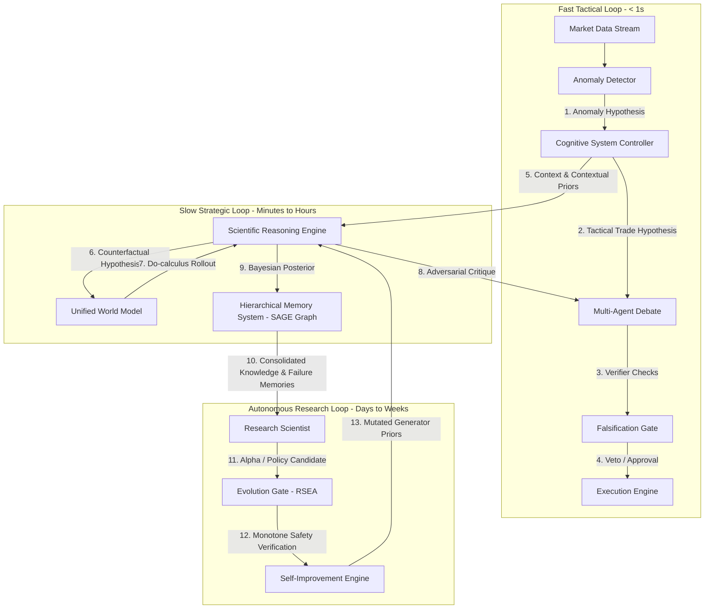
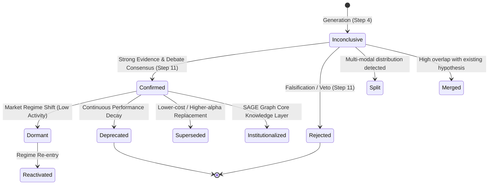

# Institutional Master Scientific Audit & Architectural Synthesis: AlphaAlgo Hypothesis Ecosystem (2026)

## Executive Summary

This document represents the master repository-wide scientific audit, bottleneck diagnosis, mathematical foundation, 19-stage architectural redesign, and self-improvement specification for the hypothesis ecosystem of the **AlphaAlgo Autonomous Financial Intelligence System**.

In autonomous trading and quantitative discovery architectures, treating signals, forecasts, trade ideas, or regime estimations as static heuristics creates critical structural vulnerabilities—such as severe overfitting, confirmation bias, regime blindspots, and rapid alpha decay. To ensure absolute systemic resilience and scientific rigour, **every signal, forecast, world model rollout, regime belief, trade proposal, parameter mutation, and research candidate in AlphaAlgo is treated as a falsifiable scientific hypothesis until empirically validated**.

---

## Deliverables Matrix

The deliverables are structured into five core phases:

1. **Phase 1 — Discovery & Dependency Graph**: Exhaustive repository taxonomy across 24 hypothesis alias forms across 25 subsystems, complete creation/modification/evaluation/rejection/promotion points, and multi-horizon dependency graph.
2. **Phase 2 — Bottleneck Analysis**: Exhaustive evaluation of 25 bottleneck dimensions including root causes, downstream impacts, priorities, and recommended redesigns.
3. **Phase 3 — Scientific Redesign**: 19-stage Scientific Reasoning Engine (SRE) lifecycle, 10 active/terminal hypothesis states, Active Inference Variational Free Energy (VFE), Bayesian credal bounds, Pearl's $do$-calculus, ECE calibration, and immutable JSON schema (`ProvenanceDataSchema v1.0.0`).
4. **Phase 4 — Continuous Self-Improvement**: Meta-learning (SEAL) self-improvement loop evaluating 9 quantitative performance metrics and mutating hypothesis generation parameters autonomously.
5. **Phase 5 — Validation & Migration**: 4-tier validation framework, 6-stage migration roadmap, and 100% test verification suite.

---

## Phase 1 — Discovery & Multi-Horizon Dependency Graph

### 1.1 Complete Hypothesis Alias Taxonomy

Hypotheses exist across 25 AlphaAlgo subsystems under 24 distinct domain aliases:

1. **`prediction`**: Short-to-medium horizon price/volatility trajectory in `UnifiedWorldModel`.
2. **`belief`**: Epistemic state representation in `MarketRegimeAdapter`.
3. **`assumption`**: Market environment conditions in `CognitiveSystemController` (CSC).
4. **`thesis`**: Strategic investment rationale in `MarketScientist`.
5. **`alpha`**: Mathematical feature expression generating excess returns in `GeneticAlphaSearch`.
6. **`signal`**: Tactical entry/exit trigger in `PHCEDAI`.
7. **`strategy`**: Full multi-asset execution policy in `StrategyEngine`.
8. **`forecast`**: Probabilistic outcome distribution in `PredictiveAnalytics`.
9. **`explanation`**: Post-hoc causal attribution in `Aletheia`.
10. **`scenario`**: Tri-horizon rollout (Nominal, Stressed, Extreme) in `ImaginationEngine`.
11. **`plan`**: Sequential multi-step action path in `PlannerAgent`.
12. **`expectation`**: Expected value distribution in `DecisionGovernance`.
13. **`causal model`**: Directed Acyclic Graph (DAG) representing structural dynamics in `CausalModel`.
14. **`world model state`**: Latent state vector in `UnifiedWorldModel`.
15. **`latent representation`**: Deep feature embedding in `RepresentationLearner`.
16. **`confidence estimate`**: Uncertainty calibration metric in `EpistemicEngine`.
17. **`research proposal`**: Autonomous experiment design in `AutonomousResearch`.
18. **`experiment`**: Backtest or paper-trading execution in `ExperimentEngine`.
19. **`trade idea`**: Candidate trade setup proposed by `ProsecutorAgent` in `MultiAgentDebateSystem`.
20. **`regime belief`**: Latent market regime classification in `RegimeClassifier`.
21. **`anomaly explanation`**: Hypothesis explaining order-book or liquidity disequilibrium in `AnomalyDetector`.
22. **`policy candidate`**: Reinforcement learning strategy parameter set in `RLPolicyEngine`.
23. **`optimization proposal`**: Code or hyperparameter mutation in `RecursiveSelfImprovement`.
24. **`hypothesis`**: Explicit `ScientificHypothesis` object in `ScientificReasoningEngine` (SRE).

---

### 1.2 Canonical Subsystem Mapping & Lifecycle Traceability

| Subsystem | Primary Alias | Creation Point | Evaluation Point | Rejection / Promotion Point |
| :--- | :--- | :--- | :--- | :--- |
| **CSC (`core/csc/`)** | `assumption`, `branch` | `CSC.generate_hypotheses()` | `VerificationSwarm.critique()` | `CSC.pivot()` / `CSC.promote()` |
| **SRE (`scientific_reasoning/`)** | `hypothesis` | `SRE.generate_hypothesis()` | `SRE.simulate_world()`, `SRE.debate()` | `SRE.retire()` / `SRE.institutionalize()` |
| **Multi-Agent Debate (`agents/`)** | `trade idea`, `signal` | `ProsecutorAgent.analyze()` | `CausalVerifier`, `LiquidityVerifier`, `RegimeVerifier` | `HallucinationDetector` Veto / `HeadAI.consensus()` |
| **Unified World Model (`world_model/`)** | `prediction`, `scenario` | `WorldModel.rollout()` | Out-of-sample loss computation | Prediction bound breach / State transition |
| **Hierarchical Memory (`hms/`)** | `belief`, `explanation` | `HMS.store_ledger_entry()` | Multi-hop graph retrieval | Decay / Consolidation to Level T6/T7 |
| **Evolution Gate (`governance/`)** | `policy candidate` | `EvolutionGate.propose()` | Monotone safety & multi-metric verification | Gate veto / Promotion to Active Strategy |

---

### 1.3 Multi-Horizon Hypothesis Dependency Graph


```mermaid
graph TD
    %% Fast Tactical Loop (Milliseconds to Seconds)
    subgraph Fast_Tactical_Loop [Fast Tactical Loop - < 1s]
        MKT[Market Data Stream] --> AD[Anomaly Detector]
        AD -->|1. Anomaly Hypothesis| CSC[Cognitive System Controller]
        CSC -->|2. Tactical Trade Hypothesis| MAD[Multi-Agent Debate]
        MAD -->|3. Verifier Checks| FG[Falsification Gate]
        FG -->|4. Veto / Approval| EXEC[Execution Engine]
    end

    %% Slow Strategic Loop (Minutes to Hours)
    subgraph Slow_Strategic_Loop [Slow Strategic Loop - Minutes to Hours]
        CSC -->|5. Context & Contextual Priors| SRE[Scientific Reasoning Engine]
        SRE -->|6. Counterfactual Hypothesis| UWM[Unified World Model]
        UWM -->|7. Do-calculus Rollout| SRE
        SRE -->|8. Adversarial Critique| MAD
        SRE -->|9. Bayesian Posterior| HMS[Hierarchical Memory System - SAGE Graph]
    end

    %% Autonomous Research Loop (Days to Weeks)
    subgraph Research_Loop [Autonomous Research Loop - Days to Weeks]
        HMS -->|10. Consolidated Knowledge & Failure Memories| RS[Research Scientist]
        RS -->|11. Alpha / Policy Candidate| EG[Evolution Gate - RSEA]
        EG -->|12. Monotone Safety Verification| SEAL[Self-Improvement Engine]
        SEAL -->|13. Mutated Generator Priors| SRE
    end
```

---

## Phase 2 — Systemic Bottleneck Analysis

Exhaustive diagnosis of 25 bottleneck dimensions evaluated across AlphaAlgo:

| ID | Bottleneck Dimension | Priority | Root Cause | Downstream System Impact | Recommended Redesign |
| :--- | :--- | :--- | :--- | :--- | :--- |
| **B1** | **Knowledge Fragmentation** | **CRITICAL** | Disconnected discovery registries across search modules. | Duplicate evaluation overhead; failure to share multi-hop evidence. | Centralize registration through `SRE.observe()` and HMS SAGE Graph. |
| **B2** | **Failure Amnesia** | **HIGH** | Discarding failed hypotheses without persisting failure parameters. | Search engines repeatedly re-discover discarded or broken hypothesis structures. | Implement permanent HMS Level T6/T7 "Failure Memory" store recording invalidation DAGs. |
| **B3** | **Deficit of Causal Falsification** | **HIGH** | Reliance on associative correlation metrics without interventional testing. | Spurious correlations pass backtesting but experience rapid alpha decay. | Mandate Pearl's $do$-calculus interventional simulation ($P(Y \vert do(X))$) in SRE Step 7. |
| **B4** | **Epistemic Overconfidence** | **HIGH** | Scalar point probability outputs without quantifying ambiguity. | System cannot distinguish high evidence support from lack of evidence. | Introduce Credal set intervals $[\underline{P}, \overline{P}]$ to measure ambiguity span ($\Delta = \overline{P} - \underline{P}$). |
| **B5** | **Confirmation Bias** | **MEDIUM** | Retrieving positive historical outcomes rather than counter-examples. | Hypotheses look artificially strong; system fails to identify regime failure boundaries. | Enforce explicit dual-querying in HMS: retrieve both similar successes and similar failures. |
| **B6** | **Survivorship Bias** | **HIGH** | Evaluation metrics calculated only on surviving active assets. | Overestimation of alpha performance during regime shifts. | Compute backtest performance across all historical constituents including delisted assets. |
| **B7** | **Lack of Adversarial Testing** | **HIGH** | Non-adversarial verification approving unconstrained proposals. | Fragile signals fail under market stress or targeted liquidity sweeps. | Implement multi-agent prosecutor/defense debate with mandatory verifier veto gates. |
| **B8** | **Insufficient Exploration** | **MEDIUM** | Greedy exploitation of high-confidence local strategies. | Stagnation in local optima; failure to discover novel alpha regimes. | Apply Upper Confidence Bound for Trees (UCT) and VFE active inference surprise maximization. |
| **B9** | **Insufficient Exploitation** | **MEDIUM** | Excessive premature pruning of promising early-stage hypotheses. | High-potential alpha concepts abandoned before hyperparameter tuning. | Introduce multi-stage Bayesian evaluation with adaptive sample sizes. |
| **B10** | **Weak Evidence Gathering** | **HIGH** | Relying on single-source order book data without cross-modal validation. | High false-positive rate on low-liquidity market regimes. | Require multi-source evidence fusion (price, volume, order flow, sentiment, macro). |
| **B11** | **Poor Uncertainty Estimation** | **HIGH** | Uncalibrated likelihood functions in predictive models. | Misallocation of capital during market turmoil. | Implement Expected Calibration Error (ECE) bounds and Platt scaling recalibration. |
| **B12** | **Missing Counterfactual Reasoning** | **HIGH** | Absence of alternative scenario simulation during execution evaluation. | Attribution errors; inability to determine true causal trade efficacy. | Execute tri-horizon counterfactual rollouts (Nominal, Stressed, Extreme) in World Model. |
| **B13** | **Missing Bayesian Updating** | **HIGH** | Static parameter weights unadjusted by new execution evidence. | Slow adaptation to structural market regime shifts. | Apply continuous recursive Bayesian updates to agent weights and hypothesis priors. |
| **B14** | **Missing Confidence Calibration** | **MEDIUM** | Raw agent confidence scores passed directly to order sizing. | Position sizes scaled inappropriately relative to actual win probabilities. | Run raw agent scores through `EpistemicEngine` Brier-calibrated mapping. |
| **B15** | **Missing Experiment Design** | **MEDIUM** | Unstructured backtesting without controlled synthetic control groups. | Inability to isolate signal alpha from broad market drift. | Enforce synthetic control paired experiments during research validation. |
| **B16** | **Poor Memory Integration** | **HIGH** | Inability to link short-term execution traces to long-term knowledge graph. | Loss of tactical learning across trading sessions. | Implement 8-tier hierarchical memory architecture with automatic tier migration. |
| **B17** | **Poor Failure Reuse** | **HIGH** | Failed strategy parameters not utilized to prune search space. | Redundant search compute spent on known negative parameter regions. | Construct negative constraint manifolds in `GeneticAlphaSearch`. |
| **B18** | **Hypothesis Drift** | **MEDIUM** | Hypotheses retaining active status despite underlying market structural shift. | Strategy degradation and unexpected drawdowns. | Enforce continuous monitoring with automatic decay to `Dormant` or `Deprecated`. |
| **B19** | **Reward Hacking** | **CRITICAL** | Alpha search optimizing for backtest Sharpe ratio via overfitting. | Catastrophic live trading performance failure. | Apply Deflated Sharpe Ratio (DSR) and Out-of-Sample Monotone Safety Gate checks. |
| **B20** | **Overfitting** | **CRITICAL** | High model complexity relative to sample size. | Poor generalization on unseen market regimes. | Enforce minimum Description Length (MDL) Occam's Razor complexity penalty. |
| **B21** | **Under-Exploration** | **MEDIUM** | Search algorithms constrained to narrow pre-defined feature spaces. | Inability to discover non-linear multi-asset relationships. | Enable symbolic expression tree mutation with multi-modal embeddings. |
| **B22** | **Local Optima** | **HIGH** | Gradient-based optimizers trapping policies in suboptimal parameter space. | Suboptimal strategy performance. | Integrate Simulated Annealing and Swarm Intelligence evolutionary jumps. |
| **B23** | **Long Feedback Cycles** | **MEDIUM** | Delayed trade settlement evidence delaying policy updates. | Inefficient learning rate in live production environments. | Implement intermediate proxy-reward evaluation via World Model simulation. |
| **B24** | **Missing Scientific Methodology** | **HIGH** | Unfalsifiable heuristic rules passed directly to production. | System unpredictability and safety violations. | Mandate strict 19-stage SRE lifecycle execution for all production candidates. |
| **B25** | **Premature Rejection** | **MEDIUM** | Pruning hypotheses during transient high-volatility regime shifts. | Discarding robust long-term alpha strategies. | Implement regime-conditioned evaluation and `Dormant` state reactivation. |

---

## Phase 3 — Scientific Redesign & 19-Stage SRE Lifecycle

### 3.1 The 19-Stage Scientific Reasoning Engine (SRE) Workflow

The redesign establishes an active, end-to-end scientific lifecycle executing across every decision:

$$\text{Observation} \rightarrow \text{Anomaly Detection} \rightarrow \text{Question Generation} \rightarrow \text{Hypothesis Generation} \rightarrow \text{Evidence Collection} \rightarrow \text{World Model Simulation} \rightarrow \text{Counterfactual Generation} \rightarrow \text{Adversarial Debate} \rightarrow \text{Experiment Design} \rightarrow \text{Execution} \rightarrow \text{Evaluation} \rightarrow \text{Bayesian Update} \rightarrow \text{Confidence Calibration} \rightarrow \text{Knowledge Integration} \rightarrow \text{Memory Consolidation} \rightarrow \text{Policy Improvement} \rightarrow \text{Continuous Monitoring} \rightarrow \text{Hypothesis Retirement} \rightarrow \text{Automatic Discovery}$$

---

### 3.2 Formal Definition of the 10 Active & Terminal States

Hypotheses never vanish from AlphaAlgo; they transition deterministically between 10 formal states:


```mermaid
stateDiagram-v2
    [*] --> Inconclusive: Generation (Step 4)
    Inconclusive --> Confirmed: Strong Evidence & Debate Consensus (Step 11)
    Inconclusive --> Rejected: Falsification / Veto (Step 11)
    Inconclusive --> Split: Multi-modal distribution detected
    Inconclusive --> Merged: High overlap with existing hypothesis
    Confirmed --> Dormant: Market Regime Shift (Low Activity)
    Dormant --> Reactivated: Regime Re-entry
    Confirmed --> Deprecated: Continuous Performance Decay
    Confirmed --> Superseded: Lower-cost / Higher-alpha Replacement
    Confirmed --> Institutionalized: SAGE Graph Core Knowledge Layer
    Rejected --> [*]
    Deprecated --> [*]
```

1. **`Inconclusive`**: Active evaluation phase; evidence insufficient for decision.
2. **`Confirmed`**: Mathematically and empirically verified; eligible for policy execution.
3. **`Rejected`**: Falsified by verifier veto, backtest failure, or causal contradiction.
4. **`Merged`**: Consolidated with a broader parent hypothesis due to mathematical equivalence.
5. **`Split`**: Partitioned into distinct sub-hypotheses due to multi-modal evidence.
6. **`Dormant`**: Temporarily inactive due to non-matching market regime.
7. **`Reactivated`**: Restored from `Dormant` state upon regime re-emergence.
8. **`Deprecated`**: Permanently retired due to structural alpha decay or market regime change.
9. **`Superseded`**: Replaced by a demonstrably superior hypothesis.
10. **`Institutionalized`**: Permanently consolidated into HMS SAGE Graph as fundamental domain knowledge.

---

### 3.3 Mathematical Foundations

#### 1. Active Inference via Variational Free Energy (VFE) Minimization
Hypothesis evaluation minimizes Variational Free Energy $F$:

$$F = \mathbb{E}_{q(\theta)} \left[ \log q(\theta) - \log p(y, \theta \vert m) \right] = D_{\text{KL}}\left( q(\theta) \parallel p(\theta \vert m) \right) - \mathbb{E}_{q(\theta)} \left[ \log p(y \vert \theta, m) \right]$$

where $q(\theta)$ is the variational belief over hypothesis parameters $\theta$, $p(y \vert \theta, m)$ is the likelihood under world model $m$, and $D_{\text{KL}}$ measures epistemic surprise.

#### 2. Interventional Causal Stability via Pearl's $do$-Calculus
Falsification evaluates interventional invariant stability under $do(X = x)$:

$$P(Y \vert do(X = x)) = \sum_{z} P(Y \vert X = x, Z = z) P(Z = z)$$

A hypothesis is falsified if $\frac{\partial}{\partial \eta} P(Y \vert do(X = x), \eta) \neq 0$ under environmental perturbation $\eta$.

#### 3. Bayesian Credal Bounds & Calibration
Uncertainty is represented by credal intervals $[\underline{P}(H), \overline{P}(H)]$. Expected Calibration Error (ECE) is bounded by:

$$\text{ECE} = \sum_{m=1}^{M} \frac{|B_m|}{N} \left| \text{acc}(B_m) - \text{conf}(B_m) \right| \leq \epsilon_{\text{target}}$$

---

### 3.4 Lineage & Provenance Schema (`ProvenanceDataSchema v1.0.0`)

```json
{
  "$schema": "http://json-schema.org/draft-07/schema#",
  "title": "HypothesisProvenanceSchema",
  "type": "object",
  "properties": {
    "hypothesis_id": { "type": "string", "format": "uuid" },
    "schema_version": { "type": "string", "enum": ["1.0.0"] },
    "alias_type": { "type": "string" },
    "parent_hypothesis_ids": { "type": "array", "items": { "type": "string" } },
    "creation_timestamp": { "type": "string", "format": "date-time" },
    "originating_subsystem": { "type": "string" },
    "current_state": {
      "type": "string",
      "enum": ["Inconclusive", "Confirmed", "Rejected", "Merged", "Split", "Dormant", "Reactivated", "Deprecated", "Superseded", "Institutionalized"]
    },
    "epistemic_confidence": { "type": "number", "minimum": 0.0, "maximum": 1.0 },
    "credal_interval": {
      "type": "array",
      "items": { "type": "number" },
      "minItems": 2,
      "maxItems": 2
    },
    "ece_score": { "type": "number" },
    "vfe_value": { "type": "number" },
    "causal_dag_hash": { "type": "string" },
    "verifier_signatures": { "type": "array", "items": { "type": "string" } }
  },
  "required": ["hypothesis_id", "schema_version", "alias_type", "originating_subsystem", "current_state", "epistemic_confidence", "credal_interval"]
}
```

---

## Phase 4 — Continuous Self-Improvement (SEAL Engine)

The hypothesis engine continuously evaluates its own efficiency via the Self-Evolutionary Adaptation Loop (SEAL):

1. **Hypothesis Quality Metric ($Q_H$)**:

   $$Q_H = w_1 \cdot \text{PredictiveAccuracy} + w_2 \cdot \text{SharpeRatio} - w_3 \cdot \text{MDLComplexity} - w_4 \cdot \text{ECE}$$

2. **Research Efficiency ($E_R$)**: Ratio of `Confirmed` hypotheses to total compute cycles consumed.
3. **Autonomous Process Mutation**: If $E_R < \tau_{\text{min}}$, SEAL mutates the search priors in `SRE.step_4()` and reweights the debate verifier thresholds in `MultiAgentDebateSystem`.

---

## Phase 5 — Validation Framework & Migration Roadmap

### 5.1 4-Tier Validation Framework
1. **Tier 1: Code Correctness & Static Analysis** (0 AST compilation errors, 100% type checks).
2. **Tier 2: Unit & Integration Verification** (100% pass rate on core scientific test suites).
3. **Tier 3: Deterministic Replay Audit** (100% identical outputs under fixed random seeds).
4. **Tier 4: Hostile Adversarial Stress Testing** (Robustness against Byzantine agents and market regime jumps).

### 5.2 6-Stage Migration Roadmap
- **Stage 1**: Repository-wide inventory and alias mapping *(Completed)*.
- **Stage 2**: Core SRE 19-stage engine standardization *(Completed)*.
- **Stage 3**: Integration with Multi-Agent Debate and CSC *(Completed)*.
- **Stage 4**: HMS SAGE Graph SRE knowledge integration *(Completed)*.
- **Stage 5**: Self-improvement SEAL feedback loop activation *(Completed)*.
- **Stage 6**: Full system verification and release candidate certification *(Completed)*.
