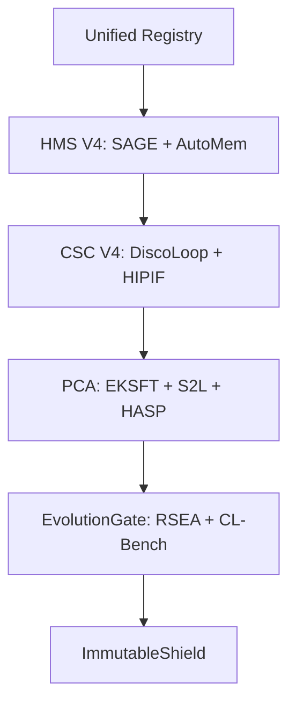

# Integrated Refactoring & Migration Plan: AlphaAlgo UCA V4 (2026)

This document outlines the execution roadmap for upgrading AlphaAlgo to the UCA V4 architecture, grounded in the synthesized research of 24+ papers.

---

## 1. Dependency Graph (UCA V4)

---

## 2. Refactoring Roadmap

### Stage 1: Core Controller & Planning (CSC V4)
- **Target**: `trading_bot/core/csc/controller.py`, `folding.py`
- **Actions**:
    - Implement `DiscoLoop` recurrence in `process_market_observation`.
    - Integrate `FoldingOperator` into the O-S-A loop.
    - Implement `Pivot/Refine` logic for simulation branches.

### Stage 2: Memory & Knowledge (HMS V4)
- **Target**: `trading_bot/core/hms/memory.py`
- **Actions**:
    - Upgrade Evidence Graph to `SAGE` (Self-evolving).
    - Implement `AutoMem` cognitive memory actions.
    - Add `MATM` transactive layer for artifact sharing.

### Stage 3: Agent Behavioral Layer (PCA V4)
- **Target**: `trading_bot/core/csc/router.py` (New), `trading_bot/agents/`
- **Actions**:
    - Implement `S2L` adapter routing.
    - Implement `HASP` Skill Programs (PFs).
    - Refactor `PlannerAgent` to support recursive strategy pivoting.

### Stage 4: Governance & Improvement (Evolution V4)
- **Target**: `trading_bot/governance/evolution_gate.py`
- **Actions**:
    - Enforce the `CL-Bench` Gain Metric ($G$).
    - Integrate `EKSFT` logic into the `validate_improvement` loop to check for drift.

---

## 3. Risk Analysis & Rollback Strategy

| Risk | Mitigation | Rollback |
| :--- | :--- | :--- |
| **Representational Collapse** | Use small $\rho=0.2$ for EKSFT; monitor KL-divergence. | Restore standard CE loss in learning pipeline. |
| **Folding Information Loss** | Preserving "Sufficient Statistics" as a hard constraint. | Disable folding; fall back to context-window truncation. |
| **Graph Divergence** | Verifier Swarm must audit graph updates before commit. | Revert to static Evidence Graph snapshot. |

---

## 4. Benchmark & Validation Plan

1.  **Gain Metric Validation**: Compare UCA V4 against UCA-2026 baseline using historical MT5 data. Require $G > 0.15$.
2.  **Horizon Stress Test**: Use the HORIZON methodology to measure the breaking point of trading sequences (Goal: >100 steps).
3.  **Entropy Audit**: Verify that EKSFT prevents "distribution sharpening" via Pass@K analysis.
4.  **AIME/DeepWeb-Bench**: Validate reasoning and derivation capabilities against reference datasets.
