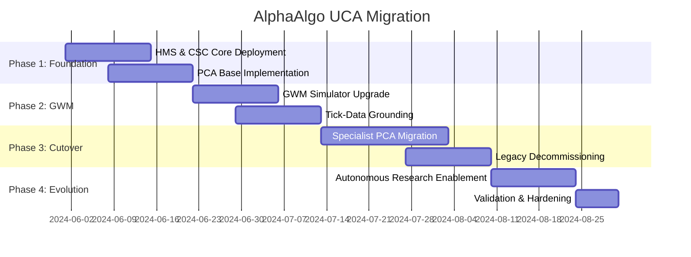

# AlphaAlgo UCA: Migration Strategy & Roadmap

## 1. Phased Migration Strategy

### Phase 1: Shadow Core (Weeks 1-3)
- **Objective**: Deploy UCA infrastructure without impacting live trading.
- **Actions**:
    - Deploy `CognitiveSystemController` (CSC) in "Listen Only" mode.
    - Implement `HMS` (Hierarchical Memory System) storage connectors.
    - Instantiate the first `PersistentCognitiveAgent` (PCA) (Safety/Risk).
- **Exit Criteria**: CSC and PCA can process market data and generate shadows-decisions identical or superior to legacy code.

### Phase 2: World Model Anchoring (Weeks 4-6)
- **Objective**: Ground the GWM in historical reality.
- **Actions**:
    - Upgrade `FWM_DigitalTwin` to `GenerativeWorldModel`.
    - Implement Parallel Rollout Engine.
    - Ground simulations using `RigorousBacktest` and historical tick data.
- **Exit Criteria**: GWM rollout error (Fidelity) is below 5%.

### Phase 3: Specialist Cutover (Weeks 7-9)
- **Objective**: Replace legacy agents with persistent cognitive counterparts.
- **Actions**:
    - **Step 1**: Migrate `RiskManager` → `PCA_RiskAgent`.
    - **Step 2**: Migrate `MarketAnalysis` → `PCA_MacroAgent`.
    - **Step 3**: Migrate `TradeExecution` → `PCA_ExecutionAgent`.
- **Exit Criteria**: All specialist roles managed by PCAs. Legacy orchestrators disabled.

### Phase 4: Autonomous Research & Evolution (Weeks 10-12)
- **Objective**: Enable full self-improvement cycle.
- **Actions**:
    - Connect `ResearchAgent` to strategy discovery.
    - Enable `MetaImprovementLoop` to tune PCA policies.
    - Implementation of the "Verdict Engine" for multi-agent debate.
- **Exit Criteria**: System demonstrates measurable "Learning Improvement" in backtests.

---

## 2. Risk Management during Migration

| Stage | Risk | Mitigation |
| :--- | :--- | :--- |
| **Foundation** | Data Incompatibility | Use `LegacyAdapter` for HMS → JSON bridging. |
| **Simulations** | Reality Gap | Mandatory "Simulation vs. Reality" audit after every major trade. |
| **Agent Cutover** | Logic Collision | Blue/Green deployment of agents; CSC maintains a global lock. |
| **Learning** | Policy Divergence | Tier 6 (Institutional) memory acts as a hard boundary for RL updates. |

---

## 3. Implementation Roadmap (T-Minus 12 Weeks)

