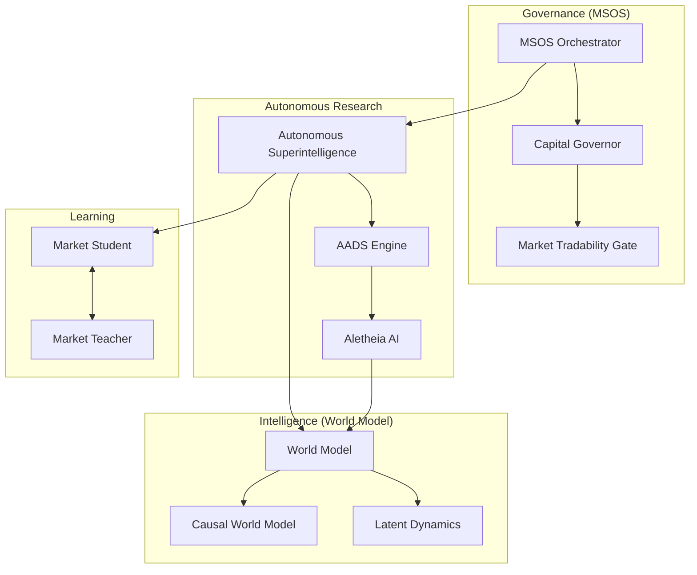

# Stage 3: Dependency Graph

## 1. High-Level Dependency Map
The system exhibits a "Spaghetti" dependency pattern where multiple high-level orchestrators depend on each other's sub-components, often through circular paths broken by local imports.

### Core Dependency Chains:
*   **IntegratedAgentSystem** (IAS) → **WorldModel** → **LatentDynamics**
*   **AutonomousSuperintelligence** → **A2AMessageBus** / **World2AgentBridge**
*   **AADS** → **CausalWorldModel** → **SakanaEngine**
*   **AAMIS v3** → **NeuroSymbolicEngine** → **MultimodalFusion**
*   **MSOS** → **CapitalGovernor** → **MarketTradabilityGate**

## 2. Circular Dependencies Identified
1.  **WorldModel ↔ SimulationOrchestrator**: The world model uses the simulator for rollouts, while the simulator uses the world model's latent dynamics to generate synthetic data.
2.  **AutonomousSuperintelligence ↔ SelfModifier**: Superintelligence coordinates the self-modification, but the self-modification engine needs to inspect and update the Superintelligence orchestrator's own logic.
3.  **MarketStudent ↔ MarketTeacher**: The student learns from the teacher, but the teacher's policy is updated based on the student's performance metrics.

## 3. Visual Dependency Graph (Mermaid)

## 4. Key Architectural Bottlenecks
*   **Registry Lock-in**: Multiple agent registries (`AgentRegistry`, `ComponentRegistry`, `OpenClawRegistry`) make it impossible to have a single view of all active system capabilities.
*   **Message Bus Fragmentation**: Usage of `A2AMessageBus`, `EventBus`, and direct method calls for inter-module communication creates observability gaps.
*   **State Split**: System state is split across `MSOSState`, `LearningState`, `AutonomousCore` state, and various JSON persistence files.
