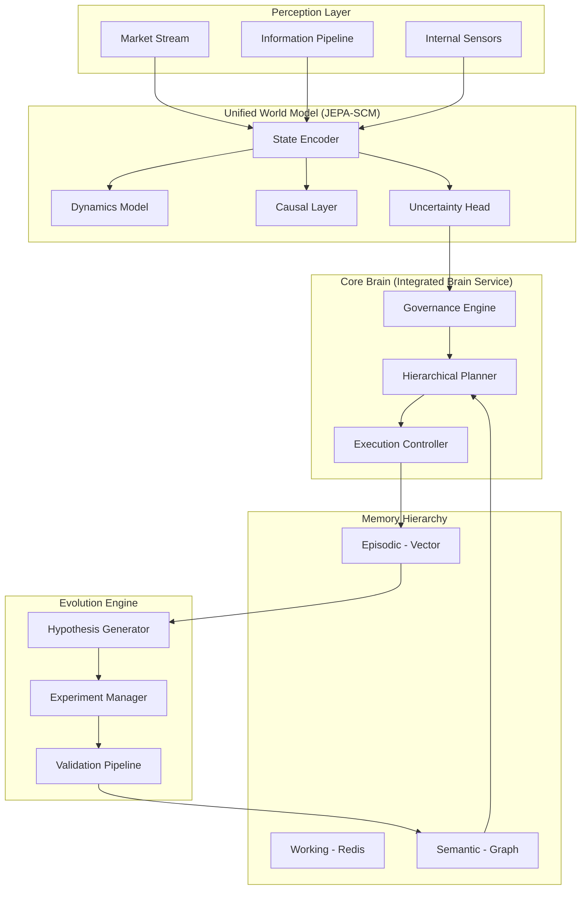

# Stage 8: Target Architecture - The Unified Cognitive System

## 1. Unified Orchestration: "The Core Brain"
The 9 fragmented orchestrators are consolidated into a single **Integrated Brain Service**.
*   **Hierarchical Planner**: Decomposes high-level goals into task graphs.
*   **Execution Controller**: Manages the multi-broker execution pipeline.
*   **Governance Engine**: Enforces safety, capital, and ethical constraints (L0 Gate).

## 2. Universal Perception & Memory
*   **Perception Pipeline**: Unified pipeline for:
    *   **Market Stream**: Tick, L2, Bars.
    *   **Information Pipeline**: Internet data (News, SEC, Social) with credibility scoring.
    *   **Internal Sensors**: System health, latency, compute usage.
*   **Unified Memory Hierarchy**:
    *   **L1: Working Memory**: Real-time state and reasoning traces (Redis).
    *   **L2: Episodic Memory**: Past trade outcomes and research findings (Vector DB).
    *   **L3: Semantic Memory**: Causal DAGs and learned strategy genomes (Graph DB).

## 3. Unified World Model: JEPA-SCM Hybrid
A single world model architecture:
1.  **State Encoder**: Compresses multi-modal perception into a latent vector $z_t$.
2.  **Dynamics Model**: Action-conditioned latent transition $z_{t+1} = f(z_t, a_t)$.
3.  **Causal Layer**: Structural equations for counterfactual "what-if" reasoning.
4.  **Uncertainty Head**: Bayesian ensemble for epistemic uncertainty quantification.

## 4. Autonomous Research Lab (The Evolution Engine)
A unified pipeline for self-improvement:
1.  **Hypothesis Generator**: Uses EIG (Expected Information Gain) to target "ignorant" market regimes.
2.  **Experiment Manager**: Runs high-fidelity simulations and backtests.
3.  **Validation Pipeline**: 5-stage gate (Statistical → Sim → Causal → Stress → Paper).
4.  **Self-Modifier**: Applies validated code/param mutations to the production system.

## 5. Decision & Execution Pipeline
*   **Reasoning Pipeline**: ReAct loop (Reason + Act) with causal verification.
*   **Swarm Consensus**: specialized experts (Market, Quant, Risk) providing evidence-weighted signals.
*   **Smart Order Router**: Cross-venue, cross-broker execution with slippage minimization.

## 6. Architecture Diagram (Mermaid)

