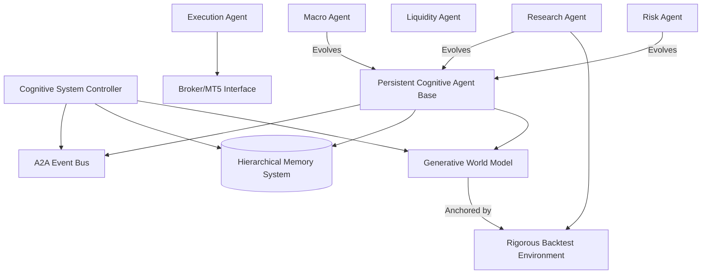

# AlphaAlgo UCA: Technical Specification & Deliverables

## 1. Bottleneck Analysis (Current System)

| ID | Bottleneck | Description | Root Cause |
| :--- | :--- | :--- | :--- |
| **B1** | **Orchestration Conflict** | Three orchestrators (`Master`, `IAS`, `Meta`) overlap, causing logic duplication and race conditions. | Incremental evolution without decommissioning legacy code. |
| **B2** | **Cognitive Fragmentation** | Agents are stateless "functions" called by orchestrators, losing context over long horizons. | Legacy "ReAct" implementation focused on isolated tasks. |
| **B3** | **Simulation Gap** | The World Model predicts "Next Latent State" but cannot generate "Inspectable Paths" for agent reasoning. | JEPA/DreamerV1 focus on local dynamics vs. global trajectories. |
| **B4** | **Un-grounded Learning** | RL/Self-play loops optimize against `np.random` instead of historical tick/bar data. | Development placeholders never replaced with data connectors. |
| **B5** | **Memory Context Window** | Recursive summarization loses critical evidence needed for institutional-grade research. | Lack of hierarchical indexing in current memory layers. |

---

## 2. Dependency Graph (Target Architecture)

---

## 3. Mathematical Justification

### 3.1 Active Inference for Agents
Agent behavior is governed by the minimization of **Expected Free Energy** ($G$):
$$G(\pi) = \sum_\tau [ P(o_\tau | \pi) \ln \frac{P(o_\tau | \pi)}{P(o_\tau | C)} + H(o_\tau | s_\tau, \pi) ]$$
- **Term 1 (Pragmatic Value)**: KL divergence between predicted outcomes and desired goals ($C$).
- **Term 2 (Epistemic Value)**: Expected entropy (uncertainty reduction).
This forces agents to balance *trading for profit* vs *trading to learn about the market*.

### 3.2 Einstein World Model Dynamics
The World Model utilizes a **Temporal-Spatial Transformer** to generate rollouts $\hat{\mathcal{T}}$:
$$\hat{\mathcal{T}}_{1:H} = \text{GWM}(s_0, \{a_\tau, \delta_\tau\}_{1:H})$$
Where $\delta$ represents a **causal intervention** (e.g., "do(inflation=5%)"). The agent inspects $\hat{\mathcal{T}}$ to calculate the **Counterfactual Regret** of its current plan.

---

## 4. Migration Strategy

### Step 1: Shadow Core (Phase 1)
- Deploy `CognitiveSystemController` alongside legacy orchestrators.
- PCA-Base instantiated but logic only "suggests" actions (no execution).

### Step 2: World Model Anchoring (Phase 2)
- Replace `latent_dynamics.py` with `GenerativeWorldModel`.
- Ground rollouts using the `RigorousBacktest` module as the source of truth.

### Step 3: Progressive Specialist Cutover (Phase 3)
- Migrate agents one-by-one:
    - `RiskManager` → `PCA_RiskAgent`.
    - `TrendFollowingAgent` → `PCA_StrategyAgent`.
- Decommission legacy modules once PCA performance exceeds baseline.

---

## 5. Implementation Roadmap (T-Minus 12 Weeks)

| Week | Focus | Milestone |
| :--- | :--- | :--- |
| **1-2** | **Foundation** | PCA Base Class + Hierarchical Memory Store (Tier 1-6). |
| **3-4** | **GWM Core** | Multi-horizon rollout engine + Counterfactual SCM. |
| **5-6** | **Integration** | A2A Bus + Cognitive System Controller (Brain Consolidation). |
| **7-8** | **Specialization** | Instantiate Macro, Risk, and Research PCAs. |
| **9-10** | **Grounding** | Connect all learning to Tick-Data Backtesting. |
| **11-12** | **Validation** | Stress-testing, Calibration Audit, and Full Cutover. |
