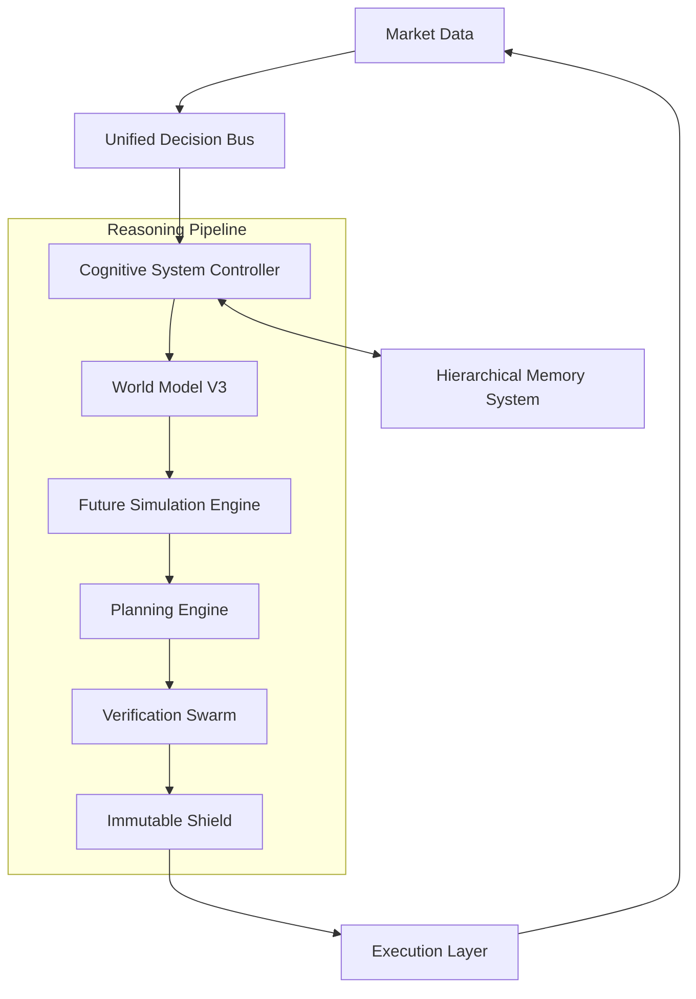

# AlphaAlgo UCA-2026 Dependency Graph & Implementation Roadmap

## 1. Architectural Components

| Component | Responsibility |
| :--- | :--- |
| **Unified Registry** | Authoritative singleton for all object references. |
| **Unified Decision Bus** | High-performance async event system for all communication. |
| **Hierarchical Memory (HMS)** | 6-tier persistent "Global Workspace" (Write-Manage-Read). |
| **Cognitive Controller (CSC)** | The "One Brain." Orchestrates Active Inference & HIPIF. |
| **World Model V3 (WM-V3)** | Predictive planning, simulation, and causal reasoning. |
| **Verification Swarm** | Evidence-first auditing of all reasoning branches. |
| **Immutable Shield** | Non-bypassable governance and risk layer. |
| **Planning Engine** | Multi-horizon lookahead search and plan evaluation. |
| **Execution Layer** | Institutional adapters for order placement and L2/L3 data. |

## 2. Startup Order (Linear Dependencies)

1.  **Stage 0: Bootstrapping**
    *   `main.py` initializes.
    *   **UnifiedComponentRegistry** (Singleton) created.
    *   **UnifiedDecisionBus** (Singleton) started.
    *   **ImmutableShield** (Singleton) initialized.

2.  **Stage 1: Memory & State**
    *   **HMS Working Memory** (Redis/RAM) started.
    *   **HMS Persistent Tiers** (Semantic/Episodic/Research) indexed.
    *   `WorldStateTracker` registered in CSC.

3.  **Stage 2: Perception & Simulation**
    *   **World Model V3** loaded (Transformer-Mamba Core).
    *   `CausalEngine` initialized with Institutional Graphs.
    *   `ExecutionSimulator` (L2/L3 aware) registered.

4.  **Stage 3: Reasoning & Planning**
    *   `HypothesisGenerator` registered.
    *   **Planning Engine** (CEM/MCTS) registered.
    *   **VerificationSwarm** agents (CausalVerifier, etc.) registered.

5.  **Stage 4: Cognitive Controller**
    *   **CognitiveSystemController (CSC)** initialized.
    *   Subscribes to Decision Bus for market updates.

6.  **Stage 5: Execution**
    *   `BrokerAdapter` / `MarketDataFeeder` started.
    *   Governance Gates opened.

## 3. Data Flow (The OSA-HIPIF Loop)

## 4. Circular Dependency Mitigation
*   **Decoupling via Bus:** Components communicate via `UnifiedEvent` on the bus, never directly referencing each other's class instances except via the `UnifiedRegistry`.
*   **Interface Inversion:** The CSC defines the `WorldModelInterface`; the WM-V3 implements it.
*   **State Externality:** No component (except HMS) maintains persistent state. State is passed as context in events.

## 5. Implementation Roadmap (Post-Approval)

| Phase | Milestone | Deliverables |
| :--- | :--- | :--- |
| **I** | **Foundations** | HMS 6-tier implementation, Registry/Bus hardening. |
| **II** | **Core Brain** | CSC Active Inference loop, HIPIF Folding Operator. |
| **III** | **Imagination** | WM-V3 Neural Core, Diffusion Simulator, Causal Engine. |
| **IV** | **Verification** | Evidence Graph, Specialist Verifiers, Hard Consensus Gate. |
| **V** | **Operation** | Training Pipeline (AMT/SFT/RL), Broker Integration. |
| **VI** | **Self-Improvement** | Evolution Gate (RSEA), Scientific Research Ledger. |
