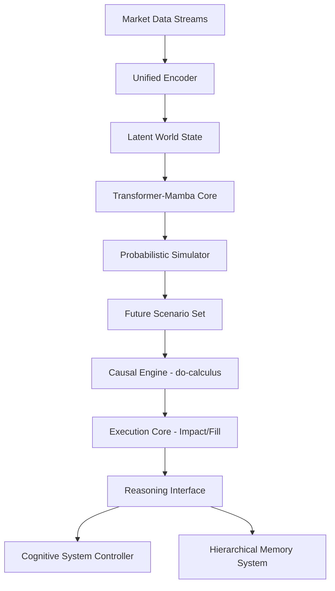

# 06_WORLD_MODEL_ARCHITECTURE.md - System Design & Component Interaction

## Objective
Detail the high-level architecture of the World Model V3 (Institutional Predictive Intelligence Engine).

## 1. The Unified Cognitive Controller (CSC)
The World Model is not a standalone service but a core capability of the **Cognitive System Controller**. It acts as the "Imagination Layer" in the OSA (Observe-Simulate-Act) loop.

## 2. Core Architectural Modules

### A. The Neural Predictive Core (The Engine)
*   **Backbone:** Hybrid **Transformer-Mamba (SSM)**.
*   **Mamba Layers:** Responsible for high-frequency temporal state tracking and linear-time history compression.
*   **Transformer Layers:** Responsible for global cross-asset relational attention and reasoning.

### B. The Unified Cross-Asset Encoder (The Senses)
*   **Input:** Multi-modal streams (Tick data, L2 Order Book, Macro Calendars, News Embeddings).
*   **Mechanism:** Shared latent space with modality-specific projection heads.

### C. The Probabilistic Simulator (The Imagination)
*   **Mechanism:** Diffusion-based or Trajectory Transformer core.
*   **Output:** A set of $N$ diverse future scenarios $\{\tau_1, \dots, \tau_N\}$ with associated probability weights $w_i$.

### D. The Causal Engine (The Logic)
*   **Mechanism:** Structural Causal Model (SCM) with a learned adjacency matrix.
*   **Function:** Enables "What-if" interventions ($do(x)$) and counterfactual analysis of past trades.

### E. The Execution Core (The Grounding)
*   **Function:** Predicts L2/L3 dynamics: slippage, market impact, queue position, and fill probability.
*   **Constraint:** This module must be grounded in real execution data to prevent the "Delusion Loop."

### F. The Reasoning Interface (The Translator)
*   **Logic Head:** Generates structured Causal Evidence Graphs for the CSC.
*   **Text Head:** Generates human-readable reasoning traces for Audit and Governance.

## 3. Data Flow (The OSA Loop)

1.  **Observe:** Encoder maps multi-modal market data to a unified latent state $z_t$.
2.  **Simulate:**
    *   The **Predictive Core** predicts the transition $z_t \to z_{t+1}$.
    *   The **Probabilistic Simulator** rolls out $N$ future trajectories $\tau_{t:t+H}$.
    *   The **Causal Engine** applies interventions (e.g., "What if we double the size?").
3.  **Evaluate:**
    *   The **Execution Core** estimates costs for each trajectory.
    *   The **Reasoning Interface** ranks scenarios by Expected Utility.
4.  **Fold:** The final decision and world-state updates are written to the **HMS**.

## 4. Component Interaction Diagram

## 5. Implementation Priorities
1.  **Mamba Backbone:** Replacing the naive RNN/LSTM approach for better temporal context.
2.  **HMS Integration:** Ensuring the World Model is no longer a data silo.
3.  **Causal Graph:** Moving from correlations to structural interventions.
