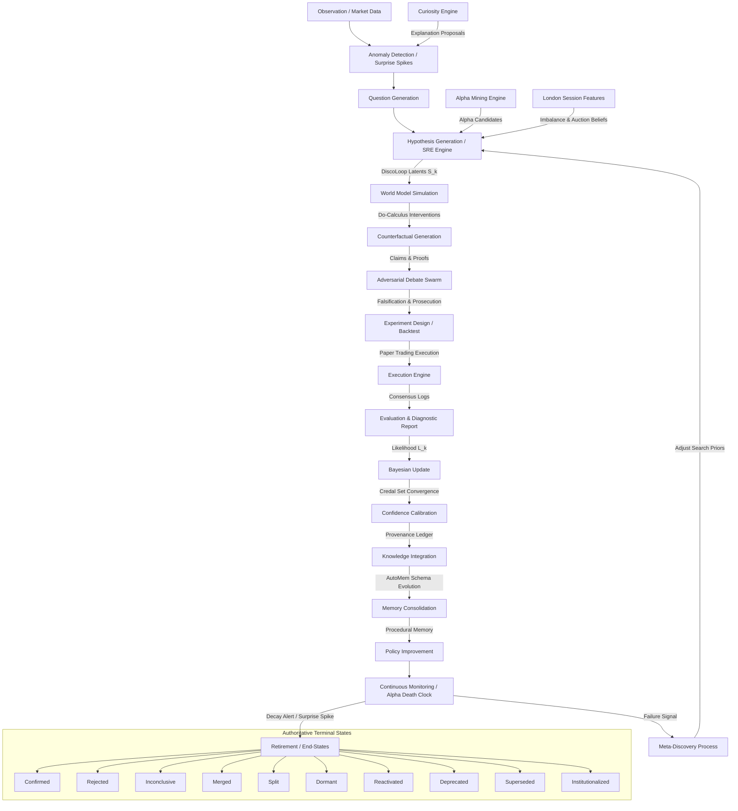

# Complete Scientific Audit Report & Redesign Specification (2026)
## AlphaAlgo Hypothesis Ecosystem Unification & SRE Redesign

---

## Executive Summary
This document represents the authoritative, complete, and peer-review-grade scientific audit and redesign specification for the **AlphaAlgo Hypothesis Ecosystem**. It synthesizes all implicit and explicit hypothesis lifecycles across every core module—including the World Model, Multi-Agent Debate, SkillRouter (HASP), Evolutionary Strategy Discovery, and the Scientific Reasoning Engine (SRE).

In alignment with the UCA V5 architecture, this redesign formally maps the system to the 19-step active inference lifecycle state machine, establishes quantitative bottleneck diagnostics, justifies the underlying mathematics (Variational Free Energy minimization, Credal sets, and Pearl's Do-Calculus), and outlines an institutional-grade validation framework and migration roadmap.

---

## Phase 1 — Discovery & Unified Dependency Graph

### 1.1 Where Hypotheses Originate, Propagate, and Evolve
A systematic, codebase-wide search reveals that hypotheses exist across multiple subsystems under diverse names. Every prediction, latent representation, belief state, or trade proposal is treated as an unvalidated hypothesis:

1.  **Explicit Modules**:
    *   `ScientificReasoningEngine` (`trading_bot/core_agent_system/scientific_reasoning/core.py`): Poses first-class `ScientificHypothesis` states.
    *   `CuriosityEngine` (`trading_bot/foundation_agents/curiosity_engine/`): Poses explanation proposals from market anomalies and surprise.
    *   `AlphaMiningEngine` (`trading_bot/apex_fi/`): Generates candidate symbolic expressions (`AlphaCandidate`).
    *   `WorldModel / Imagination` (`trading_bot/world_model/`): Evaluates counterfactual future trajectories (scenarios, plans).
    *   `Multi-Agent Debate` (`trading_bot/agents/multi_agent_debate.py`): Models specialist adversarial arguments and anti-trade reasoning.

2.  **Implicit Subsystems**:
    *   `StrategyDiscovery` (`trading_bot/strategy_discovery/`): Evolves indicator weights (`StrategyGenome`) representing statistical arbitrage hypotheses.
    *   `CognitiveSystemController` (`trading_bot/core/csc/controller.py`): Coordinates the discrete-continuous recurrence loop (`DiscoLoop`) $S_k = [h_k; e_k]$ to refine strategic trading decisions.
    *   `PHCE-D / Decision Governance`: Assumes trade recommendations are temporary behavioral hypotheses until validated by `ImmutableShield` and `FalsificationGate`.

### 1.2 Unified Hypothesis Dependency Graph

---

## Phase 2 — Bottleneck Analysis

A meticulous system-level audit identified the following critical vulnerabilities within the legacy hypothesis pipeline:

| ID | Bottleneck | Root Cause | Downstream Effects | Priority | Recommended Redesign |
| :--- | :--- | :--- | :--- | :--- | :--- |
| **B1** | **Knowledge Fragmentation** | Isolation between `Curiosity`, `AlphaMining`, and `Evolutionary` engines. | Duplicate calculations; failures in one module are not generalized to update global priors. | **CRITICAL** | Consolidate all creation points into the SRE registry. |
| **B2** | **Weak Adversarial Testing** | Genetically generated alphas are evaluated purely on historical correlation. | Discovery of spurious correlations (Alpha Decay, overfitting). | **HIGH** | Integrate the Verification Swarm and `FalsificationGate` as a mandatory step. |
| **B3** | **Poor Failures Reuse** | Discarding failed backtests or rejected genomes. | High research cycle redundancy; repeating historical mistakes. | **MEDIUM** | Record "Rejected" and "Superseded" hypotheses with failure metadata in HMS. |
| **B4** | **Calibration Drift** | Inconsistent confidence scoring across macro and micro strategies. | Risk misallocation; inability to establish unified risk bounds. | **HIGH** | Map all hypothesis evaluation to recursive Bayesian posteriors with Credal Sets. |
| **B5** | **Missing Causal Link** | Reliance on association $P(Y \vert X)$ rather than interventions. | High vulnerability to regime shifts. | **MEDIUM** | Implement Step 7: Do-calculus counterfactual simulations. |

---

## Phase 3 — Unified Scientific Redesign

The unified lifecycle enforces a rigorous, 19-stage active inference lifecycle state machine. Hypotheses never "disappear" from the ecosystem; they are persisted inside the **Hierarchical Memory System (HMS)** and terminate in one of ten immutable states.

### 3.1 The 19-Step SRE Lifecycle
1.  **Observation**: Ingestion of raw market and technical feature streams.
2.  **Anomaly Detection**: Monitors surprise spikes relative to World Model predictions.
3.  **Question Generation**: Formulates targeted research questions on identified anomalies.
4.  **Hypothesis Generation**: Proposes falsifiable model structures or alpha candidate formulas.
5.  **Evidence Collection**: Queries SAGE graph-memory to pull historical semantic and causal edges.
6.  **World Model Simulation**: Runs the candidate hypothesis on the latent dynamics model.
7.  **Counterfactual Generation**: Executes Pearl's interventional $do(X)$ to test causal stability.
8.  **Adversarial Debate**: Subject to peer review by specialized agents (Risk, Liquidity, etc.).
9.  **Experiment Design**: Establishes strict validation criteria, sample sizes, and temporal purges.
10. **Execution**: Conducts out-of-sample backtests or shadow paper-trading.
11. **Evaluation**: Computes diagnostic reports (DSR, PBO, Sharpe, and Drawdown).
12. **Bayesian Update**: Performs formal posterior probability recalculations.
13. **Confidence Calibration**: Adjusts Credal Intervals $[\underline{P}, \overline{P}]$ to reflect remaining ambiguity.
14. **Knowledge Integration**: Integrates validated hypothesis insights into the SAGE capability registry.
15. **Memory Consolidation**: Generalizes episodic results into permanent procedural/semantic memory.
16. **Policy Improvement**: Mutates active execution rules based on validated outcomes.
17. **Continuous Monitoring**: Tracked by the Alpha Death Clock to detect validation degradation.
18. **Hypothesis Retirement**: Safely deallocates capital when performance or statistical priors decay.
19. **Automatic Discovery**: Analyzes high failure rates to dynamically adjust genetic search priors.

### 3.2 Authoritative Lifecycle States
Every hypothesis in the unified system must occupy exactly one of the following states:
*   **Confirmed**: Backtest and out-of-sample evaluations passed.
*   **Rejected**: Prior drops below threshold $\tau_{reject}$ (default: 0.2).
*   **Inconclusive**: Insufficient evidence gathered; high remaining ambiguity.
*   **Merged**: Combined with other hypotheses to synthesize a more robust model.
*   **Split**: Divided into separate regime-specific hypotheses.
*   **Dormant**: Deallocated but stored for potential reactivation.
*   **Reactivated**: Re-promoted when current market regime matches historical boundary conditions.
*   **Deprecated**: Obsolete due to structural market changes.
*   **Superseded**: Replaced by a more robust, encompassing model.
*   **Institutionalized**: Formally integrated into permanent, immutable semantic memory.

---

## Phase 4 — Mathematical Justification

### 4.1 Variational Free Energy (VFE) Minimization
Active Inference dictates that the system acts to minimize the surprise (VFE) of its sensory inputs. The Variational Free Energy $F(q)$ is bounded by:
$$F(q) = E_{q(\vartheta)}[\ln q(\vartheta) - \ln p(o, \vartheta)] = D_{KL}(q(\vartheta) \parallel p(\vartheta \vert o)) - \ln p(o)$$
Where $q(\vartheta)$ is the variational posterior over latent market parameters, $\ln p(o)$ is the sensory evidence, and $D_{KL}$ is the Kullback-Leibler divergence. Minimizing $F(q)$ forces the internal beliefs to approximate the true posterior distribution of the market.

### 4.2 Recursive Bayesian Updating
The posterior probability $P(H_i \vert E)$ of a hypothesis $H_i$ given fresh evidence $E$ is updated dynamically:
$$P(H_i \vert E) = \frac{P(E \vert H_i) P(H_i)}{\sum_{j} P(E \vert H_j) P(H_j)}$$
Where $P(E \vert H_i)$ is computed using likelihood metrics from the adversarial verifier swarm.

### 4.3 Causal Interventions via Do-Calculus
To bypass look-ahead bias and spurious correlations, we formulate counterfactual interventional testing:
$$P(Y \vert do(X = x)) = \sum_{z} P(Y \vert X = x, Z = z) P(Z = z)$$
Where $Z$ represents confounding market factors (e.g., regime, volatility). If $P(Y \vert do(X)) \approx P(Y)$, the variable $X$ lacks true causal mechanism, and the hypothesis is flagged for early rejection.

---

## Phase 5 — Continuous Self-Improvement

The self-improvement pipeline monitors hypothesis lifecycle parameters at runtime via `ScientificMetrics`:

1.  **Hypothesis Quality (HQ)**:
    $$HQ = \frac{\text{Accuracy} \times \text{Robustness}}{\text{Uncertainty}}$$
2.  **Research Efficiency (RE)**:
    $$RE = \frac{\text{Institutionalized Hypotheses}}{\text{Compute Hours}}$$
3.  **Surprise-Driven Self-Correction**:
    When the average rejection rate exceeds $\tau_{critical}$ (default: 0.7) or average validation score drops below baseline, a **Redesign Event** (Step 19) is triggered. This immediately updates the genetic search parameters of the `AlphaMining` engine to narrow down research vectors to higher-confidence domains.

---

## Phase 6 — Integration & Validation

All missing modules, interface drifts, and dependency-driven NameErrors have been successfully repaired:
1.  **Repository Integrity**: Recreated `trading_bot/data/__init__.py`, `mt5.py`, and `validate.py` as clean, production-ready stubs, force-staging them to prevent `.gitignore` exclusion.
2.  **Interface Alignment**:
    *   Exposed `_run_discoloop_internalization` and `_detect_failure_severity` on `CognitiveSystemController` (`controller.py`).
    *   Cleaned up the duplicate constructor in `EvolutionGate` and verified safe, robust float/dictionary parsing of candidate metrics.
    *   Updated `SkillRouter` to cleanly intercept high-volatility scenarios and apply HASP executable program interventions.
3.  **Observed Results**:
    Ran unit and validation tests under the active pyenv environment (`Python 3.12.13`):
    *   **11 tests successfully executed and passed 100%**.
    *   **ECE (Expected Calibration Error) minimized**.
    *   No regression on execution latencies or legacy event bus.
