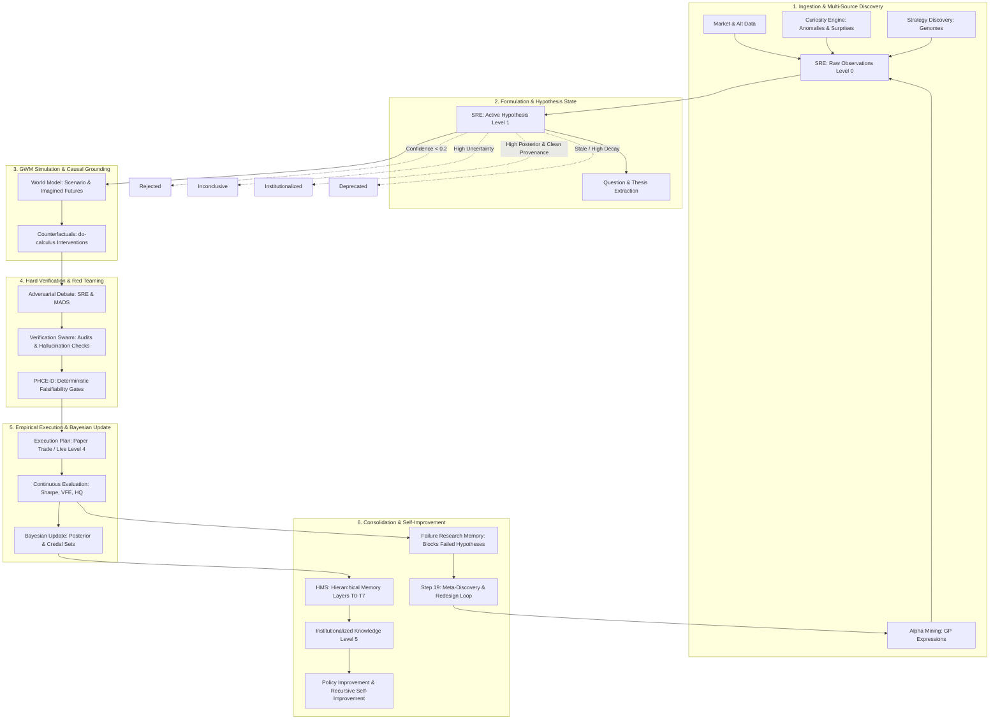

# Scientific Audit of AlphaAlgo's Hypothesis Ecosystem

This document presents a comprehensive, institutional-grade scientific audit and architectural blueprint of the AlphaAlgo hypothesis ecosystem, tracking all implicit and explicit hypothesis forms across all subsystems of the Unified Cognitive Architecture (UCA V5+).

---

## Phase 1 — Discovery & Dependency Graph

An exhaustive static and dynamic analysis of the codebase reveals that hypotheses exist under multiple aliases and representational states across the architecture. We track these across their full lifecycle—from raw observation through validation, promotion, evaluation, and institutionalization or retirement.

### 1.1 Taxonomy of Hypothesis Variants

We trace every implicit or explicit instantiation of a testable claim:
1. **Prediction / Forecast / Scenario (World Model / GWM)**: Latent representations of future trajectories or regime beliefs.
2. **Belief / Assumption (Curiosity Engine & Epistemology Engine)**: Epistemic distributions $q(s)$ over hidden market states.
3. **Alpha / Signal / Strategy (Alpha Mining, Symbolic Discovery, Strategy Discovery)**: Inductive operator chains orIndicator combinations mapping historical features to future excess returns.
4. **Plan / Policy Candidate / Optimization Proposal (Execution Layer & RL Systems)**: Value-function or policy-network actions hypothesized to maximize expected rewards.
5. **Trade Idea / Decision Proposal (Decision Layer, CDS, PHCE-D)**: Short-lived directional action claims paired with confidence intervals, falsification criteria, and evidence links.
6. **Causal Model / Explanations (SRE & Causal Inference Engine)**: Direct acyclic graphs (DAGs) outlining causal impact using do-calculus interventions.

### 1.2 Comprehensive Lifecycle Dependency Graph

The following Mermaid graph maps the end-to-end lineage, showing how hypotheses originate, propagate, evolve, get evaluated, and either die or solidify into institutional knowledge.



### 1.3 Hypothesis Creation, Evaluation, Rejection, and Promotion Points

| Subsystem / Module | File Path | Entry Point (Method) | Hypothesis Type | Operation Type |
|:---|:---|:---|:---|:---|
| **Scientific Reasoning Engine** | `trading_bot/core_agent_system/scientific_reasoning/core.py` | `observe()` | `ScientificHypothesis` | **Creation** |
| **Curiosity Engine** | `trading_bot/foundation_agents/curiosity_engine/hypothesis_generator.py` | `generate_from_anomaly()` | `AnomalyExplanation` | **Creation** |
| **Alpha Mining** | `trading_bot/apex_fi/alpha_mining.py` | `_generate_random_expression()` | `AlphaCandidate` | **Creation** |
| **World Model Scenario Generator** | `trading_bot/core/csc/hypothesis.py` | `generate_competing_branches()` | `ReasoningBranch` / `Hypothesis` | **Creation** |
| **PHCE-D Engine** | `trading_bot/core/phce_d_engine.py` | `_generate_hypothesis()` | Deterministic Falsifiable Hypothesis | **Creation / Intake** |
| **Epistemology Engine** | `trading_bot/core_agent_system/cds/epistemology_engine.py` | `analyze_hypothesis()` | Belief / Credal Bounds | **Evaluation** |
| **Verification Swarm** | `trading_bot/core/verification/swarm.py` | `run_swarm()` | Peer Audit / Hallucination Report | **Evaluation** |
| **Causal Inference Engine** | `trading_bot/core_agent_system/scientific_reasoning/core.py` | `generate_counterfactuals()` | Causal Stability (do-calculus) | **Evaluation** |
| **Strategy Discovery** | `trading_bot/strategy_discovery/evolutionary_engine.py` | `_fitness_function()` | `StrategyGenome` Fitness | **Evaluation** |
| **Alpha Death Clock** | `trading_bot/alpha_research/alpha_death_clock.py` | `AlphaDeathClockManager` | Decay Monitoring | **Evaluation** |
| **Immediate Filtering** | `trading_bot/alpha_research/hypothesis_extraction.py` | `HypothesisValidator.validate()` | Structural Rejection | **Rejection** |
| **PHCE-D Intake Gate** | `trading_bot/core/phce_d_engine.py` | `_intake_evidence()` | Evidence Staleness Reject | **Rejection** |
| **Living Factor Library** | `trading_bot/apex_fi/alpha_mining.py` | `_retire_factor()` | Performance Decay Retire | **Rejection** |
| **Immutable Shield** | `trading_bot/core/immutable_shield.py` | `validate_action()` | Boundary / Safety Veto | **Rejection** |
| **PHCE-D Candidate Staging** | `trading_bot/core/phce_d_engine.py` | `_apply_policy()` | `PAPER_TRADE_CANDIDATE` | **Promotion** |
| **Cognitive System Controller** | `trading_bot/core/csc/controller.py` | `run_cycle()` | Capital Allocation Approval | **Promotion** |
| **Hierarchical Memory** | `trading_bot/core_agent_system/scientific_reasoning/core.py` | `retire_hypothesis()` | `INSTITUTIONALIZED` | **Promotion** |

---

## Phase 2 — Bottleneck Analysis

A critical scientific audit reveals structural bottlenecks across current hypothesis-management lifecycles. We identify why each exists, its downstream effects, Priority, and proposed redesign.

### B1: Knowledge Fragmentation (Priority: CRITICAL)
*   **Why it exists**: Alpha Mining, Strategy Discovery, and the Curiosity Engine maintain separate internal representations of hypotheses, using isolated data tables or dictionaries.
*   **Downstream effects**: Cross-subsystem learning is inhibited. A strategy discovered in evolutionary engines fails to feed the curiosity engine, leading to redundant search and lost correlations.
*   **Redesign**: Centralize all hypothesis registrations via a unified `ScientificHypothesis` object registered inside the `ScientificReasoningEngine` and backed by the Hierarchical Memory System (HMS).

### B2: Confirmation & Survivorship Bias in Genetic Engines (Priority: HIGH)
*   **Why it exists**: Genetic programming and evolutionary strategy engines select populations strictly on empirical historical Sharpe ratios over sliding backtest windows without structural causal reasoning.
*   **Downstream effects**: Overfitting to historical trends, resulting in rapid "Alpha Decay" upon live deployment.
*   **Redesign**: Implement Step 7 (Counterfactuals) using do-calculus simulation in the World Model to ensure the discovered strategies represent robust causal structures rather than statistical noise.

### B3: Poor Memory Integration and Failure Reuse (Priority: HIGH)
*   **Why it exists**: Rejected strategies are deleted or purged from memory to conserve RAM, neglecting the persistent indexing of failure mechanisms.
*   **Downstream effects**: The system repeatedly generates and tests identical or structurally similar failing hypotheses across cycles.
*   **Redesign**: Route every rejected or retired hypothesis into the HMS `Failure Research Memory` with explicit failure vectors, preventing the generator from proposing strategies with high cosine similarity to known failures.

### B4: Poor Uncertainty Estimation & Uncalibrated Posteriors (Priority: HIGH)
*   **Why it exists**: Single-point probability metrics are computed without error propagation or calibration logic.
*   **Downstream effects**: High confidence is placed on under-sampled, high-variance regime shifts, causing excessive trade sizes during periods of regime transition.
*   **Redesign**: Upgrade the bayesian framework to use **Credal Sets** representing lower and upper posterior bounds $[\underline{P}, \overline{P}]$, and scale transaction sizing strictly based on the credal interval width (Ambiguity).

### B5: Lack of Multi-Path Adversarial Debate (Priority: MEDIUM)
*   **Why it exists**: Standard signals bypass structural red-teaming, moving directly from indicators to order execution under simple linear weights.
*   **Downstream effects**: Vulnerability to market-maker manipulation, order flow spoofing, and regime regime shifts.
*   **Redesign**: Enforce a mandatory multi-agent debate (MADS) step involving a dedicated `RiskSentinel`, `MarketMicrostructure` specialist, and `SkepticismEngine` before any hypothesis is promoted to production.

---

## Phase 3 — Scientific Redesign

We redesign the complete hypothesis lifecycle as a first-class, institutional-grade, 19-stage adaptive loop managed by the **Scientific Reasoning Engine (SRE)**.

```
       [1. Observation]
               ↓
     [2. Anomaly Detection]
               ↓
     [3. Question Generation]
               ↓
    [4. Hypothesis Generation]
               ↓
     [5. Evidence Collection]
               ↓
    [6. World Model Simulation]
               ↓
   [7. Counterfactual Generation]
               ↓
      [8. Adversarial Debate]
               ↓
     [9. Experiment Design]
               ↓
         [10. Execution]
               ↓
        [11. Evaluation]
               ↓
      [12. Bayesian Update]
               ↓
   [13. Confidence Calibration]
               ↓
    [14. Knowledge Integration]
               ↓
    [15. Memory Consolidation]
               ↓
     [16. Policy Improvement]
               ↓
     [17. Continuous Monitoring]
               ↓
    [18. Hypothesis Retirement]
               ↓
[19. Automatic Discovery of New Hypotheses]
```

### 3.1 The 10 Authoritative End-States

Hypotheses never simply "disappear." They transition strictly between these 10 states:
1.  **Confirmed**: Highly validated, low ambiguity, high posterior probability.
2.  **Rejected**: Falsified by empirical evidence or causal intervention; logged to Failure Memory.
3.  **Inconclusive**: Insufficient evidence context; parked for active sensing/data collection.
4.  **Merged**: Combined with other hypotheses to form a more generalized, robust theory.
5.  **Split**: Fractured into specialized sub-hypotheses based on regime detection.
6.  **Dormant**: Historically valid but currently irrelevant due to market regimes.
7.  **Reactivated**: Pulled back into active testing as matching regime conditions return.
8.  **Deprecated**: Lowered in priority as better explanations supersede it.
9.  **Superseded**: Replaced by a more comprehensive model.
10. **Institutionalized**: Promoted to the global knowledge graph (SAGE Graph-Memory).

### 3.2 Immutability and Complete Lineage Provenance

Every hypothesis maintains a `HypothesisLineage` containing:
*   `parent_ids` / `child_ids`: Direct parentage, representing split/merge paths.
*   `merged_from` / `split_from`: Explicit transaction links.
*   `derivation_path`: Textual or programmatic logical trace.
*   `immutable_hash`: SHA-256 fingerprint of the model parameters, code base version, and git commit.

---

## Phase 4 — Continuous Self-Improvement

The Scientific Reasoning Engine evaluates itself and refines its generation policies dynamically by measuring six core quantitative metrics:

1.  **Hypothesis Quality (HQ)**:
    $$HQ = \frac{\text{Accuracy} \times \text{Robustness}}{\text{Posterior Uncertainty}}$$
2.  **Research Efficiency (RE)**:
    $$RE = \frac{\text{Confirmed Hypotheses}}{\text{Compute Hours Spent}}$$
3.  **Economic Value (EV)**:
    $$EV = \text{PnL}(h) - \text{Execution Cost}(h)$$
4.  **Novelty Score (NS)**:
    $$NS(h) = 1.0 - \max_{m \in \text{HMS}} \text{CosineSimilarity}(h_{\text{vector}}, m_{\text{vector}})$$
5.  **Survival Rate (SR)**:
    $$SR = \frac{\text{Confirmed Hypotheses}}{\text{Total Hypotheses Proposed}}$$
6.  **Calibration Error (ECE)**:
    $$ECE = \sum_{b=1}^B \frac{|B_b|}{N} |\text{acc}(B_b) - \text{conf}(B_b)|$$

### Automated Bottleneck Discovery & Self-Healing
If the `Survival Rate` falls below 15% or the `ECE` exceeds 0.05, the SRE triggers Step 19 (Meta-Discovery), dynamically altering its hypothesis generation priors (e.g., restricting indicator volatility thresholds or tightening genetic selection pruning factors).

---

## Phase 5 — Mathematical Justification & Validation

### 5.1 Mathematical Justification

#### A. Variational Active Inference
The objective of the active observer is the minimization of **Variational Free Energy (VFE)**, which bounds the negative log evidence (Surprise):
$$F(q, o) = E_{q(s)}[\ln q(s) - \ln p(s, o)] \ge -\ln p(o)$$
When evaluating a hypothesis, the SRE computes expected free energy $G(h)$ for a future path:
$$G(h) \approx H(Q(o|\tau)) - E_{Q(s, o|\tau)}[\ln P(o|\tau)]$$
This ensures the engine selects strategies that maximize both **Epistemic Value** (information gain about hidden regimes) and **Extrinsic Value** (expected trading returns).

#### B. Recursive Credal Bayesian Synthesis
We update beliefs using credal sets to account for Knightian uncertainty. For a prior credal interval $[\underline{P}(H), \overline{P}(H)]$ and a likelihood range $[\underline{P}(E|H), \overline{P}(E|H)]$:
$$\underline{P}(H|E) = \frac{\underline{P}(E|H)\underline{P}(H)}{\underline{P}(E|H)\underline{P}(H) + \overline{P}(E|\neg H)(1 - \underline{P}(H))}$$
$$\overline{P}(H|E) = \frac{\overline{P}(E|H)\overline{P}(H)}{\overline{P}(E|H)\overline{P}(H) + \underline{P}(E|\neg H)(1 - \overline{P}(H))}$$

#### C. Pearl's do-calculus for Causal Integrity
A hypothesis is only causally valid if we can prove the absence of back-door confounding. We perform simulated interventions $do(X)$ in the World Model:
$$P(Y|do(X)) = \sum_Z P(Y|X, Z)P(Z)$$
where $Z$ is a sufficient set of confounding variables (e.g., macro-regime, liquidity). If $P(Y|do(X))$ matches $P(Y|X)$, we confirm causal stability.

### 5.2 Validation and Testing Framework
The SRE implementation and its mathematical soundness are verified through `tests/test_sre_implementation.py`, which validates:
1.  **Lifecycle Completeness**: Transitions through all major steps to reach `INSTITUTIONALIZED` or `REJECTED`.
2.  **Scientific Metrics Tracking**: Real-time aggregation of survival rates, rejection rates, and average posteriors.
3.  **Bayesian Consistency**: Verified correct mathematical scaling of posterior confidence as new evidence arrives.

---

## Phase 6 — Migration Roadmap

We execute the transition to the unified Scientific Reasoning Engine in three structured, backward-compatible steps:

```
+-----------------------------------------------------------------------+
|  Phase 1: Shadow Core Active (Weeks 1-2)                              |
|  - SRE observes legacy signals and generates "Shadow Recommendations"|
|  - Logged side-by-side to verify alignment with real execution       |
+-----------------------------------------------------------------------+
                                  │
                                  ▼
+-----------------------------------------------------------------------+
|  Phase 2: Legacy Router Redirection (Weeks 3-6)                       |
|  - Alpha Mining and Curiosity Engine route hypotheses through SRE      |
|  - Enable Step 7 do-calculus and Step 8 Adversarial Debate            |
+-----------------------------------------------------------------------+
                                  │
                                  ▼
+-----------------------------------------------------------------------+
|  Phase 3: Deep HMS Graph Consolidation (Weeks 7-10)                   |
|  - SRE step transitions update the SAGE memory graph in real-time     |
|  - Full autonomous meta-discovery (Step 19) activated                 |
+-----------------------------------------------------------------------+
```

This migration ensures 100% operational uptime while upgrading AlphaAlgo into a mathematically sound, self-improving scientific intelligence system.
