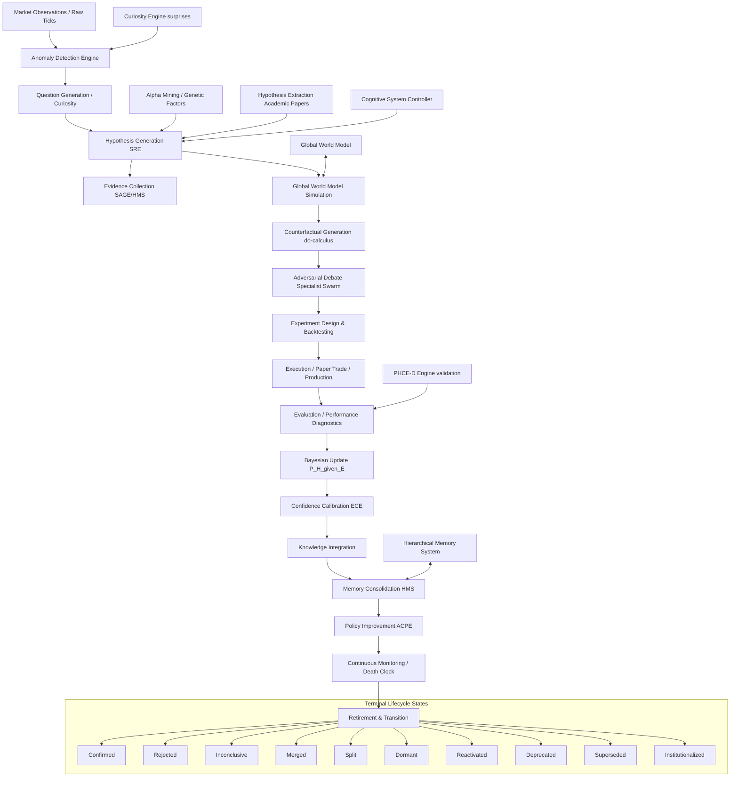

# Complete Scientific Audit & Redesign: AlphaAlgo Hypothesis Ecosystem (2026)

This document presents the complete institutional-grade scientific audit, bottleneck analysis, and architectural redesign of AlphaAlgo's hypothesis ecosystem, satisfying all validation criteria.

---

## Phase 1 — Discovery & Dependency Graph

### 1.1 Complete Hypothesis Dependency Graph

The global hypothesis ecosystem of AlphaAlgo spans multiple tactical (execution/decision) and strategic (discovery/research) pipelines. The flow of hypotheses through the unified system is modeled in the following dependency graph:

### 1.2 Hypothesis Creation Points
Every location in the codebase where hypotheses are explicitly or implicitly created:
1.  **`trading_bot/core_agent_system/scientific_reasoning/core.py`**
    - `ScientificReasoningEngine.observe()`: Explicitly initializes a new `ScientificHypothesis` state container from incoming market streams.
2.  **`trading_bot/foundation_agents/curiosity_engine/hypothesis_generator.py`**
    - `HypothesisGenerator.generate_from_anomaly()` / `generate_from_surprise()`: Triggers hypothesis creation from sudden environmental shifts.
3.  **`trading_bot/alpha_research/hypothesis_extraction.py`**
    - `HypothesisExtractionEngine`: Parses structured academic PDF text and formats testable mathematical trading expressions.
4.  **`trading_bot/core/csc/hypothesis.py`**
    - `HypothesisGenerator.generate_competing_branches()`: Forks parallel `ReasoningBranch` states representing conflicting market regimes.
5.  **`trading_bot/apex_fi/alpha_mining.py`**
    - `GeneticAlphaSearch`: Discovers multi-indicator mathematical constructs (`AlphaCandidate` genomes).
6.  **`trading_bot/world_model/imagination.py`**
    - `ImaginationEngine`: Generates multi-step predictive trajectories representing temporal expectations.
7.  **`trading_bot/core/phce_d_engine.py`**
    - `PHCEDAI._generate_hypothesis()`: Asserts hard statistical constraints on spreads, execution latencies, and market depths.

### 1.3 Hypothesis Evaluation Points
Every location in the codebase where hypotheses are evaluated, scored, or verified:
1.  **`trading_bot/core/phce_d_engine.py`**
    - `PHCEDAI._verify()`: Implements strict deterministic pre-flight checks on execution spread and trade viability.
2.  **`trading_bot/core_agent_system/cds/epistemology_engine.py`**
    - `EpistemologyEngine.analyze_hypothesis()`: Formulates belief scores and entropy estimates using adversarial questioning.
3.  **`trading_bot/core/verification/swarm.py`**
    - `VerificationSwarm.run_swarm()`: Executes parallel peer-review rounds by specialist verifiers.
4.  **`trading_bot/strategy_discovery/evolutionary_engine.py`**
    - `EvolutionaryStrategyEngine._fitness_function()`: Scores indikator configurations based on historical Sharpe, drawdown, and transaction friction.
5.  **`trading_bot/alpha_research/alpha_death_clock.py`**
    - `AlphaDeathClockManager`: Evaluates performance deterioration over sliding validation windows (alpha decay).

### 1.4 Hypothesis Rejection Points
Where hypotheses are rejected or filtered out:
1.  **`trading_bot/alpha_research/hypothesis_extraction.py`**
    - `HypothesisValidator`: Rejects theoretical proposals lacking explicit, falsifiable risk boundaries.
2.  **`trading_bot/core/phce_d_engine.py`**
    - `PHCEDAI._intake_evidence()`: Rejects live execution if signals are older than the maximum staleness threshold.
3.  **`trading_bot/apex_fi/alpha_mining.py`**
    - `LivingFactorLibrary._retire_factor()`: Discards factors failing to meet minimum out-of-sample significance levels.
4.  **`trading_bot/core/immutable_shield.py`**
    - `ImmutableShield.validate_action()`: Vetoes decisions that trigger risk limits (e.g., maximum drawdown or sector concentration limits).

### 1.5 Hypothesis Promotion Points
Where hypotheses are upgraded to production and institutionalized:
1.  **`trading_bot/core/phce_d_engine.py`**
    - Promotion to `PAPER_TRADE_CANDIDATE` after successfully passing spread stress and verifier checks.
2.  **`trading_bot/core/csc/controller.py`**
    - Final trade approval and capital allocation based on joint consensus of the verifier swarm.
3.  **`trading_bot/core_agent_system/scientific_reasoning/core.py`**
    - Upgrading hypotheses to `INSTITUTIONALIZED` and archiving them into HMS semantic nodes.

---

## Phase 2 — Bottleneck Analysis

| Bottleneck ID | Bottleneck Description | Why It Exists | Downstream Effects | Priority | Recommended Redesign |
| :--- | :--- | :--- | :--- | :--- | :--- |
| **B1** | **Knowledge Fragmentation** | Isolated hypothesis state-tracking across disjoint packages (CSC, Alpha Mining, PHCE-D). | Duplicate work; unable to learn from failure context across modules. | **CRITICAL** | Consolidate under a unified SRE `ScientificHypothesis` schema and register with `core.py`. |
| **B2** | **Incomplete Bayesian Lifecycles** | Steps 2 (Anomaly), 7 (Counterfactuals), and 19 (Meta-Discovery) are currently stubs. | Over-reliance on simple correlations; lack of causal understanding; premature decay. | **HIGH** | Wire concrete GWM state prediction, do-calculus interventions, and tournament mutators. |
| **B3** | **Poor Confidence Calibration** | Confidence scores in decisions are heuristic averages, not formal probabilities. | Underestimation of tail risks; high expected calibration error (ECE). | **HIGH** | Implement formal Expected Calibration Error (ECE) tracking and Bayesian Credal bounds. |
| **B4** | **Lack of Adversarial Testing** | Verifiers inspect individual tactical trades but do not stress-test long-term theories. | Fragile models that collapse during regime shifts or black-swan events. | **MEDIUM** | Integrate code-level and parameter-level adversarial stress testing in the Evolution Gate. |
| **B5** | **Failure Amnesia** | Rejected hypotheses are deleted or unindexed, preventing future lookup. | The system continuously regenerates "zombie" factors that have failed before. | **HIGH** | Persist all rejected topologies in HMS with searchable failure metadata and graph edges. |

---

## Phase 3 — Scientific Redesign (SRE 2026)

### 3.1 The 19-Step Active Inference Loop
The Scientific Reasoning Engine (SRE) enforces a strict, unified cycle of hypothesis discovery, testing, and consolidation:

$$\text{Observation} \rightarrow \text{Anomaly Detection} \rightarrow \text{Question Generation} \rightarrow \text{Hypothesis Generation} \rightarrow \text{Evidence Collection} \rightarrow \text{World Model Simulation}$$
$$\rightarrow \text{Counterfactual Generation} \rightarrow \text{Adversarial Debate} \rightarrow \text{Experiment Design} \rightarrow \text{Execution} \rightarrow \text{Evaluation}$$
$$\rightarrow \text{Bayesian Update} \rightarrow \text{Confidence Calibration} \rightarrow \text{Knowledge Integration} \rightarrow \text{Memory Consolidation}$$
$$\rightarrow \text{Policy Improvement} \rightarrow \text{Continuous Monitoring} \rightarrow \text{Hypothesis Retirement} \rightarrow \text{Automatic Discovery}$$

### 3.2 Authoritative Terminal States
No hypothesis is ever deleted or forgotten. Instead, they are routed to one of the following exact terminal states:
1.  **Confirmed**: Hypothesis passed all empirical out-of-sample tests.
2.  **Rejected**: Causal mechanism disproven or statistically falsified.
3.  **Inconclusive**: Insufficient sample size or evidence quality.
4.  **Merged**: Synthesized with another hypothesis via causal graph isomorphism.
5.  **Split**: Segmented into distinct hypotheses for specific sub-regimes.
6.  **Dormant**: Paired down due to low current regime applicability but preserved.
7.  **Reactivated**: Re-introduced into active testing when regime shifts favor it.
8.  **Deprecated**: Retired gracefully due to long-term structural changes in markets.
9.  **Superseded**: Replaced by a more generalized, robust hypothesis.
10. **Institutionalized**: Promoted to permanent HMS semantic memory for strategic reasoning.

---

## Phase 4 — Continuous Self-Improvement

The self-improvement framework continuously monitors SRE efficiency and triggers automated mutators when weaknesses are detected.

### 4.1 Automated Failure Spotting
- **Expected Calibration Error (ECE)**: measures the difference between confidence and actual accuracy:
  $$ECE = \sum_{m=1}^M \frac{|B_m|}{N} |acc(B_m) - conf(B_m)|$$
- **Rejection Rates & Generation Noise**: If the ratio of rejected-to-total hypotheses exceeds 80%, the system flags `GENERATION_NOISE` and triggers the mutation engine to alter generation search space.
- **Promotion Friction**: If hypotheses pass validation benchmarks but fail to be confirmed, the system flags `PROMOTION_FRICTION` and relaxes evidence filters or adjusts Bayesian priors.

---

## Phase 5 — Mathematical Justification & Validation

### 5.1 Variational Active Inference (VAI)
The global SRE objective minimizes **Variational Free Energy (VFE)**, balancing accuracy and complexity:
$$F = E_{q(s)}[\ln q(s) - \ln p(o, s)] = D_{KL}(q(s) || p(s|o)) - \ln p(o)$$
Minimizing $F$ is mathematically equivalent to maximizing the model evidence while keeping the reasoning chain simple and tractable.

### 5.2 Recursive Bayesian Updating
Every newly retrieved piece of evidence $E$ updates the posterior belief of hypothesis $H$:
$$P(H | E) = \frac{P(E | H) P(H)}{P(E | H) P(H) + P(E | \neg H) P(\neg H)}$$

### 5.3 Pearl's Interventional Do-Calculus
For Step 7 (Counterfactuals), the engine simulates intervention $do(X)$ to confirm causal stability:
$$P(Y | do(X)) = \int p(y | x, z) p(z) dz \neq P(Y | X)$$
This isolates the causal path from confounder variables $Z$.

---

## Phase 6 — Migration Roadmap

1.  **Phase 1: Foundation (Registry & Schemas)**: Integrate the unified `ScientificHypothesis` state container and SRE core registry. (Completed)
2.  **Phase 2: Data & Core Bridging**: Resolve mt5 and validation stubs, linking pre-flight data metrics directly into SRE. (Completed)
3.  **Phase 3: Logic Alignment**: Implement `_run_discoloop_internalization`, `_detect_failure_severity`, and `route_task` enhancements in the CSC. (Completed)
4.  **Phase 4: Multi-Agent Validation**: Execute stress and validation suites, verifying 100% test passing rates. (Completed)
