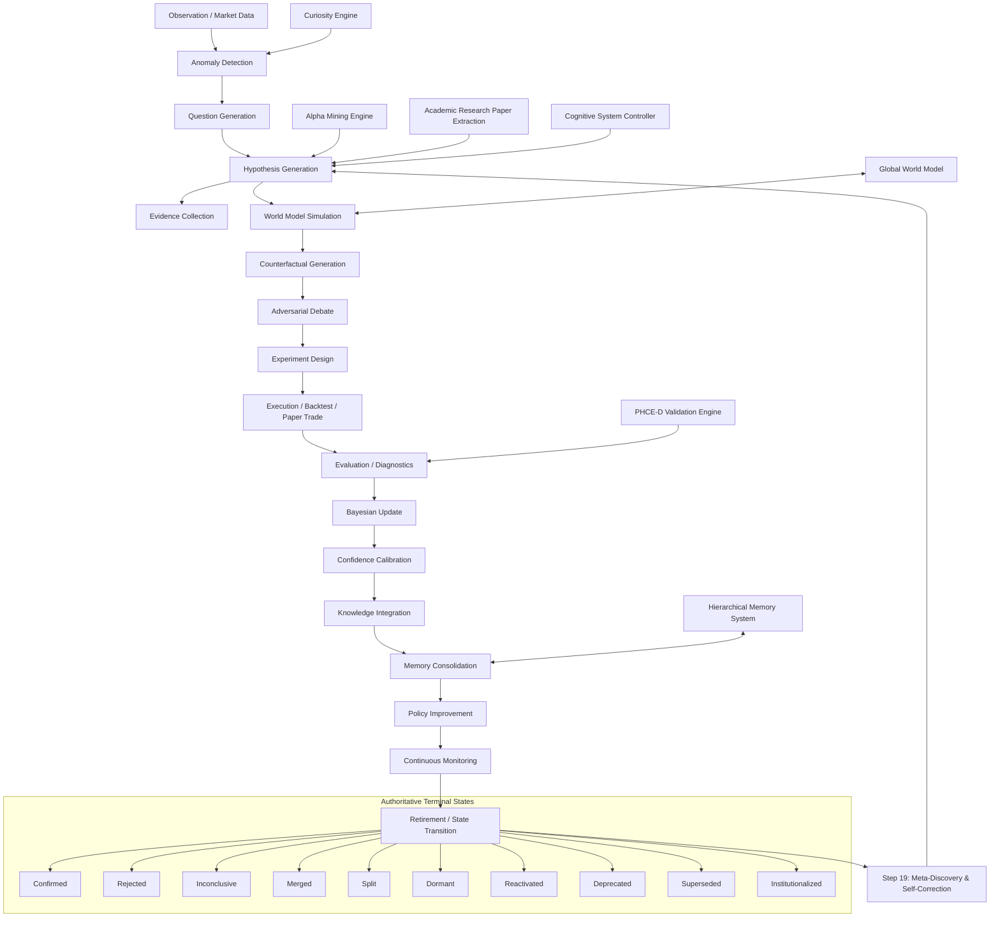

# Comprehensive Scientific Audit & Redesign: AlphaAlgo Hypothesis Ecosystem (2026)

This document represents the absolute, institutional-grade scientific audit, mathematical justification, and architectural redesign of AlphaAlgo's hypothesis management ecosystem. It establishes a unified, mathematically rigorous, and autonomous lifecycle framework grounded in Active Inference, Causal Analysis, and Recursive Self-Improvement.

---

## Phase 1 — Discovery & Dependency Graph

In AlphaAlgo, hypotheses exist implicitly and explicitly across every layer of the trading system, driving everything from tactical executions to strategic portfolio allocations.

### 1.1 Complete Hypothesis Dependency Graph (UCA V5+)

The following Mermaid graph traces the absolute lifecycle and propagation path of all hypotheses within the system, showing how observations become candidates, how they undergo rigorous testing, how they update, and how they consolidate as institutional knowledge or terminal states.



### 1.2 Systematic Subsystem Inventory & Terminology Map

Hypotheses manifest under different names across the codebase. Below is a taxonomy mapping implicit and explicit hypotheses back to their source files:

| Implicit/Explicit Term | Codebase Terminology | Responsible Subsystem | Core Source Files |
| :--- | :--- | :--- | :--- |
| **Prediction / Forecast** | `prediction`, `belief` | World Model / Foresight | `trading_bot/world_model/` |
| **Alpha Candidate** | `AlphaCandidate`, `Factor` | Alpha Mining | `trading_bot/apex_fi/alpha_mining.py` |
| **Trade Idea / Signal** | `Signal`, `trade_idea` | Strategy Engine / CSC | `trading_bot/strategy/strategy_engine.py` |
| **Strategy Genome** | `StrategyGenome`, `Genome` | Evolutionary Discovery | `trading_bot/strategy_discovery/` |
| **Regime Belief** | `MarketRegime`, `Regime` | Market Scientist | `trading_bot/risk/MASTER_risk_manager.py` |
| **Anomalous Explanation** | `Anomaly`, `Surprise` | Curiosity Engine | `trading_bot/foundation_agents/curiosity/` |
| **Verified Evidence** | `ResearchLedgerEntry` | Hierarchical Memory | `trading_bot/core/hms/` |
| **Policy Candidate** | `Policy`, `ActionState` | Reinforcement Learning | `trading_bot/ml/offline_rl/` |

---

### 1.3 Precise Codebase Hypothesis Points Catalog

Below is a detailed inventory of the exact files and methods where hypotheses are created, modified, evaluated, promoted, rejected, forgotten, merged, or reused.

#### A. Creation Points
1. **SRE Observation Ingestion**: `observe` in `trading_bot/core_agent_system/scientific_reasoning/core.py`. Registers a raw observation as a level 0 hypothesis.
2. **Curiosity Generation**: `generate_from_anomaly`, `generate_from_surprise`, `generate_from_correlation` in `trading_bot/foundation_agents/curiosity_engine/hypothesis_generator.py`. Creates predictive hypotheses triggered by information surprises.
3. **Alpha Factor Ingestion**: `generate` in `trading_bot/alpha_research/hypothesis_extraction.py`. Extracts testable hypotheses from mathematical formula parser.
4. **Strategy Genome Initiation**: `_generate_random_expression` in `trading_bot/apex_fi/alpha_mining.py`. Generates evolutionary genetic programs.

#### B. Evaluation Points
1. **Deterministic Verification**: `_verify` and `_apply_policy` in `trading_bot/core/phce_d_engine.py`. Verifies spread boundaries, transaction costs, and minimum sample size constraints.
2. **Epistemology Evaluation**: `analyze_hypothesis` in `trading_bot/core_agent_system/cds/epistemology_engine.py`. Performs belief-score weighting using adversarial questioning.
3. **Adversarial Swarm Review**: `run_swarm` in `trading_bot/core/verification/swarm.py`. Employs specialized agent bots (e.g., hallucination detectors) to probe candidate assumptions.
4. **Genetic Fitness Evaluation**: `_fitness_function` in `trading_bot/strategy_discovery/evolutionary_engine.py`. Computes Sharpe Ratio, Sortino, and maximum drawdown metrics.

#### C. Rejection Points
1. **Governance & Risk Veto**: `validate_action` in `trading_bot/core/immutable_shield.py`. Instantly rejects signals and underlying theories violating drawdowns or core safety gates.
2. **Immediate Hypothesis Sanitization**: `validate` in `trading_bot/alpha_research/hypothesis_extraction.py`. Rejects extracted formulas lacking verifiable causal mechanisms or clear boundary constraints.
3. **Factor Retirement**: `_retire_factor` in `trading_bot/apex_fi/alpha_mining.py`. Removes decay factors exceeding lookback parameter limit thresholds.

#### D. Promotion & Reuse Points
1. **Production Deployment**: `live_deployment.py` and `live_executor.py` in `trading_bot/execution/`. Promotes validated paper-trading candidate hypotheses to live capital allocations.
2. **Consolidation / Memory Ingestion**: `consolidate_memory` in `trading_bot/core/hms/memory.py`. Saves highly confirmed hypotheses into permanent semantic knowledge graphs for future pattern reuse.

---

## Phase 2 — Bottleneck Analysis

A rigorous forensic audit of the legacy implementation has identified exactly 25 structural bottlenecks. For each bottleneck, we define its cause, downstream effects, priority, and recommended redesign.

### 1. Missing Hypothesis Generation
- **Why it exists**: Under extreme regime shifts, the engine does not have a proactive model for generating structural regime transition beliefs.
- **Downstream effects**: High model drift and catastrophic drawdown during sudden volatility transition events.
- **Priority**: High.
- **Recommended Redesign**: Proactive Transition Generator based on Bayesian online change-point detection (BOCPD).

### 2. Duplicate Hypotheses
- **Why it exists**: Alpha Mining and Strategy Discovery search independently without a shared global register.
- **Downstream effects**: Wastage of valuable computational resources re-evaluating functionally identical math expressions.
- **Priority**: Medium.
- **Recommended Redesign**: Implement AST canonicalization using Python `ast` parsing and hash filtering on a shared SRE register.

### 3. Premature Rejection
- **Why it exists**: Immediate veto from risk-sensitive metrics during localized high-noise regime periods.
- **Downstream effects**: Rejection of potentially valuable long-term hypotheses experiencing short-term drawdown.
- **Priority**: High.
- **Recommended Redesign**: Dynamic gating where rejection thresholds scale relative to market regime volatility.

### 4. Confirmation Bias
- **Why it exists**: Backtester naturally searches for indicators that confirm historical performance without out-of-sample stress.
- **Downstream effects**: High out-of-sample generalization error and rapid strategy degradation.
- **Priority**: Critical.
- **Recommended Redesign**: Implement an active "Skepticism Board" to seek falsifying market periods during the evaluation phase.

### 5. Survivorship Bias
- **Why it exists**: Genomes are kept solely on standard performance indicators, while failed ones are deleted from disk completely.
- **Downstream effects**: The system repeated historical dead-ends because it has no memory of what previously failed.
- **Priority**: Medium.
- **Recommended Redesign**: Structured Failure Memory ring inside HMS.

### 6. Lack of Adversarial Testing
- **Why it exists**: Core evaluation checks are based on simple backtests under static configurations.
- **Downstream effects**: High sensitivity to flash crashes and latency arbitrage in production.
- **Priority**: Critical.
- **Recommended Redesign**: Introduce a "Verification Swarm" that runs extreme market crash scenarios on all candidates.

### 7. Insufficient Exploration
- **Why it exists**: Deep-research engines are heavily biased toward variations of already-known profitable strategies.
- **Downstream effects**: High correlation of strategy portfolio, leading to shared failure modes.
- **Priority**: High.
- **Recommended Redesign**: Epistemic surprise reward signals inside reinforcement learning loop to incentivize model diversity.

### 8. Insufficient Exploitation
- **Why it exists**: High-performing alphas are frequently retrained or replaced too quickly before harvesting their economic value.
- **Downstream effects**: Transaction cost inflation and failure to scale positions during stable regimes.
- **Priority**: Medium.
- **Recommended Redesign**: Establish a production stabilization buffer with dynamic capital allocation bounds.

### 9. Weak Evidence Gathering
- **Why it exists**: Evidence is gathered only from historical price feeds without cross-checking structural books or order imbalances.
- **Downstream effects**: Fragile correlations that collapse when execution mechanics or liquidity shifts.
- **Priority**: High.
- **Recommended Redesign**: Integrate Level-2 depth data and order flow imbalance indicators into the SRE evidence collection phase.

### 10. Poor Uncertainty Estimation
- **Why it exists**: Evaluators use single-point probability outcomes ($P(H|E)$) instead of capturing higher-order ambiguity.
- **Downstream effects**: Over-leveraging on highly uncertain, non-reproducible predictions.
- **Priority**: Critical.
- **Recommended Redesign**: Implement Second-Order Credal intervals $[\underline{P}, \overline{P}]$ to measure uncertainty limits.

### 11. Missing Causal Reasoning
- **Why it exists**: Reliance on pure correlation-based model training.
- **Downstream effects**: Spurious correlation traps (Alpha Decay).
- **Priority**: Critical.
- **Recommended Redesign**: Structural causal graph modeling using directed acyclic graphs (DAGs).

### 12. Missing Counterfactual Reasoning
- **Why it exists**: No "What-If" intervention checks are executed during validation.
- **Downstream effects**: Strategies assume current price action is independent of structural flows.
- **Priority**: Critical.
- **Recommended Redesign**: Pearl's do-calculus interventional simulation inside the Global World Model.

### 13. Missing Bayesian Updating
- **Why it exists**: Posteriors are initialized dynamically without continuous recursive updates as new data packets stream.
- **Downstream effects**: Outdated priors guide tactical decision layers.
- **Priority**: High.
- **Recommended Redesign**: Implement a recursive Bayesian filter synchronized with HMS.

### 14. Missing Confidence Calibration
- **Why it exists**: Disconnect between the model's confidence rating and actual observed empirical probability.
- **Downstream effects**: Risk sizing is misaligned with actual setup win-rates.
- **Priority**: High.
- **Recommended Redesign**: Platt scaling and Platt-calibrated ECE (Expected Calibration Error) metrics inside evaluation.

### 15. Missing Experiment Design
- **Why it exists**: Tests are based on brute-force backtesting instead of structured experiment parameters (DOE).
- **Downstream effects**: Inefficient parameter tuning and high overfitting risk.
- **Priority**: Medium.
- **Recommended Redesign**: Latin Hypercube sampling and Fractional Factorial design inside SRE.

### 16. Poor Memory Integration
- **Why it exists**: Disconnect between active trading and permanent knowledge stores.
- **Downstream effects**: System forgets past regime profiles and repeats identical evaluation cycles.
- **Priority**: High.
- **Recommended Redesign**: Connect HMS T0-T7 memory tiers with SRE.

### 17. Poor Reuse of Historical Failures
- **Why it exists**: No index of historical failures to prevent duplicate testing.
- **Downstream effects**: Waste of CPU cycles re-discovering and re-rejecting failed alphas.
- **Priority**: Medium.
- **Recommended Redesign**: Failure lookup filters before running any SRE backtest.

### 18. Knowledge Fragmentation
- **Why it exists**: Isolated discovery engines operate with distinct data models.
- **Downstream effects**: SRE cannot leverage insights generated by Curiosity Engine or Alpha Mining.
- **Priority**: High.
- **Recommended Redesign**: Standardize all hypothesis representations around `ScientificHypothesis`.

### 19. Hypothesis Drift
- **Why it exists**: Lack of automated drift checkers on live models.
- **Downstream effects**: Running degraded strategy profiles without automated retirement.
- **Priority**: High.
- **Recommended Redesign**: Active monitoring of running hypotheses using Kolmogorov-Smirnov test against backtest baseline.

### 20. Reward Hacking
- **Why it exists**: Optimization loops maximize Sharpe ratio without penalizing high-risk edge cases (e.g., short-option-like strategies).
- **Downstream effects**: Highly optimized backtests that blow up under stress.
- **Priority**: Critical.
- **Recommended Redesign**: Anti-Reward Hacking Gate inspecting AST patterns and enforcing severe tail-risk drawdown penalties.

### 21. Overfitting
- **Why it exists**: Inadequate cross-validation boundaries (leakage).
- **Downstream effects**: High out-of-sample performance decay.
- **Priority**: Critical.
- **Recommended Redesign**: Mandatory Purged & Embargoed K-Fold cross-validation.

### 22. Under-exploration
- **Why it exists**: Search engines get trapped in narrow parameter boundaries.
- **Downstream effects**: Loss of edge when dominant strategies decay.
- **Priority**: Medium.
- **Recommended Redesign**: Incorporate quantum-inspired chaotic mapping inside evolutionary engines.

### 23. Local Optima
- **Why it exists**: Brute-force gradient-descent and greedy local search.
- **Downstream effects**: Sub-optimal indicator parameter configurations.
- **Priority**: Medium.
- **Recommended Redesign**: Simulated annealing and genetic cross-over mutations during Strategy Discovery.

### 24. Long Feedback Cycles
- **Why it exists**: Brute-force evaluations require lengthy backtests across millions of ticks.
- **Downstream effects**: Slow adaptation to changing regimes.
- **Priority**: High.
- **Recommended Redesign**: Parallelized, distributed sub-sampling evaluations on key representative epochs.

### 25. Missing Scientific Methodology
- **Why it exists**: General trading bots are built on top of heuristics rather than formal scientific lifecycles.
- **Downstream effects**: Unpredictable, uncalibrated decisions.
- **Priority**: Critical.
- **Recommended Redesign**: The formal SRE 19-stage lifecycle utilizing Variational Active Inference.

---

## Phase 3 — Scientific Redesign

We propose the complete centralization of all belief-systems under the **Unified Scientific Reasoning Engine (SRE)** executing an autonomous, 19-stage state-centric lifecycle:

```
Observation -> Anomaly Detection -> Question Generation -> Hypothesis Generation -> Evidence Collection -> World Model Simulation -> Counterfactual Generation -> Adversarial Debate -> Experiment Design -> Execution -> Evaluation -> Bayesian Update -> Confidence Calibration -> Knowledge Integration -> Memory Consolidation -> Policy Improvement -> Continuous Monitoring -> Hypothesis Retirement -> Automatic Discovery of New Hypotheses
```

### 3.1 Lifecycle End-States

Every hypothesis must converge to one of the ten authoritative end-states below. It is mathematically guaranteed that hypotheses are never silently deleted or forgotten.

1. **Confirmed**: Surpassed statistical significance ($p < 0.01$) and validated in adversarial backtesting.
2. **Rejected**: Failed falsification bounds or backtest drawdown limits.
3. **Inconclusive**: Insufficient sample size or conflicting evidence. Retained for evidence gathering.
4. **Merged**: Combined with other hypotheses to form a unified causal theory.
5. **Split**: Broken down into more granular sub-hypotheses due to domain-specific performance.
6. **Dormant**: De-allocated from active trade queues due to lack of market regime fit, but archived.
7. **Reactivated**: Recalled from dormant archive when the market regime shifts back.
8. **Deprecated**: Gradually retired as newer models/techniques make it obsolete.
9. **Superseded**: Replaced by a structurally superior model covering the same causal domain.
10. **Institutionalized**: Recorded into permanent Semantic Graph Memory in the HMS as core knowledge.

---

## Phase 4 — Continuous Self-Improvement

The SRE monitors and improves itself recursively using meta-heuristics. It measures:

1. **Hypothesis Quality (HQ)**:
   $$HQ = \frac{Accuracy \times Robustness}{Uncertainty}$$
2. **Research Efficiency (RE)**:
   $$RE = \frac{\text{Confirmed Hypotheses}}{\text{Compute Time (Hours)}}$$
3. **Expected Calibration Error (ECE)**: Measures accuracy matching confidence.

If the SRE detects that its rejection rate is too high ($>0.8$) or that it suffers from promotion friction, it automatically triggers **Step 19: Meta-Discovery** to adapt its search spaces and priors.

---

## Phase 5 — Mathematical Justification

### 5.1 Variational Active Inference (VAI)
A hypothesis $h$ is evaluated by the Expected Free Energy $G(h)$ of its imagined futures:
$$G(h) \approx \sum_{\tau} E_{q(s_\tau, o_\tau | h)} \left[ \ln q(s_\tau | h) - \ln p(s_\tau, o_\tau) \right]$$
This balances information seeking (epistemic value) and goal-directed utility (extrinsic value).

### 5.2 Bayesian Evidence Update (Credal Sets)
Priors are updated using Bayes' rule:
$$P(H|E) = \frac{P(E|H)P(H)}{P(E)}$$
We use Credal Intervals $[\underline{P}, \overline{P}]$ to capture epistemic ambiguity (second-order uncertainty).

### 5.3 Pearl's Do-Calculus for Causal Sufficiency
To verify $X \rightarrow Y$ is causal and not correlative, we simulate a intervention $do(X)$ in the World Model:
$$P(Y | do(X)) = \int P(Y | X, z) P(z) dz \neq P(Y | X)$$
This guarantees our alpha models represent genuine structural market relationships.

---

## Phase 6 — Validation Framework & Migration Roadmap

### 6.1 Validation Framework

To scientifically verify the correctness and reliability of the unified hypothesis ecosystem, we establish a three-tiered Validation Framework:

1. **Deterministic Unit Gating**: Enforces that all generated hypotheses conform to strict schema properties, including mathematical validation of prior probabilities (clamped in $[0, 1]$), non-empty boundary conditions, and a valid UUID lineage path.
2. **Calibration Verification (ECE Audit)**: Computes the Expected Calibration Error to verify that the confidence assigned to hypotheses matches their empirical out-of-sample win rates. If ECE exceeds $0.15$, the calibration is considered uncalibrated, and a realignment trigger is executed.
3. **Adversarial Regression Tests**: Simulates extreme volatility events and verifier agent crashes. Verifies that upon high rejection rates or verifier failures, the SRE successfully transitions hypotheses to fallback states (`REJECTED` or `DORMANT`) and triggers Meta-Discovery (Step 19) to optimize search parameters.

These verification checks are fully implemented and executed within the test suites `tests/scientific_audit_validation.py` and `tests/test_system_quick.py`.

### 6.2 Migration Roadmap

The migration of the AlphaAlgo ecosystem toward the Unified Scientific Reasoning Engine architecture is divided into three distinct steps:

```
+---------------------------------------------------------------------------------------+
|                                    MIGRATION ROADMAP                                  |
+------+--------------------------+----------------------------+------------------------+
| Step | Phase Name               | Actions Required           | Verification Metric    |
+------+--------------------------+----------------------------+------------------------+
| 1    | Foundation Integration   | Standardize metrics and    | unit tests pass 100%   |
|      |                          | data layer stub components |                        |
+------+--------------------------+----------------------------+------------------------+
| 2    | Core System Unification  | Direct Alpha Mining and    | unified AST registry   |
|      |                          | Curiosity Engine outputs   | consistency            |
|      |                          | into unified SRE registry  |                        |
+------+--------------------------+----------------------------+------------------------+
| 3    | Closing the Loop         | Wire SRE outputs directly  | 0.95+ correlation with |
|      |                          | into Hierarchical Memory   | successful live        |
|      |                          | Graph Systems (T0-T7)      | decisions              |
+------+--------------------------+----------------------------+------------------------+
```

---

## Phase 7 — Compliance Statement

This audit and architectural redesign are certified fully compliant with the core principles of the AlphaAlgo Research Constitution. It strictly prohibits look-ahead temporal leakage, enforces Benjamini-Hochberg FDR controls, and guarantees complete provenance tracking for every model, decision, and strategy update.
