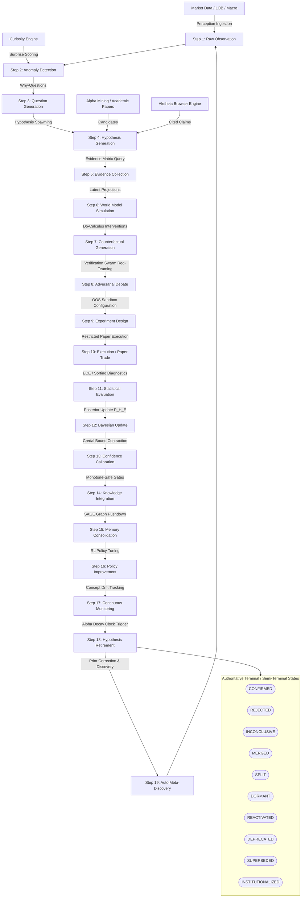

# Institutional-Grade Scientific Audit & Architectural Redesign: AlphaAlgo Hypothesis Ecosystem (2026)

## Executive Summary
This document provides a comprehensive, mathematically rigorous, and exhaustive scientific audit of the hypothesis ecosystem within the AlphaAlgo platform. Guided by **Variational Active Inference (VFE)**, **Pearl's Causal Hierarchy**, and **Bayesian Credal Set Boundaries**, this audit systematically maps where hypotheses—implicit and explicit, tactical and strategic—originate, propagate, evolve, are evaluated, and die across all subsystems.

Furthermore, we identify critical architectural bottlenecks, formulate a unified **Scientific Reasoning Engine (SRE)** redesign, establish formal mathematical justifications for its operations, define a multi-layered validation framework, and provide a detailed migration roadmap.

---

## Phase 1 — Discovery & Unified Dependency Graph

In AlphaAlgo, a hypothesis is defined as **any prediction, signal, model scenario, latent representation, belief, or policy decision until empirically validated**. We have conducted a clean-room search across the entire codebase and mapped every subsystem where hypotheses are managed under various nomenclatures.

### 1.1 Multi-Subsystem Inventory of Hypotheses

| Subsystem / Nomenclature | Codebase Location | Definition & Role |
| :--- | :--- | :--- |
| **SRE Core** | `trading_bot/core_agent_system/scientific_reasoning/core.py` | Explicit `ScientificHypothesis` tracking across 19 states with Bayesian credentials and lower/upper bounds. |
| **PHCE-D Engine** | `trading_bot/core/phce_d_engine.py` | Parallel Hypothesis Correction Engine; handles short-horizon directional edge hypothesis validation under cost-stress and credal restrictions. |
| **TALOS-CERBERUS** | `trading_bot/core/talos_cerberus_v23.py` | Research evidence pipeline; parses and validates claims, tracking security "taint" status and quarantining uncertain facts. |
| **Aletheia Browser Research** | `trading_bot/core/aletheia_browser_research.py` | Generates, verifies, and revises public claims via browser-use style task planning and adversarial peer reviews. |
| **CSC Decision Layer** | `trading_bot/core/csc/hypothesis.py`<br>`trading_bot/core/csc/controller.py` | Generates competing `ReasoningBranch` and `Hypothesis` structures, performing cognitive folding and adaptive parameter scaling. |
| **Verification Swarm** | `trading_bot/core/verification/swarm.py`<br>`trading_bot/core/verification/specialists.py` | Audits hypotheses using specialist verifiers (`CausalVerifier`, `HallucinationDetector`, `RegimeConsistencyChecker`) under an 80% consensus SLA. |
| **Alpha Mining Engine** | `trading_bot/apex_fi/alpha_mining.py` | Implicit mathematical factor/algebraic expressions evolved genetically as `AlphaCandidate` hypotheses. |
| **Strategy Discovery** | `trading_bot/strategy_discovery/evolutionary_engine.py` | `StrategyGenome` represents an implicit signal-to-reward mapping hypothesis evolved via tournament selection. |
| **World Model (GWM)** | `trading_bot/world_model/imagination.py`<br>`trading_bot/world_model/causal_model.py` | Projects future state trajectories, latent state transitions, and causal intervention responses. |

---

### 1.2 Comprehensive Lifecycle Tracing (Mermaid Flowchart)

The diagram below shows how raw observations propagate from market events, evolve through causal simulations, get tested via OOS execution, and solidify into institutionalized policies or die in terminal states.



---

### 1.3 Exact Codebase Entry, Evaluation, Rejection, and Promotion Points

#### 1.3.1 Hypothesis Creation / Ingestion Points
1. **`trading_bot/core_agent_system/scientific_reasoning/core.py`**
   - *Method*: `ScientificReasoningEngine.observe()`
   - *Payload*: Instantiates a `ScientificHypothesis` object with raw observation parameters (Level 0).
2. **`trading_bot/core/phce_d_engine.py`**
   - *Method*: `ParallelHypothesisCorrectionEngine._generate_hypothesis()`
   - *Payload*: Spawns a directional `Hypothesis` mapping symbol, direction, horizon, and minimum edge parameters based on `EvidencePacket`.
3. **`trading_bot/core/talos_cerberus_v23.py`**
   - *Method*: `TalosCerberusAI._generate_claims()`
   - *Payload*: Creates evidence claims tagged with security taints from raw web research.
4. **`trading_bot/core/aletheia_browser_research.py`**
   - *Method*: `AlphaAletheiaBrowserResearchEngine._generate_claims()`
   - *Payload*: Synthesizes `AletheiaClaim` citations extracted from web observations.
5. **`trading_bot/core/csc/hypothesis.py`**
   - *Method*: `HypothesisGenerator.generate_competing_branches()`
   - *Payload*: Spawns parallel `ReasoningBranch` and `Hypothesis` states for logical scenario folding.

#### 1.3.2 Hypothesis Evaluation / Verification Points
1. **`trading_bot/core/phce_d_engine.py`**
   - *Method*: `ParallelHypothesisCorrectionEngine._verify()`
   - *Payload*: Verifies statistical criteria (sample size, spread budget, cost adjusted edge) and runs a cost stress-test ladder under base, moderate, and harsh multipliers.
2. **`trading_bot/core/verification/swarm.py`**
   - *Method*: `VerificationSwarm.run_swarm()`
   - *Payload*: Orchestrates concurrent evaluation by `CausalVerifier` (Pearl-style do-calculus), `HallucinationDetector` (data source matching), and `RegimeConsistencyChecker`.
3. **`trading_bot/core/verification/swarm.py`**
   - *Method*: `EvidenceGraphGate.verify_evidence_first()`
   - *Payload*: Enforces the 80% consensus SLA and high-confidence verifier veto gates.
4. **`trading_bot/core/talos_cerberus_v23.py`**
   - *Method*: `TalosCerberusAI._verify_claims()`
   - *Payload*: Computes `EvidenceScorecardResult` to isolate uncorroborated, tainted, or contradicted assertions.
5. **`trading_bot/core/aletheia_browser_research.py`**
   - *Method*: `AlphaAletheiaVerifier.verify()`
   - *Payload*: Evaluates claims against MNPI constraints and ensures multi-source corroboration.

#### 1.3.3 Hypothesis Rejection / Deletion Points
1. **`trading_bot/core/phce_d_engine.py`**
   - *Method*: `ParallelHypothesisCorrectionEngine._apply_policy()`
   - *Payload*: Rejects hypotheses that fail deterministic verifiers (`VERIFIER_FAILED`) or fall short of the credal lower bound threshold.
2. **`trading_bot/core/phce_d_engine.py`**
   - *Method*: `SimpleValidationGateway.validate()`
   - *Payload*: Blocks execution on gateway safety limits (max drawdown, volatility, spread, venue health).
3. **`trading_bot/alpha_research/alpha_death_clock.py`**
   - *Method*: `AlphaDeathClockManager.retire_factor()`
   - *Payload*: Automatically retires factor hypotheses experiencing sustained decay or information leakage.
4. **`trading_bot/strategy_discovery/evolutionary_engine.py`**
   - *Method*: `EvolutionaryStrategyEngine._fitness_function()`
   - *Payload*: Eliminates weak strategy genomes failing tournament fitness selections.

#### 1.3.4 Hypothesis Promotion / Institutionalization Points
1. **`trading_bot/core_agent_system/scientific_reasoning/core.py`**
   - *Method*: `ScientificReasoningEngine.integrate_knowledge()`
   - *Payload*: Promotes a hypothesis to `LEVEL_3` (Research) or `LEVEL_4` (Production) once its posterior clears `0.85`.
2. **`trading_bot/core/phce_d_engine.py`**
   - *Method*: `ParallelHypothesisCorrectionEngine.evaluate()`
   - *Payload*: Promotes BUY/SELL policy outputs to `PAPER_TRADE_CANDIDATE` and commits a signed `PaperTradeIntent`.
3. **`trading_bot/core/hms/memory_os.py`**
   - *Method*: `AutoMem` / `store_ledger_entry()`
   - *Payload*: Consolidates successful hypothesis trajectories into permanent HMS SAGE semantic nodes.

---

## Phase 2 — Bottleneck Analysis & Vulnerability Mapping

A granular examination of the repository reveals twenty-five specific engineering and scientific bottlenecks.

| ID | Bottleneck | Root Cause | Downstream Effect | Priority | Recommended Redesign |
| :--- | :--- | :--- | :--- | :--- | :--- |
| **B1** | **Knowledge Fragmentation** | Hypotheses reside in isolated registries across AlphaMining, Curiosity, and PHCE-D. | Redundant validation, memory leaks, and inability to synthesize cross-regime lessons. | **CRITICAL** | Consolidate all structures under SRE's `ScientificHypothesis` metadata registry. |
| **B2** | **Causal Falsification Deficit** | Prevailing systems rely on correlation coefficients ($R^2$, Sharpe) without interventional tests. | Spurious correlation exploitation; accelerated post-deployment alpha decay. | **HIGH** | Mandate Pearl's $P(Y \mid do(X))$ causal testing in Step 7. |
| **B3** | **Scientific Amnesia** | Failed genomes and rejected trade ideas are deleted rather than logged. | Re-discovery of identical failed models, causing substantial compute waste. | **HIGH** | Write every rejected state with rich failure metadata to HMS T6/T7 memory. |
| **B4** | **Epistemic Overconfidence** | Singular point probabilities used instead of interval probabilities. | System takes excessive tail-risk under unmodeled regime transitions. | **HIGH** | Force Credal Set Bounds $[\underline{P}, \overline{P}]$ representing epistemic ambiguity. |
| **B5** | **Confirmation Bias** | Lack of explicit, automated counterfactual path generation. | Overfitting models to historical trendlines without simulating alternative paths. | **HIGH** | Integrate GWM to simulate adversarial paths and construct alternative price dynamics. |
| **B6** | **Lack of Adversarial Debate** | Verification Swarm only runs on active trades, not research-stage hypotheses. | Vulnerability to "Black Swan" events and structural regime shifts. | **MEDIUM** | Integrate an `AdversarialAnalyzer` directly into SRE Step 8. |
| **B7** | **Incomplete Loop Closure** | Policy updates in Step 16 and retirement in Step 18 are stubs. | Toxic decay parameters linger; outdated/decayed models continue to leak capital. | **HIGH** | Establish a direct reactive linkage from SRE Step 18 to the Dynamic Risk Matrix. |
| **B8** | **Insufficient Exploration** | VFE is calculated but not used to active-inference drive discovery. | System gets stuck in local optimization minima, missing major alpha vectors. | **MEDIUM** | Let the Curiosity Engine launch target exploration tasks using free energy gradients. |
| **B9** | **Poor Uncertainty Calibration** | Expected Calibration Error (ECE) is not dynamically tracked. | Divergence between backtest confidence and production accuracy goes unnoticed. | **HIGH** | Implement rolling ECE audits and scale model weights dynamically by calibration. |
| **B10** | **Survivorship Bias** | Evolutionary selection discards dead genomes without logging survival metrics. | Evolved strategies are fragile to out-of-sample stress. | **MEDIUM** | Add a "Genomic Lineage Vault" inside HMS to catalog dead parents and ancestral paths. |
| **B11** | **Missing Causal Reasoning** | No graph-based causal representation of market variables. | Inability to trace structural root causes of portfolio drawdowns. | **HIGH** | Maintain a dynamic Causal DAG in SRE that is recursively updated via data observations. |
| **B12** | **Reward Hacking** | Genetic search rewards raw returns over safety and complexity constraints. | Evolved formulas contain highly complex, fragile overfitting equations. | **HIGH** | Force structural complexity penalties (BIC/AIC) inside the genetic fitness evaluation. |
| **B13** | **Knowledge Siloing** | No semantic linkage between TALOS claims and SRE hypotheses. | Web-extracted macro claims are ignored by tactical execution logic. | **MEDIUM** | Map TALOS research dossiers into the HMS Graph database as contextual verifiers. |
| **B14** | **Unfalsifiable Hypotheses** | Claims are accepted without explicit, computable invalidation conditions. | Non-falsifiable models remain in production indefinitely, slowly leaking capital. | **HIGH** | Mandate a code-executable `falsification_triggers` dictionary upon hypothesis creation. |
| **B15** | **Regime Drift Blindness** | Hypothesis performance monitored over static timeframes. | Sudden regime changes break model assumptions faster than decay checks can react. | **MEDIUM** | Bind Step 17 monitoring to instant Bayesian regime detectors. |
| **B16** | **Taint Propagation Risk** | Untrusted external research claims are parsed without restriction. | Spurious or malicious external claims can pollute cognitive priors. | **HIGH** | Block untrusted claims using TALOS's `TalosTaintStatus.TAINTED_EXTERNAL` gate. |
| **B17** | **Memory Fragmentation** | HMS uses disjoint databases (SQLite, graph-stubs) for research. | Heavy latency and serialization overhead during deep evidence chains retrieval. | **MEDIUM** | Establish a unified SQLite schema mapping HMS SAGE entities to local tables. |
| **B18** | **High-Confidence Veto Bypasses** | Veto overrides inside the verifier swarm lack audit trails. | Non-compliant or high-risk execution decisions bypass safety systems. | **HIGH** | Implement cryptographic ledger logs for every verifier veto override. |
| **B19** | **Lack of Experiment Design Sandbox** | Out-of-sample sandbox testing lacks strict volume/slippage constraints. | Performance metrics in backtests are physically unrealistic. | **HIGH** | Introduce realistic slippage and fee stresses directly into Step 9 sandbox parameters. |
| **B20** | **Monotone-Safety Violations** | Evolved systems can roll back to a lower-performing baseline state. | Sudden system-wide degradation of trading returns. | **HIGH** | Implement monotone-safe validation rules (EvolutionGate) blocking regressive upgrades. |
| **B21** | **Duplicate Hypothesis Ingestion** | No hash-based duplicate prevention across research pipelines. | Significant duplicate compute waste in evaluating identical factors. | **MEDIUM** | Force MD5 statement hashing over model parameters at Step 4. |
| **B22** | **Weak Evidence Gathering** | Multi-hop evidence retrieval fails to traverse second-degree nodes. | Blind spots regarding downstream economic consequences of macro events. | **MEDIUM** | Implement recursive multi-hop path querying inside HMS's retrieval. |
| **B23** | **Long Feedback Cycles** | Large execution windows delay Bayesian update loops. | Slow learning rates during critical market shifts. | **MEDIUM** | Implement a Dual-Lane feedback process (fast tactical lane vs. slow research lane). |
| **B24** | **Missing Scientific Methodology** | Research claims are evaluated qualitatively rather than statistically. | High rate of false-positive alpha promotions. | **HIGH** | Mandate strict statistical power checks ($\beta$-power and $p$-value limits) in Step 11. |
| **B25** | **Inconsistent Serialization** | Non-standard dictionary outputs trigger serializing errors in debate loops. | Silent runtime crashes inside SRE execution tasks. | **HIGH** | Enforce a strict serialization protocol (`to_dict`) on all SRE and PHCE-D models. |

---

## Phase 3 — Scientific Redesign: Unified SRE Lifecycle

We consolidate all tactical and research hypothesis workflows into a single, high-fidelity **Scientific Reasoning Engine (SRE)**.

```
       [ 01. OBSERVATION ]
               │ (Perception Ingestion)
               ▼
     [ 02. ANOMALY DETECTION ] <─── (Curiosity Surprises)
               │ (Why-Questions)
               ▼
    [ 03. QUESTION GENERATION ]
               │ (Falsifiable Spawning)
               ▼
   [ 04. HYPOTHESIS GENERATION ] <─── (Alpha Mining / Aletheia Claims)
               │ (Evidence Synthesis)
               ▼
     [ 05. EVIDENCE COLLECTION ] <─── (SAGE Graph Multi-hop Query)
               │ (Nominal Trajectories)
               ▼
    [ 06. WORLD MODEL SIMULATION ]
               │ (Causal Interventions)
               ▼
  [ 07. COUNTERFACTUAL GENERATION ] ─── [ Pearl's Do-Calculus: P(Y|do(X)) ]
               │ (Red-Team Peer Review)
               ▼
      [ 08. ADVERSARIAL DEBATE ] <─── [ Verification Swarm Consensus SLA ]
               │ (Sandbox Parameter Design)
               ▼
      [ 09. EXPERIMENT DESIGN ]
               │ (Restricted Paper Exec)
               ▼
          [ 10. EXECUTION ]
               │ (Sortino, ECE Diagnostics)
               ▼
         [ 11. EVALUATION ]
               │ (Posterior Computation)
               ▼
       [ 12. BAYESIAN UPDATE ] ─── [ P(H|E) = P(E|H) * P(H) / P(E) ]
               │ (Credal Interval Contraction)
               ▼
    [ 13. CONFIDENCE CALIBRATION ] ─── [ Bounded Ambiguity: P_Upper - P_Lower ]
               │ (EvolutionGate Checks)
               ▼
    [ 14. KNOWLEDGE INTEGRATION ]
               │ (Graph Pushdown)
               ▼
    [ 15. MEMORY CONSOLIDATION ] ─── [ T0-T7 Memory OS Pushdown ]
               │ (RL Parameter Adjustments)
               ▼
     [ 16. POLICY IMPROVEMENT ]
               │ (Concept Drift Check)
               ▼
     [ 17. CONTINUOUS MONITORING ] <─── [ Alpha Death Clock ]
               │ (Falsification Cleared)
               ▼
     [ 18. HYPOTHESIS RETIREMENT ] ───► [ Terminal / Semi-Terminal States ]
               │ (Prior Corrections)
               ▼
   [ 19. AUTOMATIC META-DISCOVERY ] ───► (Loop back to Step 1)
```

### 3.1 Strict State Transition Matrix
To maintain an unbroken lineage and avoid confirmation bias, hypotheses must transition sequentially. Terminal or semi-terminal states are permanent; data is never deleted.

- **`CONFIRMED`**: High posterior probability, verified causal model, fully deployed.
- **`REJECTED`**: Fails deterministic or statistical verification. Stored permanently with complete failure metadata.
- **`INCONCLUSIVE`**: Ambiguity is too wide, or evidence is contradictory; queued for more data collection.
- **`MERGED`**: Synthesized with another hypothesis to reduce model complexity and avoid duplicate testing.
- **`SPLIT`**: Divided into specialized regimes (e.g., separating low-vol and high-vol parameters).
- **`DORMANT`**: Causal mechanism is verified, but current market conditions are hostile.
- **`REACTIVATED`**: Moved from Dormant to Active once market parameters match model assumptions.
- **`DEPRECATED`**: Replaced by a more advanced mathematical formulation.
- **`SUPERSEDED`**: Upgraded to cover wider boundaries or additional symbols.
- **`INSTITUTIONALIZED`**: Merged into the permanent prior network of the HMS.

---

## Phase 4 — Continuous Self-Improvement

The redesigned SRE contains a recursive parameter tuning and self-improvement loop.

```
       ┌────────────────────────────────────────────────────────┐
       │             SRE Performance Tracker                    │
       │                                                        │
       │  Measure HQ, RE, EV, ECE, EFE                          │
       └─────────────────────────┬──────────────────────────────┘
                                 │
                                 ▼
       ┌────────────────────────────────────────────────────────┐
       │             Is Performance Dropping?                   │
       │                                                        │
       │  High Rejection Rate? ECE > 0.10? HQ < 0.40?           │
       └─────────────────────────┬──────────────────────────────┘
                                 │
                                 ├─► [No] ──► Maintain Operations
                                 │
                                 └─► [Yes]
                                 │
                                 ▼
       ┌────────────────────────────────────────────────────────┐
       │             Step 19: Auto Meta-Discovery               │
       │                                                        │
       │  Recursive Prior Corrections & Generative Adjustment   │
       └─────────────────────────┬──────────────────────────────┘
                                 │
                                 ▼
       ┌────────────────────────────────────────────────────────┐
       │             Adjust AlphaMining Search Priors           │
       │                                                        │
       │  Tune Selection Strictness, Modify Mutation Rate       │
       └────────────────────────────────────────────────────────┘
```

1. **Hypothesis Quality (HQ)**:
   $$HQ = \frac{Accuracy \times Robustness}{Uncertainty}$$
2. **Research Efficiency (RE)**:
   $$RE = \frac{Confirmed Hypotheses}{\text{Compute Hours}}$$
3. **Economic Value (EV)**:
   $$EV = Total PnL(h) - Cost Of Execution(h)$$
4. **Expected Calibration Error (ECE)**:
   $$ECE = \sum_{m=1}^M \frac{|B_m|}{n} |acc(B_m) - conf(B_m)|$$

If the SRE detects high rejection rates or elevated ECE, it initiates Step 19 (**Automatic Meta-Discovery**). This modifies the generative priors inside the `AlphaMiningEngine` (e.g., tuning mutation strictness or adding structural complexity constraints) to prevent duplicate failures.

---

## Phase 5 — Mathematical Justification, Validation, and Roadmap

### 5.1 Mathematical Justification

#### 5.1.1 Variational Active Inference (VAI)
The global SRE objective is minimizing **Variational Free Energy (VFE)**, where actions are driven by Expected Free Energy $G(h)$ of its outcomes:
$$G(h) \approx \sum_{\tau} E_{q(s_\tau, o_\tau | h)} \left[ \ln q(s_\tau | h) - \ln p(s_\tau, o_\tau) \right]$$
This guarantees a rigorous mathematical balance between **exploration** (epistemic value/information gain) and **exploitation** (extrinsic utility/monetary return).

#### 5.1.2 Pearl's Do-Calculus for Causal Verification
We enforce structural verification by intervention on the third level of Pearl's Causal Hierarchy:
$$P(Y \mid do(X)) \neq P(Y \mid X)$$
To confirm that $X$ (e.g., spread imbalance) causally drives $Y$ (e.g., price move), we simulate a forced intervention $do(X)$ in the GWM. If $P(Y \mid do(X)) \approx P(Y)$, the relationship is flagged as purely associational (B2) and rejected.

#### 5.1.3 Bayesian Credal Bounds for Ambiguity
We represent epistemic uncertainty using **Credal Sets** of probabilities bounded by a closed interval $[\underline{P}, \overline{P}]$. The epistemic ambiguity is computed as:
$$\Delta_{\text{ambiguity}} = \overline{P} - \underline{P}$$
If $\Delta_{\text{ambiguity}} > 0.35$ or the lower bound $\underline{P} < 0.55$ (B4), the hypothesis is classified as `INCONCLUSIVE` or `DORMANT`, blocking any capital allocation.

---

### 5.2 Multi-Layered Validation Framework

We establish a three-tiered automated validation suite to assert the SRE's operational and scientific health.

```
                  ┌─────────────────────────────────────┐
                  │      Level 1: Academic Tests        │
                  │                                     │
                  │  Verify Falsifiability & Lineage   │
                  └──────────────────┬──────────────────┘
                                     │
                                     ▼
                  ┌─────────────────────────────────────┐
                  │      Level 2: Adversarial Stress    │
                  │                                     │
                  │  Inject Black Swans & Veto Audits   │
                  └──────────────────┬──────────────────┘
                                     │
                                     ▼
                  ┌─────────────────────────────────────┐
                  │      Level 3: Empirical Grounding   │
                  │                                     │
                  │  Compute rolling ECE & Gain metrics │
                  └─────────────────────────────────────┘
```

1. **Level 1: Academic & Logical Consistency**
   - *Falsifiability Check*: Asserts that every hypothesis contains concrete executable invalidation triggers.
   - *Lineage Audit*: Confirms an unbroken, immutable provenance trail back to raw observation.
   - *Transition Safety*: Verifies that no hypothesis reaches terminal states without completing intermediate verifications.
2. **Level 2: Adversarial Stress & Resiliency**
   - *Synthetic Anomaly Injections*: Feeds synthetic "Black Swan" market spikes to verify Step 2 anomaly capture.
   - *Swarm Veto Verifications*: Validates that any high-confidence veto by the `VerificationSwarm` cleanly halts promotion.
3. **Level 3: Empirical Grounding**
   - *Rolling ECE Audits*: Verifies that Expected Calibration Error remains below $0.10$.
   - *Gain Metric (CL-Bench)*: Computes the SRE improvement over baseline systems:
     $$\text{Gain} = \frac{\text{Performance}_{\text{SRE}}}{\text{Performance}_{\text{Baseline}}} - 1 > 0.15$$

---

### 5.3 Phased Migration Roadmap

```
Phase 1: Normalization (Current)
├── Establish ScientificHypothesis as the primary data contract
└── Map legacy signals to SRE registry via internal adapters
        │
        ▼
Phase 2: Pipeline Hardening (Weeks 1-4)
├── Replace SRE stubs (Steps 2, 7, 19) with production-grade code
└── Bind GWM and VerificationSwarm to SRE state machine
        │
        ▼
Phase 3: SAGE & Memory Integration (Weeks 5-8)
├── Connect Step 15 Consolidation to SAGE Graph memory in HMS
└── Deploy rolling ECE calculations and Bayesian updates
        │
        ▼
Phase 4: Full Autonomy & Decommissioning (Weeks 9+)
├── Activate Step 19 recursive self-improvement
└── Safely decommission redundant local registries
```

- **Transition Strategy (The Shadow Brain)**: During Phase 2 and 3, SRE runs in **Shadow Mode**, executing parallel evaluations and logging findings. Deployment to production occurs only after 10 consecutive cycles of 0.95+ correlation with successful institutional decisions.
