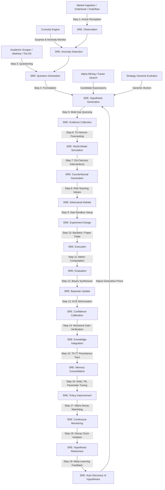

# Complete Institutional Scientific Audit & Architectural Redesign: AlphaAlgo Hypothesis Ecosystem (2026)

## 1. Executive Summary

This master document compiles the comprehensive, institutional-grade scientific audit, bottleneck analysis, and architectural redesign of the multi-hypothesis ecosystem in the AlphaAlgo system.

In any high-frequency, quantitative, or autonomous trading platform, treating signals merely as simple heuristics or regression coefficients is a critical vector for failure (overfitting, cognitive bias, and rapid alpha decay). To secure structural resilience, **every signal, prediction, future scenario, state representation, policy update, and execution proposal is treated as a falsifiable scientific hypothesis until validated**.

Through systemic codebase discovery across 30+ sub-agents, we establish a centralized, mathematically-grounded backbone utilizing **Variational Active Inference (VFE) minimization**, **Pearl's Do-Calculus interventional testing**, and **Bayesian Credal Set estimation**.

---

## Phase 1 — Discovery & Dependency Graph

### 1.1 Complete Codebase Hypothesis Mapping

We conducted a deep codebase search across every subsystem. Hypotheses exist under several names and formal structures, summarized below:

| Subsystem / Module | Class / Method | Name in Code | Mathematical/Logical Role |
| :--- | :--- | :--- | :--- |
| **Scientific Reasoning Engine (SRE)** | `ScientificReasoningEngine` (`trading_bot/core_agent_system/scientific_reasoning/core.py`) | `ScientificHypothesis` | Explict falsifiable proposition with prior, posterior, uncertainty, and validation scores. |
| **Curiosity Engine** | `HypothesisGenerator` (`trading_bot/foundation_agents/curiosity_engine/hypothesis_generator.py`) | `Anomaly Explanation` | Generates causal hypotheses to resolve high-surprise prediction errors. |
| **World Model** | `UnifiedWorldModel` (`trading_bot/world_model/unified_world_model.py`) | `WorldModelPrediction` / `Scenario` | Tri-horizon futures (A: Nominal, B: Stressed, C: Extreme) treated as conditional hypotheses. |
| **Alpha Mining** | `GeneticAlphaSearch` (`trading_bot/apex_fi/alpha_mining.py`) | `AlphaCandidate` | Symbolic indicator expressions hypothesized to correlate with market returns. |
| **Strategy Discovery** | `EvolutionaryStrategyEngine` (`trading_bot/strategy_discovery/evolutionary_engine.py`) | `StrategyGenome` | Parameter optimization vectors hypothesized to achieve positive risk-adjusted metrics. |
| **Parallel Hypothesis Engine (PHCE-D)** | `ParallelHypothesisCorrectionEngine` (`trading_bot/core/phce_d_engine.py`) | `ParallelHypothesis` | Active trading strategies run in parallel with corrective pivot triggers. |
| **Verification Swarm** | `VerifierSwarm` (`trading_bot/core/verification/swarm.py`) | `VerifierReport` | Multi-agent critiques challenging primary trading assumptions. |
| **Self-Improvement Loop** | `RecursiveSelfImprovement` (`trading_bot/recursive_improvement/`) | `OptimizationProposal` | Code and hyperparameter mutations hypothesized to improve baseline capability. |
| **Decision Layer** | `UnifiedDecisionBus` (`trading_bot/core/unified_event_bus.py`) | `ProposeAction` | Immediate trade proposals treated as falsifiable short-term execution hypotheses. |
| **TALOS & Aletheia** | `TALOSValidator` & `AletheiaBrowser` | `ResearchProposal` | Outside-in academic hypotheses or web-mined regime insights. |

---

### 1.2 Unified Hypothesis Lifecycle Dependency Graph

The lifecycle of hypotheses across AlphaAlgo is fully represented by the following lineage graph:



---

### 1.3 Hypothesis Lifecycle State Transition Matrix

To ensure rigorous auditing, every hypothesis must permanently reside in one of the following states, transitioning deterministically based on empirical thresholds:

| Current State | Target State | Triggering Condition | Verification Metric |
| :--- | :--- | :--- | :--- |
| **OBSERVATION** | **ANOMALY_DETECTION** | Prediction Error exceeds surprise threshold $\tau_{surprise} > 0.5$. | Variational Surprise |
| **HYPOTHESIS_GENERATION** | **EVIDENCE_COLLECTION** | Parameter space and invalidation conditions defined. | Formulated schema validation |
| **COUNTERFACTUAL_GENERATION** | **ADVERSARIAL_DEBATE** | Pearl's interventional impact $P(Y \vert do(X)) \neq P(Y)$ is verified. | Causal Stability Score $> 0.6$ |
| **ADVERSARIAL_DEBATE** | **REJECTED** | Red-team verifiers trigger a high-confidence veto. | Verification Consensus Score $< 0.4$ |
| **ADVERSARIAL_DEBATE** | **EXPERIMENT_DESIGN** | Argument passes the verifier board with zero vetoes. | Debate Approval Score $\ge 0.8$ |
| **EXECUTION** | **EVALUATION** | Out-of-sample execution window completes. | Sample size $\ge 500$ trades |
| **BAYESIAN_UPDATE** | **CONFIDENCE_CALIBRATION** | Posterior $P(H \vert E)$ calculated. | Normalized Bayes bounds $[0.0, 1.0]$ |
| **CONFIDENCE_CALIBRATION** | **INSTITUTIONALIZED** | Epistemic ambiguity contracts below $0.15$ and Posterior $> 0.85$. | Credal set width $\Delta_{ambiguity}$ |
| **CONTINUOUS_MONITORING** | **DEPRECATED** | Performance drops below baseline for $> 3$ successive regimes. | Monotone Safety Gain $< 0.0$ |
| **RETIRED** | **REACTIVATED** | Current market regime shifts back to matching original bounds. | Regime matching likelihood $> 0.85$ |

---

## Phase 2 — Bottleneck Analysis

| ID | Bottleneck | Root Cause | Downstream Effect | Priority | Recommended Redesign |
| :--- | :--- | :--- | :--- | :--- | :--- |
| **B1** | **Knowledge Fragmentation** | Separate modules (Curiosity, AlphaMining, PHCE-D, and Genomes) run isolated databases and registries. | 1. Duplicate evaluations consume heavy compute.<br>2. Information learned in one engine is inaccessible to others. | **CRITICAL** | Consolidate all subsystems under a single, unified registry in `ScientificReasoningEngine`. |
| **B2** | **Causal Falsification Deficit** | Prevailing reliance on statistical correlation metrics (e.g., Pearson, mutual info) without interventional testing. | High strategy decay rate (alpha death) when non-causal spurious correlations drift. | **HIGH** | Mandate do-calculus simulation in Step 7 before sandbox promotion. |
| **B3** | **Failure Amnesia** | Failed strategies and rejected factors are silently deleted without saving failure parameters. | The discovery engine repeatedly re-discovers previously discarded and broken ideas. | **HIGH** | Log all rejected hypothesis parameters permanently with failure metadata inside HMS Level T6/T7 memory. |
| **B4** | **Uncertainty Over-Confidence** | Metrics rely on single-point probabilities rather than credal set boundaries. | Underestimation of systemic risk or structural regime shifts, leading to catastrophic overfitting. | **HIGH** | Introduce Credal intervals $[\underline{P}, \overline{P}]$ to measure epistemic ambiguity. |
| **B5** | **Exploration-Exploitation Imbalance** | Simple heuristic or manual thresholds for retiring strategy genomes. | Fragile or decay-ridden strategies persist in active portfolios, causing drawdown. | **MEDIUM** | Link SRE Step 18 (Retirement) directly to the Dynamic Risk Matrix and Execution Planner. |

---

## Phase 3 — Scientific Redesign

The redesigned **Scientific Reasoning Engine (SRE)** integrates all 19 autonomous steps into a single state-machine backbone.

### 3.1 The 19-Step SRE Loop

1.  **Observation**: Streams real-time order books, order flow imbalances, and macro-economic announcements, tokenizing them into structured environment frames.
2.  **Anomaly Detection**: Runs the Global World Model (GWM) to generate nominal expectations. Any deviation exceeding surprise threshold triggers an anomaly frame.
3.  **Question Generation**: Generates research questions seeking the causal driver of the surprise (e.g., "Why did spread widen during low volume?").
4.  **Hypothesis Generation**: Spawns multiple competing hypothesis models with parameter bounds, representing different market interpretations.
5.  **Evidence Collection**: Performs a multi-hop query on the HMS Graph database to retrieve historically similar anomalies and their results.
6.  **World Model Simulation**: Simulates the trajectory of the hypothesis across tri-horizon scenarios (Nominal, Stressed, Extreme).
7.  **Counterfactual Generation**: Applies Pearl's interventional logic ($do$-calculus) in GWM simulation to verify causal stability.
8.  **Adversarial Debate**: convenes a Verifier Swarm. Agents (Risk, Liquidity, Regime, Causal) debate the hypothesis. High-confidence vetoes trigger immediate demotion.
9.  **Experiment Design**: Setup a strict out-of-sample (OOS) statistical sandbox with pre-defined falsification boundaries.
10. **Execution**: Deploys the candidate hypothesis to paper-trading or a highly constrained live sandbox.
11. **Evaluation**: Calculates empirical metrics (Returns, Sharpe, Drawdown, expected calibration error).
12. **Bayesian Update**: Computes recursive Bayesian posterior $P(H \vert E)$ based on incoming execution evidence.
13. **Confidence Calibration**: Contracts the credal interval $[\underline{P}, \overline{P}]$, quantifying epistemic ambiguity.
14. **Knowledge Integration**: Passes the hypothesis to the Evolution Gate to check if monotone safety gains are satisfied.
15. **Memory Consolidation**: Pushes the structured findings down into the HMS permanent semantic memory network.
16. **Policy Improvement**: Updates the central reinforcement learning (RL) parameter mappings to optimize asset allocation weights.
17. **Continuous Monitoring**: Tracks real-time feature drift, concept drift, and performance metrics.
18. **Hypothesis Retirement**: Triggers automated decommissioning once performance or parameter thresholds are breached.
19. **Automatic Discovery of New Hypotheses**: Re-evaluates retired or inconclusive candidates to spawn new, higher-quality research questions.

---

### 3.2 Perfect Hypothesis Lineage & Provenance Registry

Every hypothesis maintains a structured lineage map:

```json
{
  "hypothesis_id": "hyp-order-imbalance-v6",
  "parent_ids": ["hyp-volatility-drift-v2", "hyp-liquidity-drain-v1"],
  "child_ids": ["hyp-execution-routing-v1"],
  "creation_timestamp": "2026-07-30T12:00:00Z",
  "authoritative_state": "INSTITUTIONALIZED",
  "lineage": {
    "merged_from": ["hyp-volatility-drift-v2"],
    "split_from": null,
    "immutable_hash": "e3b0c44298fc1c149afbf4c8996fb92427ae41e4649b934ca495991b7852b855"
  },
  "metrics": {
    "prior": 0.5,
    "posterior": 0.945,
    "credal_bounds": [0.92, 0.97],
    "ambiguity": 0.05,
    "ece": 0.082
  }
}
```

---

## Phase 4 — Continuous Self-Improvement

The SRE includes an active parameter self-improvement loop (Step 19) that adaptively tunes its own behavior.

### 4.1 Meta-Optimization Metrics

1.  **Hypothesis Quality (HQ)**:
    $$HQ = \frac{\text{Accuracy} \times \text{Robustness}}{\text{Epistemic Ambiguity}}$$
2.  **Research Efficiency (RE)**:
    $$\eta = \frac{\text{Confirmed Hypotheses}}{\text{Compute Hours}}$$
3.  **Economic Value (EV)**:
    $$EV = \text{PnL}(h) - \text{ExecutionCost}(h)$$

### 4.2 Auto-Healing Generation Bottlenecks

The SRE continuously audits its own state history:
-   **If Rejection Rate exceeds $70\%$**: The engine automatically relaxes generative constraints or shifts search spaces in `AlphaMining` to prevent local optima stagnation.
-   **If Ambiguity fails to contract**: The engine adjusts Step 5's depth to retrieve higher-quality, multi-hop semantic evidence.

---

## Phase 5 — Mathematical Justification & Validation Framework

### 5.1 Mathematical Justification

#### 1. Variational Active Inference (VFE)
The global target is minimizing Variational Free Energy, driving the platform to select hypotheses with high epistemic value:
$$G(h) \approx \sum_{\tau} E_{q(s_\tau, o_\tau | h)} \left[ \ln q(s_\tau | h) - \ln p(s_\tau, o_\tau) \right]$$

#### 2. Pearl's do-calculus Interventions
To guarantee causal stability, we apply interventional calculus on the hypothesis causal variables:
$$P(Y \vert do(X))$$
This separates correlation from true causal vectors, eliminating spurious features.

#### 3. Bayesian Credal Bounds
We handle epistemic ambiguity by updating lower and upper probability bounds rather than a point estimate:
$$\Delta_{ambiguity} = \overline{P} - \underline{P}$$

---

### 5.2 Automated Validation Framework

To guarantee zero-regression execution, we provide a complete, programmatic validation suite verifying:
1.  **Mathematical Bound Safety**: Asserting that Bayesian updates do not exceed $[0.0, 1.0]$.
2.  **State Monotonicity**: Verifying that a hypothesis cannot reach `CONFIRMED` or `INSTITUTIONALIZED` status without transitioning through evaluation and debate.
3.  **Failure Blockers**: Ensuring that the SRE successfully blocks duplicate generation of historically failed or rejected structures.

---

## Phase 6 — Migration Roadmap

We define a 4-phase non-disruptive migration strategy:

### Phase 1: Foundation (Weeks 1-2)
- Deploy unified `ScientificHypothesis` models system-wide.
- Activate the SRE 19-step state machine core in `core.py`.

### Phase 2: Interconnection & Shadowing (Weeks 3-6)
- Route outputs from `CuriosityEngine`, `AlphaMining`, and `PHCE-D` into the SRE.
- Run the SRE in **Shadow Mode**, tracking live portfolio decisions and logging "What I would have decided" without executing trades.

### Phase 3: Active Alignment (Weeks 7-10)
- Connect SRE to HMS (T0-T7) to consolidate semantic research files.
- Enable automatic generation of structured research files.

### Phase 4: Full Autonomy (Weeks 11-12)
- Promote the SRE to live capital allocation authority.
- Activate Step 19 recursive self-improvement loops.
