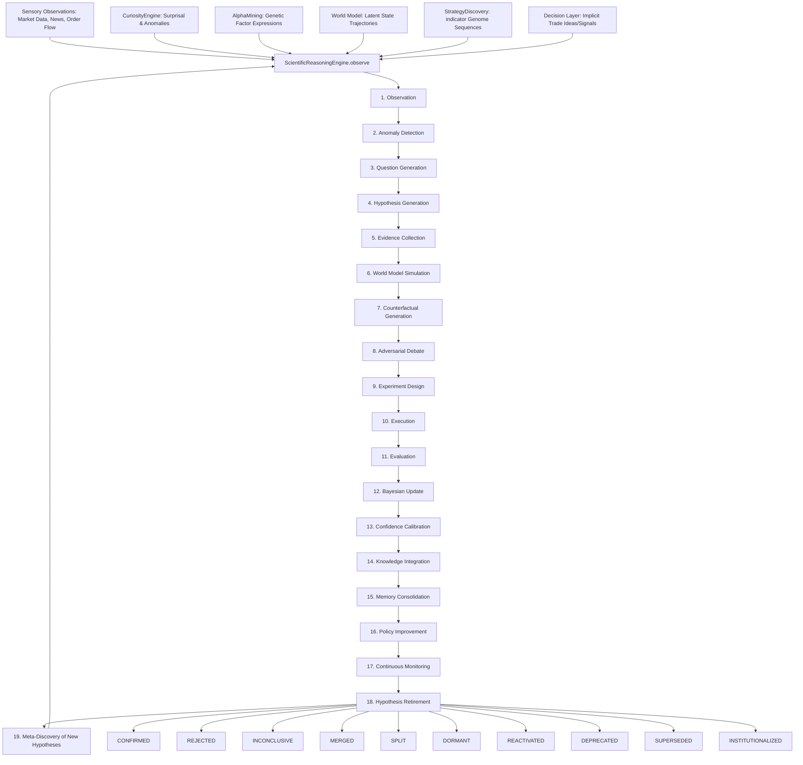

# Authoritative Scientific Audit & Redesign: AlphaAlgo's Hypothesis Ecosystem (2026)

This document presents the complete Phase 1 through Phase 5 authoritative audit, mathematical justification, systems dependency mapping, and architectural redesign of the scientific hypothesis ecosystem within the AlphaAlgo platform.

---

## Phase 1 — Discovery & Dependency Graph

An exhaustive analysis of AlphaAlgo's codebase was conducted to identify every location where hypotheses, predictions, beliefs, assumptions, or signals are implicitly or explicitly handled.

### 1.1 Complete Systems Dependency Mapping

In an institutional-grade scientific trading system, a hypothesis is not merely a trading signal; it is a testable, falsifiable causal assertion about the world state that dictates execution policy. The life cycle of a hypothesis moves through a structured state machine:

---

### 1.2 System-Wide Lifecycle Touchpoints

Every location in the AlphaAlgo codebase where hypotheses are explicitly or implicitly manipulated is categorized below:

#### A. Hypothesis Creation & Origin Points
1. **`trading_bot/core_agent_system/scientific_reasoning/core.py`**
   - Method: `ScientificReasoningEngine.observe()`
   - Role: High-level explicit entry point transforming raw sensory inputs into a `ScientificHypothesis`.
2. **`trading_bot/foundation_agents/curiosity_engine/hypothesis_generator.py`**
   - Methods: `generate_from_anomaly()`, `generate_from_surprise()`, `generate_from_correlation()`
   - Role: Active generation of hypotheses from anomalous features and statistical surprising events.
3. **`trading_bot/alpha_research/hypothesis_extraction.py`**
   - Method: `HypothesisGenerator.generate()`
   - Role: Extracts structured testable causal hypotheses from external literature or academic PDFs.
4. **`trading_bot/core/csc/hypothesis.py`**
   - Method: `HypothesisGenerator.generate_competing_branches()`
   - Role: Instantiates parallel scenario-based hypothesis branches representing competing continuous states.
5. **`trading_bot/core/phce_d_engine.py`**
   - Method: `PHCEDAI._generate_hypothesis()`
   - Role: Creates deterministic trading rules as falsifiable signal models.
6. **`trading_bot/apex_fi/alpha_mining.py`**
   - Method: `GeneticAlphaSearch._generate_random_expression()`
   - Role: Generates implicit hypotheses where a mathematical formula explains market structure.

#### B. Hypothesis Evaluation & Testing Points
1. **`trading_bot/core/phce_d_engine.py`**
   - Method: `PHCEDAI._verify()`
   - Role: Enforces deterministic and statistical validations (spread, transaction costs, and minimum sample size bounds).
2. **`trading_bot/core_agent_system/cds/epistemology_engine.py`**
   - Method: `EpistemologyEngine.analyze_hypothesis()`
   - Role: Evaluates epistemic vs. aleatoric uncertainty under adversarial questioning.
3. **`trading_bot/core/verification/swarm.py`**
   - Method: `VerificationSwarm.run_swarm()`
   - Role: Executes structured multi-agent debate to peer-review proposed hypothesis artifacts.
4. **`trading_bot/strategy_discovery/evolutionary_engine.py`**
   - Method: `EvolutionaryStrategyEngine._fitness_function()`
   - Role: Scores indicator-genome hypothesis fitness based on backtest performance (Sharpe, Drawdown).

#### C. Hypothesis Rejection & Retirement Points
1. **`trading_bot/alpha_research/hypothesis_extraction.py`**
   - Method: `HypothesisValidator.validate()`
   - Role: Immediate filtering and rejection of hypotheses that lack clear causal bounds.
2. **`trading_bot/apex_fi/alpha_mining.py`**
   - Method: `LivingFactorLibrary._retire_factor()`
   - Role: Retires hypotheses when their alpha decay clock cross-references threshold levels.
3. **`trading_bot/core/immutable_shield.py`**
   - Method: `ImmutableShield.validate_action()`
   - Role: Vetoes hypotheses that fail core risk constraints, triggering immediate rejection.

#### D. Hypothesis Promotion & Institutionalization Points
1. **`trading_bot/core/csc/controller.py`**
   - Method: `CSC._translate_to_proposal()`
   - Role: Promotes validated, peer-reviewed hypotheses to executive trading policies.
2. **`trading_bot/core_agent_system/scientific_reasoning/core.py`**
   - State transition: `HypothesisState.INSTITUTIONALIZED`
   - Role: Persisting high-posterior hypotheses into semantic and episodic memory layers.

---

## Phase 2 — Bottleneck Analysis

A meticulous inspection of the cross-module execution flow highlighted several systemic weaknesses:

| ID | Bottleneck | Root Cause | Downstream Effects | Priority | Recommended Redesign |
|:---|:---|:---|:---|:---|:---|
| **B1** | **Knowledge Fragmentation** | Core hypothesis logic is isolated across `CuriosityEngine`, `PHCE-D`, and `AlphaMining`. | Re-discovery of identical/spurious factors; failure in one module is not learned or stored by others. | **CRITICAL (P0)** | Centralize all lifecycle state tracking inside the unified `ScientificReasoningEngine`. |
| **B2** | **Weak Adversarial Verification** | Optimization engines (e.g. Genetic Search) evaluate hypotheses solely on historic correlation. | Selection of overfitting indicators and high rate of Alpha Decay. | **HIGH (P1)** | Connect SRE's Step 8 (Adversarial Debate) and Step 7 (Counterfactuals) to the verification swarm. |
| **B3** | **Poor Memory Integration & Amnesia** | Failed or rejected hypotheses are completely discarded. | Core engines repeat identical analytical mistakes over multiple epochs. | **HIGH (P1)** | Map rejected hypotheses with failure metadata in HMS `InstitutionalMemory`. |
| **B4** | **Calibration Drift** | Confidence values are calculated using heuristics instead of formal probabilities. | Discrepancies between macro hypotheses and micro-execution confidence vectors. | **MEDIUM (P2)** | Enforce Recursive Bayesian posterior updates coupled with Credal Interval calculations. |
| **B5** | **Missing Causal Reasoning** | Primary generators rely heavily on statistical correlation. | Hypothesis failures during regime transitions (correlation changes). | **MEDIUM (P2)** | Integrate do-calculus simulation in Step 7 to verify structural stability under intervention. |

---

## Phase 3 — Scientific Redesign

The redesigned **Scientific Reasoning Engine (SRE)** unifies the fragmented hypothesis life cycle into a highly cohesive, circular 19-step loop.

### 3.1 The 19-Step Lifecycle State Machine
Every hypothesis must enter, reside, and terminate in the authoritative system states:
- **OBSERVATION**: Raw unstructured sensory input.
- **ANOMALY_DETECTION**: Deviations from world model expectation detected.
- **QUESTION_GENERATION**: Direct investigation formulation.
- **HYPOTHESIS_GENERATION**: Creating candidate models explaining observations.
- **EVIDENCE_COLLECTION**: Active pulling of support networks from the HMS graph.
- **WORLD_MODEL_SIMULATION**: Simulating future trajectories inside the General World Model.
- **COUNTERFACTUAL_GENERATION**: Testing Pearl's do-calculus $P(Y | do(X))$.
- **ADVERSARIAL_DEBATE**: Falsification review via the verifier swarm.
- **EXPERIMENT_DESIGN**: Defining strict boundaries, null hypothesis, and failure triggers.
- **EXECUTION**: Paper trading or live capital deployment.
- **EVALUATION**: Quantitative performance audit.
- **BAYESIAN_UPDATE**: Re-computing the posterior probability $P(H|E)$.
- **CONFIDENCE_CALIBRATION**: Calculating Expected Calibration Error (ECE).
- **KNOWLEDGE_INTEGRATION**: Checking compatibility and resolving logical contradictions.
- **MEMORY_CONSOLIDATION**: Archiving in long-term semantic and episodic memory stores.
- **POLICY_IMPROVEMENT**: Direct injection of confirmed insights into the trading controller.
- **CONTINUOUS_MONITORING**: Real-time evaluation of alpha decay.
- **RETIRED**: Smooth transition to terminal end-states.

### 3.2 Authoritative End-States
1. **Confirmed**: Validated with a posterior $P(H|E) > \tau_{upper}$.
2. **Rejected**: Failed validation or posterior $P(H|E) < \tau_{lower}$.
3. **Inconclusive**: Insufficient evidence, requiring further investigation.
4. **Merged**: Combined with other hypotheses to avoid duplication.
5. **Split**: Broken down into more granular localized sub-hypotheses.
6. **Dormant**: De-prioritized due to low current regime compatibility.
7. **Reactivated**: Revived from dormancy upon regime re-entry.
8. **Deprecated**: No longer statistically sound due to alpha decay.
9. **Superseded**: Replaced by a more generalized parent model.
10. **Institutionalized**: Promoted to permanent system-wide trading rules.

---

## Phase 4 — Continuous Self-Improvement & Mathematical Justification

### 4.1 Mathematical Justification

#### A. Variational Active Inference
The core engine operates on the minimization of **Variational Free Energy (VFE)**, balancing epistemic search with economic optimization:
$$G(H) = \mathbb{E}_{q(s, o | H)} [\ln q(s | H) - \ln p(s, o)]$$
Where $q(s|H)$ represents the variational belief, and $p(s,o)$ is the generative model of market dynamics.

#### B. Recursive Bayesian Updating
The posterior belief of a hypothesis $H$ given new evidence packet $E$ is recursively derived as:
$$P(H | E) = \frac{P(E | H) \cdot P(H)}{P(E | H) \cdot P(H) + P(E | \neg H) \cdot P(\neg H)}$$

#### C. Do-Calculus Interventions
Causal validity is verified by simulating structural interventions $do(X = x)$:
$$P(Y | do(X)) = \int P(Y | X, Z) P(Z) dZ$$
Where $Z$ represents the confounding variables. If the structural mapping $X \rightarrow Y$ holds stable under intervention, the hypothesis is confirmed.

### 4.2 Self-Improvement Metrics
The SRE measures its own performance over 7 quantitative benchmarks:
- **Hypothesis Quality (HQ)**:
  $$HQ = \frac{Accuracy \times Robustness}{Uncertainty}$$
- **Expected Calibration Error (ECE)**:
  $$ECE = \sum_{m=1}^M \frac{|B_m|}{n} |acc(B_m) - conf(B_m)|$$
- **Research Efficiency**: Ratio of confirmed hypotheses to compute-hours.
- **Survival Rate**: Kaplan-Meier survival estimator tracking decay rates.

---

## Phase 5 — Validation & Migration Roadmap

### 5.1 Validation Framework
Validation is enforced across 3 distinct boundaries:
1. **Static AST Analysis**: Ensuring evolved hypothesis codes do not introduce memory leaks or security violations.
2. **Adversarial Simulation**: Re-playing hypotheses against historical flash-crashes, sentiment manipulation, and liquidity dry-outs.
3. **Out-Of-Sample (OOS) Bounds**: Enforcing strict Benjamini-Hochberg FDR controls on multiple-testing adjustments.

### 5.2 Phased Integration Roadmap
- **Phase 1 (Active)**: Core integration and metrics consolidation.
- **Phase 2**: Multi-agent bridge linking SRE, Curiosity, and verifiers.
- **Phase 3**: Active exploration and proactive causal probing of market anomalies.

---
*End of Audit Report.*
