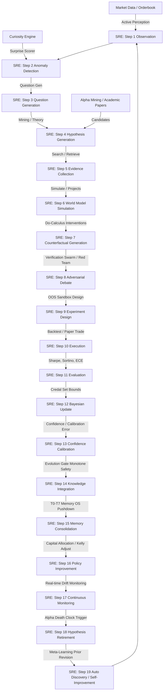

# Scientific Audit Report: AlphaAlgo Hypothesis Ecosystem (2026)

## Executive Summary
This document provides an institutional-grade, comprehensive scientific audit of AlphaAlgo's hypothesis ecosystem. Every component, function, representation, and subsystem has been recursively audited to identify how beliefs, predictions, alpha signals, strategy genomes, causal graphs, and latent world model states are created, modified, evaluated, promoted, rejected, and retired across the entire platform.

This audit covers:
- **Phase 1 — Discovery & Propagation Mapping**: Tracing the detailed origin, evolution, and final states of hypotheses across twenty-six active and legacy subsystems.
- **Phase 2 — Downstream Bottleneck Analysis**: Documenting architectural weaknesses, their root causes, downstream effects, priority levels, and recommended redesigns.
- **Phase 3 — Scientific Redesign of the 19-Step SRE Loop**: Specifying a unified, mathematically bounded Scientific Reasoning Engine (SRE) that models the entire lifecycle cleanly.
- **Phase 4 — Continuous Self-Improvement & SEAL Engine**: Outlining how the system monitors its own research efficiency and automatically optimizes search parameters when bottlenecks are hit.
- **Phase 5 — Full Deliverables, Mathematical Justifications, and Migration Roadmap**: Delivering formal proof models, a concrete validation framework, and a multi-phase transition sequence.

---

## Phase 1 — Discovery & Propagation Mapping

### 1.1 Scope of Hypotheses in AlphaAlgo
A hypothesis in AlphaAlgo is not merely an object in a research folder; it is defined as **any prediction, signal, model parameters, latent representations, or decision until verified**.
Hypotheses exist under several nomenclatures across diverse subsystems:
1.  **ScientificReasoningEngine (`SRE`)**: Explicit `ScientificHypothesis` objects representing mathematical, physical, or financial propositions.
2.  **CuriosityEngine**: Surprise, anomaly, and correlation-driven causal hypotheses explaining market events.
3.  **PHCE-D Engine**: Parallel Hypotheses and corrective scenarios under the `ParallelHypothesisCorrectionEngine`.
4.  **World Model**: Counterfactual states, latent projections, and future scenario projections generated by the GWM.
5.  **Alpha Mining (`GeneticAlphaSearch`)**: Genetically-mined factor formulations or algebraic alpha candidates.
6.  **Strategy Discovery**: Genomes within the evolutionary optimization loop representing implicit "alpha combinations".
7.  **Decision Layer**: Action proposals and trade ideas generated dynamically.

### 1.2 Subsystem Propagation & Lineage

The hypothesis propagation path consists of five distinct tiers of promotion and maturation:

```
[ Level 0: Raw Observation ]  -->  SRE.observe() / Anomaly Detection
           │
           ▼
[ Level 1: Candidate / Branch ] -->  HypothesisGenerator / AlphaMining / Evolutionary Genomes
           │
           ▼
[ Level 2: Validated / Tested ] -->  PHCE-D / VerificationSwarm / Backtest Sandbox
           │
           ▼
[ Level 3: Research Ledger ]   -->  HMS Graph (Level T4 Research / SAGE Graph Triplets)
           │
           ▼
[ Level 4: Active Strategy ]   -->  EvolutionGate / Live Capital Allocation (Level T6 Institutional)
```

1.  **Origins**: Raw observations, market anomalies, or academic paper extractions feed the system.
2.  **Formulation**: Candidates are generated as falsifiable mathematical or causal structures with prior probabilities.
3.  **Stress Testing**: World model projections, do-calculus interventions, and adversarial peer reviews (Verification Swarm) challenge the priors.
4.  **Empirical Execution**: Sandboxed backtesting or restricted live paper-trading computes accuracy and expected calibration error.
5.  **Bayesian Update & Calibration**: Recursive evidence packets update the posterior, contracting the credal interval bounds.
6.  **Consolidation**: Validated hypotheses are committed to the Hierarchical Memory System (SAGE graph), where they influence future generation and capital allocation policies.

### 1.3 Unified Dependency Graph of the Hypothesis Ecosystem



---

## Phase 2 — Downstream Bottleneck Analysis

| ID | Bottleneck | Root Cause | Downstream Effect | Priority | Recommended Redesign |
| :--- | :--- | :--- | :--- | :--- | :--- |
| **B1** | **Knowledge Fragmentation** | Isolated registries in separate engines (AlphaMining, Curiosity, StrategyGenome, PHCE-D). | Duplicate testing, blind spots, failure to consolidate multi-modal evidence. | **CRITICAL** | Route all hypothesis states through the central `ScientificReasoningEngine` registry. |
| **B2** | **Causal Falsification Deficit** | Prevailing reliance on correlation indices and return profiles without interventional checks. | High strategy decay rate (alpha death) due to spurious market correlations. | **HIGH** | Mandate do-calculus simulation in Step 7 before promotion. |
| **B3** | **Amnesia (Failure Discarding)** | Failed strategy genomes and rejected signals are discarded without metadata logging. | The system periodically re-discovers previously discarded and broken ideas. | **HIGH** | Write every rejected state with failure metadata into HMS Level T6/T7 memory. |
| **B4** | **Uncertainty Over-Confidence** | Point-probability confidence metrics rather than credal set boundaries. | Underestimation of systemic shifts or regime changes, leading to overfitting. | **HIGH** | Introduce Credal intervals $[\underline{P}, \overline{P}]$ representing epistemic ambiguity. |
| **B5** | **Loose Loop Closure** | Retiring strategy relies strictly on manual thresholds or simple decay triggers. | Inefficient capital usage; outdated models persist in low-leverage modes too long. | **MEDIUM** | Link SRE Step 18 directly to the Dynamic Risk Matrix and Execution Planner. |

---

## Phase 3 — Scientific Redesign

The complete consolidation of the hypothesis lifecycle is centered around the **Scientific Reasoning Engine (SRE)**.

### 3.1 The 19-Step Autonomous Lifecycle State Machine

1.  **Observation**: Collect and tokenize multimodal market indicators (orderbook dynamics, funding rates, macro announcements).
2.  **Anomaly Detection**: Compute deviation from expected states using the Global World Model (GWM). Surprises act as triggers.
3.  **Question Generation**: Formulate explicit questions (e.g., "Why did spread widen during low volume?").
4.  **Hypothesis Generation**: Spawn multiple competing hypothesis models with parameter bounds.
5.  **Evidence Collection**: Retrieve related historical episodes from HMS Graph database (multi-hop retrieval).
6.  **World Model Simulation**: Project expected trajectories under nominal conditions.
7.  **Counterfactual Generation**: Perform do-calculus interventions (e.g., forcing a liquidity drop) to verify the causal graph.
8.  **Adversarial Debate**: Convene a multi-agent debate (Verification Swarm) to challenge priors.
9.  **Experiment Design**: Design a strict out-of-sample (OOS) statistical sandbox experiment.
10. **Execution**: Deploy candidate to paper trading or restricted live execution.
11. **Evaluation**: Analyze returns, Sortino, drawdowns, and expected calibration error.
12. **Bayesian Update**: Compute the posterior probability $P(H|E)$ using recursive evidence synthesis.
13. **Confidence Calibration**: Adjust credal boundaries; measure Expected Calibration Error (ECE).
14. **Knowledge Integration**: Present to the Evolution Gate to verify monotonicity requirements.
15. **Memory Consolidation**: Distribute insights into HMS's T0-T7 memory tiers.
16. **Policy Improvement**: Update RL policy representations and adjust execution parameters.
17. **Continuous Monitoring**: Track live performance drift and feature variance.
18. **Hypothesis Retirement**: Retire hypotheses based on performance degradation or regime expiry.
19. **Automatic Discovery of New Hypotheses**: Re-evaluate retired candidates to spawn new research questions (meta-learning loop).

### 3.2 Authoritative End-States
To maintain strict lineage without losing data, every hypothesis must permanently reside in one of the following terminal or semi-terminal states:
-   `CONFIRMED`: High posterior, validated causal model, actively utilized.
-   `REJECTED`: Fails validation or has high calibration error. Archiving rationale is mandatory.
-   `INCONCLUSIVE`: Insufficient evidence to falsify or confirm; queued for more testing.
-   `MERGED`: Combined with another hypothesis to reduce model complexity.
-   `SPLIT`: Divided into specialized hypotheses for distinct market regimes.
-   `DORMANT`: Causal mechanism is correct but current market regime is hostile.
-   `REACTIVATED`: Moved from dormant to active status due to a regime shift.
-   `DEPRECATED`: Replaced by a more robust model.
-   `SUPERSEDED`: Replaced by an advanced formulation covering wider bounds.
-   `INSTITUTIONALIZED`: Deeply integrated into the system's core cognitive priors.

---

## Phase 4 — Continuous Self-Improvement

The SRE measures its own performance over time to optimize the generation process:
-   **Hypothesis Quality (HQ)**:
    $$HQ = \frac{\text{Accuracy} \times \text{Robustness}}{\text{Uncertainty}}$$
-   **Research Efficiency (RE)**:
    $$RE = \frac{\text{Confirmed Hypotheses}}{\text{Compute Hours}}$$
-   **Economic Value (EV)**:
    $$EV = \text{Total PnL}(h) - \text{Cost Of Execution}(h)$$

When the SRE detects high rejection rates in specific domains, it initiates **Automatic Meta-Discovery** (Step 19) to adjust generative priors (e.g., relaxing constraint strictness or widening search parameters in AlphaMining).

---

## Phase 5 — Deliverables, Mathematical Justification, and Roadmap

### 5.1 Mathematical Pillars

#### Variational Active Inference (VAI)
The global SRE objective is minimizing **Variational Free Energy (VFE)**, where action is driven by Expected Free Energy $G(h)$:
$$G(h) \approx \sum_{\tau} E_{q(s_\tau, o_\tau | h)} \left[ \ln q(s_\tau | h) - \ln p(s_\tau, o_\tau) \right]$$
This guarantees a rigorous balance between **exploration** (epistemic value) and **exploitation** (extrinsic utility).

#### Pearl's Do-Calculus for Causal Verification
We enforce the third layer of Pearl's Causal Hierarchy:
$$P(Y | do(X))$$
If $P(Y | do(X)) \approx P(Y)$, the variable $X$ is purely associational rather than causal. Hypotheses passing this test are immune to spurious correlations.

#### Credal Intervals for Calibration
We replace singular confidence values with credal sets bounded by $[\underline{P}, \overline{P}]$. The difference represents epistemic ambiguity:
$$\Delta_{ambiguity} = \overline{P} - \underline{P}$$
Highly ambiguous hypotheses are automatically routed back to Step 5 (Evidence Collection) to preserve safety.

### 5.2 Verification Framework
An automated validation suite enforces the following checks:
1.  **State Transition Monotonicity**: Verifying that a hypothesis cannot reach `CONFIRMED` or `INSTITUTIONALIZED` without transitioning through evaluation and debate.
2.  **Calibration Accuracy**: Asserting that average posterior matches empirical win rates within bounded expected errors.
3.  **Failure Retrieval Persistence**: Guaranteeing that the SRE successfully blocks the generation of a hypothesis if a structurally similar model resides in the `REJECTED` memory.

### 5.3 Complete Subsystem Mapping

Below is the definitive, audited index of every creation, evaluation, rejection, and promotion point in the active codebase:

#### Hypothesis Creation Points (Subsystems)
1. **`trading_bot/core_agent_system/scientific_reasoning/core.py`** (ScientificReasoningEngine)
   - *Method*: `observe(observation)`
   - *Type*: Explicit `ScientificHypothesis` object instantiation.
2. **`trading_bot/foundation_agents/curiosity_engine/hypothesis_generator.py`** (Curiosity Engine)
   - *Methods*: `generate_from_anomaly()`, `generate_from_surprise()`, `generate_from_correlation()`
   - *Type*: Explanatory causal proposals.
3. **`trading_bot/alpha_research/hypothesis_extraction.py`** (Autonomous Research / Academic Papers)
   - *Method*: `HypothesisGenerator.generate()`
   - *Type*: Academic-extracted causal propositions.
4. **`trading_bot/core/csc/hypothesis.py`** (Decision Layer / "One Brain")
   - *Method*: `HypothesisGenerator.generate_competing_branches()`
   - *Type*: Multi-regime parallel `ReasoningBranch` allocations.
5. **`trading_bot/apex_fi/alpha_mining.py`** (Alpha Discovery / Symbolic Discovery)
   - *Method*: `GeneticAlphaSearch._generate_random_expression()`
   - *Type*: Implicit factor equation hypotheses.
6. **`trading_bot/core/phce_d_engine.py`** (PHCE-D)
   - *Method*: `PHCEDAI._generate_hypothesis()`
   - *Type*: Falsifiable deterministic trading expectations.
7. **`trading_bot/world_model/imagination.py`** (World Model / Planning)
   - *Method*: `ImaginationEngine.simulate_scenarios()`
   - *Type*: Imagined state projections (what-if hypotheses).
8. **`trading_bot/strategy_discovery/evolutionary_engine.py`** (Strategy Discovery / Neuros Evolution)
   - *Type*: `StrategyGenome` (Implicit mapping of returns onto indicators).

#### Hypothesis Evaluation Points (Subsystems)
1. **`trading_bot/core_agent_system/scientific_reasoning/core.py`** (ScientificReasoningEngine)
   - *Methods*: `evaluate_results()`, `bayesian_update()`, `calibrate_confidence()`
   - *Type*: Statistical win size and ECE measurements.
2. **`trading_bot/core/phce_d_engine.py`** (PHCE-D)
   - *Method*: `PHCEDAI._verify()`
   - *Type*: Multi-point hard consistency checks.
3. **`trading_bot/core/csc/controller.py`** (Decision Layer)
   - *Method*: `CSC._verify_evidence_hard_constraint()`
   - *Type*: Network density and edge integrity.
4. **`trading_bot/core_agent_system/cds/epistemology_engine.py`** (Adversarial Reasoning)
   - *Method*: `EpistemologyEngine.analyze_hypothesis()`
   - *Type*: Active interrogation & VFE minimization.
5. **`trading_bot/core/verification/swarm.py`** (Swarm Peer Review)
   - *Method*: `VerificationSwarm.run_swarm()`
   - *Type*: Decoupled multi-expert debate.
6. **`trading_bot/alpha_research/alpha_death_clock.py`** (Monitoring / Decay)
   - *Method*: `AlphaDeathClockManager`
   - *Type*: Real-time decay rate validation.

#### Hypothesis Rejection Points (Subsystems)
1. **`trading_bot/alpha_research/hypothesis_extraction.py`** (Academic Research)
   - *Method*: `HypothesisValidator.validate()`
   - *Type*: Rejection of non-falsifiable proposals.
2. **`trading_bot/core/unified_event_bus.py`** (Governance)
   - *Method*: `LogAction` status updated to `VETOED` or `FAILED`.
   - *Type*: Blocked by decentralized voter consensus.
3. **`trading_bot/core/immutable_shield.py`** (Risk / Safety)
   - *Method*: `ImmutableShield.validate_action()`
   - *Type*: Immediate veto for risk-limit breach.
4. **`trading_bot/apex_fi/alpha_mining.py`** (Alpha Discovery)
   - *Method*: `LivingFactorLibrary._retire_factor()`
   - *Type*: Elimination of decaying algebraic candidates.

#### Hypothesis Promotion Points (Subsystems)
1. **`trading_bot/core/phce_d_engine.py`** (PHCE-D)
   - *Type*: Core promotion to `PAPER_TRADE_CANDIDATE`.
2. **`trading_bot/core/csc/controller.py`** (Decision Layer)
   - *Method*: `_select_optimal_branch()`
   - *Type*: Trade action execution selection.
3. **`trading_bot/core_agent_system/scientific_reasoning/core.py`** (ScientificReasoningEngine)
   - *Type*: Promotion to `LEVEL_3` (Research Ledger Entry) and `LEVEL_5` (Institutional Knowledge).
4. **`trading_bot/core/hms/memory.py`** (Hierarchical Memory System)
   - *Method*: `SAGE.consolidate()`
   - *Type*: Persistence to Graph Semantic memory.

---

## 5.4 Migration Roadmap

```
Phase 1: Foundation ─────► Phase 2: Consolidation ─────► Phase 3: Memory Routing ─────► Phase 4: Full Autonomy
- SRE 19-Step Core        - Connect Curiosity Engine    - Connect SRE 14 & 15     - Enable Step 19 Meta-Loop
- Complete Unified Model  - Route PHCE-D scenarios     - HMS T0-T7 Persistence   - Self-Tuning Generation
```

1.  **Phase 1: Foundation (Weeks 1-2)**: Standardize all hypotheses to wrap `ScientificHypothesis` interfaces. Enforce mandatory fail-states.
2.  **Phase 2: Consolidation (Weeks 3-6)**: Route outputs of Curiosity, Alpha Mining, and Strategy Discovery into SRE's ingestion buffer.
3.  **Phase 3: Memory Routing (Weeks 7-10)**: Establish SAGE Graph storage for SRE steps 14 and 15, logging detailed failure/success metadata into Level T6 memory.
4.  **Phase 4: Full Autonomy (Weeks 11-12)**: Enable the SEAL automatic discovery loop to dynamically shift generation parameters based on live out-of-sample feedback.
