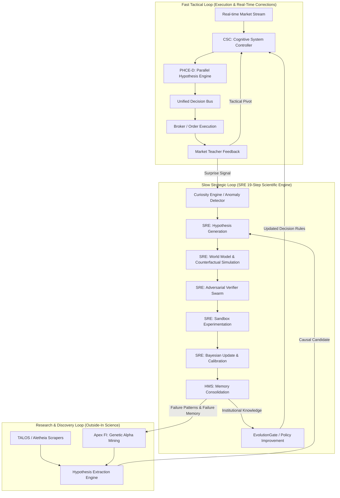

# Phase 1: End-to-End Hypothesis Dependency Graph & Propagation Architecture (2026)

## 1. Multi-Loop Architecture

The hypothesis ecosystem across AlphaAlgo operates across three interconnected operational feedback loops:



---

## 2. Hypothesis Information & Uncertainty Propagation Protocol

Hypotheses carry three key signals across nodes in the dependency graph:

1. **Prior & Posterior Belief $P(H \vert E)$**: Probabilistic assertion of hypothesis truth given observed evidence.
2. **Epistemic Ambiguity Span $\Delta = \overline{P} - \underline{P}$**: Lower and upper credal set bounds reflecting evidence sufficiency.
3. **Causal Interventional Impact Score $I_c = P(Y \vert do(X)) - P(Y)$**: Quantifies true causal influence vs spurious correlation.

```
       [SRE Core Step 4]
        (Formulate Hypothesis)
              │
              ├── Prior P(H) = 0.50, Ambiguity = 0.50
              ▼
       [World Model Step 6/7]
        (Simulate Scenarios & Interventions)
              │
              ├── Causal Score Ic > 0.60
              ▼
       [Adversarial Swarm Step 8]
        (Red-Team Verification)
              │
              ├── Verification Score = 0.88, No Vetoes
              ▼
       [Bayesian Synthesizer Step 12/13]
        (Posterior Update & Credal Contraction)
              │
              ├── Posterior P(H|E) = 0.89, Credal Bounds = [0.86, 0.92] (Ambiguity = 0.06)
              ▼
       [HMS Memory Consolidation Step 15]
        (Persist to SAGE Graph Memory & Institutionalize)
```

---

## 3. Propagation Edge Details

- **Edge 1: Anomaly → Hypothesis Generation**: High prediction surprise ($\tau_{\text{surprise}} > 0.5$) in `CuriosityEngine` forces `SRE` to spawn competing candidate explanation nodes.
- **Edge 2: Hypothesis → World Model Counterfactuals**: `SRE` transmits parameters to `UnifiedWorldModel`. The model applies $do(X)$ interventions to evaluate counterfactual stability.
- **Edge 3: World Model → Adversarial Swarm**: Trajectory simulations are passed to `VerifierSwarm` (Risk, Regime, Liquidity) for falsification checks.
- **Edge 4: Swarm Verdict → Bayesian Synthesizer**: Unanimous or weighted debate results are converted into likelihood updates $P(E \vert H)$ to recalculate posterior $P(H \vert E)$.
- **Edge 5: Posteriors → HMS Graph**: Validated hypotheses with high confidence are written to the Hierarchical Memory System (`trading_bot/core/hms/memory.py`) as permanent nodes in the SAGE graph.
- **Edge 6: HMS → Strategy & Policy Improvement**: `EvolutionGate` retrieves institutionalized hypotheses to update reinforcement learning policies and trading parameters in `CSC`.
