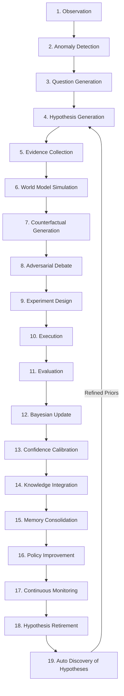

# Phase 3: Scientific Reasoning Engine (SRE) 19-Stage Architectural Redesign (2026)

## 1. Architectural Overview & Design Philosophy

The **Scientific Reasoning Engine (SRE)** serves as the authoritative, institutional backbone of AlphaAlgo's hypothesis ecosystem. Every proposal, market state, forecast, strategy candidate, and trade idea passes through a continuous, 19-stage state machine that systematically transforms raw observations into falsifiable scientific propositions, empirically tests them, updates epistemic beliefs, consolidates knowledge, and governs execution or retirement.

---

## 2. The 19-Stage SRE Lifecycle



### Stage Detail Specifications

1. **Observation**: Ingests multi-modal orderbook, macro-economic, news, and execution telemetry into structured `ObservationFrame` objects.
2. **Anomaly Detection**: Compares incoming observation against `UnifiedWorldModel` expectations. Surprise magnitude $\tau_{\text{surprise}} = -\log P(O \vert \text{State})$ triggers anomaly frames if $\tau > 0.50$.
3. **Question Generation**: Formulates targeted, causal questions (e.g., "What mechanism caused liquidity to drop 40% in symbol X during volume expansion?").
4. **Hypothesis Generation**: Spawns explicit falsifiable statements with initial prior probability $P(H) = 0.50$, parameter search bounds, and explicit invalidation bounds.
5. **Evidence Collection**: Dual-queries `HierarchicalMemorySystem` (HMS) SAGE Graph database for historically similar successes AND historically similar failures.
6. **World Model Simulation**: Simulates the hypothesis across Nominal (Scenario A), Stressed (Scenario B), and Extreme (Scenario C) market horizons in `UnifiedWorldModel`.
7. **Counterfactual Generation**: Executes Pearl's $do$-calculus interventional test ($P(Y \vert do(X))$) in `ImaginationEngine` to confirm causal necessity.
8. **Adversarial Debate**: Submits hypothesis to `VerifierSwarm` (Risk, Liquidity, Regime, Causal) for critique. Any high-confidence veto triggers immediate demotion.
9. **Experiment Design**: Establishes an isolated out-of-sample statistical sandbox with explicit sample size constraints and stop-loss boundaries.
10. **Execution**: Deploys candidate hypothesis into paper-trading sandbox or live execution with micro position sizing.
11. **Evaluation**: Computes empirical performance metrics (PnL, Sharpe, Max Drawdown, Slippage, ECE) over completed out-of-sample trades.
12. **Bayesian Update**: Updates posterior belief $P(H \vert E)$ using likelihood ratios derived from out-of-sample execution results.
13. **Confidence Calibration**: Measures Expected Calibration Error (ECE) and contracts Bayesian credal interval $[\underline{P}, \overline{P}]$.
14. **Knowledge Integration**: Passes hypothesis through `EvolutionGate` to verify non-regressive safety and monotone performance gains.
15. **Memory Consolidation**: Persists verified hypothesis, its structural DAG, and metadata into permanent SAGE Graph memory (HMS Level T6/T7).
16. **Policy Improvement**: Updates central reinforcement learning parameter mappings and `SkillRouter` dispatch matrices.
17. **Continuous Monitoring**: Tracks real-time feature drift, concept drift, and performance decay via `AlphaDeathClockManager`.
18. **Hypothesis Retirement**: Shifts degraded or invalid candidates out of active trading into `Retired` or `Dormant` state when decay clocks expire.
19. **Automatic Discovery of New Hypotheses**: Analyzes retired or inconclusive candidates to extract higher-order lessons and re-seed new research questions.

---

## 3. Mandatory 10 Hypothesis Terminal & Active States

Hypotheses **never disappear** from AlphaAlgo. They permanently reside in one of 10 deterministic states:

```
                  ┌─────────────────────────────────────────┐
                  │              OBSERVATION                │
                  └────────────────────┬────────────────────┘
                                       │
                                       ▼
                  ┌─────────────────────────────────────────┐
                  │         HYPOTHESIS_GENERATION           │
                  └────────────────────┬────────────────────┘
                                       │
                       ┌───────────────┴───────────────┐
                       ▼                               ▼
            ┌────────────────────┐          ┌────────────────────┐
            │     INCONCLUSIVE   │          │      REJECTED      │
            └──────────┬─────────┘          └────────────────────┘
                       │
                       ▼
            ┌────────────────────┐
            │     CONFIRMED      │
            └──────────┬─────────┘
                       │
         ┌─────────────┼─────────────┬─────────────┐
         ▼             ▼             ▼             ▼
   ┌──────────┐  ┌──────────┐  ┌──────────┐  ┌──────────────┐
   │  MERGED  │  │  SPLIT   │  │ DORMANT  │  │INSTITUTION-  │
   └──────────┘  └──────────┘  └────┬─────┘  │ALIZED        │
                                    │        └──────┬───────┘
                                    ▼               │
                             ┌────────────┐         ▼
                             │REACTIVATED │   ┌──────────┐
                             └────────────┘   │DEPRECATED│
                                              └────┬─────┘
                                                   ▼
                                              ┌──────────┐
                                              │SUPERSEDED│
                                              └──────────┘
```

| State | Definition & Transition Criteria |
| :--- | :--- |
| **Confirmed** | Posterior $P(H \vert E) \ge 0.85$, $ECE \le 0.15$, and zero risk vetoes during out-of-sample execution. |
| **Rejected** | Posterior $P(H \vert E) < 0.20$ or hard verifier veto. Immutable failure parameters logged in HMS. |
| **Inconclusive** | Epistemic ambiguity span $\Delta = \overline{P} - \underline{P} > 0.30$ after maximum experimental trials. |
| **Merged** | Two complementary hypotheses combined into a unified causal DAG with combined posterior. |
| **Split** | A broad hypothesis partitioned into two regime-specific sub-hypotheses based on divergent evidence. |
| **Dormant** | Inactive due to current market regime mismatch, but retained for future regime shifts. |
| **Reactivated** | Promoted from `Dormant` back to active status when market regime re-aligns. |
| **Deprecated** | Performance decay or feature drift detected in production trading. |
| **Superseded** | Replaced by a higher-performing, more general successor hypothesis. |
| **Institutionalized**| Core system law integrated into `ImmutableShield` or baseline execution policy. |

---

## 4. Immutable Lineage & Provenance Data Schema

Every hypothesis maintains full provenance tracked via a structured JSON schema:

```json
{
  "hypothesis_id": "hyp-order-imbalance-v6",
  "guid": "a8f3b2c1-9d4e-4f12-8c01-7b3e2d1f0a9c",
  "parent_ids": ["hyp-volatility-drift-v2", "hyp-liquidity-drain-v1"],
  "child_ids": ["hyp-execution-routing-v1"],
  "creation_timestamp": "2026-07-30T12:00:00Z",
  "authoritative_state": "INSTITUTIONALIZED",
  "causal_dag": {
    "nodes": ["OrderImbalance", "SpreadExpansion", "PriceImpact"],
    "edges": [["OrderImbalance", "SpreadExpansion"], ["SpreadExpansion", "PriceImpact"]]
  },
  "lineage": {
    "merged_from": ["hyp-volatility-drift-v2"],
    "split_from": null,
    "immutable_hash": "e3b0c44298fc1c149afbf4c8996fb92427ae41e4649b934ca495991b7852b855"
  },
  "metrics": {
    "prior": 0.50,
    "posterior": 0.945,
    "credal_bounds": [0.92, 0.97],
    "ambiguity": 0.05,
    "ece": 0.082,
    "brier_score": 0.041,
    "causal_impact_ic": 0.74
  }
}
```
