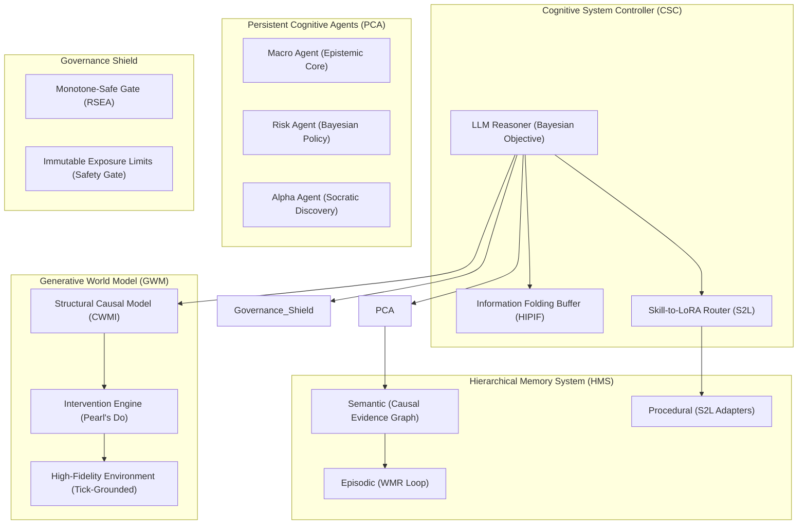

# Phase 5: AlphaAlgo Unified Scientific Architecture (UCA-2026)

The UCA-2026 is a single, coherent cognitive architecture synthesized from the 16 foundational papers. It rejects the "Swarm Mirage" in favor of a **Unified Cognitive Controller** managing **Persistent Persistent Agents** via **Information Folding** and **Causal Sandboxing**.

---

## 1. The UCA-2026 Schematic

---

## 2. Core Architectural Pillars

### 2.1 The Unified Cognitive Controller (CSC)
*   **Role**: The "One Brain." Replaces every existing orchestrator.
*   **Mechanism**: Implements **Active Inference** (Minimizing Free Energy) as its global objective. It manages the lifecycle of all PCAs and governs the flow of information.
*   **Context Management**: Uses the **Folding Operator** to compress interaction logs every time a subgoal is reached.

### 2.2 Persistent Cognitive Agents (PCA)
*   **Role**: Specialized reasoning entities that carry state across market sessions.
*   **Mechanism**: Each PCA has an **Epistemic Core** (Bayesian Belief State). They do not communicate via raw text but via **Transactive Memory** (sharing artifacts in the Semantic Graph).
*   **Efficiency**: PCAs use **S2L LoRA Adapters** to execute standardized trading behaviors without prompt overhead.

### 2.3 The Causal World Model (GWM)
*   **Role**: The system's "Imagination" and "Risk Simulator."
*   **Mechanism**: A **Structural Causal Model (SCM)** that maps the causal relationships between market variables. It supports **Counterfactual Reasoning** ("What if I had taken trade X?").
*   **Grounding**: Grounded in the **High-Fidelity Environment**, which uses real tick data and order book depth, eliminating the "Delusion Loop."

### 2.4 The Causal Evidence Graph (HMS)
*   **Role**: The source of truth for all research and decision-making.
*   **Mechanism**: Replaces passive RAG with a **Graph of Evidence**. Every claim (e.g., "Market is Bullish") must be logically linked to a source (e.g., "CPI Data") and a mechanism (e.g., "Rate Cut Expectation").

---

## 3. The OSA Loop (Observe-Simulate-Act)

1.  **Observe**: Ingest multi-modal data; update the **Epistemic Core** of relevant PCAs.
2.  **Simulate (Sandbox)**:
    *   Propose a plan branch.
    *   Query the GWM for a **Structural Intervention** ($do(X)$).
    *   Analyze the distribution of world states and calculate **Expected Value (EV)**.
3.  **Act**:
    *   Select the policy that minimizes **Expected Free Energy**.
    *   Activate the required **S2L LoRA** (e.g., `ExecutionLoRA`).
    *   Execute via institutional adapters.
4.  **Reflect**:
    *   Use **SocraticPO** feedback from the Backtest Engine to diagnose errors.
    *   **Fold** the subgoal history into the Semantic Graph.

---

## 4. Safety & Evolution Governance

*   **Immutable Shield**: The Governance Shield is a separate, non-bypassable layer. No trade can exceed exposure limits, regardless of the CSC's "Reasoning."
*   **Strict Evolution Gate**: Any self-proposed code or parameter change must pass a **Held-out Backtest Set** with a strict "Gain Metric" check. If it does not improve performance, it is rejected and logged.
