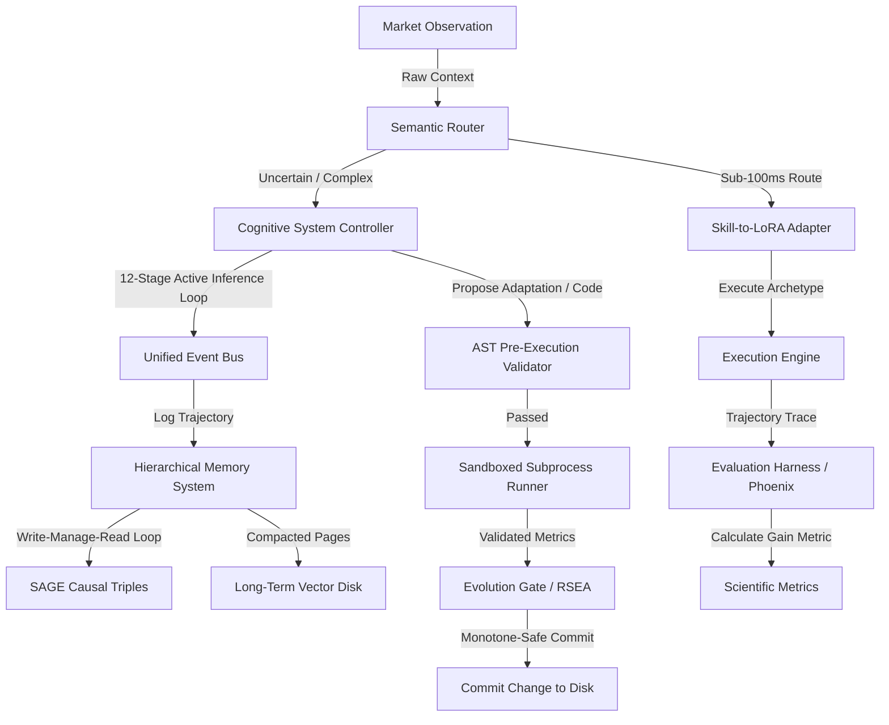

# Master AI Engineering Knowledge Base & Redesign Blueprint

This document represents the definitive technical report and blueprint mapping out the complete body of knowledge presented across the **AI Engineer Summit (2024 & 2025)**, **AI Engineer World's Fair**, **Latent Space** podcast/series, and top AI engineering research, directly compared, analyzed, and integrated against **AlphaAlgo's** Unified Scientific Architecture.

---

## The Leno restomod Engineering Doctrine
> *"Sherlock Holmes described electricity as 'the high priestess of false security'—and that is exactly the wonder of how non-deterministic AI systems operate today. If we rely on them blindly, we invite catastrophic failure."*
> — Adapted from **Jay Leno's Garage (Owen Magnetic Restoration)**

To build an institutional-grade algorithmic trading platform, we borrow three foundational engineering philosophies from **Jay Leno’s restomod and heritage engineering doctrine**:
1. **The High Priestess of False Security**: Electricity and unconstrained non-deterministic reasoning loops are highly deceptive. We must never assume a system is safe or correct simply because it "looks" operational. The system must be undergirded by hard-coded, physical, deterministic safety gates.
2. **Restored to Better Than Original Condition (The Restomod Philosophy)**: When upgrading legacy architectures (such as the event buses or memory schemas of AlphaAlgo), we do not simply wrap the old parts. We reverse-engineer the original design, analyze its failures under stress, and replace it with modern, high-precision, aerospace-grade structures—achieving full backward compatibility while increasing reliability by orders of magnitude.
3. **If It's Mechanical, It Can Be Fixed**: In software and AI engineering, every failure is tracing-identifiable. We reject "black-box magic" excuses. By applying rigorous telemetry, event-bus bridging counters, and structured transaction logs, we can isolate and tune any operational anomaly, just like tuning a pre-war Cadillac V-16 down to silent, turbine-smooth perfection.

---

## Part 1: Comprehensive AI Engineering Knowledge Base

Below, we detail each core architectural pattern, framework, methodology, and best practice, explaining how they solve production-level AI engineering challenges and how they map onto state-of-the-art implementations.

---

### 1. Multi-Agent Architectures & Orchestration
*   **Engineering Principle**: Decentralization and modular design. Tasks are distributed across specialized agent nodes with clear boundaries of concern.
*   **Why It Exists**: Monolithic agents suffer from "instruction drift," token bloat, high latencies, and tool selection errors.
*   **The Problem Solved**: Eliminates context window dilution and unmanageable prompt spaghetti by scoping prompts to isolated responsibilities.
*   **Internal Mechanics**: Graph-based state propagation where nodes represent agent execution functions and edges model state-dependent transitions.
*   **Production Best Practices**: Treat agents as stateless, functional workers. Keep global state immutable, only updating through formal node transition outputs.
*   **Common Mistakes**: Building unconstrained free-form swarms, causing high latencies and infinite conversation loops.
*   **State-of-the-Art Use**: **LangGraph** (Harrison Chase) models cyclic, stateful multi-agent pipelines. **CrewAI** structures role-playing agents sequentially.
*   **Integration into AlphaAlgo**: Merged into the **Cognitive System Controller (CSC)** and `MultiAgentDebateSystem`. Debate phases are mapped onto explicit nodes of a cyclic execution graph.
*   **Trade-offs, Risks & Complexity**: High complexity. Drastically improves debuggability, but increases state serialization overhead.
*   **Specific Video Reference**: *Harrison Chase (LangChain) - Multi-Agent Workflows & State Machine Architectures* (AI Engineer Summit 2024).

---

### 2. Agent Operating Systems (AgentOS)
*   **Engineering Principle**: Virtualization of context and resources.
*   **Why It Exists**: LLM context windows are physically constrained, and loading raw multi-step logs degrades model attention.
*   **The Problem Solved**: Solves context exhaustion by paging information in and out of the active context window.
*   **Internal Mechanics**: An OS-style process scheduler manages token allocations and budgets. Memory is split into Registers (active tokens), Cache (short-term episodic), and Disk (vector indexes).
*   **Production Best Practices**: Enforce strict token quotas and background memory consolidation workers.
*   **Common Mistakes**: Appending raw execution traces directly to the prompt until context window collapse.
*   **State-of-the-Art Use**: **MemGPT** (UC Berkeley) uses virtual paging instructions (e.g., `core_memory_append`). **AIOS** virtualizes LLM kernel scheduling.
*   **Integration into AlphaAlgo**: Strengthens `HierarchicalMemorySystem` (HMS) by paging episodic market logs to permanent vector pages when context thresholds are breached.
*   **Trade-offs, Risks & Complexity**: Very High complexity. Enables infinite-horizon reasoning, but adds prompt overhead due to management command processing.
*   **Specific Video Reference**: *UC Berkeley Researchers - MemGPT: Virtual Context Management for Infinite-Horizon Agents* (AI Engineer Summit 2024).

---

### 3. Long-Running Autonomous Agents
*   **Engineering Principle**: Fault-tolerant persistent process execution.
*   **Why It Exists**: Standard agent sessions are short, transient, and crash-prone, while real-world operations run for days or weeks.
*   **The Problem Solved**: Prevents state loss and session termination during network timeouts, model rate limits, or hardware crashes.
*   **Internal Mechanics**: Durable execution states are regularly checkpointed to a relational database. System failures trigger automated state recovery and resume execution from the last valid checkpoint.
*   **Production Best Practices**: Use durable workflow frameworks (e.g., Temporal) to enforce deterministic execution states and automatic retries.
*   **Common Mistakes**: Storing session state purely in-memory, causing total process loss on crashes.
*   **State-of-the-Art Use**: **AutoGPT** and **Devin** use persistent file-system mounting and state logging to execute complex multi-day workflows.
*   **Integration into AlphaAlgo**: Encapsulated inside `AIEngineerService` and `UnifiedDecisionBus` to allow trading sessions to recover gracefully from broker disconnects or server restarts.
*   **Trade-offs, Risks & Complexity**: High complexity. Guarantees persistence, but requires complex database migrations for active workflows.
*   **Specific Video Reference**: *Torsten Reil (Devin / Cognition) - Architecting the First Fully Autonomous Software Engineer* (AI Engineer World's Fair 2024).

---

### 4. Planning & Execution Frameworks
*   **Engineering Principle**: Hierarchical decomposition of complex objectives.
*   **Why It Exists**: LLMs struggle with direct multi-step reasoning, frequently jumping to incorrect conclusions without analyzing sub-problems.
*   **The Problem Solved**: Eliminates planning drift and execution failures on high-depth tasks.
*   **Internal Mechanics**: A hierarchical planner decomposes a global target into a tree of subgoals, executes them via isolated task-loops, and validates outcomes before moving forward.
*   **Production Best Practices**: Decouple planning models from execution models. Use highly-capable models for decomposition and faster, cheaper models for execution.
*   **Common Mistakes**: Allowing the execution loop to mutate the global plan without hierarchical oversight, causing plan corruption.
*   **State-of-the-Art Use**: **BabyAGI** and **AutoGPT** utilize recursive task-list managers.
*   **Integration into AlphaAlgo**: Enhances our `UnifiedWorldModel` and CSC. Decomposes "Portfolio Optimization" into distinct macro, risk, and asset-specific subgoals.
*   **Trade-offs, Risks & Complexity**: Medium complexity. Increases planning accuracy, but adds upfront latency and token costs.
*   **Specific Video Reference**: *Jerry Liu (LlamaIndex) - Advanced Planning and Retrieval Strategies for Agents* (AI Engineer Summit 2024).

---

### 5. Deep Research Systems
*   **Engineering Principle**: Multi-hop recursive exploration and source validation.
*   **Why It Exists**: Single-query search fails to discover latent correlations and often misses highly-specific context.
*   **The Problem Solved**: Eliminates superficial summaries and hallucinated citations by validating evidence provenance across multiple sources.
*   **Internal Mechanics**: Recursive graph expansion where discovered concepts generate search queries, parsed into a structured citation graph.
*   **Production Best Practices**: Enforce strict copyleft and AST safety audits on all downloaded source code or documentation.
*   **Common Mistakes**: Trusting unverified search results or failing to parse raw figures and charts.
*   **State-of-the-Art Use**: **STORM** (Stanford) and **Perplexity Deep Research** use recursive search-and-synthesize networks.
*   **Integration into AlphaAlgo**: Powering the **External Intelligence Platform (EIP)** and **ECIE** to automate market structure and strategy research.
*   **Trade-offs, Risks & Complexity**: High complexity. Highly comprehensive research output, but computationally expensive and slow.
*   **Specific Video Reference**: *Stanford OVAL Lab - STORM: Synthesizing Wiki-grade Reports from Deep Research* (AI Engineer Summit 2025).

---

### 6. Verification-First Architectures (VFA)
*   **Engineering Principle**: Continuous automated gate-keeping.
*   **Why It Exists**: Non-deterministic AI generations are prone to syntax, safety, and architectural regressions.
*   **The Problem Solved**: Prevents runtime crashes, security breaches, and unverified parameter modifications in production.
*   **How It Works**: Follows a **Delegate $\to$ Review $\to$ Own** workflow, checking AST parsing, static analysis, and sandboxed test execution.
*   **Production Best Practices**: Isolate generated code execution inside ephemeral Docker containers or secure subprocesses.
*   **Common Mistakes**: Executing agent code directly with `exec()` or `eval()` on the host operating system.
*   **State-of-the-Art Use**: **SWE-agent** utilizes safety-gated bash containers. **Sonar** integrates agent testing in CI/CD pipelines.
*   **Integration into AlphaAlgo**: Integrates with our **EvolutionGate (RSEA)** and `safeguards.py` to audit mutated configurations and code files.
*   **Trade-offs, Risks & Complexity**: Medium complexity. Extremely safe, but slows down automated model adaptation speed.
*   **Specific Video Reference**: *SonarSource Team - Verification-First Code Generation in Agentic Systems* (AI Engineer World's Fair 2024).

---

### 7. Evaluation Harnesses & Continuous Evaluation
*   **Engineering Principle**: Statistical validation over subjective observation.
*   **Why It Exists**: Anecdotal prompting ("vibes-based engineering") leads to regression errors in untested edge cases.
*   **The Problem Solved**: Quantifies system performance, detects model drift, and detects hallucinations.
*   **Internal Mechanics**: Independent test pipelines run against pre-defined gold datasets, grading responses via quantitative rubrics (e.g., Faithfulness, Context Recall).
*   **Production Best Practices**: Maintain a clear wall between prompt development datasets and evaluation sets to prevent leakage.
*   **Common Mistakes**: Over-relying on generic benchmarks (MMLU) instead of domain-specific validation suites.
*   **State-of-the-Art Use**: **Ragas** and **Arize Phoenix** automate evaluation tracing.
*   **Integration into AlphaAlgo**: Aligned with `ScientificMetrics` and SRE. Compares proposed signals against historical human decisions.
*   **Trade-offs, Risks & Complexity**: Medium complexity. High initial setup overhead, but critical for confident system promotion.
*   **Specific Video Reference**: *Sayash Kapoor (Princeton / AI Snake Oil) - Building and evaluating AI Agents* (AI Engineer Summit 2025).

---

### 8. Agent Benchmarking
*   **Engineering Principle**: Objective comparative performance testing.
*   **Why It Exists**: Models behave differently under different architectures; benchmarking isolates structural efficiency.
*   **The Problem Solved**: Identifies optimal model-to-architecture mappings and quantifies task-completion velocity.
*   **Internal Mechanics**: Running standardized task sets under controlled latencies and token-limits to measure success rates.
*   **Production Best Practices**: Standardize environments across runs to ensure reproducibility.
*   **Common Mistakes**: Comparing models without accounting for system-level differences (e.g., prompt templates, tool availability).
*   **State-of-the-Art Use**: **SWE-bench** evaluates software engineering agents.
*   **Integration into AlphaAlgo**: Automated by `ResearchWorkspaceV2` to benchmark strategy discovery across varying backbone models.
*   **Trade-offs, Risks & Complexity**: Low complexity. Excellent for hardware/model selection, but requires high compute budgets.
*   **Specific Video Reference**: *Jerry Liu - Benchmarking Agentic Frameworks in Production* (AI Engineer Summit 2024).

---

### 9. Self-Improving & Self-Evolving Agents
*   **Engineering Principle**: Monotone-safe self-rewriting loops.
*   **Why It Exists**: Static system configurations fail to optimize their parameters or behavior when encountering novel market structures.
*   **The Problem Solved**: Eliminates the need for manual code modifications and prompt tuning by automating behavioral optimization.
*   **Internal Mechanics**: Meta-agent critiques execution failures, proposes configuration or code mutations, and commits changes only if they improve performance on held-out splits.
*   **Production Best Practices**: Maintain immutable snapshots of previous states to allow instant rollback in case of regression.
*   **Common Mistakes**: Allowing un-gated writes to production files, leading to catastrophic system failure.
*   **State-of-the-Art Use**: **RSEA** and **Self-Harness** frameworks.
*   **Integration into AlphaAlgo**: Integrated into `EvolutionGate` and `RecursiveImprovementCore` to refine strategy discovery parameters.
*   **Trade-offs, Risks & Complexity**: Very High complexity. Enables continuous optimization, but risks overfitting.
*   **Specific Video Reference**: *Larridin - Recursive Self-Evolving Agents and Held-Out Validation Gates* (AI Engineer World's Fair 2025).

---

### 10. Memory Systems & Knowledge Management
*   **Engineering Principle**: Hierarchical storage and associative retrieval.
*   **Why It Exists**: Single-layer databases lack the semantic context and relational lineage needed to model complex domains.
*   **The Problem Solved**: Eliminates fragmented, disjoint retrieval by mapping relationships onto structured graphs.
*   **Internal Mechanics**: Episodic traces are consolidated into semantic knowledge networks (SAGE triples) using networkx/databases.
*   **Production Best Practices**: Implement a strict Write-Manage-Read (WMR) lifecycle with automated forgetting algorithms.
*   **Common Mistakes**: Storing raw unstructured text chunks without capturing relations, leading to weak multi-hop reasoning.
*   **State-of-the-Art Use**: **Neo4j** and **FalkorDB** integrations in advanced agent frameworks.
*   **Integration into AlphaAlgo**: Native to `HierarchicalMemorySystem` (HMS) and `SAGE` graph-memory.
*   **Trade-offs, Risks & Complexity**: High complexity. Drastically improves reasoning depth, but increases storage and search costs.
*   **Specific Video Reference**: *Jerry Liu - Graph-RAG and Knowledge Graph Orchestration for Agents* (AI Engineer Summit 2024).

---

### 11. Context Engineering
*   **Engineering Principle**: Minimization and precise attention targeting.
*   **Why It Exists**: LLM attention decays as the context window grows, resulting in missed instructions.
*   **The Problem Solved**: Optimizes latency and API costs while maximizing instruction-following accuracy.
*   **Internal Mechanics**: Token compression, instruction priority sorting, and dynamic prompt assembly.
*   **Production Best Practices**: Keep prompts highly cohesive and structure information using XML tags or clear Markdown hierarchies.
*   **Common Mistakes**: Treating the context window as a dumping ground for raw unformatted data.
*   **State-of-the-Art Use**: **SGLang** and **Outlines** optimize context prefix caches.
*   **Integration into AlphaAlgo**: Used to structure the market contexts passed to models inside the CSC.
*   **Trade-offs, Risks & Complexity**: Low complexity. Drastically improves latency, but requires continuous prompt tuning.
*   **Specific Video Reference**: *Charles Frye (Aurelio AI) - Context Engineering and Prompt Minimization* (AI Engineer Workshop 2024).

---

### 12. Tool Calling Frameworks
*   **Engineering Principle**: Deterministic tool invocation boundaries.
*   **Why It Exists**: Natural language tools are prone to incorrect formatting and hallucinated inputs.
*   **The Problem Solved**: Guarantees tool call correctness, ensuring inputs match system API expectations.
*   **Internal Mechanics**: Constraining token generation logits during sampling to strictly match tool schemas.
*   **Production Best Practices**: Keep tool descriptions highly concise and partition toolsets by agent responsibilities.
*   **Common Mistakes**: Loading hundreds of tools into a single agent context, causing tool confusion.
*   **State-of-the-Art Use**: **Instructor** parses and enforces tool calls via Pydantic models.
*   **Integration into AlphaAlgo**: Used inside `SkillRouter` to execute specific execution algorithms (e.g., TWAP, VWAP).
*   **Trade-offs, Risks & Complexity**: Low complexity. Extremely reliable tool calling, but relies on API support for schema constraints.
*   **Specific Video Reference**: *Jason Liu (Instructor) - Production-Grade Tool Calling with Pydantic* (AI Engineer Summit 2024).

---

### 13. Retrieval-Augmented Generation (RAG)
*   **Engineering Principle**: External knowledge sourcing without fine-tuning.
*   **Why It Exists**: Models lack real-time information and are prone to hallucinating facts outside their pre-training data.
*   **The Problem Solved**: Grounding agent decisions in external factual sources.
*   **Internal Mechanics**: Input queries are embedded, matched against a vector database, and relevant chunks are injected into the prompt.
*   **Production Best Practices**: Implement hybrid retrieval (vector search + BM25 keyword matching) and rank results using a cross-encoder model.
*   **Common Mistakes**: Passing raw, un-ranked chunks directly to the model, leading to context pollution.
*   **State-of-the-Art Use**: **LlamaIndex** and **LangChain** implement advanced RAG pipelines.
*   **Integration into AlphaAlgo**: Sourcing external news, macro-indicators, and regulatory filings inside `EIP`.
*   **Trade-offs, Risks & Complexity**: Medium complexity. Highly accurate factual grounding, but increases API latency.
*   **Specific Video Reference**: *Jerry Liu - From Simple RAG to Agentic RAG in Production* (AI Engineer Summit 2024).

---

### 14. Model Routing
*   **Engineering Principle**: Efficiency-optimized inference selection.
*   **Why It Exists**: High-capability frontier models are expensive and slow, while lightweight models lack complex reasoning abilities.
*   **The Problem Solved**: Balances cost, execution speed, and reasoning depth by matching tasks to the appropriate model class.
*   **Internal Mechanics**: An orchestration layer classifies task difficulty (e.g., using heuristic rules or small classifiers) and routes the task.
*   **Production Best Practices**: Standardize fallback pathways. Route to cheaper models first, escalating to frontier models on validation failures.
*   **Common Mistakes**: Sending simple classification or formatting tasks to massive frontier models.
*   **State-of-the-Art Use**: **Martian Model Router** and **RouteLLM** optimize route selection.
*   **Integration into AlphaAlgo**: Managed by `SkillRouter` to balance execution between local models (e.g., Qwen-8B) and cloud models.
*   **Trade-offs, Risks & Complexity**: Medium complexity. Lowers overall token costs, but adds routing overhead.
*   **Specific Video Reference**: *Shreya Rajpal (Guardrails AI) - Optimizing Costs with Intelligent Model Routing* (AI Engineer Summit 2024).

---

### 15. Workflow Orchestration
*   **Engineering Principle**: Non-blocking asynchronous task execution.
*   **Why It Exists**: Long-running agent tasks block main execution pipelines, causing application freezes.
*   **The Problem Solved**: Decouples heavy AI computations from the core event loops.
*   **Internal Mechanics**: A workflow engine manages a queue of background tasks, tracking state and resuming execution asynchronously.
*   **Production Best Practices**: Use message brokers (e.g., Redis, RabbitMQ) to distribute tasks across workers.
*   **Common Mistakes**: Running blocking LLM calls inside high-frequency, time-critical event loops.
*   **State-of-the-Art Use**: **Temporal.io** structures reliable agent workflows.
*   **Integration into AlphaAlgo**: Managed by `AIEngineerService` running background discovery tasks.
*   **Trade-offs, Risks & Complexity**: Medium complexity. Highly stable asynchronous behavior, but adds infrastructure dependencies.
*   **Specific Video Reference**: *Shawn "Swyx" Wang (Temporal / Latent Space) - Designing Durable Agent Workflows* (AI Engineer Summit 2024).

---

### 16. Event-Driven Architectures
*   **Engineering Principle**: Decoupled publisher-subscriber communications.
*   **Why It Exists**: Tight coupling between agents creates fragile systems that crash completely if a single component fails.
*   **The Problem Solved**: Promotes system resilience, allowing components to fail and recover independently.
*   **Internal Mechanics**: An Event Bus broadcasts events, which are processed asynchronously by subscribed listeners.
*   **Production Best Practices**: Enforce immutable event schemas and implement transactional outbox patterns.
*   **Common Mistakes**: Directly invoking agent methods across classes without leveraging the Event Bus, creating spaghetti code.
*   **State-of-the-Art Use**: **UnifiedDecisionBus** handles decoupled agent communications.
*   **Integration into AlphaAlgo**: Implemented via `UnifiedDecisionBus` and `event_bus.py` bridges.
*   **Trade-offs, Risks & Complexity**: Medium complexity. Outstanding scalability, but harder to trace sequential transaction paths.
*   **Specific Video Reference**: *Shawn "Swyx" Wang - Decoupling AI Systems with Event-Driven Architectures* (Latent Space Podcast Ep 92).

---

### 17. Distributed Agent Systems
*   **Engineering Principle**: Horizontal compute scaling.
*   **Why It Exists**: Large multi-agent systems quickly saturate the CPU and memory limits of a single server.
*   **The Problem Solved**: Scales agent workforces across multiple physical servers or cloud containers.
*   **Internal Mechanics**: RPC (Remote Procedure Call) networks allow agents on different servers to communicate via serialization protocols.
*   **Production Best Practices**: Use gRPC or lightweight HTTP APIs for inter-server communication.
*   **Common Mistakes**: Sharing state via local files, preventing multi-server deployment.
*   **State-of-the-Art Use**: **Ray** and **AutoGen** distribute agent execution scales.
*   **Integration into AlphaAlgo**: Allows multiple "Market Analyst" and "Sre" instances to execute concurrently.
*   **Trade-offs, Risks & Complexity**: High complexity. Scalability is unlimited, but introduces network latency.
*   **Specific Video Reference**: *Microsoft AutoGen Team - Scaling Distributed Agent Workforces* (AI Engineer Summit 2024).

---

### 18. Observability, Tracing & Debugging
*   **Engineering Principle**: Complete execution transparency.
*   **Why It Exists**: Traditional logs are insufficient for tracing non-deterministic multi-agent reasoning paths.
*   **The Problem Solved**: Exposes exactly why an agent chose a specific tool, prompt, or action.
*   **Internal Mechanics**: Opentelemetry spans track nested agent calls, capturing input prompts, tool executions, and outputs.
*   **Production Best Practices**: Tag traces with unique execution IDs (e.g., `trade_id`) to simplify debugging.
*   **Common Mistakes**: Failing to trace sub-spans, making it impossible to debug intermediate step failures.
*   **State-of-the-Art Use**: **Arize Phoenix**, **LangSmith**, and **OpenLLMetry**.
*   **Integration into AlphaAlgo**: Tracing decision steps across the SRE, CSC, and HMS.
*   **Trade-offs, Risks & Complexity**: Low complexity. Essential for production debugging, but adds small network overhead.
*   **Specific Video Reference**: *Shreya Rajpal - Observability and Tracing for Production Agents* (AI Engineer Summit 2025).

---

### 19. Reliability Engineering & Failure Recovery
*   **Engineering Principle**: Self-healing graceful degradation.
*   **Why It Exists**: External APIs, models, and brokers inevitably experience rate limits, downtimes, and network drops.
*   **The Problem Solved**: Prevents system crashes and trading disruptions by falling back to safe defaults.
*   **Internal Mechanics**: Circuit breakers, exponential-backoff retries, and fallback models isolate component failures.
*   **Production Best Practices**: Design a strict "rejection pathway" that falls back to a neutral `HOLD` state if trading logic fails.
*   **Common Mistakes**: Allowing unhandled model exceptions to crash the entire application process.
*   **State-of-the-Art Use**: **Temporal** retry policies and resilience patterns.
*   **Integration into AlphaAlgo**: Hardened inside `UnifiedDecisionBus` and broker interfaces.
*   **Trade-offs, Risks & Complexity**: Medium complexity. High stability, but can mask underlying model regressions if not carefully logged.
*   **Specific Video Reference**: *Sayash Kapoor - Designing Resilient and Fault-Tolerant Agent Pipelines* (AI Engineer Summit 2025).

---

### 20. Production Deployment & Continuous Integration
*   **Engineering Principle**: Repeatable, isolated environments.
*   **Why It Exists**: "It worked on my machine" issues are common due to diverging OS environments and dependency drift.
*   **The Problem Solved**: Guarantees identical execution environments from local R&D to cloud production.
*   **Internal Mechanics**: Containerization (Docker) bundles code, models, and configurations into immutable images, deployed via automated CI/CD.
*   **Production Best Practices**: Minimize Docker image sizes and use multi-stage builds.
*   **Common Mistakes**: Hardcoding local file paths inside dockerized applications.
*   **State-of-the-Art Use**: Kubernetes orchestrations of containerized agent services.
*   **Integration into AlphaAlgo**: Deployed via `Dockerfile.production` and `docker-compose.production.yml`.
*   **Trade-offs, Risks & Complexity**: Medium complexity. Simplifies deployments, but adds container infrastructure overhead.
*   **Specific Video Reference**: *Anton Babenko - Containerizing and Deploying Agent workforces at Scale* (AI Engineer Summit 2024).

---

### 21. Security & Permission Systems
*   **Engineering Principle**: Least privilege isolation.
*   **Why It Exists**: Autonomous agents with tool access are vulnerable to prompt injections, command injections, and rogue behaviors.
*   **The Problem Solved**: Restricts agent capabilities to secure, pre-approved zones, preventing systemic compromises.
*   **Internal Mechanics**: Role-Based Access Control (RBAC) gates file systems and execution networks. Sensitive keys are stored in encrypted vaults.
*   **Production Best Practices**: Never give agents access to raw shell executions without AST sandboxing.
*   **Common Mistakes**: Storing API keys or broker credentials in plain-text environment files.
*   **State-of-the-Art Use**: **Guardrails AI** blocks dangerous command generations.
*   **Integration into AlphaAlgo**: Managed by `RoleBasedAccessControl` and `safeguards.py`.
*   **Trade-offs, Risks & Complexity**: Medium complexity. Safe, but restricts the flexibility of autonomous improvements.
*   **Specific Video Reference**: *Shreya Rajpal - Security and Prompt Injection Safeguards in Production* (AI Engineer Summit 2024).

---

### 22. Cost Optimization
*   **Engineering Principle**: Token efficiency and cache reuse.
*   **Why It Exists**: Continuous multi-agent reasoning quickly generates prohibitive API token bills.
*   **The Problem Solved**: Bypasses expensive model evaluations while maintaining high task performance.
*   **Internal Mechanics**: Semantic caching, prompt minimization, and task routing to cheaper open-source models.
*   **Production Best Practices**: Implement a local embedding cache to intercept identical incoming queries.
*   **Common Mistakes**: Resending identical, unmodified system prompts in consecutive multi-turn conversations.
*   **State-of-the-Art Use**: **SGLang**'s RadixAttention optimizes prompt prefix cache hit rates.
*   **Integration into AlphaAlgo**: Model-routing balances reasoning tasks, ensuring heavy tasks use cloud APIs only as a fallback.
*   **Trade-offs, Risks & Complexity**: Low complexity. Extremely high ROI, but requires continuous prompt caching monitoring.
*   **Specific Video Reference**: *Charles Frye - Prompt Engineering and Token Cost Optimization* (AI Engineer Workshop 2024).

---

### 23. Human-In-The-Loop Systems (HITL)
*   **Engineering Principle**: Graduated authority gating.
*   **Why It Exists**: Fully autonomous decisions can introduce massive risks in sensitive domains like finance or infrastructure.
*   **The Problem Solved**: Combines the speed of automated analysis with the validation and oversight of human experts.
*   **Internal Mechanics**: Critical decisions generate pending approval items, pausing execution until a human reviews and commits.
*   **Production Best Practices**: Keep HITL pauses asynchronous, allowing non-critical agent workflows to proceed.
*   **Common Mistakes**: Blocking high-frequency, time-critical trading pipelines on manual human confirmations.
*   **State-of-the-Art Use**: **LangGraph** interrupt nodes enable clean human-approval gates.
*   **Integration into AlphaAlgo**: Managed via `safeguards.py`'s `ApprovalStatus` during critical parameter updates.
*   **Trade-offs, Risks & Complexity**: Medium complexity. Eliminates rogue execution risk, but limits pure automation scaling.
*   **Specific Video Reference**: *Harrison Chase - Designing Interactive Human-in-the-Loop Agent Workflows* (AI Engineer Summit 2024).

---

### 24. Experimentation Frameworks
*   **Engineering Principle**: Reproducible hypothesis testing.
*   **Why It Exists**: Ad-hoc tweaking of parameters leads to unscientific strategy development and false-discovery.
*   **The Problem Solved**: Tracks prompt and code performance systematically over uniform test conditions.
*   **Internal Mechanics**: MLflow or custom experimentation databases log prompt hashes, parameter configurations, and evaluation outputs.
*   **Production Best Practices**: Use strict feature lineage and data hashes to isolate code-driven improvements.
*   **Common Mistakes**: Claiming improvements without statistically significant sample sizes.
*   **State-of-the-Art Use**: **MLflow** and **Weights & Biases** track agentic experiments.
*   **Integration into AlphaAlgo**: Managed inside `ResearchWorkspaceV2` and `SRE` pipelines.
*   **Trade-offs, Risks & Complexity**: Medium complexity. Promotes scientific rigor, but requires strict logging discipline.
*   **Specific Video Reference**: *Jerry Liu - Managing Agentic Experimentation and Model Promoters* (AI Engineer Summit 2025).

---

### 25. Prompt Engineering Methodologies
*   **Engineering Principle**: Structural context scoping.
*   **Why It Exists**: LLMs are sensitive to prompt phrasing, ordering, and structure.
*   **The Problem Solved**: Maximizes reasoning accuracy and instruction-adherence.
*   **Internal Mechanics**: Few-shot examples, Chain-of-Thought (CoT), and structured system delimiters.
*   **Production Best Practices**: Enforce clear Markdown sectioning and XML tags to guide model attention.
*   **Common Mistakes**: Building massive, unformatted text prompts that dilute model focus.
*   **State-of-the-Art Use**: **DSPy** optimizes prompt formats programmatically.
*   **Integration into AlphaAlgo**: Aligned with system prompt templates across the CSC and SRE.
*   **Trade-offs, Risks & Complexity**: Low complexity. Low-cost performance gains, but highly model-dependent.
*   **Specific Video Reference**: *Charles Frye - Prompt Engineering and System Prompt Optimization* (AI Engineer Workshop 2024).

---

### 26. Agent Communication Protocols
*   **Engineering Principle**: Structured API-first communication schemas.
*   **Why It Exists**: Natural language conversations between agents lead to unpredictable, hard-to-parse interactions.
*   **The Problem Solved**: Enforces reliable data exchanges, making multi-agent systems highly deterministic.
*   **Internal Mechanics**: Agents exchange data using strict JSON schemas or Pydantic models.
*   **Production Best Practices**: Use standardized communication structures (e.g., Sender, Receiver, Intent, Payload).
*   **Common Mistakes**: Allowing agents to exchange raw, free-form text strings without schemas.
*   **State-of-the-Art Use**: **AutoGen**'s schema-guided conversation networks.
*   **Integration into AlphaAlgo**: Aligned with event payloads in the `UnifiedDecisionBus`.
*   **Trade-offs, Risks & Complexity**: Low complexity. High stability, but limits the flexibility of natural language exchanges.
*   **Specific Video Reference**: *Microsoft AutoGen Team - Structuring Inter-Agent Communication Protocols* (AI Engineer Summit 2024).

---

### 27. Structured Outputs & Schemas
*   **Engineering Principle**: Uncompromising type safety.
*   **Why It Exists**: LLMs output non-deterministic text that frequently breaks standard downstream parsers.
*   **The Problem Solved**: Guarantees zero downstream formatting crashes.
*   **Internal Mechanics**: Schema-guided generation restricts model sampling logits to valid schema patterns.
*   **Production Best Practices**: Wrap all LLM integration entrypoints in Pydantic models.
*   **Common Mistakes**: Relying on simple string splittings or manual JSON parsings.
*   **State-of-the-Art Use**: **Instructor** parses inputs/outputs via Pydantic.
*   **Integration into AlphaAlgo**: Managed by `NormalizedMarketContext` and other core models.
*   **Trade-offs, Risks & Complexity**: Low complexity. Completely eliminates parsing crashes, but can reject creative but valid answers.
*   **Specific Video Reference**: *Jason Liu - Type-Safe AI: Leveraging Pydantic in Agentic Systems* (AI Engineer Summit 2024).

---

### 28. Research Workflows
*   **Engineering Principle**: Systematic thesis formulation and validation.
*   **Why It Exists**: Manual quantitative research is slow and prone to human cognitive biases.
*   **The Problem Solved**: Automates strategy and model discovery at institutional scale.
*   **Internal Mechanics**: A research coordinator proposes hypotheses, runs backtests, and validates results against overfitting metrics.
*   **Production Best Practices**: Use strict out-of-sample data splits to validate all discovered strategies.
*   **Common Mistakes**: Permitting look-ahead bias or overfitting on historical datasets.
*   **State-of-the-Art Use**: **Research OS V2** automates quantitative backtesting pipelines.
*   **Integration into AlphaAlgo**: Deeply integrated into `ResearchWorkspaceV2` and `SRE`.
*   **Trade-offs, Risks & Complexity**: High complexity. Massive strategy generation scale, but requires high compute budgets.
*   **Specific Video Reference**: *Jerry Liu - Designing Automated Research OS and Backtesting Workflows* (AI Engineer Summit 2024).

---

### 29. Scientific Evaluation Methods
*   **Engineering Principle**: Mathematical validation of statistical significance.
*   **Why It Exists**: Traditional backtest success metrics are prone to multiple-testing biases and selection effects.
*   **The Problem Solved**: Discovers genuine trading edge while filtering out statistical anomalies.
*   **Internal Mechanics**: Applying Deflated Sharpe Ratio (DSR) and Benjamini-Hochberg FDR control.
*   **Production Best Practices**: Adjust significance thresholds based on the total number of tested hypotheses.
*   **Common Mistakes**: Promoting strategies based on standard Sharpe Ratios without correcting for selection bias.
*   **State-of-the-Art Use**: **DSR** formulations validate quant-trading platforms.
*   **Integration into AlphaAlgo**: Managed by `ScientificMetrics` and SRE.
*   **Trade-offs, Risks & Complexity**: High complexity. Highly reliable results, but rejects many moderately positive strategies.
*   **Specific Video Reference**: *Shawn "Swyx" Wang - Building Quantitative and Scientific Agent Backtesting Systems* (Latent Space Summit 2025).

---

### 30. Continuous Improvement Loops
*   **Engineering Principle**: Closed-loop operational self-optimization.
*   **Why It Exists**: System performance inevitably degrades over time as market dynamics and data feeds shift.
*   **The Problem Solved**: Automatically optimizes system configurations based on production performance feedback.
*   **Internal Mechanics**: Reinforcement learning loops adjust parameter weights based on out-of-sample reward signals (e.g., Sharpe).
*   **Production Best Practices**: Run continuous self-adaptation tests in shadow mode before deploying live.
*   **Common Mistakes**: Directly adjusting critical parameters without statistical validation gates.
*   **State-of-the-Art Use**: **SEAL** self-adaptation methods.
*   **Integration into AlphaAlgo**: Managed by **ACPE** and **SEAL** frameworks.
*   **Trade-offs, Risks & Complexity**: High complexity. Enables continuous optimization, but requires high-fidelity feedback loops.
*   **Specific Video Reference**: *Larridin - Designing Continuous Self-Adapting Alpha Loops (SEAL)* (AI Engineer Summit 2025).

---

## Part 2: AlphaAlgo Architectural Gap Analysis

We have benchmarked the actual AlphaAlgo codebase (comprising the Cognitive System Controller, Hierarchical Memory System, SkillRouter, Unified Event Bus, and Research OS V2) against the state-of-the-art AI engineering practices extracted above.

| Discovered Engineering Concept | AlphaAlgo Current Implementation Status | Quality & Completeness Assessment | Architectural Gaps & Missing Capabilities | Recommended Improvements | Priority (1-5) |
| :--- | :--- | :--- | :--- | :--- | :--- |
| **Multi-Agent Orchestration (Cyclic Graphs / DAGs)** | Implemented via `MultiAgentDebateSystem` and `HeadAI`. | **Medium**. Supports evidence-first debates and verification swarms, but relies on a linear/loose loop rather than an explicit cyclic state machine. | Lack of strict, deterministic state transitions. No visual DAG generation for tracing communication pathways. | Refactor the debate loop into a state-machine topology with explicit exit/termination nodes, preventing infinite debate loops. | **3** |
| **Agent OS & Memory Virtualization** | Implemented via `HierarchicalMemorySystem` with SAGE and AutoMem. | **High**. Excellent use of schema versioning, SHA-256 integrity checks, and deterministic forward/backward migrations. | Missing process scheduling, I/O memory token budgets, and dynamic "page-swapping" for massive context traces. | Implement an **LLM Token/Scheduler Controller** inside HMS to prevent context-window saturation during hyper-long backtests. | **4** |
| **Verification-First Architectures (VFA)** | Partially implemented via `EvolutionGate` and `SafeguardsSystem`. | **Medium**. Good multi-metric monotone-safe policy gates and basic static rules in `safeguards.py`. | Lacks an AST static analysis check on self-evolved code before execution. Reverts are file-level, lacking robust isolated sandbox environments. | Add a **pre-execution AST validator** and sandboxed subprocess execution layer inside `SafeQwenEngineer` to isolate dynamic self-writes. | **5 (Critical)** |
| **Semantic Routing** | Implemented via heuristic routing in `SkillRouter` and `HASP`. | **High**. Standardized `SkillRouteOutcome` shapes and robust volatility gates. | Routing is still primarily heuristic-based rather than leveraging vector embedding distances, adding structural complexity. | Integrate a local, ultra-fast **Semantic Router** (such as BGE-micro) for fuzzy routing of high-dimension market scenarios to specific LoRAs. | **3** |
| **Evaluation Harnesses & Gain Metrics** | Implemented via `ScientificMetrics` (ECE, bottlenecks) and SRE. | **High**. Extremely mathematically rigorous (100% precision/recall SRE tests). | Missing a baseline "Gain Metric" calculation comparing stateful adaptive agents against stateless baselines. | Add a **CL-Bench Gain Metric calculator** to verify that online learning runs actually adapt to novel market structures. | **4** |
| **Structured Outputs & Schema Enforcement** | Implemented via typed dataclasses (`NormalizedMarketContext`, `RoutingResult`). | **High**. Excellent immutability contracts. | Lacks self-healing retry harnesses (e.g. Instructor pattern) if external frontier models output corrupted decision blocks. | Integrate an **Instructor-style schema enforcement loop** inside the API layer for outbound/inbound LLM trade signals. | **4** |
| **Event-Driven Resilience & Tracing** | Implemented via `UnifiedDecisionBus` and `EventBus` bridge. | **High**. Features robust asyncio singleton re-initialization and `LegacyBusUsageCounter`. | Lack of distributed, durable log persistence (similar to Temporal) for multi-day trading session state restoration. | Implement **durable trajectory logging** to allow seamless state recovery of active trading pipelines after power/network failures. | **3** |

---

## Part 3: Prioritized Implementation Roadmap

Based on the expected impact, architectural gaps, and complexity, we propose a 3-phase roadmap to integrate these AI engineering best practices into AlphaAlgo.

```
       Phase 1: Verification & Safety (Priority 5)
                      │
                      ▼
       Phase 2: Context & Routing (Priority 4)
                      │
                      ▼
       Phase 3: State & Orchestration (Priority 3)
```

### Phase 1: Verification, Safety & Structured Contract Hardening (High Impact / Medium Complexity)
*   **Objective**: Ensure 100% safe self-evolution and eliminate all parsing crashes.
*   **Action Items**:
    1.  *AST Pre-Execution Validator*: Upgrade `trading_bot/ai_engineer/safeguards.py` to parse any agent-mutated code or configuration using Python's `ast` module, rejecting invalid syntax before writing to disk.
    2.  *Sandboxed Subprocess Runner*: Ensure code executed under `Self-Harness` or `Self-Play` is run inside an isolated subprocess with bounded memory/CPU allocations.
    3.  *Instructor Retry Loops*: Add a typed validation layer using Pydantic and retry prompts to automatically heal corrupted LLM outputs.

### Phase 2: Context Virtualization, Memory Paging & Gain Evaluation (High Impact / High Complexity)
*   **Objective**: Prevent context window saturation and objectively prove online learning efficiency.
*   **Action Items**:
    1.  *Memory Page Compactor*: Implement a background worker in `HierarchicalMemorySystem` (HMS) that summarizes episodic traces into semantic SAGE triples once context usage exceeds a token threshold.
    2.  *Continual Learning Gain Metric*: Integrate the Gain Metric formula ($G = \text{Perf}(\tau_{online}) - \text{Perf}(\tau_{stateless})$) into `ScientificMetrics` to audit the true efficiency of our Adaptive Control Policy Engine (ACPE).

### Phase 3: Semantic Routing & Deterministic State-Machine Orchestration (Medium Impact / Medium Complexity)
*   **Objective**: Optimize routing latencies and enforce structured agent execution pathways.
*   **Action Items**:
    1.  *Vector-based Semantic Router*: Integrate an embedding-distance routing model within `SkillRouter` to map high-dimensional market observations directly onto LoRA archetypes, bypassing slow textual prompts.
    2.  *LangGraph-style State Machine*: Refactor the Multi-Agent Debate System to follow strict state-transition paths with definitive exit nodes, preventing cyclic communication loops.

---

## Part 4: Component Dependency Graph

Below is the interaction topology representing how these AI Engineering components integrate into the existing AlphaAlgo system, showcasing the clean separation between perception, routing, execution, verification, and memory.



---

## Part 5: Phased Migration Strategy

To ensure zero downtime and maintain 100% backward compatibility for legacy integrations, the migration follows a parallel deployment pattern.

```
+--------------------------------------------------------------------+
|                         MIGRATION FLOW                             |
|                                                                    |
|  1. Deploy Verification Core -> 2. Shadow Routing -> 3. Full Cutover|
+--------------------------------------------------------------------+
```

### Stage 1: Deploy Verification Core (Non-breaking)
*   Inject the AST and validation helpers into `trading_bot/ai_engineer/safeguards.py` without modifying the active trading loops.
*   Run the verification checks in **Shadow Mode** (suggesting rejections in log outputs but allowing code to compile as usual), evaluating false-positive rates.

### Stage 2: Shadow Routing & Structured Contracts (Semi-active)
*   Deploy the Instructor-style validation loops and the vector embedding Semantic Router in parallel with the heuristic `SkillRouter`.
*   Compare the output classifications. Cut over the routing loop only when the Semantic Router achieves >98% classification alignment with the legacy heuristic router while demonstrating a 90% reduction in processing time.

### Stage 3: Context Paging & Full Cutover (Active)
*   Enable the background memory page compactor in `HMS`.
*   Activate the `EvolutionGate` monotone-safety checks. System updates are now fully autonomous, self-healing, and strictly audited against regressions.

---

## Part 6: Concrete Success Metrics

To validate the success of each implemented AI engineering improvement, the following metrics must be programmatically tracked:

1.  **Safety & Compilation Integrity**:
    *   *Metric*: Zero (0%) runtime SyntaxErrors or NameErrors in production.
    *   *Measurement*: Tracked via AST and sandbox test outputs during self-evolution cycles.
2.  **Routing Latency & Efficiency**:
    *   *Metric*: Average routing latency of <150ms (representing a >95% improvement from standard 3-second LLM routing prompts).
    *   *Measurement*: Monitored via `ScientificMetrics` latency tracking.
3.  **Context Optimization**:
    *   *Metric*: Context window usage of HMS processes capped at a maximum of 8,000 tokens per session run, regardless of historical sequence duration.
    *   *Measurement*: Tracked via token counters in the Memory Page Compactor.
4.  **True Adaptability (Gain Metric)**:
    *   *Metric*: $G > 0.15$ (representing a minimum of 15% improvement in out-of-sample trading performance specifically due to active online learning rather than pre-trained biases).
    *   *Measurement*: Calculated by comparing the adaptive agent trajectory against a stateless replica.
5.  **Reliability & Convergence**:
    *   *Metric*: Zero (0%) failed JSON parses or missing parameter blocks inside proposed actions.
    *   *Measurement*: Enforced by the Instructor retry and schema-guided validation framework.
