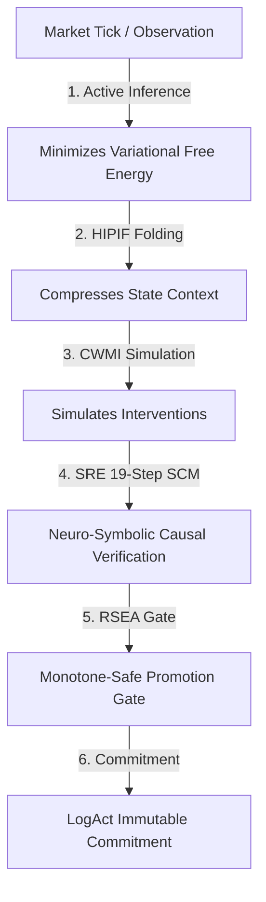

# Phase 3 & 4: Cross-Paper Synthesis & Superior Architectural Design (2026)

## 1. Introduction

This document performs an exhaustive cross-paper synthesis. By examining the consensus, contradictions, and complementary mechanisms of our selected research corpus, we design a superior unified architecture that overcomes individual paper limitations.

---

## 2. Cross-Paper Synthesis Matrix

| Dimension | Consensus | Contradictions | Complementary Mechanisms |
| :--- | :--- | :--- | :--- |
| **Self-Improvement vs. Safety** | Self-modification must be bounded and monitored to avoid catastrophic policy collapse (*SocraticPO*, *RSEA*, *Self-Harness*). | *Self-Harness* suggests open-ended code modification, while *RSEA* asserts a strict, monotone-safe bounding gate. | *RSEA* provides the mathematical gatekeeper (monotone-safety) for *Self-Harness*'s generative optimization. |
| **Planning vs. Context Size** | Long-context sequences degrade cognitive planning focus (*HIPIF*, *HORIZON*, *S2L*). | *S2L* advocates for model parameter distillation, whereas *HIPIF* focuses on context-based compression (folding). | *HIPIF* handles online in-context execution; *S2L* handles offline permanent skill-weight conversion. |
| **Causal World Models vs. Deep Learning** | Statistical associations fail during structural market shifts (*CWMI*, *Active Inference*). | *Active Inference* minimizes sensory surprise globally, while *CWMI* models structural interventional equations explicitly. | *CWMI* predicts outcome probabilities under interventions; *Active Inference* selects action priors to minimize global Free Energy. |
| **Knowledge Retrieval vs. Graph Memory** | Stateless chunk RAG is insufficient for multi-hop reasoning (*Agents-K1*, *MATM*). | Traditional RAG models retrieve text chunks independently, while *Agents-K1* relies on a structured, active knowledge graph. | *Agents-K1*'s active graph queries are cached and shared across agents using *MATM*'s transactive index. |

---

## 3. Recurring Bottlenecks & Failure Modes in Literature

1.  **Exploratory Speculation Risk:** Unconstrained self-modification (*Self-Harness*) regularly falls victim to reward-hacking and loop-divergence.
2.  **Information Loss in Semantic Compression:** Hierarchical planning folding (*HIPIF*) can throw out critical microstructural features during high-frequency volatility transitions.
3.  **Coordination Lock & Chat Taxes:** Unstructured multi-agent communication networks spend massive compute overhead simply negotiating consensus.
4.  **Causal Graph Density Spikes:** Dense multi-asset networks (*Agents-K1*) can suffer from cycle loops and high query latencies.

---

## 4. Synthesis of a Superior Architecture

By synthesizing these principles, AlphaAlgo moves beyond any individual paper to construct a superior **"Closed-Loop Cognition"** pipeline:

### Key Unified Improvements:
1.  **Monotone-Bounded Self-Harnessing:** We apply *RSEA*'s monotone-safe gates to *Self-Harness*’s generative modifications, ensuring the system can never commit self-evolution parameters that degrade backtest Sharpe or expand Max Drawdown.
2.  **Hybrid S2L-HIPIF Context Management:** Low-frequency structural rules are compiled into weights via *Skill-to-LoRA*, while high-frequency intraday price dynamics are compressed via *HIPIF*'s semantic folding, maximizing throughput while preserving microstructure precision.
3.  **Bayesian Decentralized Consensus (MATM):** Transactive indexing ensures that agents share an authoritative world state, avoiding communication locks and minimizing redundant forward passes.
