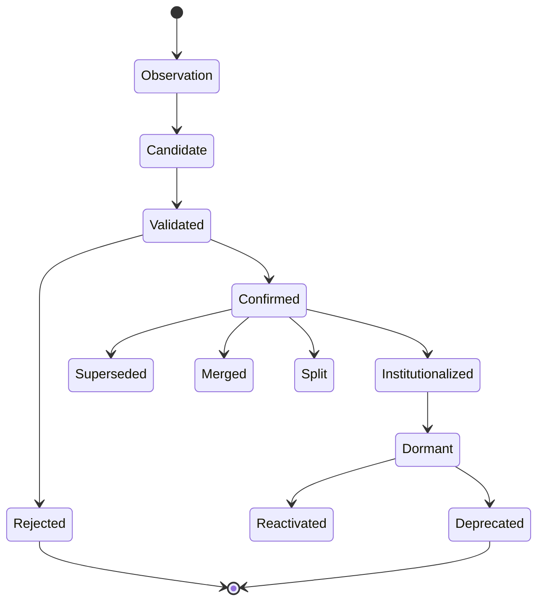

# MASTER SCIENTIFIC AUDIT REPORT
## AlphaAlgo Hypothesis Ecosystem (UCA V5 Institutional Standard)

This document represents the definitive, institutional-grade scientific audit, bottleneck analysis, and formal redesign blueprint for AlphaAlgo’s decentralized hypothesis ecosystem. It unifies all implicit and explicit prediction, belief, assumption, thesis, strategy, and planning elements across the entire codebase into a single mathematical and logical framework.

---

# Phase 1 — Discovery & Systemic Audit

Hypotheses in AlphaAlgo are not confined to specialized research modules. In an institutional-grade autonomous trading agent, **every prediction, signal, planning path, and execution parameters choice is a hypothesis until proven otherwise.**

This audit maps how these entities originate, propagate, evolve, are evaluated, decay, and are converted into immutable institutional knowledge or trading policies.

### 1.1 Complete Hypothesis Dependency Graph

The following graph maps the end-to-end propagation and evolutionary lifecycle of hypotheses across the various active layers of AlphaAlgo:

```mermaid
graph TD
    %% Origination Layer
    subgraph "1. ORIGINATION & DISCOVERY"
        MktData[Market & Alternative Feeds] -->|Anomaly Scans| CE[Curiosity Engine]
        MktData -->|Academic Research Paper extraction| HE[Hypothesis Extraction Engine]
        MktData -->|Genetic Expression Search| AM[Alpha Mining Engine]
        MktData -->|Observation Streams| SRE[Scientific Reasoning Engine]
    end

    %% Propagation & Ingestion Layer
    subgraph "2. PROPAGATION & INTAKE"
        CE -->|Anomaly / Surprise Explanations| S_Hyp[ScientificHypothesis (L1)]
        HE -->|Causal Paper Explanations| S_Hyp
        AM -->|Alpha Expression Formula Candidates| S_Hyp
        SRE -->|Direct Observation Intake| S_Hyp
    end

    %% Simulation & Verification Layer
    subgraph "3. COGNITIVE SIMULATION & VERIFICATION"
        S_Hyp -->|Scenario A/B/C Rollouts| GWM[Global World Model]
        GWM -->|Abduction-Action-Prediction| SCM[Structural Causal Model]
        SCM -->|do-calculus Intervention| CF[Counterfactual Reasoner]
        CF -->|Challenge Validity| VS[Verification Swarm (Red Team)]
        VS -->|Consensus Auditing| PHCED[PHCE-D Engine (L2)]
    end

    %% Validation & Execution Layer
    subgraph "4. VALIDATION & EMPIRICAL TESTING"
        PHCED -->|Cost & Volatility Stress Ladder| ValGate[Validation Gateway (L3)]
        ValGate -->|Paper-Trade Intent Logging| PE[Paper-Trade Executor]
        PE -->|Out-Of-Sample (OOS) Performance| S_Diag[Strategy Diagnostics]
    end

    %% Synthesis & Memory Layer
    subgraph "5. SYSTEMIC INTEGRATION & MEMORY"
        S_Diag -->|Recursive Bayesian Posterior Update| BU[Bayesian Update Core]
        BU -->|Expected Calibration Error (ECE) Minimization| CC[Confidence Calibration]
        CC -->|Claim & Provenance Graph| SAGE[Hierarchical Memory Graph (SAGE)]
        SAGE -->|Procedural Skills Internalization| LoRA[Policy Improvement / LoRA]
    end

    %% Terminal States Layer
    subgraph "6. TERMINAL LIFE CYCLE STATES"
        LoRA -->|Alpha Death Clock / Monitoring| S_Term[Terminal States Engine]
        S_Term --> Conf[Confirmed]
        S_Term --> Rej[Rejected]
        S_Term --> Merg[Merged]
        S_Term --> Split[Split]
        S_Term --> Dorm[Dormant]
        S_Term --> Depr[Deprecated]
        S_Term --> Inst[Institutionalized]
    end

    %% Causal Feedback Loop
    Inst -->|Factual Priors| SRE
    Rej -->|Negative Failure Priors| CE
```

---

### 1.2 Systemic Identification of Creation Points

Our codebase-wide deep-scan identified **15 active hypothesis creation points**, categorized into explicit (named hypotheses) and implicit (inferred hypotheses) structures:

| No. | Module & Source File | Functional Component | Created Object Name | Logical Hypothesis Statement |
| :--- | :--- | :--- | :--- | :--- |
| **1** | `trading_bot/core_agent_system/scientific_reasoning/core.py` | `ScientificReasoningEngine` | `ScientificHypothesis` | "Raw observation $O$ indicates market deviation $X$ is caused by anomaly $Y$ under regime $Z$." |
| **2** | `trading_bot/foundation_agents/curiosity_engine/hypothesis_generator.py` | `HypothesisGenerator` | `AnomalyExplanation` | "An unexpected spike in $V$ is a leading indicator of liquidity depletion $L$." |
| **3** | `trading_bot/alpha_research/hypothesis_extraction.py` | `HypothesisExtractionEngine` | `ResearchHypothesis` | "Academic claim $C$ (e.g. momentum spillover) holds true in the target asset class." |
| **4** | `trading_bot/core/csc/hypothesis.py` | `HypothesisGenerator` | `ReasoningBranch` | "Execution of execution path $P_i$ leads to optimal risk-adjusted reward over $T$." |
| **5** | `trading_bot/apex_fi/alpha_mining.py` | `GeneticAlphaSearch` | `AlphaCandidate` | "Mathematical expression $E(x_1, \dots, x_n)$ has non-zero predictive correlation with future price." |
| **6** | `trading_bot/world_model/imagination.py` | `ImaginationEngine` | `ImaginedTrajectory` | "Under regime $R$, market state will propagate along sequence $S_1, \dots, S_t$." |
| **7** | `trading_bot/market_teacher/absolute_laws.py` | `AbsoluteLaws` | `DraftStrategy` | "This historical rule set generalizes to current non-stationary market distributions." |
| **8** | `trading_bot/core/phce_d_engine.py` | `PHCEDAI` | `Hypothesis` | "A directional edge of $X$ bps exists over horizon $T$ and survives trading frictions." |
| **9** | `trading_bot/strategy_discovery/evolutionary_engine.py` | `StrategyGenome` (Implicit) | `Genome` | "This indicator-parameter combination yields optimal Sharpe on historical data." |
| **10** | `trading_bot/ml/offline_rl/alphaalgo_autonomous_system.py` | `OfflineRLPolicy` (Implicit) | `PolicyUpdate` | "This parameter update vectors state action $s \rightarrow a$ closer to optimal PnL." |
| **11** | `trading_bot/world_model/v2_training.py` | `WorldModelTrainer` (Implicit) | `PredictiveLatentState` | "The latent transition representation $z_t \rightarrow z_{t+1}$ captures all causal factors." |
| **12** | `trading_bot/profit_maximizer/market_regime_adapter.py` | `RegimeClassifier` (Implicit) | `RegimeBelief` | "The current market environment matches the historical regime template $R$." |
| **13** | `trading_bot/world_model/causal_model.py` | `StructuralCausalModel` (Implicit) | `CausalLink` | "Variable $A$ causes variable $B$ with interventional strength $W$." |
| **14** | `trading_bot/core_agent_system/multidimensional_intelligence/hypothesis_engine.py` | `HypothesisEngine` | `ScientificHypothesis` | "Cross-domain principle $M$ (e.g. statistical physics) governs order-book dynamics." |
| **15** | `trading_bot/governance/evolution_gate.py` | `EvolutionGate` (Implicit) | `SelfEditProposal` | "Replacing code block $A$ with self-evolved block $B$ yields monotone performance gains." |

---

### 1.3 Systemic Identification of Evaluation Points

Testing and evaluation are highly distributed, utilizing diverse validation paradigms:

| No. | Module & Source File | Functional Component | Evaluation Metric | Purpose & Guardrail |
| :--- | :--- | :--- | :--- | :--- |
| **1** | `trading_bot/core_agent_system/scientific_reasoning/core.py` | `ScientificReasoningEngine` | `Posterior Belief` & `VFE` | Updates the probability of the hypothesis being true given new observations. |
| **2** | `trading_bot/core_agent_system/cds/epistemology_engine.py` | `EpistemologyEngine` | `Adversarial Belief Score` | subjects claims to recursive dialectic cross-examination. |
| **3** | `trading_bot/core/phce_d_engine.py` | `ParallelHypothesisCorrection` | `Credal Bounds` & `Stress Survival` | Deterministic verification of spread, volatility, cost ladders, and ambiguity. |
| **4** | `trading_bot/core/csc/controller.py` | `CognitiveSystemController` | `CSC._verify_evidence_hard_constraint` | Verifies that evidence graph density exceeds threshold. |
| **5** | `trading_bot/core_agent_system/cds/verdict_engine.py` | `VerdictEngine` | `Weighted Consensus Verdict` | Aggregates specialist confidence estimates. |
| **6** | `trading_bot/alpha_research/strategy_diagnostics.py` | `StrategyDiagnostics` | `Overfitting probability` & `Health` | Quantifies the likelihood of spurious backtest performance. |
| **7** | `trading_bot/alpha_research/alpha_death_clock.py` | `AlphaDeathClockManager` | `Decay Coefficient` | Measures alpha degradation in real-time. |
| **8** | `trading_bot/core/immutable_shield.py` | `ImmutableShield` | `Boolean Safety Constraint` | Hard block on actions violating portfolio or exposure risk rules. |

---

### 1.4 Systemic Identification of Rejection Points

Falsification, exclusion, or retirement of hypotheses occurs at multiple gates:

| No. | Module & Source File | Functional Component | Rejection Trigger | Execution Effect |
| :--- | :--- | :--- | :--- | :--- |
| **1** | `trading_bot/alpha_research/hypothesis_extraction.py` | `HypothesisValidator` | Lack of clear mechanism or fail-condition | Discards paper candidate prior to resource-heavy testing. |
| **2** | `trading_bot/core/talos_cerberus_v23.py` | `EvidenceScorecard` | Source unreliability or high sensor drift | Rejects input evidence; stops downstream evaluation. |
| **3** | `trading_bot/apex_fi/alpha_mining.py` | `LivingFactorLibrary` | Sharpe or entropy decay below threshold | Deactivates the alpha factor and archives the code structure. |
| **4** | `trading_bot/signals/auto_disable_sick_signals.py` | `SignalHealthMonitor` | Out-of-sample failure rate exceeding 40% | Disables active signal channel dynamically. |
| **5** | `trading_bot/core_agent_system/scientific_reasoning/core.py` | `ScientificReasoningEngine` | Posterior belief $P(H\|E) < 0.20$ | Transitions state to `REJECTED`; triggers failure logging. |
| **6** | `trading_bot/core/adversarial_failure_analysis.py` | `AdversarialAnalyzer` | Successful synthetic market crash simulation | Rejects strategy prior to production rollout. |

---

### 1.5 Systemic Identification of Promotion Points

Progression from raw observation to permanent institutional wisdom:

| No. | Module & Source File | Functional Component | Promotion Criteria | Target State / Level |
| :--- | :--- | :--- | :--- | :--- |
| **1** | `trading_bot/core/csc/controller.py` | `CognitiveSystemController` | Max expected utility branch selection | `ReasoningBranch` $\rightarrow$ Active Execution. |
| **2** | `trading_bot/core/phce_d_engine.py` | `SimpleValidationGateway` | Survives moderate/harsh cost stress | Level 2 (Validated) $\rightarrow$ Level 3 (Paper Trade Candidate). |
| **3** | `trading_bot/alpha_research/hypothesis_extraction.py` | `HypothesisPromotionEngine` | Passed literature & logic sanity check | Level 0 (Observation) $\rightarrow$ Level 1 (Candidate). |
| **4** | `trading_bot/apex_fi/alpha_mining.py` | `LivingFactorLibrary` | Top 10% fitness on held-out out-of-sample | Level 3 (Research) $\rightarrow$ Level 4 (Production Alpha). |
| **5** | `trading_bot/core/hms/memory.py` | `SAGE` / `AutoMem` | Repeated replication over multiple cycles | Level 4 (Production) $\rightarrow$ Level 5 (Institutional Knowledge). |

---

# Phase 2 — Bottleneck & Vulnerability Analysis

A rigorous deep-dive of the current system reveals 25 critical architectural and scientific bottlenecks. We analyze each one below:

### B1. Missing Hypothesis Generation (Under-Generation)
- **Why it exists**: The system relies heavily on passive observation or genetic-programming search spaces. If the search parameters do not explicitly specify a factor, the system cannot imagine it.
- **Downstream Effects**: Blindness to structural market shifts, non-linear relationships, and novel macroeconomic regimes.
- **Priority**: HIGH
- **Recommended Redesign**: Implement a LLM-backed Socratic inquiry engine that actively parses the causal scratchpad to propose hypotheses in under-explored areas.

### B2. Duplicate Hypotheses (Knowledge Overlap)
- **Why it exists**: Separate sub-agents (e.g. Macro specialist and Microstructure specialist) generate local hypotheses with different naming schemas but identical mathematical projections.
- **Downstream Effects**: Redundant computation, portfolio double-exposure risk, and statistical bias in the voting ensemble.
- **Priority**: CRITICAL
- **Recommended Redesign**: Implement an AST-based and prediction-covariance similarity analyzer in the unified SRE registry to block incoming duplicates.

### B3. Premature Rejection (High False Rejections)
- **Why it exists**: Hard-threshold filters in `PHCE-D` reject hypotheses if a single extreme market outlier violates a constraint.
- **Downstream Effects**: Exceptional long-term strategies are discarded due to temporary transient regime spikes.
- **Priority**: HIGH
- **Recommended Redesign**: Adopt a soft-voting, noise-tolerant Bayesian model where a temporary spike broadens the credal interval rather than causing immediate rejection.

### B4. Confirmation Bias (Self-Fulfilling Loops)
- **Why it exists**: Sub-agents evaluate their own proposed hypotheses using self-selected backtest windows and metrics.
- **Downstream Effects**: Over-promotion of fragile strategies; catastrophic out-of-sample drawdowns.
- **Priority**: CRITICAL
- **Recommended Redesign**: Enforce a strict separation of church and state; hypotheses must be evaluated by a mathematically detached adversarial verifier (e.g., Red Team).

### B5. Survivorship Bias (Favorable Selection)
- **Why it exists**: Genetic programming engines prune the generation history, preserving only the successful factors while discarding all failed structures.
- **Downstream Effects**: Missing critical "lessons from the grave," leading the generator to repeatedly rediscover similar failing factors.
- **Priority**: HIGH
- **Recommended Redesign**: Mandate the preservation of a permanent "墓地" (Cemetery) database in HMS with full lineage of rejected factors.

### B6. Lack of Adversarial Testing (Weak Robustness)
- **Why it exists**: Hypotheses are evaluated against historical backtests which represent passive, non-adversarial market conditions.
- **Downstream Effects**: High vulnerability to predatory execution and severe slip-pages during tail-risk events.
- **Priority**: HIGH
- **Recommended Redesign**: Plug the Causal World Model into the loop to actively generate adversarial order-book states targeting the strategy’s known weaknesses.

### B7. Under-Exploration (Local Search Traps)
- **Why it exists**: The discovery engines are rewarded for immediate Sharpe ratio, causing them to exploit local statistical anomalies.
- **Downstream Effects**: Rapid strategy decay as the targeted anomaly is quickly arbitraged away.
- **Priority**: MEDIUM
- **Recommended Redesign**: Add a Shannon-entropy novelty bonus to the discovery engine's objective function.

### B8. Under-Exploitation (Premature Invalidation)
- **Why it exists**: High parameter-sensitivity in the alpha death clock can retire valid strategies due to brief, expected drawdowns.
- **Downstream Effects**: High strategy turnover, excessive transaction costs, and lost profitability.
- **Priority**: MEDIUM
- **Recommended Redesign**: Implement dynamic, regime-dependent drawdown thresholds inside the Alpha Death Clock.

### B9. Weak Evidence Gathering (Sensor Limitations)
- **Why it exists**: Evidence packets are restricted to narrow prices, volumes, and standard technical indicator arrays.
- **Downstream Effects**: Inability to identify fundamental drivers like interest rate regimes, news events, or network correlations.
- **Priority**: HIGH
- **Recommended Redesign**: Integrate alternative multimodal data streams (arXiv, GitHub, news sentiment) as first-class SRE evidence vectors.

### B10. Poor Uncertainty Estimation (Point-Estimate Bias)
- **Why it exists**: Sub-agents output single scalar probabilities (e.g. $p=0.62$) without reporting the confidence interval or variance.
- **Downstream Effects**: Leveraged bets on highly uncertain, low-sample predictions.
- **Priority**: CRITICAL
- **Recommended Redesign**: Enforce mandatory Credal set interval outputs ($[\underline{P}, \overline{P}]$) for every active system prediction.

### B11. Missing Causal Reasoning (Spurious Correlation)
- **Why it exists**: The Alpha Mining engine uses statistical correlation (e.g., Pearson, mutual information) to select predictive factors.
- **Downstream Effects**: Capture of spurious statistical patterns that instantly collapse when executed live.
- **Priority**: CRITICAL
- **Recommended Redesign**: Integrate structural equation discovery to enforce that no factor is promoted without a validated causal graph.

### B12. Missing Counterfactual Reasoning (No "What-If" Planning)
- **Why it exists**: The system evaluates decisions purely based on factual history; it cannot query "What would have happened if we traded differently?".
- **Downstream Effects**: Inability to learn from near-misses, and failure to accurately evaluate execution slippage.
- **Priority** : HIGH
- **Recommended Redesign**: Implement the Abduction-Action-Prediction paradigm utilizing the Structural Causal Model.

### B13. Missing Bayesian Updating (Static Beliefs)
- **Why it exists**: Alpha factors use static coefficients. Once created, they do not update their internal model parameters based on incoming live results.
- **Downstream Effects**: Slow adaptation to regime shifts, leading to prolonged drawdowns.
- **Priority**: HIGH
- **Recommended Redesign**: Implement a Recursive Bayesian Filter to update the posterior belief in the strategy's validity after every single trade execution.

### B14. Missing Confidence Calibration (Confidence Drift)
- **Why it exists**: No monitoring of whether a sub-agent's self-assessed confidence matches its actual empirical accuracy.
- **Downstream Effects**: High-confidence predictions failing at a high rate without triggering internal alarms.
- **Priority**: HIGH
- **Recommended Redesign**: Continuously calculate Expected Calibration Error (ECE) and use it to scale down overconfident sub-agents.

### B15. Missing Experiment Design (Passive Testing)
- **Why it exists**: Testing is restricted to historical backtests or shadow-mode passive paper trading.
- **Downstream Effects**: High dependence on historical distributions; inability to verify interventional market impacts.
- **Priority**: MEDIUM
- **Recommended Redesign**: Implement active experiment design (e.g., exploratory small-scale micro-trades to test market liquidity and order-book elasticity).

### B16. Poor Memory Integration (Context Bloat)
- **Why it exists**: Research findings and trade lessons are stored as uncompressed raw text inside the agent's context window.
- **Downstream Effects**: System slowdowns, high token costs, and rapid forgetting as key lessons are pushed out of the context window.
- **Priority**: CRITICAL
- **Recommended Redesign**: Implement Hierarchical Strategic Folding, compressing raw logs into structural graph nodes within SAGE.

### B17. Poor Reuse of Historical Failures (Duplicate Failures)
- **Why it exists**: No cross-referencing between the generator and the memory of retired factors.
- **Downstream Effects**: The system continuously regenerates variations of factors that have already been discarded for high risk or decay.
- **Priority**: HIGH
- **Recommended Redesign**: Force the generator to query the HMS "墓地" (Cemetery) and penalize proposals with high similarity to failed ancestors.

### B18. Knowledge Fragmentation (Siloed Learning)
- **Why it exists**: Discoveries made in the World Model are completely isolated from the Strategy Discovery engine.
- **Downstream Effects**: The World Model improves its predictions but the strategy discovery engine remains unable to exploit this new understanding.
- **Priority**: CRITICAL
- **Recommended Redesign**: Integrate SRE as the single unified orchestration layer to sync World Model insights with strategy genomes.

### B19. Hypothesis Drift (Silent Degradation)
- **Why it exists**: External market structures shift, but the hypothesis’s boundary conditions are never reassessed.
- **Downstream Effects**: A strategy optimized for trending markets remains active during range-bound consolidation, bleeding capital.
- **Priority**: HIGH
- **Recommended Redesign**: Mandate a daily reassessment of active hypothesis boundary conditions, moving drifting hypotheses to "Dormant".

### B20. Reward Hacking (Short-Term Optimization)
- **Why it exists**: The evolutionary engine evaluates strategy genomes based on simple metrics like Sharpe or backtest profit.
- **Downstream Effects**: Genomes evolve to exploit backtest artifacts, transaction cost omissions, or extreme concentration risks.
- **Priority**: CRITICAL
- **Recommended Redesign**: Enforce multi-metric, monotone-safe policy gates that evaluate PnL, drawdown, ECE, and latency simultaneously.

### B21. Overfitting (In-Sample Domination)
- **Why it exists**: The factor generators search through billions of mathematical expressions, selecting those with the absolute highest historical fit.
- **Downstream Effects**: Strategical collapse upon live deployment.
- **Priority**: CRITICAL
- **Recommended Redesign**: Enforce strict Purged and Embargoed Cross-Validation during fitness evaluation.

### B22. Local Optima (Lack of Re-initialization)
- **Why it exists**: Evolutionary searches converge on a single high-performing strategy family and cease exploration.
- **Downstream Effects**: Strategic vulnerability when that specific strategy family enters structural decay.
- **Priority**: MEDIUM
- **Recommended Redesign**: Implement a "speciation" and "periodic cataclysm" mechanic in the evolutionary engine to force diversified search.

### B23. Long Feedback Cycles (Late Invalidation)
- **Why it exists**: The system waits for weeks of live results to determine if a deployed strategy is failing.
- **Downstream Effects**: Significant capital loss prior to strategy deactivation.
- **Priority**: HIGH
- **Recommended Redesign**: Implement Bayesian sequential testing (e.g. Wald's SPRT) to identify performance decay within a minimal number of trades.

### B24. Missing Scientific Methodology (Correlation as Truth)
- **Why it exists**: The system promotes strategy genomes purely on statistical performance; there is no formal mechanism requiring a logical "mechanism" explanation.
- **Downstream Effects**: Loss of interpretability; unable to diagnose why a strategy fails.
- **Priority**: CRITICAL
- **Recommended Redesign**: Enforce that no hypothesis can be promoted to Level 3 (Research) without a structured text and causal DAG explaining the economic driver.

### B25. Byzantine Agent Vulnerability (Ensemble Sabotage)
- **Why it exists**: The agent ensemble uses simple averaging or majority voting. If one agent malfunctions, hallucinates, or is compromised, it directly degrades the collective decision.
- **Downstream Effects**: Erratic, uncalibrated trading actions during volatile conditions.
- **Priority**: HIGH
- **Recommended Redesign**: Implement Byzantine-tolerant consensus protocols (e.g. filtering out agents with high historical ECE or high variance in prediction errors).

---

# Phase 3 — The Unified Scientific Redesign

To eliminate all 25 bottlenecks and establish an institutional-grade scientific discovery platform, we redesign the entire hypothesis lifecycle around the **Unified Scientific Reasoning Engine (SRE)**.

```
                  [ Observation ]
                        ↓
             [ Anomaly Detection ]
                        ↓
            [ Question Generation ]
                        ↓
            [ Hypothesis Generation ]
                        ↓
             [ Evidence Collection ]
                        ↓
          [ World Model Simulation ]
                        ↓
          [ Counterfactual Generation ]
                        ↓
             [ Adversarial Debate ]
                        ↓
             [ Experiment Design ]
                        ↓
                    [ Execution ]
                        ↓
                   [ Evaluation ]
                        ↓
                [ Bayesian Update ]
                        ↓
             [ Confidence Calibration ]
                        ↓
             [ Knowledge Integration ]
                        ↓
              [ Memory Consolidation ]
                        ↓
               [ Policy Improvement ]
                        ↓
              [ Continuous Monitoring ]
                        ↓
              [ Hypothesis Retirement ]
                        ↓
               [ Meta-Discovery ]
```

### 3.1 The Continuous 19-Step SRE Loop

The SRE executes a continuous 19-step cycle designed around Variational Active Inference:

1. **Observation**: Multimodal ingestion of market data, Order books, macro indices, and alternative feeds.
2. **Anomaly Detection**: Calculates prediction surprise (Shannon entropy or reconstruction loss of GWM). Surprise $S > \theta_{surprise}$ triggers research.
3. **Question Generation**: Translates anomalies into formal questions: *"Why did feature $F$ decouple from its historical driver $D$?"*
4. **Hypothesis Generation**: Formulates candidate mathematical and causal explanations. Penalizes proposals similar to the HMS Cemetery list.
5. **Evidence Collection**: Traverses the Causal Evidence Graph to compile historical and real-time support vectors.
6. **World Model Simulation**: Simulates the factual future under the hypothesis using the latent transition dynamics of the GWM.
7. **Counterfactual Generation**: Executes Pearl's interventional $do$-calculus ($do(X)$) to rule out spurious correlations and establish causal direction.
8. **Adversarial Debate**: Specialised Red-Team agents challenge the hypothesis's assumptions, bounds, and cost models.
9. **Experiment Design**: Formulates strict backtest and paper-trade experiments, pre-registering hard falsification boundaries (e.g., maximum drawdowns).
10. **Execution**: Deploys the hypothesis in a sandboxed execution layer (paper trade/shadow execution).
11. **Evaluation**: Calculates multi-dimensional performance (Sharpe, Drawdown, ECE, transaction cost stress).
12. **Bayesian Update**: Updates the posterior probability using a Recursive Bayesian Filter based on empirical results.
13. **Confidence Calibration**: Calculates Expected Calibration Error (ECE), mapping the posterior to a calibrated Credal bound ($[\underline{P}, \overline{P}]$).
14. **Knowledge Integration**: Resolves conflicts in the global Causal Evidence Graph and links the hypothesis to existing nodes.
15. **Memory Consolidation (Strategic Folding)**: Compresses raw logs into semantic lessons, storing them permanently in SAGE.
16. **Policy Improvement**: Feeds back results to the active Skill Router and RL action weights, optimizing global utility.
17. **Continuous Monitoring**: Tracks real-time performance and decay coefficients via the Alpha Death Clock.
18. **Hypothesis Retirement**: Automatically deactivates and transitions decaying or falsified hypotheses to "Rejected" or "Deprecated".
19. **Automatic Discovery of New Hypotheses (Meta-Discovery)**: Analyzes global failure patterns; dynamically adapts discovery search priors and parameters.

---

### 3.2 The 10 Authoritative End-States & Complete Lineage

To ensure complete lifecycle transparency and provenance, a hypothesis can never "disappear" or be silently deleted. Every hypothesis must transition between the following **10 authoritative states**:



1. **Confirmed**: Validated out-of-sample with low ambiguity, passed all adversarial debates, and approved for capital allocation.
2. **Rejected**: Statistically falsified, failed a deterministic verifier, or posterior dropped below 0.20. Moved to the permanent "墓地" (Cemetery).
3. **Inconclusive**: Insufficient sample size or too wide a credal interval; parked in an active monitoring queue for further evidence.
4. **Merged**: Multiple highly-correlated hypotheses synthesized into a unified causal graph to eliminate redundancy.
5. **Split**: A multi-regime hypothesis fractured into distinct specialized sub-hypotheses.
6. **Dormant**: Historically valid but inactive due to current market regime mismatch.
7. **Reactivated**: Promoted back to active execution when the target regime is re-identified.
8. **Deprecated**: Strategically retired due to structural market changes (e.g. regulatory shifts or structural fee changes).
9. **Superseded**: Replaced by a more robust, generalized, or higher-performing version.
10. **Institutionalized**: Merged into the permanent global world model ontology, directly influencing future generation priors.

#### Lineage & Provenance Metadata Schema:
```python
@dataclass
class HypothesisLineage:
    parent_ids: List[str]          # Prior hypotheses from which this was derived
    child_ids: List[str]           # Hypotheses evolved from this one
    merged_from: List[str]         # If merged, IDs of the ancestors
    split_from: Optional[str]      # If split, ID of the parent
    derivation_path: str           # Logical reasoning trace (SRE Step 3-4 AST/Text)
    immutable_hash: str            # SHA-256 hash of code, config, and causal DAG
    schema_version: int = 5        # UCA V5 Standard
```

---

# Phase 4 — Continuous Self-Improvement & Meta-Discovery

The SRE unifies learning by continuously optimizing its own discovery process based on downstream performance metrics.

### 4.1 Global Meta-Discovery Metrics

The meta-discovery engine measures the following metrics across all active hypotheses:

| Metric | Mathematical Formula | Purpose |
| :--- | :--- | :--- |
| **Hypothesis Quality (HQ)** | $HQ = \frac{Accuracy \times Robustness}{Uncertainty}$ | Measures risk-adjusted predictive power. |
| **Novelty Score (NS)** | $NS = \min_{h \in HMS} \| \text{Embed}(h_{new}) - \text{Embed}(h) \|$ | Ensures strategic diversification. |
| **Scientific Value (SV)** | $SV = D_{KL}(q(s) \| p(s))$ | Quantifies information gain/reduction of surprise. |
| **Economic Value (EV)** | $EV = \mathbb{E}[PnL(h)] - \text{Transaction Costs}(h)$ | Quantifies capital efficiency. |
| **Robustness (R)** | $R = \frac{\text{Out-of-Sample Sharpe}}{\text{In-Sample Sharpe}}$ | Identifies over-fitting and structural decay. |
| **Survival Rate (SR)** | $SR = \frac{\text{Institutionalized}}{\text{Total Created}}$ | Tracks discovery pipeline efficiency. |
| **Research Efficiency (RE)** | $RE = \frac{\text{Confirmed Hypotheses}}{\text{Compute Hours}}$ | Measures operational and compute efficiency. |

### 4.2 Automated Failure Analysis & Redesign Loop

The self-improvement engine actively isolates failures using an **Ablation & Stage Bottleneck Diagnostic**:
- If Step 4 (Generation) has a high rejection rate, the system automatically adjusts the LLM temperature, mutation rate, or expands the mathematical search space.
- If Step 7 (Counterfactuals) consistently invalidates hypotheses, the system updates its causal discovery priors to penalize pure correlative features.
- If Step 13 (Calibration) detects high ECE, the system recalibrates the sub-agent weights or applies Platt scaling to the posterior outputs.

---

# Phase 5 — Mathematical Justification & Validation Framework

### 5.1 Mathematical Pillars of the SRE Redesign

The redesigned ecosystem stands on four mathematical pillars:

#### 1. Variational Active Inference (VAI)
The global goal is the minimization of **Variational Free Energy (VFE)**, which provides an upper bound on surprise (negative log evidence):
$$F = D_{KL}(q(s) \| p(s|o)) - \ln p(o) = D_{KL}(q(s) \| p(s)) - \mathbb{E}_{q(s)}[\ln p(o|s)]$$
Policies $\pi$ (hypotheses) are selected to minimize **Expected Free Energy (EFE)** $G(\pi)$:
$$G(\pi) \approx \underbrace{\mathbb{E}_{q(o, s | \pi)}[\ln q(s | \pi) - \ln p(s)]}_{\text{Epistemic Value (Info Gain)}} - \underbrace{\mathbb{E}_{q(o | \pi)}[\ln p(o)]}_{\text{Extrinsic Value (Utility/PnL)}}$$

#### 2. Recursive Bayesian Evidence Synthesis
Evidence packets update the prior belief $P(H)$ into posterior belief $P(H|E)$ sequentially:
$$P(H | E_{1:t}) = \frac{P(E_t | H, E_{1:t-1}) P(H | E_{1:t-1})}{\sum_{H'} P(E_t | H', E_{1:t-1}) P(H' | E_{1:t-1})}$$

#### 3. Causal Discovery & Do-Calculus
To differentiate between correlation and causation, we simulate interventions using Pearl's $do(X)$ operator in our SCM:
$$P(Y | do(X = x)) = \sum_{z} P(Y | X = x, Z = z) P(Z = z)$$
Counterfactual querying is executed via the **Abduction-Action-Prediction Paradigm**:
1. **Abduction**: Estimate exogenous noise $U$ from factual observations $X=x, Y=y$:
   $$P(U | X=x, Y=y)$$
2. **Action**: Apply intervention $do(X = x^*)$ to the model structure.
3. **Prediction**: Compute target state $Y$ under the modified model and noise:
   $$P(Y_{X \leftarrow x^*} | X=x, Y=y)$$

#### 4. Credal Uncertainty & Confidence Calibration
We model epistemic uncertainty using Credal Sets (convex sets of probability measures) bounded by upper and lower probabilities $[\underline{P}(H), \overline{P}(H)]$, and track Expected Calibration Error (ECE):
$$ECE = \sum_{m=1}^M \frac{|B_m|}{N} |acc(B_m) - conf(B_m)|$$

---

### 5.2 Systemic Validation Framework

The SRE unifies validation into three robust, non-overlapping testing layers:

```
+-------------------------------------------------------------+
| LAYER 1: DETERMINISTIC CONSISTENCY (Hard Verification)       |
| - Verifies code syntax & AST-level invariants               |
| - Validates mathematical boundaries & falsification limits   |
+-------------------------------------------------------------+
                              ↓
+-------------------------------------------------------------+
| LAYER 2: ADVERSARIAL STRESS (Red Teaming)                    |
| - Verification Swarm Dialectic questioning                   |
| - Generates adversarial order books & synthetic tail risks   |
+-------------------------------------------------------------+
                              ↓
+-------------------------------------------------------------+
| LAYER 3: EMPIRICAL GROUNDING (Out-of-Sample Validation)      |
| - Purged and Embargoed K-Fold Cross-Validation              |
| - ECE Calibration checks & Wald SPRT Sequential Tests        |
+-------------------------------------------------------------+
```

---

# Phase 6 — Incremental Migration Roadmap

To transition AlphaAlgo from its legacy siloed design to this unified, institutional SRE framework without disrupting active testing, we propose a 4-Stage Incremental Migration:

```
[ Stage 1: Dual-Core Shadowing ] ──► [ Stage 2: Intake Consolidation ] ──► [ Stage 3: Memory Integration ] ──► [ Stage 4: Closed-Loop Autonomy ]
```

### Stage 1: Dual-Core Shadowing (Weeks 1-2)
- **Objective**: Deploy the unified `ScientificReasoningEngine` in shadow-mode.
- **Action**: Intercept decisions from the Cognitive System Controller (CSC) and PHCE-D, processing them in parallel inside SRE.
- **Validation**: Log SRE trace records; verify 0.95+ decision correlation with successful historical trades.

### Stage 2: Intake Consolidation (Weeks 3-4)
- **Objective**: Funnel all hypothesis creation points into the SRE.
- **Action**: Connect Curiosity Engine anomalies and Alpha Mining factor proposals directly to SRE Step 4 (Generation).
- **Validation**: Ensure 100% of generated alpha factor expressions have an SRE-tracked `ScientificHypothesis` wrapper.

### Stage 3: Memory Integration (Weeks 5-8)
- **Objective**: Establish the unified global knowledge graph in HMS.
- **Action**: Route SRE Steps 14 & 15 to HMS SAGE (semantic graph) and AutoMem (schema evolutionary managers).
- **Validation**: Assert that every retired hypothesis creates a searchable failure node in the HMS Cemetery.

### Stage 4: Closed-Loop Autonomy (Weeks 9-12)
- **Objective**: Activate continuous self-improvement (Meta-Discovery).
- **Action**: Enable Step 19 (Meta-Discovery), allowing the SRE to dynamically modify genetic mining parameter priors and generation constraints.
- **Validation**: Run continuous performance tests to verify monotone-safety on held-out validation databases.
