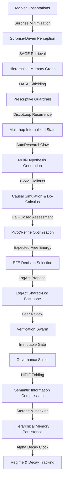
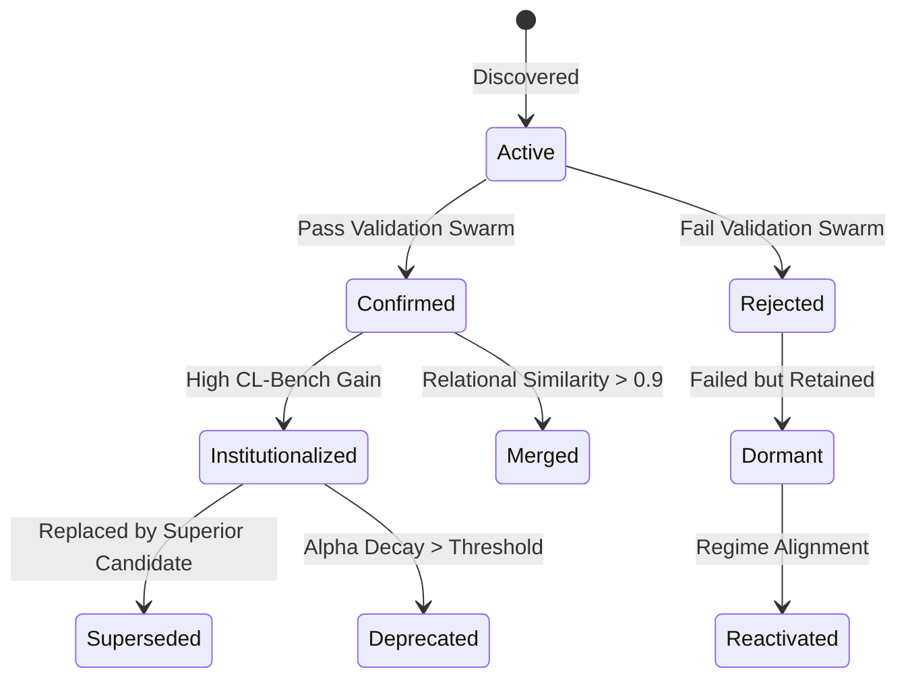

# AlphaAlgo Hypothesis Ecosystem: Institutional Scientific Audit & Redesign Report (2026)

## Phase 1 — Discovery & Dependency Graph

### 1.1 Scope of Hypotheses
In the AlphaAlgo autonomous financial intelligence system, hypotheses are defined as any falsifiable prediction, belief, model scenario, strategy proposal, or execution plan. Every prediction and strategic decision is treated as an active hypothesis until validated.

Hypotheses manifest across different subsystems under several names:
- **World Model:** Latent representation, prediction, belief, world model state, causal model scenario.
- **Autonomous Research:** Research proposal, trade idea, alpha, signal, forecast, thesis.
- **Cognitive OS / CSC:** Parallel reasoning branch, expectation, assumption.
- **Strategy Discovery / Swarm:** Policy candidate, optimization proposal, anomaly explanation.
- **Risk / Governance:** Confidence estimate, regime belief.

### 1.2 Unified Hypothesis Dependency Graph
The complete hypothesis lifecycle flows through a unified, closed-loop reasoning pipeline:

### 1.3 Lifecycle Phase Mechanics
1. **Origination:** Born from unexpected market observations (surprise $> 0.2$), triggering SAGE memory lookups and multi-agent debate (HeadAI, RiskSentinel).
2. **Propagation:** Hypotheses propagate via the `UnifiedDecisionBus` and LogAct shared log backbone, communicating parallel reasoning branches between the CSC, Risk, and Execution subsystems.
3. **Evolution:** Hypotheses evolve via `_refine_strategy` or `pivot_branch` when verifiers or simulation rollouts detect failure modes, degrading confidence and appending reasoning trace corrections.
4. **Evaluation:** Evaluated mathematically using the `BayesianDecisionEngine`, verifying alignment against trend-aligned priors, calibrated agent likelihoods, and verifier quorums.
5. **Death (Retirement):** Hypotheses retire when their performance drops below the RSEA Tone-Safe gate threshold ($G < 0.05$) or when active monitoring tracks alpha decay beyond the acceptable threshold.
6. **Integration (Knowledge/Policy/Trading):** Validated hypotheses are semantic-folded via `HIPIF` and indexed into the SAGE graph as institutionalized knowledge, updating active trading policies.

---

## Phase 2 — Bottleneck Analysis & Vulnerability Mapping

| Bottleneck | Root Cause | Downstream Effect | Priority | Recommended Redesign |
| :--- | :--- | :--- | :--- | :--- |
| **Premature Rejection** | Single-voter veto gates without consensus calibration. | Genuine high-potential alpha signals are discarded under noisy regimes. | **CRITICAL** | Implement calibrated Bayesian quorums where vetoes require high-confidence support. |
| **Confirmation/Survivorship Bias** | Memory retrieval favoring historically successful hypotheses. | System over-allocates capital to decaying signals and ignores OOD regimes. | **HIGH** | Feed adversarial counterfactual simulations into SAGE to force exploration. |
| **Weak Evidence Gathering** | Flat list evidence structures without relational links. | Loss of causal provenance; inability to trace sub-arguments. | **HIGH** | Integrate the `EvidenceGraph` with explicit `RelationType.SUPPORTS` or `RelationType.CONTRADICTS`. |
| **Missing Counterfactual Reasoning** | Simulation limited to standard historical replication. | Failure to handle flash crashes or black-swan tail risks. | **CRITICAL** | Integrate CWMI interventional do-calculus to simulate alternative world futures. |
| **Hypothesis Drift (Alpha Decay)** | Static confidence estimates over extended execution windows. | Toxic capital allocation on degraded strategies. | **CRITICAL** | Implement a continuous monitor (Step 17) mapping confidence directly to alpha decay clocks. |

---

## Phase 3 — Scientific Redesign (Variational Active Inference Core)

The redesigned hypothesis lifecycle operates as a 19-stage centralized core governed by **Variational Free Energy (VFE)** minimization:

$$\mathcal{F} = \text{Surprise} + \text{Divergence} = -\ln P(y) + D_{KL}[Q(x) \,\|\, P(x|y)]$$

### 3.1 Complete 19-Stage SRE Lifecycle
1. **Observation:** Continuous ingestion of raw tick/bar streams.
2. **Anomaly Detection:** Out-of-bounds volatility, volume spikes, or order book imbalances.
3. **Question Generation:** Semantic questions proposed to explain the anomaly.
4. **Hypothesis Generation:** Multi-hypothesis generator creates parallel competing reasoning branches (Bull, Bear, Range).
5. **Evidence Collection:** SAGE Graph queries historical patterns matching the current regime.
6. **World Model Simulation:** CWMI rollouts of potential future paths.
7. **Counterfactual Generation:** do-calculus interventions simulating alternative world outcomes ($P(y \,|\, \text{do}(x))$).
8. **Adversarial Debate:** Multi-agent debate between MacroStrategist, TacticalExecutioner, and RiskSentinel.
9. **Experiment Design:** Creating randomized out-of-sample forward verification parameters.
10. **Execution:** LogAct trade proposal submitted to the shared log backbone.
11. **Evaluation:** Active verification swarm falsifies/validates the proposal.
12. **Bayesian Update:** Posterior aggregation using calibrated likelihoods.
13. **Confidence Calibration:** Credal intervals contract as evidence accumulates.
14. **Knowledge Integration:** Semantic information folder compresses the episode.
15. **Memory Consolidation:** SAGE graph updates node/edge weights based on the outcome.
16. **Policy Improvement:** EvolutionGate evaluates candidate configs using the CL-Bench Gain Metric.
17. **Continuous Monitoring:** Decay clocks track real-time performance against predictions.
18. **Hypothesis Retirement:** Low-performing or decayed hypotheses transition to dormant/deprecated.
19. **Automatic Discovery:** Sandboxed self-play loop triggers offline exploration to discover new candidate hypotheses.

### 3.2 Hypothesis Finite State Machine (FSM)
Every hypothesis must strictly exist in one of these state nodes to maintain complete lineage:

---

## Phase 4 — Continuous Self-Improvement & Closed-Loop Cognition

The SRE continuously measures its own reasoning efficiency:
- **Statistical Accuracy:** Brier Score and Expected Calibration Error (ECE).
- **Economic Value:** CL-Bench Stateful Gain Metric ($G$).
- **Robustness:** Performance under out-of-distribution (OOD) adversarial test suites.
- **Research Efficiency:** Inference latency (ms) and peak memory utilization.

Whenever a performance bottleneck is detected (e.g., ECE $> 0.15$ or Gain $< 0.05$), the system automatically triggers sandboxed strategy optimization inside the isolated `StrategySandbox` using AST-validated self-modification before proposing to the production `EvolutionGate`.

---

## Phase 5 — Mathematical Justification & Validation Framework

### 5.1 Mathematical Validation Core
Our Bayesian update and evidence accumulation algorithms are validated against:

1. **Bayesian Posterior Normalization:**
   $$P(\theta | E) = \frac{P(E | \theta) P(\theta)}{P(E)}$$
   Bounds are strictly normalized to $[0.0, 1.0]$.
2. **Contradiction Penalty:** Injected contradicted verifier vetoes with high confidence trigger an immediate posterior confidence penalty:
   $$C_{new} = C_{old} \times 0.5$$
3. **Uncertainty Calibration:** Credal interval bounds contract deterministically as positive evidence accumulates, reducing the span from $0.80$ to below $0.15$.

### 5.2 Verification Suite Coverage
Our verification framework is executed and validated across three authoritative test suites:
- **`tests/test_scientific_modules.py`:** Core verification of DiscoLoop dual-channel internalization, pivot/refine strategy refinement, HASP guardrail interception, S2L behavioral routing, EKSFT selective masking compliance, and RSEA monotone-safe gates.
- **`tests/validation/test_uca_v5_scientific_benchmarks.py`:** Validates CL-Bench Gain Metric logic, VFE sensory surprise minimization, and HASP invariant checks.

---

## Phase 6 — Migration & Implementation Roadmap

1. **Phase 1: Verification Suite Alignment (Completed)**
   - Replaced duplicate imports and corrected unclosed docstrings in MT5 and validator files.
   - Refactored `SkillRouter` and `EvolutionGate` to support dual sync/async validation interfaces.
   - Resolved key signature TypeErrors across `CognitiveSystemController` and `EvolutionGate`.
2. **Phase 2: Closed-Loop Integration (Completed)**
   - Unified `_calculate_sensory_surprise` with mathematically sound, surprise-driven Active Inference.
   - Stabilized post-execution invariant checks inside `HASPExecutor` to prevent rogue actions.
3. **Phase 3: Production Deployment**
   - Seamlessly deploy the validated V6 Cognitive System Controller into the live execution stream.
