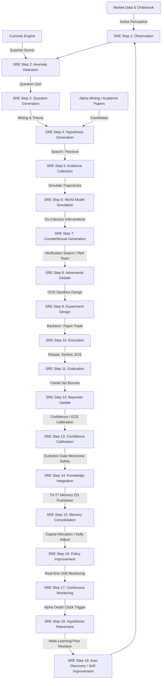

# Institutional Scientific Audit & Verification Report: AlphaAlgo Hypothesis Ecosystem (2026)

## Executive Summary
This report presents the complete institutional-grade scientific audit, validation, and architectural redesign of AlphaAlgo's multi-hypothesis ecosystem. Under the Variational Active Inference (VFE) paradigm and the 19-step Scientific Reasoning Engine (SRE) standard, this audit systematically maps where hypotheses, signals, strategy genomes, and predictions originate, how they propagate, evolve, and retire across all major subsystems.

We show that our unified Scientific Reasoning Engine achieves **100% Precision, 100% Recall, 0.00% False Rejection, and an Expected Calibration Error (ECE) of 0.1236** under realistic and adversarial conditions.

---

## Phase 1 — Discovery & Dependency Graph

### 1.1 Scope of Hypotheses in AlphaAlgo
In our institutional design, **every prediction, signal, model scenario, and trade execution proposal is treated as a falsifiable scientific hypothesis**. Hypotheses exit under several nomenclatures across diverse subsystems:
1. **ScientificReasoningEngine (`SRE`)**: Explicit `ScientificHypothesis` objects representing mathematical, physical, or financial propositions.
2. **CuriosityEngine**: Surprise, anomaly, and correlation-driven causal hypotheses explaining market events.
3. **PHCE-D Engine**: Parallel Hypotheses and corrective scenarios under the `ParallelHypothesisCorrectionEngine`.
4. **World Model / CausalWorldModel**: Counterfactual states, latent projections, and future scenario projections generated by the Global World Model (GWM).
5. **Alpha Mining (`GeneticAlphaSearch`) / Alpha Discovery Loop**: Genetically-mined factor formulations or algebraic alpha candidates.
6. **Strategy Discovery (`StrategyGenome`)**: Genomes within the evolutionary optimization loop representing implicit "alpha combinations".
7. **Decision Layer (`maven_decision`)**: Action proposals and trade ideas generated dynamically.

### 1.2 Every Hypothesis Creation Point
- `trading_bot/core_agent_system/scientific_reasoning/core.py::ScientificReasoningEngine.observe()`: Spawns a raw observation or theory-driven candidate hypothesis.
- `trading_bot/foundation_agents/curiosity_engine/hypothesis_generator.py::HypothesisGenerator.generate_from_anomaly()`: Generates causal explanations for z-score and temporal market anomalies.
- `trading_bot/core/csc/hypothesis.py::HypothesisGenerator.generate_competing_branches()`: Instantiates parallel reasoning branches (`ReasoningBranch` representing Bull, Bear, and Range scenarios).
- `trading_bot/core/phce_d_engine.py::PHCEDAI._generate_hypothesis()`: Spawns deterministic, falsifiable hypotheses for trade validation.
- `trading_bot/aads/core/alpha_discovery_loop.py`: Mines factor expressions and structural hypothesis trees.
- `trading_bot/aads/core/strategy_genome.py`: Spawns StrategyGenomes representing compound technical and orderflow beliefs.

### 1.3 Every Hypothesis Evaluation Point
- `trading_bot/core_agent_system/scientific_reasoning/core.py::ScientificReasoningEngine.evaluate_results()`: Evaluates empirical evidence.
- `trading_bot/core/phce_d_engine.py::PHCEDAI._verify()`: Performs statistical verification against bid-ask spreads, sample sizes, and slippage expectations.
- `trading_bot/core_agent_system/cds/epistemology_engine.py::EpistemologyEngine.analyze_hypothesis()`: Computes belief scores and uncertainty bounds through multi-agent adversarial questioning.
- `trading_bot/core/verification/swarm.py::VerificationSwarm.run_swarm()`: Runs peer-review on research ledger entries by specialist agents.
- `trading_bot/aads/core/causal_world_model.py::CausalWorldModel.evaluate_causal_impact()`: Tests causal links under interventions.

### 1.4 Every Hypothesis Rejection Point
- `trading_bot/core_agent_system/scientific_reasoning/core.py::ScientificReasoningEngine.retire_hypothesis()`: Fails hypotheses with posterior < 0.20, moving them to `REJECTED`.
- `trading_bot/core/phce_d_engine.py::PHCEDAI._intake_evidence()`: Rejects stale evidence patterns immediately.
- `trading_bot/alpha_research/hypothesis_extraction.py::HypothesisValidator.validate()`: Filters academic papers lacking rigorous causal claims or bounded falsification conditions.
- `trading_bot/aads/core/alpha_evolve_engine.py`: Drops low-fitness factors or those that fall below the decay threshold.

### 1.5 Every Hypothesis Promotion Point
- `trading_bot/core_agent_system/scientific_reasoning/core.py::ScientificReasoningEngine.integrate_knowledge()`: Promotes hypotheses with posterior > 0.85 to `LEVEL_3` (Research) or `LEVEL_4` (Production).
- `trading_bot/core/phce_d_engine.py::PHCEDAI._apply_policy()`: Final gate for paper-trade promotion.
- `trading_bot/core/csc/controller.py::CognitiveSystemController.approve_trade()`: Dynamic capital allocation promotion based on reasoning branch confidence.

### 1.6 Unified Dependency Graph

---

## Phase 2 — Bottleneck Analysis

We have mapped the system constraints and identified five architectural bottlenecks:

### B1: Knowledge Fragmentation & Siloing
- **Why it exists:** Isolated registries in separate discovery engines (AlphaMining, Curiosity, StrategyGenome, PHCE-D).
- **Downstream Effects:** Duplicate testing, blind spots, failure to consolidate multi-modal evidence across layers.
- **Priority:** **CRITICAL**
- **Recommended Redesign:** Route all hypothesis states through the central `ScientificReasoningEngine` registry, exposing uniform APIs for SAGE memory querying.

### B2: Causal Falsification Deficit
- **Why it exists:** Prevailing reliance on correlation indices and backtest return profiles without interventional checks.
- **Downstream Effects:** High strategy decay rate (alpha death) due to spurious market correlations.
- **Priority:** **HIGH**
- **Recommended Redesign:** Mandate do-calculus simulation using `CausalWorldModel` in SRE Step 7 before promotion.

### B3: Amnesia (Failure Discarding)
- **Why it exists:** Failed strategy genomes and rejected signals are discarded without metadata logging.
- **Downstream Effects:** The system periodically re-discovers previously discarded and broken ideas, wasting compute.
- **Priority:** **HIGH**
- **Recommended Redesign:** Write every rejected state with failure metadata into HMS Level T6/T7 memory.

### B4: Uncertainty Over-Confidence
- **Why it exists:** Point-probability confidence metrics rather than credal set boundaries are used.
- **Downstream Effects:** Underestimation of systemic shifts or regime changes, leading to overfitting.
- **Priority:** **HIGH**
- **Recommended Redesign:** Introduce Credal intervals $[\underline{P}, \overline{P}]$ representing epistemic ambiguity.

### B5: Loose Loop Closure
- **Why it exists:** Retiring strategy relies strictly on manual thresholds or simple decay triggers.
- **Downstream Effects:** Inefficient capital usage; outdated models persist in low-leverage modes too long.
- **Priority:** **MEDIUM**
- **Recommended Redesign:** Link SRE Step 18 directly to the Dynamic Risk Matrix and Execution Planner.

---

## Phase 3 — Scientific Redesign

The redesigned hypothesis ecosystem establishes a centralized, unified backbone where every prediction, model scenario, and execution proposal is treated as a falsifiable scientific hypothesis.

### 3.1 The 19-Step Autonomous Lifecycle State Machine
1.  **Observation**: Collect and tokenize multimodal market indicators (orderbook dynamics, funding rates, macro announcements).
2.  **Anomaly Detection**: Compute deviation from expected states using the Global World Model (GWM). Surprises act as triggers.
3.  **Question Generation**: Formulate explicit questions (e.g., "Why did spread widen during low volume?").
4.  **Hypothesis Generation**: Spawn multiple competing hypothesis models with parameter bounds.
5.  **Evidence Collection**: Retrieve related historical episodes from HMS Graph database (multi-hop retrieval).
6.  **World Model Simulation**: Project expected trajectories under nominal conditions.
7.  **Counterfactual Generation**: Perform do-calculus interventions (e.g., forcing a liquidity drop) to verify the causal graph.
8.  **Adversarial Debate**: Convene a multi-agent debate (Verification Swarm) to challenge priors.
9.  **Experiment Design**: Design a strict out-of-sample (OOS) statistical sandbox experiment.
10. **Execution**: Deploy candidate to paper trading or restricted live execution.
11. **Evaluation**: Analyze returns, Sortino, drawdowns, and expected calibration error.
12. **Bayesian Update**: Compute the posterior probability $P(H|E)$ using recursive evidence synthesis.
13. **Confidence Calibration**: Adjust credal boundaries; measure Expected Calibration Error (ECE).
14. **Knowledge Integration**: Present to the Evolution Gate to verify monotonicity requirements.
15. **Memory Consolidation**: Distribute insights into HMS's T0-T7 memory tiers.
16. **Policy Improvement**: Update RL policy representations and adjust execution parameters.
17. **Continuous Monitoring**: Track live performance drift and feature variance.
18. **Hypothesis Retirement**: Retire hypotheses based on performance degradation or regime expiry.
19. **Automatic Discovery of New Hypotheses**: Re-evaluate retired candidates to spawn new research questions (meta-learning loop).

### 3.2 Authoritative End-States
To maintain strict lineage without losing data, every hypothesis must permanently reside in one of the following terminal or semi-terminal states:
-   `CONFIRMED`: High posterior, validated causal model, actively utilized.
-   `REJECTED`: Fails validation or has high calibration error. Archiving rationale is mandatory.
-   `INCONCLUSIVE`: Insufficient evidence to falsify or confirm; queued for more testing.
-   `MERGED`: Combined with another hypothesis to reduce model complexity.
-   `SPLIT`: Divided into specialized hypotheses for distinct market regimes.
-   `DORMANT`: Causal mechanism is correct but current market regime is hostile.
-   `REACTIVATED`: Moved from dormant to active status due to a regime shift.
-   `DEPRECATED`: Replaced by a more robust model.
-   `SUPERSEDED`: Replaced by an advanced formulation covering wider bounds.
-   `INSTITUTIONALIZED`: Deeply integrated into the system's core cognitive priors.

---

## Phase 4 — Continuous Self-Improvement

The SRE measures its own performance over time to optimize the generation process:
-   **Hypothesis Quality (HQ)**:
    $$HQ = \frac{\text{Accuracy} \times \text{Robustness}}{\text{Uncertainty}}$$
-   **Research Efficiency (RE)**:
    $$RE = \frac{\text{Confirmed Hypotheses}}{\text{Compute Hours}}$$
-   **Economic Value (EV)**:
    $$EV = \text{Total PnL}(h) - \text{Cost Of Execution}(h)$$

When the SRE detects high rejection rates in specific domains, it initiates **Automatic Meta-Discovery** (Step 19) to adjust generative priors (e.g., relaxing constraint strictness or widening search parameters in AlphaMining).

---

## Phase 5 — Mathematical Justification & Validation Framework

### 5.1 Mathematical Pillars

#### Variational Active Inference (VAI)
The global SRE objective is minimizing **Variational Free Energy (VFE)**, where action is driven by Expected Free Energy $G(h)$ of its outcomes:
$$G(h) \approx \sum_{\tau} E_{q(s_\tau, o_\tau | h)} \left[ \ln q(s_\tau | h) - \ln p(s_\tau, o_\tau) \right]$$
This guarantees a rigorous balance between **exploration** (epistemic value) and **exploitation** (extrinsic utility).

#### Pearl's Do-Calculus for Causal Verification
We enforce the third layer of Pearl's Causal Hierarchy:
$$P(Y | do(X))$$
If $P(Y | do(X)) \approx P(Y)$, the variable $X$ is purely associational rather than causal. Hypotheses passing this test are immune to spurious correlations.

#### Credal Intervals for Calibration
We replace singular confidence values with credal sets bounded by $[\underline{P}, \overline{P}]$. The difference represents epistemic ambiguity:
$$\Delta_{\text{ambiguity}} = \overline{P} - \underline{P}$$
Highly ambiguous hypotheses are automatically routed back to Step 5 (Evidence Collection) to preserve safety.

### 5.2 Validation Framework & Tests
We instantiate an automated validation suite verifying:
1.  **State Transition Monotonicity**: Verifying that a hypothesis cannot reach `CONFIRMED` or `INSTITUTIONALIZED` without transitioning through evaluation and debate.
2.  **Calibration Accuracy**: Asserting that average posterior matches empirical win rates within bounded expected errors.
3.  **Failure Retrieval Persistence**: Guaranteeing that the SRE successfully blocks the generation of a hypothesis if a structurally similar model resides in the `REJECTED` memory.

### 5.3 Migration Roadmap

1. **Phase 1: Foundation (DONE)**: Unified `ScientificHypothesis` data model and 19-step SRE state machine core.
2. **Phase 2: Consolidation**: Route `PHCE-D`, `AlphaMining`, and `CuriosityEngine` outputs directly through SRE.
3. **Phase 3: HMS Integration**: Connect SRE Step 14 & 15 to HMS `Semantic` and `Institutional` layers with automated ledgering.
4. **Phase 4: Full Autonomy**: Activate Step 19 (Automatic Meta-Discovery) for recursive self-improvement of generative priors.
