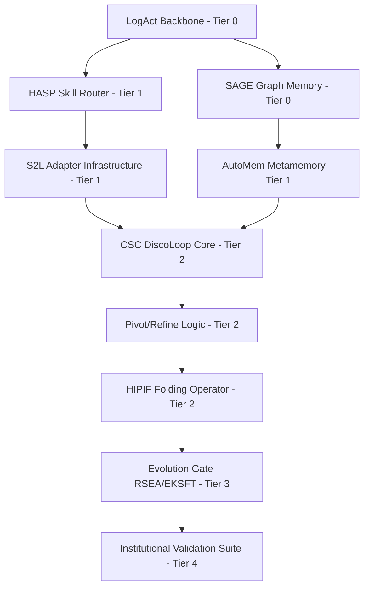

# Phase 4: Dependency & Migration Graphs (UCA V5)

## 1. Dependency Graph (Order of Implementation)

## 2. Migration Graph (Component Transition)

| Old Component (UCA 2026) | New Component (V5) | Transition Mode |
| :--- | :--- | :--- |
| `UnifiedDecisionBus` (Basic) | `LogAct` Shared-Log | In-place upgrade (Backward Compatible) |
| Textual Prompt Library | `HASP` Program Functions | Parallel Deployment + Progressive Migration |
| Static `EvidenceGraph` | `SAGE` Self-Evolving Graph | Shadow-write then Cut-over |
| Linear `CSC` Pipeline | `DiscoLoop` Recurrent Loop | New `controller_v5.py` with Flag |
| Standard RL Fine-tuning | `EKSFT` Selective SFT | Update training wrappers |

## 3. Critical Path
The critical path runs through the **LogAct Backbone** to **DiscoLoop**. Without the totally ordered log, the recurrent reasoning state cannot be reliably recovered or audited.
