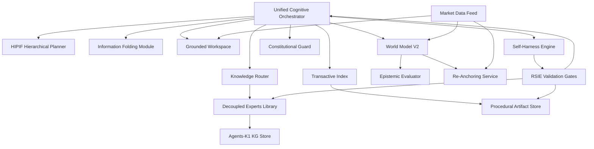

# AlphaAlgo Next-Gen: Detailed Logical Architecture & Runtime Dependencies

This document provides a high-fidelity mapping of the Unified Cognitive Architecture (UCA) for the redesign.

## 1. Logical Service Topology

The system is organized into five primary cognitive planes:

### A. Control Plane (The Brain)
- **Unified Cognitive Orchestrator (UCO):** Central state machine and reasoning engine.
- **Hierarchical Planner (HIPIF):** Manages mission/task/action decomposition.
- **Information Folding Module:** Compresses trajectory traces for long-horizon context.

### B. Knowledge Plane (The Expert)
- **Decoupled Mixture-of-Experts (DMoE):** Parametric knowledge modules.
- **Knowledge Router:** Uncertainty-aware gating for expert activation.
- **Agents-K1 Graph Store:** Scientific knowledge graph for multi-hop reasoning.

### C. Perception Plane (The World)
- **World Model (WM-V2):** Latent dynamics and future simulation.
- **Epistemic Evaluator:** Calculates Ignorance Score and State Confidence.
- **Re-Anchoring Service:** Synchronizes latent states with ground truth market data.

### D. Memory Plane (The Collective)
- **Transactive Index:** "Who knows what" registry for agents.
- **Procedural Artifact Store (MATM):** Shared successful trading trajectories.
- **Grounded Workspace:** Hierarchical memory navigation for active context.

### E. Safety & Governance Plane (The Shield)
- **Constitutional Guard:** Principle-based action verification.
- **Self-Harness Engine:** Monitors and improves the operating environment.
- **RSIE Validation Gates:** Final statistical/risk check before deployment.

---

## 2. Runtime Dependency Graph

## 3. Deployment Constraints
- **Hardware Agnostic:** Orchestrator and Router are CPU-optimized; DMoE and WM require GPU (CUDA/MPS) support.
- **State Persistence:** All Grounded Workspaces must persist across service restarts to maintain long-horizon coherence.
- **KV-Cache Reuse:** The UCO must maintain session state to leverage DMoE's zero-recomputation architecture.
