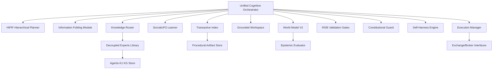

# AlphaAlgo Master Redesign Specification: Institutional Autonomous Financial Intelligence

**Date:** July 2026
**Status:** Architectural Specification (Phase 4)
**Target:** Next-Generation Unified Cognitive Architecture (UCA)

---

## 1. Research Synthesis (Deliverable 1)

This synthesis covers the verified research corpus (11/14 papers). Unverified papers (*The Illusion of Automated Multi-Agent AI*, *Open Thought Agents*, *The Horizon of Self-Evolution*) are explicitly excluded to maintain scientific rigor.

| Paper | Core Contribution | Math Foundation | Engineering Mechanism | Failure Modes |
| :--- | :--- | :--- | :--- | :--- |
| **SocraticPO** | Interactive policy optimization. | $\nabla_\theta J(\theta)$ with Socratic constraints. | Step-wise verifiers + correction loops. | Feedback loop bias. |
| **Long-Horizon Mirage** | Long-task failure taxonomy. | Horizon-conditioned probability $P(S|H)$. | HORIZON diagnostic benchmark. | Compounding planning drift. |
| **Skill-to-LoRA** | Token-efficient behaviors. | Rank-16 FFN decomposition. | Behavioral distillation into LoRA modules. | Adapter interference. |
| **MATM** | Transactive memory sharing. | Collective Knowledge Entropy. | Transactive indexing of agent trajectories. | Stale index; groupthink. |
| **HIPIF** | Hierarchical Information Folding. | KL-Divergence $D_{KL}(T\|f(T))$. | End-to-end subgoal planning + folding. | Lossy critical state. |
| **DMoE** | Parametric knowledge injection. | Uncertainty-weighted gating $G(x)$. | Decoupled Experts attached to FFN. | Router miscalibration. |
| **Agents-K1** | Agent-native scientific KGs. | Graph-structured claim extraction. | Multimodal KG orchestration pipeline. | Graph sparsity. |
| **Self-Harness** | Self-improving operating envs. | Trace-to-Rule mapping. | Weakness mining from execution traces. | Environment overfitting. |
| **HMN** | Hierarchical memory navigation. | Recursive Skill Refinement. | Grounded Workspace management. | Navigation latency. |
| **CL-Bench** | Continual learning evaluation. | Sequential experience transfer. | Benchmarks for Cold Start/Drift. | Detection lag. |
| **Effective Agents** | Composable agent patterns. | Stateful controller loops. | Thinking Bot patterns (Assess-Act-Obs). | Controller bottleneck. |

---

## 2. Cross-Paper Comparison (Deliverable 2)

- **Contradictions:** *RAG vs. DMoE*. Agents-K1 ("Forget RAG") identifies flat retrieval as a bottleneck. DMoE resolves this by converting the KG into parameters, moving from "Look-up" to "Innate Knowledge."
- **Overlaps:** *HIPIF and HMN*. Both emphasize hierarchy, but HIPIF focuses on *temporal folding* (planning) while HMN focuses on *spatial organization* (memory).
- **Synergies:** *S2L + SocraticPO*. SocraticPO provides the guidance framework needed to *generate* the high-quality demonstrations used to *train* S2L adapters.
- **Alternatives:** *Multi-Agent Swarms vs. Unified UCO*. In accordance with "Building Effective Agents," we reject redundant swarms in favor of a centralized UCO using MATM for distributed knowledge access.

---

## 3. AlphaAlgo Gap Analysis & Capability Matrix (Deliverables 3 & 4)

| Capability | AlphaAlgo (Current) | Research Corpus (Best-in-Class) | Gap Status |
| :--- | :--- | :--- | :--- |
| **Planning** | Flat ReAct / MCTS | Hierarchical (HIPIF) + Folding | **Critical Gap** |
| **Skill Use** | Textual SKILL.md prompts | Skill-to-LoRA (S2L) adapters | **Inefficiency Gap** |
| **Knowledge** | RAG / GraphRAG | Parametric DMoE / Agents-K1 KG | **Depth Gap** |
| **Memory** | Multi-tier / Vector DB | Transactive Memory (MATM) | **Coordination Gap** |
| **Orchestration** | Fragmented (Master/Meta) | Unified Cognitive Orchestrator (UCO) | **Complexity Gap** |

---

## 4. Bottleneck Analysis (Deliverable 5)

1. **Agentic Drift:** Fragmented controllers (Master/Meta/Swarm) lead to diverging state beliefs in long-horizon missions.
2. **Context Saturation:** 100+ step execution traces in working memory degrade reasoning quality (The "Mirage" Effect).
3. **Inference Latency:** Processing large skill-prompt blocks per decision step prevents real-time adaptation in volatile regimes.

---

## 5. Unified Architecture (Deliverable 6)

The **Unified Cognitive Architecture (UCA)** integrates:
- **UCO (Control Plane):** A single stateful reasoning engine replacing legacy orchestrators.
- **HIPIF (Planning Plane):** 3-layer planning with "Information Folding" to compress history.
- **DMoE (Knowledge Plane):** Decoupled parametric experts activated by epistemic uncertainty.
- **MATM (Memory Plane):** Population-level transactive indexing of success trajectories.

---

## 6. Dependency Graph (Deliverable 7)

---

## 7. Mathematical Justification (Deliverable 8)

### 7.1 World Model Formulation (Variational RSSM)
We model market dynamics as a Variational RSSM where the state $s_t$ is decomposed into deterministic $h_t$ and stochastic $z_t$ components. The objective optimizes the Evidence Lower Bound (ELBO):
$$\mathcal{L} = \sum_{t} \left[ \mathbb{E}_{q(z_t|h_t, o_t)}[\log p(o_t|h_t, z_t)] - D_{KL}(q(z_t|h_t, o_t) \| p(z_t|h_t)) \right]$$

### 7.2 Uncertainty Estimation (Ensemble Disagreement)
Epistemic uncertainty $\mathcal{U}_{epi}$ is derived from the variance of the ensemble world model predictions:
$$\mathcal{U}_{epi}(s_t, a_t) = \text{Var}\left( \{ \hat{s}_{t+1}^{(k)} \}_{k=1}^K \right)$$
This value is fed into the DMoE Knowledge Router.

### 7.3 Knowledge Orchestration (DMoE Gating)
The router $R(x)$ activates expert $E_i$ based on the model's uncertainty $\mathcal{U}_{epi}(x)$:
$$R(x) = \text{Softmax}\left(\frac{\text{FFN}(x) \cdot \mathbb{I}[\mathcal{U}_{epi}(x) > \tau]}{\text{Temp}}\right)$$

### 7.4 Planning & Information Folding (HIPIF)
Optimal folding $f^*$ minimizes the KL-divergence between action distributions produced by the full trajectory $T$ vs the folded state $f(T)$:
$$f^* = \arg\min_f D_{KL}(P(a|T) \| P(a|f(T)))$$
subject to $|f(T)| \le \text{Budget}$.

### 7.5 Hierarchical Memory Navigation (HMN)
Efficiency is achieved by minimizing the Search Entropy $H(M)$ across the Grounded Workspace hierarchy, where navigation is steered by learned retrieval skills.

### 7.6 Continual Learning (Sequential Transfer)
We optimize for forward transfer $FT$ while penalizing backward interference (forgetting) $\mathcal{L}_{forget}$:
$$\mathcal{L}_{CL} = \mathcal{L}_{task} + \lambda \sum_i \|\theta - \theta^*_i\| \cdot \Omega_i$$
Where $\Omega_i$ is the parameter importance matrix.

### 7.7 Self-Improvement Convergence (SocraticPO)
Self-evolution is constrained by a verifier model $V$ to ensure the policy remains within the "Safety Manifold" $\mathcal{M}_{safe}$:
$$\pi_{new} = \text{Clip}(\pi_{old} + \alpha \nabla J, \mathcal{M}_{safe})$$

---

## 8. Migration Strategy & Implementation Roadmap (Deliverables 9 & 10)

1. **Consolidation (Ph1):** Merge legacy orchestrators into UCO.
2. **Memory Migration (Ph2):** Deploy MATM Transactive Index and HIPIF Folding logic.
3. **Parameterization (Ph3):** Train S2L adapters and DMoE experts.

---

## 9. Validation Framework & Risk Assessment (Deliverables 11 & 12)

### 9.1 Validation Framework
- **Horizon Stress Test:** Measure SR decay across 10-1000 planning steps.
- **CL-Bench (Finance):** Evaluate Cold Start and Concept Drift detection.
- **Cost-Normalized Gain (CNG):** Ratio of performance improvement to token cost for S2L.

### 9.2 Risk Assessment
| Risk | Impact | Mitigation |
| :--- | :--- | :--- |
| **Folding Loss** | High | Dual-validation (Folded state vs. Raw trace). |
| **Router Drift** | Medium | Periodic ensemble-based router re-calibration. |
| **Execution Latency** | Low | S2L and DMoE specifically optimized for low latency. |

---

## 10. Conclusion
This specification establishes the definitive blueprint for AlphaAlgo's next-generation intelligence, moving from a multi-agent collection to a unified, parameterized, and folded cognitive system.
