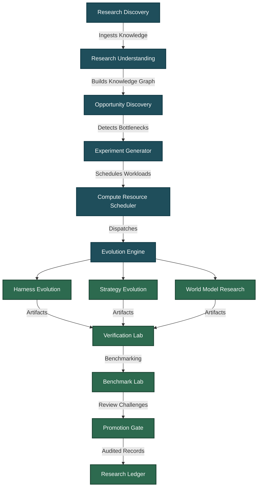

# 00. EXECUTIVE SUMMARY
## Institutional AI-for-AI Research System (ASRS)

### 1. Document Overview
This document serves as the high-level executive summary of the **Institutional AI-for-AI Research System (ASRS)** for AlphaAlgo. It describes the strategic vision, the core mission, organizational alignment, non-negotiable governance principles, and the foundational role of ASRS as the permanent, autonomous research and development (R&D) division of AlphaAlgo.

---

### 2. Vision and Strategic Mission
The rapid evolution of machine learning, reinforcement learning, and quantitative trading strategies introduces a core operational bottleneck: **human engineering latency**. While market signals decay and new AI paradigms emerge at a weekly cadence, manual analysis, implementation, and verification cannot keep pace.

The ASRS solves this by establishing a permanent, closed-loop, autonomous scientific research division inside AlphaAlgo. Rather than allowing uncontrolled or random self-modification of production systems, ASRS enforces a strict, evidence-driven scientific process. Every modification—be it a prompt change, a routing policy update, or a strategy hyperparameter tweak—must be born from a rigorous hypothesis, tested in isolated environments, verified via extensive benchmarking, and audited by independent reviewer agents before being promoted to production.

```
       +-------------------------------------------------------------+
       |                  ASRS PERMANENT R&D LOOP                    |
       |                                                             |
       |  [Discovery]   -->   [Understanding]  -->   [Opportunity]   |
       |    Finds papers         Extracts Math         Finds System  |
       |         ^                    |                 Bottlenecks  |
       |         |                    v                      |       |
       |  [Promotion]   <--   [Verification]   <--   [Experiment]    |
       |  Adversarial         Backtests, MC          Isolated L1-L3  |
       |  Review Gate         Stress Tests           Sandboxes       |
       +-------------------------------------------------------------+
```

---

### 3. Non-Negotiable Operational Principles
ASRS is governed by six immutable, non-negotiable rules designed to protect institutional capital and preserve system integrity:

1. **Strict Sandboxing Isolation**: Production code is mathematically and operationally immutable. Self-improvement is never performed on the main runtime branches. Experiments run in isolated Level 1 (config/prompts), Level 2 (local virtual environments), or Level 3 (independent Git worktrees) sandboxes.
2. **Evidence-Driven Progression**: No code is promoted without reproducible, statistically significant objective proof of superiority across latency, calibration, robustness, and trading return dimensions.
3. **Reproducibility Mandate**: Every experiment is deterministically replayed with fixed seeds and recorded in an immutable ledger with unique UUIDs and complete Git SHAs.
4. **Guaranteed Rollback State**: Every deployment maintains an automated instant rollback configuration, ensuring zero-latency recovery from production regressions or anomalies.
5. **No Model Weight Modification in Harnesses**: Harness evolution (prompts, tool selection, planning depth, routing) operates purely on system scaffolds and must never modify model weights, keeping engineering boundaries clean.
6. **Adversarial Audit Integrity**: All promotion candidates are audited by an independent, highly critical Autonomous Reviewer agent whose sole objective is to reject the candidate by identifying regressions, overfitting, or leakage.

---

### 4. High-Level Subsystem Blueprint
The platform is organized into twelve dedicated research divisions working in tandem:



---

### 5. Expected Institutional Outcomes
Through the deployment of this architecture, AlphaAlgo shifts from a static quantitative model to an **evolving financial superintelligence**:
* **Alpha Discovery Latency**: Reduced from weeks of human manual engineering to hours of parallelized, automated search.
* **Capital Risk Control**: Maintained via rigid mathematical objectives (CVaR, Expected Shortfall, Drawdown constraints) that are checked by independent validation sandboxes.
* **Engineering Zero-Waste**: The cost-aware planner prioritizes projects according to expected return on engineering investment, ensuring compute budget is spent efficiently.
* **Continuous Self-Improvement**: The ASRS is self-referential; it is capable of diagnosing its own workflows, prompts, and schedules, making the R&D division itself a subject of evolutionary optimization over time.
