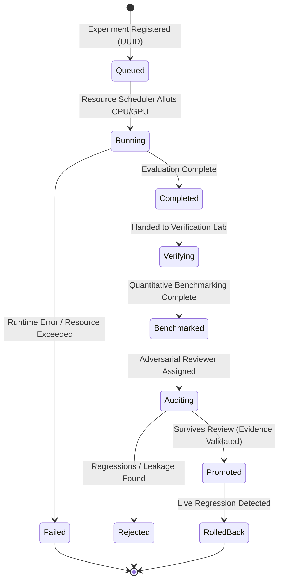

# 01. SYSTEM OVERVIEW
## Institutional AI-for-AI Research System (ASRS)

### 1. Architectural Philosophy
The **Institutional AI-for-AI Research System (ASRS)** represents the permanent R&D platform of AlphaAlgo. Unlike ad-hoc prompt tuning or random script mutations, ASRS acts as an autonomous scientific research pipeline. It continuously scans the frontier of literature (AI, quantitative finance, systems engineering, multi-agent systems), assesses the performance bottlenecks of the live AlphaAlgo system, proposes and runs rigorous, sandboxed experiments, and compiles statistical evidence to justify system promotions.

---

### 2. Physical Directory Topology
To reflect ASRS as a first-class institutional platform, all ASRS modules are organized cleanly within a dedicated `research/asrs/` root package:

```text
trading_bot/
└── research/
    └── asrs/
        ├── __init__.py
        ├── discovery/       # Div 1: Research Discovery (Knowledge Graph builders)
        ├── understanding/   # Div 2: Scientific Representation parsers & decoders
        ├── opportunity/     # Div 3: Live System Auditing & Bottleneck Auditors
        ├── experiment/      # Div 4: Experiment Generation & Sandbox orchestration
        ├── evolution/       # Div 5: Main Evolutionary Controllers (CMA-ES, Pareto, etc.)
        ├── harness/         # Div 6: Prompt, Planning, & Tool scaffolds optimizer
        ├── strategy/        # Div 7: Signal & Portfolio optimizer (Sharpe, CVaR, Slippage)
        ├── world_model/     # Div 8: Causal world trajectory predictors
        ├── verification/    # Div 9: Deterministic Replay, Stress, Chaos Lab
        ├── benchmark/       # Div 10: Statistical & Computational Benchmarking
        ├── governance/      # Div 11: Promotion Gate & Adversarial Reviewers
        ├── ledger/          # Div 12: Immutable Event-Log & Audit Registry
        ├── scheduler/       # Compute Resource Scheduler (CPU/GPU/Mem queue)
        └── registry/        # Experiment Registry (UUID state machines)
```

---

### 3. Pipeline Flow and Core Sequence
The lifecycle of a research stream, from discovery to production deployment, follows a strictly ordered, asynchronous pipeline:

```text
Discovery   Understanding   Opportunity   Generator   Scheduler    Evolution   Verification   Governance    Ledger
   |              |              |            |           |            |            |             |           |
   |--Scan Paper->|              |            |           |            |            |             |           |
   |              |--Build Graph-|            |           |            |            |             |           |
   |              |------------->|            |           |            |            |             |           |
   |              |              |--Identify->|           |            |            |             |           |
   |              |              |            |--Propose->|            |            |             |           |
   |              |              |            |           |--Schedule->|            |             |           |
   |              |              |            |           |            |--Execute-->|             |           |
   |              |              |            |           |            |            |--Validate-->|           |
   |              |              |            |           |            |            |             |--Audit--->|
   |              |              |            |           |            |            |             |           |--Commit->
```

1. **Research Discovery** continuously parses literature feeds, indexing algorithms, assumptions, and ROI models into the Research Knowledge Graph.
2. **Research Understanding** parses paper components into unified, machine-readable representations (math, datasets, roadmap).
3. **Opportunity Discovery** audits the live AlphaAlgo process metrics (slippage, latency, calibration error, drawing down) and matches issues against candidate papers in the graph.
4. **Experiment Generator** plans and initiates an isolated branch/sandbox based on the Cost-Aware Planner, registering the session in the **Experiment Registry**.
5. **Compute Resource Scheduler** queues execution workloads, preventing GPU/CPU starvation or thread-contention.
6. **Evolution Engine** executes search, tuning workflows, strategies, or causal model parameters over the registered three isolation levels.
7. **Verification & Benchmark Labs** subject the highest-performing candidates to historical backtests, Monte Carlo, stress tests, and resource limits checks.
8. **Promotion Gate** spins up the **Autonomous Reviewer** to audit logs for data leakage, statistical errors, and performance regression.
9. **Research Ledger** signs the final artifact with a unique hash, Git SHA, and rollback instructions, deploying it to production systems.

---

### 4. Core State Machine of the Experiment Registry
Every experiment is tracked as a strict finite state machine (FSM) in the global repository:



---

### 5. Architectural Invariants
* **Strict Thread/Process Safety**: Because the ASRS runs asynchronously in the background while AlphaAlgo trades, all scheduling and registry mechanisms must use file-locking or thread-safe primitives (e.g. `sqlite3` backing the registry, thread/process pools for computations).
* **Deterministic Sandboxing**: The code generation and execution subsystems in Level 2 and Level 3 isolation are completely separated from live state. Dependencies are isolated via virtual environment wrappers.
* **Metadata Uniformity**: Every artifact, report, and decision must be serialized into the Research Ledger in standard, parsable JSON format with schema validation.
