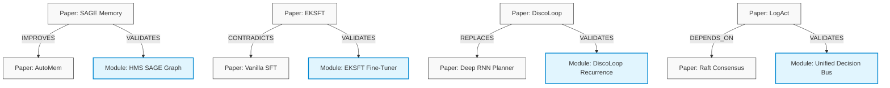

# 02. RESEARCH DISCOVERY
## Research Discovery Division & Scientific Knowledge Graph

### 1. Architectural Mission
The **Research Discovery Division (RDD)** is the continuous scientific scouting division of ASRS. Its responsibility is to monitor and ingest academic and industrial literature across artificial intelligence, quantitative finance, systems engineering, reinforcement learning, multi-agent systems, and prompt optimization.

Instead of treating research papers as unstructured text documents or PDFs, the RDD converts papers into structured, interconnected, and machine-actionable records represented in a central **Scientific Knowledge Graph (SKG)**.

---

### 2. Knowledge Graph Topology
The Research Knowledge Graph is modeled as a directed multi-graph (using schema structures compatible with GraphML, NetworkX, and SAGE memory formats). Nodes represent scientific entities, while edges represent qualitative, operational, and physical relationships.

#### Node Schema
Every node in the Scientific Knowledge Graph has a unique identifier and a set of standardized attributes:

```text
+---------------------------------------------------------------------------------+
|                                 GRAPH NODE                                      |
+---------------------------------------------------------------------------------+
| - id: str (e.g., "paper:eksft_2026")                                            |
| - label: str (e.g., "EKSFT: Entropy and KL-Divergence Selective Fine-Tuning")   |
| - category: str (PAPER, ALGORITHM, MODEL, BENCHMARK, DATASET, STRATEGY, MODULE) |
| - properties: Dict[str, Any]                                                    |
|    - expected_roi: float (Expected Sharpe/stability score improvement)          |
|    - implementation_difficulty: float (1.0 to 10.0 scale)                       |
|    - compute_requirements: str (e.g., "GPU_A100_S")                             |
|    - target_domain: str (e.g., "harness_optimization", "risk", "planning")      |
|    - verified_reproducible: bool                                                |
+---------------------------------------------------------------------------------+
```

#### Edge Schema
Edges represent directional dependencies, improvements, or contradictions between nodes:

```text
(Node A) --[Edge Type: {IMPROVES, REPLACES, DEPENDS_ON, VALIDATES, CONTRADICTS}]--> (Node B)
```

Attributes on edges:
* `confidence_score` (0.0 to 1.0): Level of evidence supporting this connection.
* `source` (e.g., "arXiv", "empirical_evaluation").
* `timestamp` (UTC).

---

### 3. Concrete Example Subgraph (The UCA V5 Spectrum)
The diagram below shows how core research papers are integrated into the Scientific Knowledge Graph:



---

### 4. Discovery Pipeline Implementation Design
The Discovery division implements a three-tier pipeline:

1. **Ingest & Parse (Collector)**:
   * Periodically scans RSS feeds, arXiv APIs, open-source repositories, and semantic scholar feeds.
   * Leverages lightweight, local regex and LLM-assisted parsers to extract Metadata (Authors, Abstracts, DOI, CITATIONS, CODE_REPOS).
2. **Entity & Edge Extraction (NLP Layer)**:
   * Extracts quantitative properties (e.g., stated Sharpe improvement, baseline dataset, parameter count, execution times).
   * Identifies logical dependencies (e.g., "We build upon CMA-ES but add dynamic parameter adjustments").
3. **Graph Update & Consolidation**:
   * Updates the global SAGE database.
   * Calculates the node’s initial **Expected Return on Engineering Investment (EROI)** using the Cost-Aware Research Planner:

$$\text{EROI} = \frac{\text{Expected ROI} \times \text{Confidence}}{\text{Implementation Difficulty} \times \text{Compute Cost}}$$

---

### 5. Automated Edge Discrepancy Scans
The Discovery Division runs scheduled integrity checks on the graph to detect research contradictions:
* **Contradictory Link Identification**: Scan for paths containing both `IMPROVES` and `CONTRADICTS` between similar modules.
* **Assumption Validation**: When an assumption of a paper is flagged as breached by the Opportunity Division (e.g., "Assumes market regime is highly trending"), the RDD flags the paper node and dependent algorithms as "Dormant" or "High-Risk".
