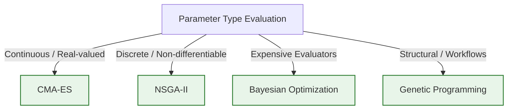

# 06. EVOLUTION ENGINE
## Evolution Engine, Search Strategies & Impact-Prioritized Mutations

### 1. Architectural Mission
The **Evolution Engine (EE)** is the algorithmic engine room of ASRS. Once the Experiment Generator establishes an isolated sandbox (L1, L2, or L3), the EE takes over to run iterative search loops. It is capable of evolving prompts, workflow routines, hyperparameters, and trading strategies.

Rather than executing random mutations, the EE is **impact-prioritized**. It allocates search steps and mutation ranges based on expected scientific ROI, utilizing advanced mathematical optimization algorithms (such as CMA-ES, Bayesian Optimization, and NSGA-II).

---

### 2. Evolutionary Search Strategies
The EE supports four distinct mathematical search strategies, selected dynamically based on parameter types and dimensions:



#### Covariance Matrix Adaptation Evolution Strategy (CMA-ES)
* **Application**: Real-valued parameters (e.g., neural model thresholds, sizing weights, volatility multipliers).
* **Mechanism**: Maintains a multivariate normal distribution over the search space. It updates the mean and covariance matrix based on successful step histories, allowing fast convergence in high-dimensional continuous landscapes without gradient information.

#### Non-dominated Sorting Genetic Algorithm II (NSGA-II)
* **Application**: Discrete multi-objective optimization (e.g., selecting indicators, order-routing rules, and stop types).
* **Mechanism**: Evaluates individuals based on non-domination. It preserves elite solutions along the Pareto front, ensuring a diverse set of trade-offs between conflicting objectives (e.g., Latency vs. Return).

#### Bayesian Optimization (BO-GP)
* **Application**: Expensive evaluations (e.g., deep-learning hyperparameters where a single backtest or model training takes hours).
* **Mechanism**: Uses Gaussian Process (GP) regression as a surrogate model of the objective function. It optimizes an acquisition function (such as Expected Improvement) to select the next sample point, minimizing evaluation counts.

#### Genetic Programming (GP)
* **Application**: Workflow structure modifications (e.g., rearranging planning, routing, and self-critique steps).
* **Mechanism**: Represents workflows as tree structures (ASTs) and performs subtree crossover and mutation to discover optimal agent execution pipelines.

---

### 3. Impact-Prioritized Mutations
To prevent computational waste, mutations are guided by the **Jacobian of Expected Return (JER)**. The EE maintains an empirical correlation matrix mapping parameter families to historically observed performance changes:

| Parameter Family | Target Module | Sensitivity Index (0-1) | Priority Range | Mutation Operator |
| :--- | :--- | :--- | :--- | :--- |
| **Risk Multipliers** | `risk.risk_manager` | 0.92 | High | Continuous Gaussian mutation ($\sigma = 0.05$) |
| **Planning Depth** | `core.csc.controller` | 0.81 | High | Integer increment/decrement ($\pm 1$) |
| **Indicator Lookbacks**| `analysis.market_structure`| 0.54 | Medium | Discrete uniform sampling |
| **Prompt Verbiage** | `agents.prompt_templates` | 0.23 | Low | TextGrad linguistic gradient edit |

The Mutation Controller restricts low-priority modifications to fewer generations, dedicating the lion's share of computational epochs to high-sensitivity parameters.

---

### 4. Evolutionary Sequence Map
The diagram below illustrates how a generation is evaluated and evolved under strict budget allocations:

```text
  [Active Sandbox]
         |
         | (1) Read Current Genome & Mutation Parameters
         v
  [Mutation Controller] <--- (Read Sensitivity Matrix & Compute Budget)
         |
         +--> [Mutated Candidate 1] --\
         +--> [Mutated Candidate 2] ----> [Resource Scheduler (Idle cores)]
         +--> [Mutated Candidate N] --/
                                               |
                                               v
                                    [Fitness Evaluation]
                                     - Calculate Sharpe, Sortino, VaR
                                     - Profile Latency, RAM overhead
                                               |
                                               v
                                    [Pareto Consolidation]
                                     - Sort by Dominance
                                     - Re-estimate CMA-ES distribution
                                               |
                                               +---> Re-seed next generation
```
