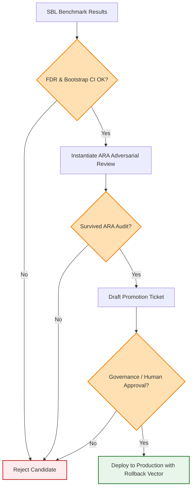

# 12. PROMOTION GATE
## Promotion Gate, Statistical Significance & Adversarial Reviewer Agent

### 1. Architectural Mission
The **Promotion Gate (PG)** is the release authority of ASRS. Even if an experiment achieves exceptional returns or low latency during benchmarking, it cannot touch production code or live trading state without surviving **Adversarial Review**.

The PG enforces rigorous statistical significance standards, executes independent audits via the Autonomous Reviewer agent, and drafts automated, fast-rollback deployment blueprints.

---

### 2. Statistical Standards of Proof
To prevent promoting lucky parameter mutations (Type I errors) or overfitting artifacts, the Promotion Gate requires candidates to pass strict statistical tests:

#### Paired Bootstrap Significance Testing
The PG performs bootstrap resampling on out-of-sample (OOS) return series to compute confidence intervals on the Sharpe ratio improvement $\Delta S = S_{\text{candidate}} - S_{\text{baseline}}$:

1. Let $R_c$ and $R_b$ be the daily out-of-sample return series of the candidate and baseline, respectively, of length $N$.
2. Resample $N$ days with replacement $B = 10,000$ times.
3. For each bootstrap iteration $b$, calculate $\Delta S^{(b)}$.
4. Compute the $(1-\alpha)$ confidence interval (where $\alpha = 0.05$). Promotion requires:

$$\text{P}(\Delta S > 0) \ge 0.95 \quad \text{and} \quad 0 \notin [\text{CI}_{\text{lower}}, \text{CI}_{\text{upper}}]$$

#### False Discovery Rate (FDR) Control
When evaluating multiple parallel mutations simultaneously (multiple comparison problem), the PG applies the **Benjamini-Hochberg (BH) procedure** to control the false discovery rate:

1. Sort the $p$-values of $m$ parallel hypotheses in ascending order: $p_{(1)} \le p_{(2)} \le \dots \le p_{(m)}$.
2. Find the largest index $k$ such that:

$$p_{(k)} \le \frac{k}{m} \cdot Q$$

Where $Q = 0.05$ (the FDR control level).
3. Reject all hypotheses $H_{(i)}$ for $i = 1, \dots, k$. Only these rejected hypotheses are eligible for promotion.

#### Sequential Probability Ratio Test (SPRT)
For real-time out-of-sample or shadow trading validation, the PG executes sequential testing to detect calibration error regressions without waiting for a fixed batch size:

$$\Lambda_n = \ln \frac{P(\mathcal{D}_n \mid H_1: \text{Calibration Regressed})}{P(\mathcal{D}_n \mid H_0: \text{Calibration Stable})} = \sum_{i=1}^n \ln \frac{P(d_i \mid H_1)}{P(d_i \mid H_0)}$$

* If $\Lambda_n \ge A$ (where $A = \ln \frac{1-\beta}{\alpha}$), the candidate is instantly rejected.
* If $\Lambda_n \le B$ (where $B = \ln \frac{\beta}{1-\alpha}$), the candidate's stability is accepted.
* Otherwise, continue shadow monitoring.

---

### 3. The Autonomous Reviewer Agent (Adversarial Audit)
Before a candidate is approved for promotion, the PG instantiates an independent, highly critical **Autonomous Reviewer Agent** (ARA). The ARA’s sole objective is to **reject the candidate**. It executes an automated, multi-pronged adversarial audit:

```
  ARA Adversarial Check List
  [ ] Benchmark Leakage Check:
      - Does the training dataset overlap with the out-of-sample test dataset?
      - Are lookahead features (such as future rolling means) used in signals?

  [ ] Multi-Collinearity / Regression Check:
      - Does the improvement degrade other adjacent systems (e.g., does lower
        latency in CSC increase CPU starvation in risk sentinel)?

  [ ] Parameter Sensitivity Check:
      - If we perturb the optimal parameters by epsilon (+/- 1%), does performance
        collapse? (Detects fragile, overfitted parameter spikes).

  [ ] Hidden Assumptions Scan:
      - Does the strategy assume constant low spread?
      - Does it require a minimum leverage that violates dynamic margin limits?
```

If the ARA finds a single failure or regression point, it issues a veto, drafting a detailed audit report, and the candidate is rejected.

---

### 4. Promotion Criteria Gatekeeper

---

### 5. Deployment Blueprint & Rollback Vector
Approved improvements are packaged into a unified migration payload. Each deployment contains:
1. **Source/Target Mapping**: Exact lines of code or prompt files to be patched.
2. **Pre-deployment Checkpoints**: A full system backup state.
3. **Rollback Vector**: A pre-compiled script containing the inverse transformation (patch revert or config toggle). If any runtime anomaly (e.g., error rate $> 0.01$) is detected within 24 hours of promotion, the System Supervisor halts trading, executes the rollback vector, and reverts the repository to the stable base SHA.
