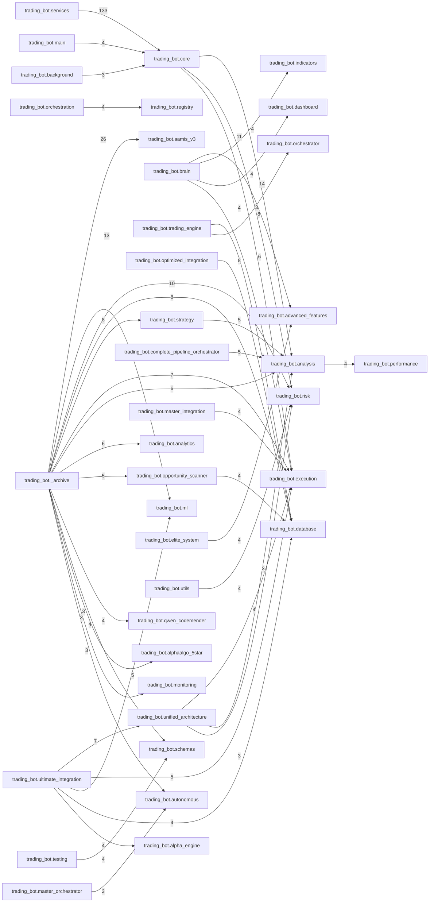

# Repository Architecture Analysis + 12-Domain Migration Plan

## Executive summary
- Python files scanned: **7215**
- Internal module dependency edges: **5264**
- Circular-import SCCs detected: **6**
- Duplicate module-name clusters (basename reuse): **60**
- Dead-code candidates (no inbound module refs): **250+ (sample listed)**

## 1) Module dependency graph (package-level)


## 2) Current system architecture (observed)
The codebase currently behaves like a **multi-platform monorepo** centered around `trading_bot/`, with cross-cutting modules for:
- ingestion/data adapters
- market analysis and alpha engines
- execution and order routing
- risk/safety/compliance
- monitoring/telemetry/dashboard
- orchestration and autonomous agents

The package graph shows dense inter-domain coupling rather than strict layered boundaries.

## 3) Duplicate systems (high-signal examples)
- `__init__` appears in 476 modules, e.g. `trading_bot/__init__.py`, `trading_bot/hedging/__init__.py`, `trading_bot/connectors/__init__.py`, `trading_bot/system_supervisor/__init__.py`
- `orchestrator` appears in 30 modules, e.g. `trading_bot/deepchart/orchestrator.py`, `trading_bot/ingestion/orchestrator.py`, `trading_bot/_archive/deepchart/orchestrator.py`, `trading_bot/_archive/ingestion/orchestrator.py`
- `master_orchestrator` appears in 9 modules, e.g. `trading_bot/master_orchestrator.py`, `trading_bot/self_assembly_ai/master_orchestrator.py`, `trading_bot/orchestration/master_orchestrator.py`, `trading_bot/_archive/orchestrator/master_orchestrator.py`
- `data_validator` appears in 8 modules, e.g. `trading_bot/system_supervisor/data_validator.py`, `trading_bot/_archive/system_supervisor/data_validator.py`, `trading_bot/_archive/critical_fixes/data_validator.py`, `trading_bot/_archive/quality/data_validator.py`
- `trade_journal` appears in 7 modules, e.g. `trading_bot/trade_journal.py`, `trading_bot/_archive/audit/trade_journal.py`, `trading_bot/_archive/skills/user_experience/trade_journal.py`, `trading_bot/core/trade_journal.py`
- `market_regime` appears in 7 modules, e.g. `trading_bot/market_regime.py`, `trading_bot/analysis/market_regime.py`, `trading_bot/adaptive_systems/market_regime.py`, `trading_bot/_archive/improvements/market_regime.py`
- `core_types` appears in 7 modules, e.g. `trading_bot/adversarial_curriculum/core_types.py`, `trading_bot/_archive/adversarial_curriculum/core_types.py`, `trading_bot/_archive/alphaalgo_institutional/core_types.py`, `trading_bot/_archive/decision_layer/core_types.py`
- `config` appears in 7 modules, e.g. `trading_bot/infrastructure/config.py`, `trading_bot/config/config.py`, `trading_bot/_archive/infrastructure/config.py`, `trading_bot/_archive/log_system/config.py`
- `ensemble` appears in 7 modules, e.g. `trading_bot/_archive/alpha_engine/ensemble.py`, `trading_bot/_archive/ai_core/forecasting/ensemble.py`, `trading_bot/_archive/alphaalgo_v2/models/signals/ensemble.py`, `trading_bot/alpha_engine/ensemble.py`
- `metrics` appears in 6 modules, e.g. `trading_bot/telemetry/metrics.py`, `trading_bot/_archive/telemetry/metrics.py`, `trading_bot/_archive/observability/metrics.py`, `trading_bot/_archive/alphaalgo_v2/reward_engine/metrics.py`
- `core` appears in 6 modules, e.g. `trading_bot/hivemind/core.py`, `trading_bot/tamic/core.py`, `trading_bot/_archive/tamic/core.py`, `trading_bot/_archive/self_healing_ai/core.py`
- `position_sizing` appears in 6 modules, e.g. `trading_bot/risk_management/position_sizing.py`, `trading_bot/_archive/risk_management/position_sizing.py`, `trading_bot/_archive/improvements/position_sizing.py`, `trading_bot/_archive/improvements/forecast_improvements/position_sizing.py`
- `neural_architecture_search` appears in 6 modules, e.g. `trading_bot/self_assembly_ai/neural_architecture_search.py`, `trading_bot/advanced_ai/neural_architecture_search.py`, `trading_bot/advanced_ml/neural_architecture_search.py`, `trading_bot/_archive/advanced_ml/neural_architecture_search.py`
- `self_improvement` appears in 6 modules, e.g. `trading_bot/deepchart/self_improvement.py`, `trading_bot/adaptive_systems/self_improvement.py`, `trading_bot/_archive/deepchart/self_improvement.py`, `trading_bot/_archive/systems_ai/self_improvement.py`
- `pattern_recognition` appears in 6 modules, e.g. `trading_bot/analysis/pattern_recognition.py`, `trading_bot/_archive/ai_core/pattern_recognition.py`, `trading_bot/elite_system/pattern_recognition.py`, `trading_bot/ai_core/pattern_recognition.py`
- `strategy_evolution` appears in 6 modules, e.g. `trading_bot/aamis_v3/evolution/strategy_evolution.py`, `trading_bot/_archive/aamis_v3/evolution/strategy_evolution.py`, `trading_bot/_archive/self_learning/strategy_evolution.py`, `trading_bot/_archive/market_teacher/strategy_evolution.py`
- `learner` appears in 6 modules, e.g. `trading_bot/_archive/evolution_layer/learner.py`, `trading_bot/_archive/self_learning/learner.py`, `trading_bot/_archive/autonomous_learner/learner.py`, `trading_bot/evolution_layer/learner.py`
- `shap_explainer` appears in 6 modules, e.g. `trading_bot/_archive/ai_core/explainability/shap_explainer.py`, `trading_bot/_archive/auto_fix_backups/20251209_231151/ml/shap_explainer.py`, `trading_bot/_archive/auto_fix_backups/20251209_232515/ml/shap_explainer.py`, `trading_bot/ai_core/explainability/shap_explainer.py`
- `position_manager` appears in 5 modules, e.g. `trading_bot/position_manager.py`, `trading_bot/_archive/position/position_manager.py`, `trading_bot/execution/position_manager.py`, `trading_bot/position/position_manager.py`
- `integration` appears in 5 modules, e.g. `trading_bot/integration.py`, `trading_bot/tamic/integration.py`, `trading_bot/_archive/tamic/integration.py`, `trading_bot/_archive/alphaalgo_core/integration.py`
- `events` appears in 5 modules, e.g. `trading_bot/core_api/events.py`, `trading_bot/events/events.py`, `trading_bot/_archive/core_api/events.py`, `trading_bot/_archive/event_pipeline/events.py`
- `circuit_breaker` appears in 5 modules, e.g. `trading_bot/safety/circuit_breaker.py`, `trading_bot/_archive/error_handling/circuit_breaker.py`, `trading_bot/error_handling/circuit_breaker.py`, `trading_bot/core/circuit_breaker.py`
- `monitoring` appears in 5 modules, e.g. `trading_bot/infrastructure/monitoring.py`, `trading_bot/_archive/alpha_engine/monitoring.py`, `trading_bot/_archive/self_healing_ai/validators/monitoring.py`, `trading_bot/alpha_engine/monitoring.py`
- `market_microstructure` appears in 5 modules, e.g. `trading_bot/analysis/market_microstructure.py`, `trading_bot/adaptive_systems/market_microstructure.py`, `trading_bot/_archive/alpha_engine/market_microstructure.py`, `trading_bot/alpha_engine/market_microstructure.py`
- `regime_detector` appears in 5 modules, e.g. `trading_bot/analysis/regime_detector.py`, `trading_bot/adaptive_systems/regime_detector.py`, `trading_bot/_archive/ai_core/meta_learning/regime_detector.py`, `trading_bot/ai_core/meta_learning/regime_detector.py`
- `feature_flags` appears in 5 modules, e.g. `trading_bot/config/feature_flags.py`, `trading_bot/_archive/advanced_analysis/feature_flags.py`, `trading_bot/_archive/skills/infrastructure/feature_flags.py`, `trading_bot/advanced_analysis/feature_flags.py`
- `engine` appears in 5 modules, e.g. `trading_bot/self_improvement/engine.py`, `trading_bot/_archive/alphaalgo_v2/execution/engine.py`, `trading_bot/_archive/alphaalgo_v2/risk_engine/engine.py`, `trading_bot/alphaalgo_v2/execution/engine.py`
- `maml` appears in 5 modules, e.g. `trading_bot/_archive/meta_learning/maml.py`, `trading_bot/_archive/ai_core/meta_learning/maml.py`, `trading_bot/meta_learning/maml.py`, `trading_bot/ai_core/meta_learning/maml.py`
- `strategy_optimizer` appears in 5 modules, e.g. `trading_bot/_archive/auto_optimizer/strategy_optimizer.py`, `trading_bot/auto_optimizer/strategy_optimizer.py`, `trading_bot/learning/strategy_optimizer.py`, `trading_bot/strategy/strategy_optimizer.py`
- `rate_limiter` appears in 5 modules, e.g. `trading_bot/_archive/api/rate_limiter.py`, `trading_bot/connectivity/rate_limiter.py`, `trading_bot/api/rate_limiter.py`, `trading_bot/core/rate_limiter.py`

## 4) Dead code candidates (static, conservative heuristic)
> Criteria: Python module under repo with zero inbound internal import refs (entrypoints/tests excluded). Dynamic imports may produce false positives.

- `trading_bot/scanners.py`
- `trading_bot/core_orchestrator.py`
- `trading_bot/elite_master_system.py`
- `trading_bot/adaptive.py`
- `trading_bot/transformer.py`
- `trading_bot/advanced_exits.py`
- `trading_bot/optimized_integration.py`
- `trading_bot/complete_pipeline_orchestrator.py`
- `trading_bot/connectors/ticktrader_connector.py`
- `trading_bot/connectors/interactive_brokers_connector.py`
- `trading_bot/connectors/exchange_monitor.py`
- `trading_bot/system_supervisor/security_supervisor.py`
- `trading_bot/system_supervisor/auto_updater_supervisor.py`
- `trading_bot/event_monitoring/economic_calendar.py`
- `trading_bot/event_monitoring/news_analyzer.py`
- `trading_bot/event_monitoring/social_media_monitor.py`
- `trading_bot/event_monitoring/market_condition_monitor.py`
- `trading_bot/event_monitoring/event_processor.py`
- `trading_bot/integration/run_verification.py`
- `trading_bot/telemetry/collector.py`
- `trading_bot/telemetry/exporter.py`
- `trading_bot/telemetry/tracing.py`
- `trading_bot/risk_management/risk_monitor.py`
- `trading_bot/risk_management/var_calculator.py`
- `trading_bot/risk_management/drawdown_ladder.py`
- `trading_bot/risk_management/budget_allocator.py`
- `trading_bot/risk_management/black_swan_protection.py`
- `trading_bot/risk_management/position_sizing.py`
- `trading_bot/security/credentialvault.py`
- `trading_bot/security/jwt_auth.py`
- `trading_bot/security/safe_eval.py`
- `trading_bot/security/jwtauthenticator.py`
- `trading_bot/security/enhanced_security.py`
- `trading_bot/safety/fail_safe.py`
- `trading_bot/safety/emergency_shutdown.py`
- `trading_bot/safety/implement_fallback.py`
- `trading_bot/analytics/growth_optimization.py`
- `trading_bot/analytics/backtest_parity.py`
- `trading_bot/analytics/data_warehouse.py`
- `trading_bot/analytics/order_flow_intelligence.py`
- `trading_bot/analytics/mae_mfe_analysis.py`
- `trading_bot/analytics/signal_performance_tracker.py`
- `trading_bot/signals/simple_signals.py`
- `trading_bot/cognitive_architecture/layer8_quantum_simulation.py`
- `trading_bot/cognitive_architecture/layer6_multimodal_fusion.py`
- `trading_bot/cognitive_architecture/layer5_advanced_rl.py`
- `trading_bot/cognitive_architecture/layer3_cognitive_economy.py`
- `trading_bot/cognitive_architecture/layer9_explainability.py`
- `trading_bot/ingestion/ingestion_backbone.py`
- `trading_bot/ingestion/validator.py`
- `trading_bot/upgrades/core_upgrades_026_050.py`
- `trading_bot/tamic/integration.py`
- `trading_bot/analysis/causal_inference.py`
- `trading_bot/analysis/pattern_failure_detection.py`
- `trading_bot/analysis/ict_concepts.py`
- `trading_bot/analysis/options_market_analysis.py`
- `trading_bot/analysis/liquidity_benchmark.py`
- `trading_bot/analysis/microstructure.py`
- `trading_bot/analysis/news_event_trading.py`
- `trading_bot/analysis/trend_analysis.py`
- `trading_bot/analysis/fear_greed_index.py`
- `trading_bot/analysis/market_breadth.py`
- `trading_bot/analysis/causal_estimator.py`
- `trading_bot/analysis/sec_filing_analyzer.py`
- `trading_bot/analysis/syntheticmarketgenerator.py`
- `trading_bot/analysis/advanced_order_flow.py`
- `trading_bot/analysis/dark_pool_monitor.py`
- `trading_bot/analysis/options_flow.py`
- `trading_bot/analysis/wyckoff_complete.py`
- `trading_bot/analysis/sec_13f_analysis.py`
- `trading_bot/analysis/pattern_recognition.py`
- `trading_bot/analysis/absorptionzoneanalyzer.py`
- `trading_bot/analysis/cot_analysis.py`
- `trading_bot/analysis/vpin_analysis.py`
- `trading_bot/analysis/institutional_footprint_dna.py`
- `trading_bot/analysis/wyckoff_analysis.py`
- `trading_bot/analysis/obv_money_flow.py`
- `trading_bot/analysis/onchain_analytics.py`
- `trading_bot/analysis/causal_graph.py`
- `trading_bot/analysis/cross_asset_flow.py`

## 5) Overlapping modules
Observed overlap patterns:
- Multiple sentiment stacks (`analysis/`, `ml/`, `sentiment/`, `alpha_engine/`, `adaptive_systems/`, `skills/alternative_data/`).
- Multiple execution stacks (`execution/`, `realtime/`, `production/`, `alpha_engine/`).
- Multiple monitoring stacks (`monitoring/`, `dashboard/`, `performance/`, plus service-specific monitors).
- Multiple orchestration layers (`integration`, `master_integration`, `orchestration`, `services`, `agents`).

## 6) Circular imports
Detected SCCs:
- `trading_bot.brain.tier1_technical` -> `trading_bot.brain.tier2_orderflow` -> `trading_bot.brain.tier3_structure` -> `trading_bot.brain.tier4_regime` -> `trading_bot.brain.tier5_sentiment` -> `trading_bot.brain.tier6_macro` -> `trading_bot.brain.tier7_risk` -> `trading_bot.brain.tier8_execution` ...
- `trading_bot.tamic.confidence_control` -> `trading_bot.tamic.core` -> `trading_bot.tamic.forbidden_behaviors` -> `trading_bot.tamic.horizon_segmentation` -> `trading_bot.tamic.institutional_time` -> `trading_bot.tamic.market_time` -> `trading_bot.tamic.optionality` -> `trading_bot.tamic.signal_decay` ...
- `trading_bot._archive.tamic.confidence_control` -> `trading_bot._archive.tamic.core` -> `trading_bot._archive.tamic.forbidden_behaviors` -> `trading_bot._archive.tamic.horizon_segmentation` -> `trading_bot._archive.tamic.institutional_time` -> `trading_bot._archive.tamic.market_time` -> `trading_bot._archive.tamic.optionality` -> `trading_bot._archive.tamic.signal_decay` ...
- `trading_bot._archive.ultimate_production.core_engine` -> `trading_bot._archive.ultimate_production.ml_prediction_engine` -> `trading_bot._archive.ultimate_production.strategy_ensemble`
- `trading_bot.ultimate_production.core_engine` -> `trading_bot.ultimate_production.ml_prediction_engine` -> `trading_bot.ultimate_production.strategy_ensemble`
- `trading_bot.self_concepts.self_adaptation_concepts` -> `trading_bot.self_concepts.self_awareness_concepts` -> `trading_bot.self_concepts.self_concept_engine` -> `trading_bot.self_concepts.self_coordination_concepts` -> `trading_bot.self_concepts.self_correction_concepts` -> `trading_bot.self_concepts.self_diagnosis_concepts` -> `trading_bot.self_concepts.self_evolution_concepts` -> `trading_bot.self_concepts.self_learning_concepts` ...

## 7) Performance bottlenecks (static indicators)
### Largest modules
- `main.py` (4576 LOC)
- `main_original.py` (3741 LOC)
- `background_services.py` (2890 LOC)
- `trading_bot/mosefs/layer1_infrastructure.py` (2685 LOC)
- `main_backup_20260213.py` (2168 LOC)
- `trading_bot/market_intelligence/data_monitoring.py` (2043 LOC)
- `trading_bot/core/service_factory.py` (1872 LOC)
- `trading_bot/mosefs/layer2_execution.py` (1818 LOC)
- `trading_bot/unified_ai_brain.py` (1714 LOC)
- `trading_bot/mosefs/layer4_learning.py` (1711 LOC)
- `trading_bot/mosefs/layer5_intelligence.py` (1673 LOC)
- `trading_bot/upgrades/ml_upgrades_251_300.py` (1600 LOC)
- `trading_bot/mega_integration.py` (1568 LOC)
- `tests/__init__.py` (1567 LOC)
- `trading_bot/upgrades/ml_upgrades_201_250.py` (1553 LOC)
- `tests/test_full_100_percent_coverage.py` (1540 LOC)
- `trading_bot/ml/sentiment.py` (1521 LOC)
- `trading_bot/mosefs/layer3_discovery.py` (1520 LOC)
- `trading_bot/alphaalgo_institutional/idea_vectors.py` (1510 LOC)
- `trading_bot/mosefs/layer6_evolution.py` (1504 LOC)

### Import-heavy modules (startup-cost indicator)
- `tests.__init__` (1248 import statements)
- `main_original` (244 import statements)
- `background_services` (159 import statements)
- `trading_bot.upgrades.ml_upgrades_201_250` (132 import statements)
- `trading_bot.upgrades.ml_upgrades_251_300` (129 import statements)
- `INTEGRATION_ADDITIONS_FOR_MAIN` (106 import statements)
- `trading_bot.services.tier5_services` (92 import statements)
- `trading_bot.innovations.category_03_biological_trading` (80 import statements)
- `trading_bot.services.__init__` (78 import statements)
- `trading_bot.upgrades.risk_upgrades_101_150` (76 import statements)
- `trading_bot.background` (76 import statements)
- `trading_bot.innovations.category_01_quantum_consciousness` (73 import statements)
- `main_backup_20260213` (73 import statements)
- `tests.test_100_percent_coverage` (71 import statements)
- `trading_bot.innovations.category_04_dimensional_trading` (70 import statements)
- `trading_bot.ultimate_integration` (66 import statements)
- `trading_bot.upgrades.core_upgrades_076_100` (65 import statements)
- `trading_bot.innovations.category_02_temporal_manipulation` (63 import statements)
- `tests.test_maximum_coverage` (61 import statements)
- `trading_bot.upgrades.core_upgrades_026_050` (59 import statements)

### Bottleneck themes
- Large, monolithic modules increase parse/import time and reduce testability.
- High fan-in/fan-out modules create cold-start latency and fragile startup.
- Optional heavy ML dependencies are imported in wide code paths, causing frequent startup warnings/failures in constrained envs.

---

## System architecture map (target 12-domain professional model)

```text
infrastructure
  ├── runtime/config/logging/events/di
  ├── storage/connectors/cache/message-bus
  └── security/ops/deployment

agents
  ├── orchestrators
  ├── decision-agents
  └── learning-agents

research
  ├── notebooks/experiments
  ├── hypothesis registry
  └── model cards

data → feature_engineering → market_analysis → alpha_discovery → validation
                                     ↓
risk_management ← portfolio_management ← execution
                                     ↓
                                monitoring
```

## Proposed new folder structure
```text
trading_bot/
  domains/
    data/
      ingestion/
      adapters/
      normalization/
      schemas/
    feature_engineering/
      technical/
      microstructure/
      alt_data/
      feature_store/
    market_analysis/
      structure/
      regime/
      order_flow/
      sentiment/
    alpha_discovery/
      signal_generators/
      model_inference/
      strategy_selection/
    validation/
      backtesting/
      paper_trading/
      walk_forward/
      reality_gates/
    risk_management/
      limits/
      sizing/
      kill_switch/
      compliance/
    portfolio_management/
      allocation/
      exposure/
      rebalancing/
    execution/
      routing/
      algo_execution/
      brokers/
      slippage/
    monitoring/
      metrics/
      alerting/
      health/
      dashboards/
    research/
      experiments/
      evaluation/
      registries/
    agents/
      orchestrators/
      planners/
      autonomous_loops/
    infrastructure/
      config/
      events/
      service_registry/
      persistence/
      observability/
  app/
    cli/
    services/
  compatibility/
    legacy_adapters/
```

## Migration plan (incremental, low-risk)
1. **Domain contracts first (Week 1)**
   - Create `trading_bot/domains/*` skeleton + interface contracts.
   - Add anti-corruption layer under `compatibility/legacy_adapters`.

2. **Data + Feature foundations (Week 2-3)**
   - Migrate ingestion/adapters/schemas to `domains/data`.
   - Migrate indicators/features into `domains/feature_engineering`.

3. **Analysis/Alpha split (Week 3-4)**
   - Move regime/structure/orderflow/sentiment to `domains/market_analysis`.
   - Move signal/model-selection into `domains/alpha_discovery`.

4. **Risk/Portfolio/Execution hard boundaries (Week 4-5)**
   - Enforce call order: alpha → validation → risk → portfolio → execution.
   - Remove direct execution calls from analysis modules.

5. **Validation domain formalization (Week 5-6)**
   - Consolidate backtest/paper/reality gates in `domains/validation`.
   - Add promotion policy for paper→live.

6. **Monitoring + Infrastructure convergence (Week 6)**
   - Merge duplicate metrics/alerts/health paths into `domains/monitoring`.
   - Centralize config/event-bus/service registry in `domains/infrastructure`.

7. **Agents and Research isolation (Week 7)**
   - Move autonomous loops/orchestrators to `domains/agents`.
   - Keep experiments and model exploration in `domains/research`.

8. **Decommission legacy paths (Week 8+)**
   - Freeze old modules, route through adapters, then delete after parity tests pass.

## Immediate prioritization recommendation
For this week: prioritize **integration tests + risk-control validation** (not feature expansion).
- Add contract tests on domain boundaries.
- Add fail-closed checks (risk veto, max exposure, kill switch).
- Gate all promotions with validation metrics.
