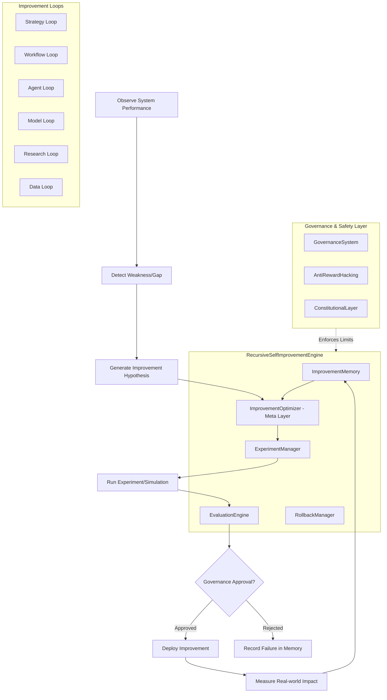

# Recursive Self-Improvement Architecture

## Overview
The Recursive Self-Improvement (RSI) system is a unified architecture designed to autonomously and safely evolve the trading bot's capabilities. It operates on two main levels:
1.  **Iterative Improvement:** Refining strategies, models, agents, and workflows.
2.  **Meta-Improvement:** Refining the process of improvement discovery itself.

## Architecture Diagram

## Dependency Map

- **Core Dependencies:**
    - `trading_bot.core_agent_system.governance_system`
    - `trading_bot.core_agent_system.anti_reward_hacking`
    - `trading_bot.sentient_core.code_evolver`
    - `trading_bot.autonomous.self_healing`
- **Internal Modules:**
    - `engine.py`: Central orchestrator.
    - `memory.py`: SQL/Vector storage for experiments.
    - `evaluation.py`: Quantitative & Qualitative scoring.
    - `experiment_manager.py`: Interface for backtesting and simulation.
    - `rollback.py`: Version control for configurations and code.

## Improvement Domains Map

| Domain | Target | Methods |
| :--- | :--- | :--- |
| **Strategy** | Entry/Exit, Sizing | Bayesian Opt, Genetic Algorithms |
| **Workflow** | Task Decomposition | Prompt Evolution, Chain-of-Thought refinement |
| **Agent** | Coordination, Roles | Multi-objective RL, Swarm consensus tuning |
| **Model** | Architectures, HPs | NAS (Neural Architecture Search), Auto-tuning |
| **Data** | Features, Filters | Alpha discovery, Information Coefficient analysis |
| **Research** | Hypotheses | LLM-driven research agents, validation automation |
| **Meta** | Improvement Discovery | Learning from experiment success/failure rates |

## Risk Analysis

| Risk | Impact | Mitigation |
| :--- | :--- | :--- |
| **Reward Hacking** | High | Multi-objective rewards, Anti-Reward Hacking monitors. |
| **Overfitting** | Medium | Rigorous out-of-sample validation, regime-aware testing. |
| **System Instability** | High | RollbackManager, immutable safety boundaries, health monitoring. |
| **Drift** | Medium | Continuous monitoring (DriftDetector) and automated re-baselining. |
| **Security/Code Injection**| Critical | CodeEvolver's restricted execution environment, AST validation. |

## Implementation Plan

1.  **Phase 1: Foundation (Current)**
    - Implement `ImprovementMemory`, `EvaluationEngine`, and `RollbackManager`.
2.  **Phase 2: Unified Engine**
    - Create `RecursiveSelfImprovementEngine` and integrate governance.
3.  **Phase 3: Integration of Existing Loops**
    - Wrap `SelfOptimizingEngine`, `StrategyTuner`, and `CodeEvolver` into RSI loops.
4.  **Phase 4: Meta-Improvement**
    - Implement `ImprovementOptimizer` to learn from historical data.
5.  **Phase 5: Production Deployment**
    - Deploy with strict canary gates and manual oversight for level 6-7 changes.
